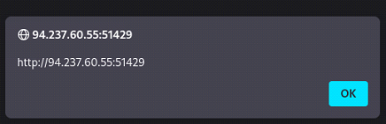
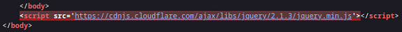

# Cross Site Scripting (XSS)

This document summarizes core techniques for identifying and exploiting **Cross-Site Scripting (XSS)** vulnerabilities. It is intended as a practical reference and does not aim to be an exhaustive guide.

---

## Table of Contents

- [Cross Site Scripting (XSS)](#cross-site-scripting-xss)
  - [Overview](#overview)
  - [Stored XSS](#stored-xss)
  - [Reflected XSS](#reflected-xss)
  - [DOM XSS](#dom-xss)

---

## Overview

Cross-Site Scripting (XSS) is one of the most prevalent web application vulnerabilities and has remained a persistent security issue for over two decades. A significant percentage of modern web applications are still affected by XSS in one form or another.

XSS vulnerabilities arise from **improper handling and sanitization of user-controlled input**, allowing attackers to inject malicious JavaScript code that is executed in the context of a victim’s browser. In a typical web application, HTML content is generated on a back-end server and rendered by the client’s browser. If user input is incorporated into this content without adequate validation or encoding, an attacker can inject JavaScript through **input fields or HTTP parameters**. When a victim loads the affected page, the injected script is executed unknowingly within their browser.

XSS payloads are executed **entirely client-side** and do not directly compromise the back-end server. In the case of stored (persistent) XSS, malicious payloads are saved on the server, but execution still occurs only when the content is retrieved and rendered by a client. Because XSS does not typically result in immediate server-side compromise, it is often underestimated or deprioritized by developers. XSS attacks are **constrained to the browser’s JavaScript execution environment** and cannot directly execute system-level commands on the server.

Despite this, XSS can have serious security implications, including:

- Session hijacking
- Credential theft
- Account takeover
- Unauthorized actions performed on behalf of users

There are three primary types of XSS vulnerabilities:

- Stored (Persistent) XSS
- Reflected (Non-Persistent) XSS
- DOM-based XSS

---

## Stored XSS

Stored XSS, also referred to as **persistent XSS**, is generally considered the most **severe** form of cross-site scripting vulnerability. In this scenario, malicious payloads are stored on the back-end server and executed whenever the affected content is retrieved and rendered in a user’s browser. Because the payload is persisted server-side, it survives page refreshes and impacts **every user** who accesses the vulnerable page.

Payloads are typically injected through input fields (e.g., forms, comment sections) or directly via HTTP parameters using a web proxy such as **Burp Suite**. If the injected payload remains present after a page refresh and executes consistently, the vulnerability can be classified as stored XSS.

A common initial discovery payload leverages the JavaScript `alert()` function to confirm code execution. The following example displays the **origin** of the page where the payload executes:

```javascript
// Payload
<script>alert(window.origin)</script>

// Example
task=<script>alert(window.origin)</script>
```


The same technique can be used to display the user’s **session cookies**, which demonstrates the potential for session hijacking:

```javascript
// Payload
<script>alert(document.cookie)</script>

// Example
task=<script>alert(document.cookie)</script>
```


Modern browsers or application-level defenses may block the `alert()` function. In such cases, alternative payloads that do not rely on `alert()` are useful for confirming exploitability.

One such technique uses the HTML `<plaintext>` tag, which causes the browser to render all subsequent content as raw text:

```html
// Payload
<plaintext>

// Example
task=<plaintext>
```


Another common discovery payload invokes the browser’s print dialog using the `print()` function:

```javascript
// Payload
<script>print()</script>

// Example
task=<script>print()</script>
```


**Note for Defenders:**

Although XSS vulnerabilities execute exclusively **client-side** and do not directly lead to server-side command execution, they remain highly impactful. Stored XSS can enable session theft, credential harvesting, phishing attacks, and full account compromise. As such, it should be treated as a critical security issue despite its client-side execution model.

---

## Reflected XSS

Reflected XSS vulnerabilities are **non-persistent**. While the malicious input is processed by the back-end server, it is **not stored**, and therefore does not persist across page refreshes. As a result, reflected XSS typically impacts only the targeted victim rather than all users of the application.

Reflected XSS often appears in **error messages**, **validation responses**, or **confirmation banners** that include user-supplied input in the response. These messages usually disappear once the page is refreshed, making them good candidates for testing reflected XSS.

When attempting to add a task named `test` in the target application, the server responds with an error message that includes our input:

```
Task 'test' could not be added.
```


This behavior indicates that the application is **reflecting user input** back into the response without proper output encoding. 

To test for reflected XSS, we can reuse the same discovery payloads used for stored XSS:

```javascript
// Payload
<script>alert(window.origin)</script>

// Example
task=<script>alert(window.origin)</script>
```



The payload executes successfully, confirming that injected JavaScript is being interpreted by the browser. Inspecting the page source reveals that the payload is embedded directly in the HTML returned by the server.


After refreshing or revisiting the page, the payload is no longer present in the server response. This confirms that the vulnerability is **reflected**, not stored.



Because reflected XSS payloads are not stored on the server, they must be delivered to the victim at the time of execution. This is typically achieved by embedding the payload in a **crafted URL** and convincing the victim to visit it (for example, via phishing or social engineering).

If the input is accepted through a GET parameter, a malicious URL may look like this:

```
http://94.237.60.55:51429/index.php?task=<script>alert(window.origin)</script>
```

When the victim visits the link, the payload is reflected by the server and executed in the victim’s browser.

---

## DOM XSS