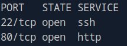
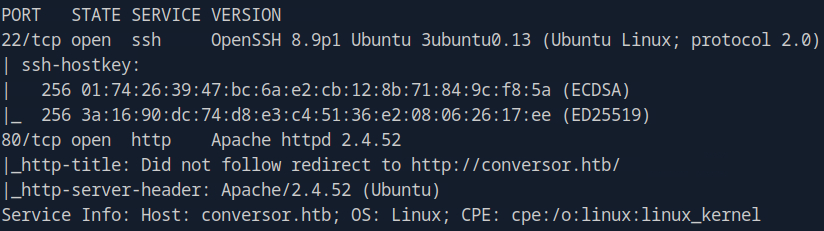

# Conversor (Linux)

---

## Overview

This report documents my exploitation of the **Conversor** machine on HackTheBox.
The attack path involved:

- Discovering an exposed ISAKMP (IKE) service over UDP
- Extracting and cracking an IKE PSK hash
- Using the recovered PSK to authenticate over SSH
- Performing local privilege escalation by exploiting a vulnerable sudo version
- Gaining root access and retrieving both user and root flags

The compromise reflects weaknesses in VPN configuration, cryptographic key management, and outdated system components.

---

## Reconnaissance

I begin with a full TCP port scan:

```bash
sudo nmap 10.129.13.123 -p-
```

Ports **22** (SSH) and **80** (HTTP) were open. 



I followed up with a service and default script scan: 

```bash
sudo nmap 10.129.13.123 -p 22,80 -sV -sC
```

| Port    | Service    | Version  | OS       |
| --------| ---------- | -------- | -------- |
| `22`    | `OpenSSH`  | `8.9p1`  | `Ubuntu` |
| `80`    | `Apache`   | `2.4.52` | `Ubuntu` |



The **http-title** script found a domain name **conversor.htb**. I added the domain name to the **/etc/hosts** file:

```bash
echo "10.129.13.123 conversor.htb" | sudo tee -a /etc/hosts
```

When visiting the domain i was greeted by a login-page. This is likely the attack vector.


I run some targeted http scripts with NSE:

```bash
sudo nmap 10.129.13.123 -p 80 --script http-*
```