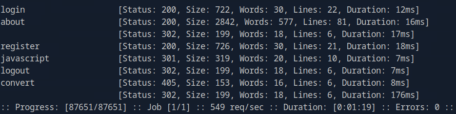
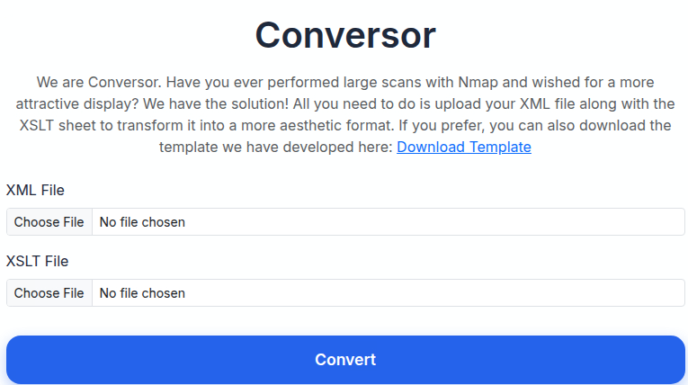
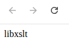

# Conversor (Linux)

---

## Overview

REWRITE this section for the correct lab!

This report documents my exploitation of the **Conversor** machine on HackTheBox.
The attack path involved:

- Discovering an exposed ISAKMP (IKE) service over UDP
- Extracting and cracking an IKE PSK hash
- Using the recovered PSK to authenticate over SSH
- Performing local privilege escalation by exploiting a vulnerable sudo version
- Gaining root access and retrieving both user and root flags

The compromise reflects weaknesses in VPN configuration, cryptographic key management, and outdated system components.

---

## Reconnaissance

I begin with a full TCP port scan:

```bash
sudo nmap 10.129.13.123 -p-
```

Ports **22** (SSH) and **80** (HTTP) were open. 


I followed up with a service and default script scan: 

```bash
sudo nmap 10.129.13.123 -p 22,80 -sV -sC
```

| Port    | Service    | Version  | OS       |
| --------| ---------- | -------- | -------- |
| `22`    | `OpenSSH`  | `8.9p1`  | `Ubuntu` |
| `80`    | `Apache`   | `2.4.52` | `Ubuntu` |


The **http-title** script found a domain name **conversor.htb**. I added the domain name to the **/etc/hosts** file:

```bash
echo "10.129.13.123 conversor.htb" | sudo tee -a /etc/hosts
```

When visiting the domain i was greeted by a login-page.


I run some targeted http scripts with NSE:

```bash
sudo nmap 10.129.13.123 -p 80 --script http-* --script-timeout 30s
```

NSE http scripts returned no useful misconfigurations or weaknesses. 

I proceed with an ffuf scan to enumerate directories:

```bash
ffuf -w directory-list-2.3-small.txt:FUZZ -u http://conversor.htb/FUZZ -ic
```

I discover a few additional pages:



It is possible to register an account, so i proceed by doing so:

| Type              | Value          |
| ----------------- | -------------- |
| `Username`        | `hackerman123` |
| `Password`        | `password123`  |

When arriving at the home page it appears to be a file upload application. We are probably dealing with a file upload functionality. The application expects XML and XSLT files, making it a target for XXE or XSLT vulnerabilities. 



I upload a minimal XML and a XSLT file. The XSLT file contains a basic payload that should reveal the version of XSLT if the target is vulnerable.




It worked, i have thus confirmed that the target is vulnerable to XSLT injections. 

XSLT (Extensible Stylesheet Language Transformation) is a styling language for XML. If you're familiar with HTML, you can think of XSLT as CSS, but more powerful. XML does not use predefined tags, like HTML does, therefore the browser does not know how to interpret each tag. XSL describes to the browser how each XML element should be displayed. 

XSLT is arguably the most important part of XSL. XSLT transforms an XML document into a document that can be interpreted by the browser, usually by tranfsforming XML elements into XHTML elements. 

XSLT uses XPath to navigate XML documents and find information. XPath defines parts of the source document that should match a predefined template. XSLT then transforms the part into the predefined format. 

The first two rows in any XSL document is the XSL stylesheet declarator and the XSLT namespace:

```xsl
<xsl:stylesheet version="1.0"
xmlns:xsl="http://www.w3.org/1999/XSL/Transform"> 
```
or 

```xsl
<xsl:transform version="1.0"
xmlns:xsl="http://www.w3.org/1999/XSL/Transform"> 
```

Start with a simple XML document that we want to transform:

```xml
<?xml version="1.0" encoding="UTF-8"?>
<?xml-stylesheet type="text/xsl" href="payload.xsl"?>
<catalog>
  <cd>
    <title>Empire Burlesque</title>
    <artist>Bob Dylan</artist>
    <country>USA</country>
    <company>Columbia</company>
    <price>10.90</price>
    <year>1985</year>
  </cd>
</catalog> 
```

Then create an XSL stylesheet containing the tranformation template (payload.xsl). Also, add a link to the XSL stylesheet in the XML document above:

```xml
<?xml version="1.0" encoding="UTF-8"?>

<xsl:stylesheet version="1.0"
xmlns:xsl="http://www.w3.org/1999/XSL/Transform">

<xsl:template match="/">
  <html>
  <body>
  <h2>My CD Collection</h2>
  <table border="1">
    <tr bgcolor="#9acd32">
      <th>Title</th>
      <th>Artist</th>
    </tr>
    <xsl:for-each select="catalog/cd">
    <tr>
      <td><xsl:value-of select="title"/></td>
      <td><xsl:value-of select="artist"/></td>
    </tr>
    </xsl:for-each>
  </table>
  </body>
  </html>
</xsl:template>
</xsl:stylesheet> 
```

The <xsl:template match="/"> element associates the XSL template with the root element of the XML source document. The content inside the <xsl:template match="/"> element defines how to transform the XML source document, in this case into HTML.

The <xsl:value-of select="title"/> element extracts the value from the <title>Empire Burlesque</title> element in the XML source document. The select attribute is an XPath expression. 