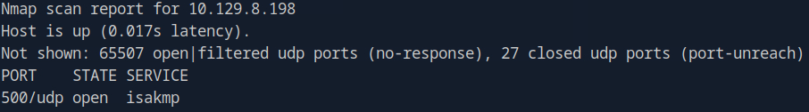

# Expressway (Linux)

My notes pertaining to the machine **Expressway* on HTB Labs.

---

## Recon

Found 1 open port on target system:

```
sudo nmap 10.129.8.198 -p-
```


When running service detection and default scripts i discover that the port is running **OpenSSH version 10.0p2** on a **Linux** OS. 

```
sudo nmap 10.129.8.198 -p 22 -sV -sC
```

I run some targeted SSH scripts with NSE, but it does not bear any fruit:

```
sudo nmap 10.129.8.198 -p 22 --script ssh*
```


I don't think this is the attack vector. I run a second NMAP scan using UDP and find an interesting port:

```
sudo nmap -p- -sU 10.129.8.198 --max-retries 0 --min-rate=3000
```



After doing some research i discover that **ISAKMP** is a protocol used for IPSEC-tunnels, which coincides nicely with the machine name Expressway", hinting at a tunnel or gateway. My research also leads me to a tool called **ike-scan** used for discovering and enumerating hosts running IPsec VPN servers. 

I star with a basic scan:

```
sudo ike-scan 10.129.8.198
```