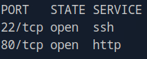
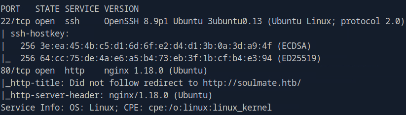
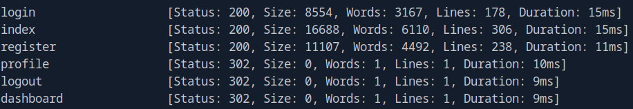

# Soulmate (Linux)

---

## Overview

This report documents my exploitation of the **Soulmate** machine on HackTheBox.
The attack path involved:

---

## Reconnaissance

I began with a full TCP port scan:

```bash
sudo nmap -p- 10.129.15.231
```

Two ports were open: `22` (SSH) and `80` (HTTP).



I followed up with a service and default script scan: 

```bash
sudo nmap  -p 22,80 -sV -sC 10.129.15.231
```

The target was running `OpenSSH 8.9p1` on port `22` and an `nginx 1.18.0` server on port `80`. I also discovered a domain name and added it to the **/etc/hosts** file:

```bash
echo "10.129.15.231 soulmate.htb" | sudo tee -a /etc/hosts
```



I ran some targeted http scripts with `NSE`, but it did not reveal anything of importance, except that the web page runs on PHP. 

```bash
sudo nmap -p 80 --script http-* --script-timeout 30s 10.129.15.231
```

## Web Enumeration

Since i knew the target ran on PHP i started with a page fuzz:

```bash
ffuf -w directory-list-2.3-small.txt:FUZZ -u http://soulmate.htb/FUZZ -e .php -ic
```

I discover two interesting pages: login.php and register.php.

