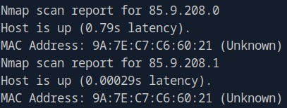
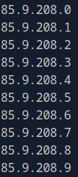
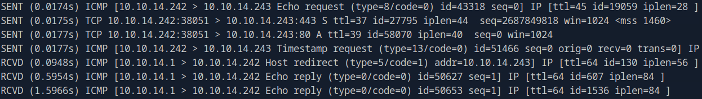
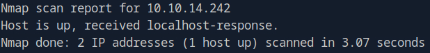

# Network Enumeration with NMAP

---

## Host discovery

**Host discovery** is utilized to discover systems on a network. This is usually a good starting point when conducting internal penetration tests.

The most basic host discovery method is **ICMP Echo Requests**, also known as **ping**. The following example utilizes **ping** to probe an entire network for online systems.

```
nmap 10.129.2.0/24 -sn -oA hosts
```

The **-oA** flag saves the output in all major formats.



By adding **grep** and **cut** we can filter out the relevant information, and end up with a clean list of only IP addresses and domain names.

```
nmap 10.129.2.0/24 -sn | grep for | cut -d " " -f5
```



During penetration tests it is not uncommon to be provided with a list of **in-scope hosts**. Nmap can scan directly from a list of IP addresses with the **-iL** flag.

```
nmap -sn -iL hosts.txt | grep for | cut -d " " -f5
```

**Multiple IP addresses** can be specified by listing them one after the other.

```
nmap -sn 10.129.2.18 10.129.2.19 10.129.2.20 | grep for | cut -d" " -f5
```

If the IP addresses of interest are adjacent to one another a range can be specified in the last octet.

```
nmap -sn 10.129.2.18-20| grep for | cut -d" " -f5
```

To get an overview of all packages sent and received the **--packet-trace** flag is used.

```
nmap 10.129.2.18 -sn --packet-trace
```



To determine why NMAP has labeled a host as **"up"**, the **--reason** flag is used.

```
nmap 10.129.2.18 -sn --reason
```



On a local network NMAP might determine the status of a host through **ARP Requests**, even though we told NMAP to use **ICMP Echo Requests**. Use the **-PE** and **--disable-arp-ping** flags to force NMAP to use **ICMP**.

```
nmap 10.129.2.18 -sn -PE --disable-arp-ping
```

---

## Port Scanning

Once we have identified an online target through the **host discovery process**, we want to get a more accurate picture of the system. This includes information about:

- Open ports
- Services
- Operating systems

A scanned port is assigned one of six different states:

| State             | Description                                                  |
| ----------------- | ------------------------------------------------------------ |
| `Open`            | `Connection to port established`                             |
| `Closed`          | `Connection to port not established`                         |
| `Filtered`        | `Port returns no response or an error code`                  |
| `Unfiltered`      | `Port is accessible but not able to conclude if open/closed` |
| `Open/Filtered`   | `No response (indication of firewall)`                       |
| `Closed/Filtered` | `Unable to determine if closed or filtered by firewall`      |
