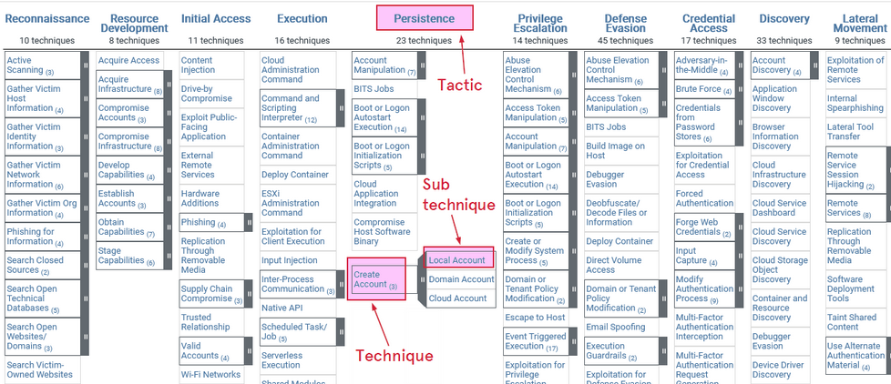
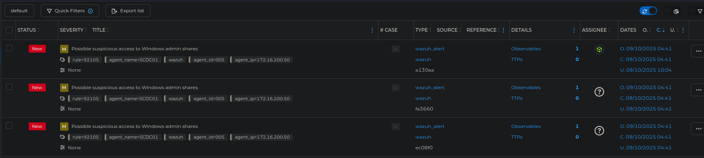

# Incident Handling

---

# Overview

Incident handling is a clearly defined set of procedures for responding to security incidents. Incident handling capability is a necessity for any organization looking to uphold the three pillars of information security:

- Confidentiality
- Integrity
- Availability

Examples of incidents include:

- Leaked credentials
    - Colonial Pipeline ransomware attack (2021)
- Weak credentials
    - Mirai Botnet (2016)
- Outdated software
    - WannaCry ransomware attack (2017)
- Rogue employees
    - Cash App (2021)
- Social engineering
    - U.S. Interior Department (2015)

---

# Cyber Kill Chain

The cyber kill chain consists of seven stages, describing the lifecycle of an attack. 

Keep in mind that adversaries rarely operate linearly, as the cyber kill chain suggests. Some stages might be repeated multiple times, and some stages might be skipped.

## Reconaissance

The attacker gather as much useful information as possible about the target. 

Active reconaissance involves mapping out the network, by identifying hosts, open ports, and running services. This involves interacting directly with the target, often through some automated tool, such as NMAP. 

Passive reconaissance involves gathering information from public sources such as social media, job ads, and company web pages. This is a more stealthy approach, since it doesn't require direct interaction with the target.  

## Weaponize

The payload used to gain initial access is developed and embedded into some type of exploit. The main purpose of the payload is to gain remote access to the target machine, preferably through a persistent payload. 

## Delivery

The payload is delivered to the target. The delivery method varies, but often include some type of phishing campaign. A solid payload rarely require the user to do anything more than to double-click on a link. 

In some cases the payload is delivered through physical means, such as a USB stick.

## Exploitation

The payload is triggered on the target machine. The attacker attempts to execute code on the target machine in order to gain control.

## Installation

The initial stager is executed and running on the target machine. The installation stage can be carried out in different ways:

- Droppers
    - Small piece of code designed to execute malware.
- Backdoors
    - Designed to provide the attacker with persistent access.
- Rootkits
    - Designed to hide its presence on the compromised machine.

## Command and Control

The attacker establishes remote access capability to the target machine.

## Action

Means to achieve the actual objectives of the attack are carried out. 

Example objectives are:

- Exfiltrating data
- Deploy ransomware

---

# MITRE ATT&CK Framework

MITRE ATT&CK is another framework for understanding adversary behavior. It is a matrix-based system of tactics and techniques observed in the wild. The columns represent adversary goals, and the rows (cells) represent the techniques used to achieve those goals.

## The Hive

A case management platform designed to effectively handle incidents by processing alerts. It collects alerts from various devices and presents them in a centralized way. 

The Hive has the capability to import all MITRE ATT&CK tactics and techniques into its alert management system. 

HTB Credentials:

- URL: http://<IP>:9000
- Username: htb-analyst
- Password: P3n#31337@LOG

---

# The Incident Handling Process

The incident handling process consists of four stages:

- Preparation
- Detection and analysis
- Containment, eradication and recovery
- Post incident activity

Incident handlers spend the majority of their time in the first two stages: preparation and detection and analysis. 

## Preparation

The preparation stage is about establishing an incident handling capability by implementing the appropriate protective measures.

Protective measures may include:

- DMARC
- Endpoint and server hardening
- AD tiering
- MFA

DMARC is an email protection mechanism against phishing built on top of SPF and DKIM. The idea is to reject emails that pretend to originate from in-house sources. 

Effective ways of achieving endpoint hardening include:

- Disable LLMNR/NetBIOS
- Remove admin privileges from regular users
- Configure PowerShell in "ContrainedLanguage" mode
- Host-based firewalls
- Impement an EDR solution

## Detection and Analysis