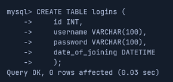
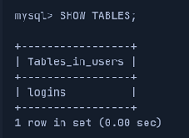
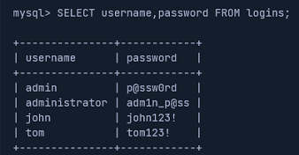
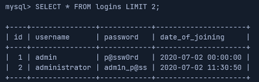
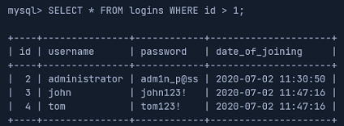

# SQL Injections

This document summarizes core techniques for discovery and exploitation of **SQL injection vulnerabilities**. This is by no means an exhaustive guide. 

---

## Table of Contents
- [SQL Injections](#sql-injections)
    - [Overview](#overview)
    - [Authenticate to MySQL](#authenticate-to-mysql)
    - [Create Databases and Tables](#create-databases-and-tables)
    - [Manipulate and Retrieve Data from Tables](#manipulate-and-retrieve-data-from-tables)
    - [Filtering SQL Queries](#filtering-sql-queries)
    - [SQL Logical Operators](#sql-logical-operators)
    - [Introduction to SQL Injections](#introduction-to-sql-injections)

---

## Overview

User input is often involved when applications send queries to a back-end database. If not securely coded, SQL injection vulnerabilities may be present.

---

## Authenticate to MySQL

The `mysql` utility is **CLI tool** used to authenticate to and interact with MySQL/MariaDB databases.

The following flags are commonly used to authenticate to a database:

| Flag        | Description   |
| ----------- | ------------- |
| `-u`        | Username      |
| `-h`        | Host          |
| `-P`        | Port          |
| `-p`        | Password      |

**Examples:**

When no host is specified, `mysql` defaults to **localhost**. The password can be supplied directly after the `-p` flag, with no space inbetween:

```bash
# Syntax
mysql -u <username> -p<password>

# Example
mysql -u root -pROOT123!
```

It is good practice to pass the `-p` flag without a password and instead be prompted interactively. This prevents the password from being stored in the `.bash_history` file:

```bash
# Syntax
mysql -u <username> -p

# Example
mysql -u root -p
```

The default port for MySQL/MariaDB is port `3306`. Use the `-h` and `-P` flags to connect to a specific host and port:

```bash
# Syntax
mysql -u <username> -h <ip/domain> -P <port> -p

# Example
mysql -u root -h 94.237.57.211 -P 46600 -p
```

---

## Create Databases and Tables

The semicolon (`;`) works as a statement terminator, much like in the `C` programming language. SQL keywords are case-insensitive; however, best practice is to write keywords in UPPERCASE and identifiers (such as database and table names) in lowercase.

The `CREATE DATABASE` statement creates a new database.

**Example:**

```sql
-- Syntax
CREATE DATABASE <name>;

-- Example
CREATE DATABASE users;
```

The `SHOW DATABASES` statement lists all databases.

**Example:**

```sql
SHOW DATABASES;
```


The `USE` statement switches to a particular database.

**Example:**

```sql
-- Syntax
USE <name>;

-- Example
USE users;
```

SQL databases store data in tables made up of horizontal rows and vertical columns. The intersection of a row and a column is called a `cell`. A column is of a particular data-type. 

Tables are created with the `CREATE TABLE` statement.

**Example:**

```sql
-- Syntax
CREATE TABLE <name> (
    col1 DATATYPE,
    col2 DATATYPE,
    col3 DATATYPE
);

-- Example
CREATE TABLE logins (
    id INT,
    username VARCHAR(100),
    password VARCHAR(100),
    join_date DATETIME
);
```



The `SHOW TABLES` statement lists all tables in the database.

**Example:**

```sql
SHOW TABLES;
```



The `DESCRIBE` statement is used to get more information about a table and its structure.

**Example:**

```sql
-- Syntax
DESCRIBE <name>;

-- Example
DESCRIBE logins;
```


---

## Manipulate and Retrieve Data from Tables

The `INSERT` statement adds a `record` to a table. A `record` represents a single row in a table, where values correspond to each column. 

**Example:**

```sql
-- Syntax
INSERT INTO <name> VALUES (col1_val, col2_val, ...);

-- Example
INSERT INTO logins VALUES(1, 'admin', 'p@ssw0rd', '2025-12-21');
```

Keep in mind that omitting column names requires values to be supplied in the exact column order defined by the table schema.

Values can also be added to individual columns, instead of adding entire records. 

**Example:**

```sql
-- Syntax
INSERT INTO <name> (col1, col2, ...) VALUES (col1_val, col2_val, ...);

-- Example
INSERT INTO logins (username, password) VALUES('admin', 'p@ssw0rd');
```

In the example above, unspecified columns must either allow `NULL` values or have default values defined.

The `SELECT` statement is used to retrieve data from tables.

**Example:**

Select all records from a table:

```sql
-- Syntax
SELECT * FROM <name>;

-- Example
SELECT * FROM logins;
```


Select specific columns from a table:

```sql
-- Syntax
SELECT col1, col2, ... FROM <name>;

-- Example
SELECT username, password FROM logins;
```



The `DROP` statement is used to delete tables. Use with `caution` — deletion is permanent and occurs without confirmation.

**Example:**

```sql
-- Syntax
DROP TABLE <name>;

-- Example
DROP TABLE logins;
```

The `ALTER` statement can be utilized to accomplish four different things:

- Rename table
- Rename column
- Add column
- Delete column

**Example:**

Rename a column:

```sql
-- Syntax
ALTER TABLE <name> RENAME COLUMN <name> TO <new_name>;

-- Example
ALTER TABLE logins RENAME COLUMN id TO ids;
```

Add a column:

```sql
-- Syntax
ALTER TABLE <name> ADD <name> <data_type>;

-- Example
ALTER TABLE logins ADD age INT;
```

---

## Filtering SQL Queries

The `ORDER BY` clause is used to sort the results of a query. The column to sort by is specified in the statement. Results are sorted in ascending order by default. Use `ASC` or `DESC` to specify direction.

**Example:**

```sql
-- Syntax
SELECT <records> FROM <table> ORDER BY <column>;

-- Example
SELECT * FROM logins ORDER BY password DESC;

-- Example
SELECT * FROM logins ORDER BY password;
```

The `LIMIT` clause is used to limit the number of records returned by a query.

**Example:**

```sql
-- Syntax
SELECT <records> FROM <table> LIMIT <number>;

-- Example
SELECT * FROM logins LIMIT 2;
```



The `WHERE` clause filters query results based on some condition. The `WHERE` clause is similar to an `if` statement in traditional programming languages. 

**Example:**

```sql
-- Syntax
SELECT <records> FROM <table> WHERE <condition>;

-- Example
SELECT * FROM logins WHERE username = 'admin';

-- Example
SELECT * FROM logins WHERE id > 1;
```



The `LIKE` clause filters a query based on some pattern. The `LIKE` operator performs simple pattern matching using wildcards, but is not a full `regular expression` engine.

**Example:**

The `%` symbol matches any characters and the `_` symbol matches exactly one character.

```sql
-- Syntax
SELECT <columns> FROM <table> WHERE <column> LIKE <pattern>;

-- Example 
SELECT * FROM logins WHERE username LIKE 'admin%';

-- Example
SELECT * FROM logins WHERE username LIKE '___';
```

---

## SQL Logical Operators

The most common **MySQL** logical operators are:

- `AND` 
- `OR` 
- `NOT`

The `AND` operator evaluates two boolean expressions and returns true or false. The result of an `AND` operation is true **if and only if** both expressions evaluate to true.

**Example:**

```sql
-- Evaluates to true
SELECT 1 = 1 AND 'test' = 'test';

-- Evaluates to false
SELECT 1 = 1 AND 'test' = 'abc';
```

The `OR` operator evaluates two boolean expressions and returns true or false. The result of an `OR` operation is true if at least one expression evaluates to true.

**Example:**

```sql
-- Evaluates to true
SELECT 1 = 1 OR 'test' = 'test';

-- Evaluates to true
SELECT 1 = 1 OR 'test' = 'abc';

-- Evaluates to false
SELECT 1 = 2 OR 'test' = 'abc';
```

The `NOT` operator takes one boolean expression and returns **true or false**. The result is the inverse of the expression.

```sql
-- Evaluates to false
SELECT NOT 1 = 1;

-- Evaluates to true
SELECT NOT 1 = 2;
```

Logical operators are often used in queries.

**Example:**

```sql
-- All records where the username is not equal to john
SELECT * FROM logins WHERE username != 'john';

-- All records where the username is not equal to john and the id is greater than 1
SELECT * FROM logins WHERE username != 'john' AND id > 1;
```


Logical operators follow a defined **order of precedence**, which determines how expressions are evaluated when parentheses are not used.

From highest to lowest precedence:

1. `NOT`
2. `AND`
3. `OR`

This means that `AND` expressions are evaluated before `OR` expressions unless parentheses explicitly alter the order.

**Example:**

Evaluates `AND` first, then `OR`:

```sql
SELECT 1 = 1 OR 1 = 2 AND 1 = 2;
```

The above expression is evaluated as:

```sql
-- true OR false = true
SELECT 1 = 1 OR (1 = 2 AND 1 = 2);
```

To override operator precedence and ensure clarity, parentheses should always be used:

```sql
-- true AND false = false
SELECT (1 = 1 OR 1 = 2) AND 1 = 2;
```
---

## Introduction to SQL Injections

**Sanitization** refers to modifying or filtering user input to remove or escape potentially dangerous characters. **Sanitization** is a common technique used to mitigate SQL injections; however, **sanitization alone is often insufficient** to fully prevent them. When user input is not properly handled, attackers can utilize special characters to escape the intended context of user input and inject a SQL payload. The payload is then executed as part of the original query.

SQL injections are categorized based on how an attacker retrieves the output of a payload:

- In-band
- Blind
- Out-of-band

In-band SQL injections are the most straightforward technique. The output of the injected query is returned directly in the application’s response and can be read by the attacker.

There are two types of In-band SQL injections:

- Union based SQL injection
- Error based SQL injection

Blind SQL injections do not return output directly on the front-end. SQL logic must be utilized to infer the output character by character based on application behavior. 

Out-of-band SQL injections provide no direct access to the output. Instead, the output is redirected to an attacker-controlled remote server and retrieved from there.

---

## SQL Injection Discovery

SQL injection vulnerabilities are typically discovered by injecting specially crafted input into application input fields or HTTP parameters. When injecting directly into HTTP parameters, payloads should be URL encoded to ensure proper transmission.

These payloads are used to test how user input is handled within SQL queries and whether it can break the intended query structure.

**Common Discovery Payloads:**

| Payload     | URL Encoded Payload   |
| ----------- | --------------------- |
| `'`         | `%27`                 |
| `"`         | `%22`                 |
| `#`         | `%23`                 |
| `;`         | `%3B`                 |
| `)`         | `%29`                 |

The above payloads are commonly used to:

- Break out of string contexts
- Terminate SQL statements
- Comment out the remainder of a query
- Trigger database error messages

A SQL injection vulnerability may be indicated by:

- Database error messages returned in the response
- Changes in application behavior
- Unexpected HTTP status codes
- Differences in response length or content

Examples of database-related error messages include:

- Syntax errors
- Unclosed quotation marks
- Invalid query structure
- Database-specific error codes

A common method of testing for SQL injections is by intercepting requests using tools such as BurpSuite and injecting payloads directly into GET or POST parameters. This allows controlled manipulation of user input while observing changes in server responses.

---

## OR Injection

Suppose we attempt to login to a vulnerable application with the credentials `admin/admin`. The back-end SQL query may look something like this:

```sql
SELECT * FROM logins WHERE username = 'admin' AND password = 'admin';
```

The query is based on a logical `AND` operation, meaning that **both** expressions must evaluate to true in order to gain access to the application.

An attacker can utilize the `OR` operator to inject a payload that always evaluates to true. The `OR` operator returns true if at least one of the expressions evaluate to true. An attacker can escape user-input bounds an inject the expression `1 = 1`, which will always evaluate to true.

**Example:**

Inject into `Username` input field, leave the `Password` field blank:
```sql
admin'OR '1'='1
```


Backend SQL query after injection:
```sql
SELECT * FROM logins WHERE username = 'admin' OR '1'='1' AND password =''; 
```

The SQL injection above will only work with a valid username or password.

According to the order of precedence the `AND` operator is evaluated before the `OR` operator. 

The query will be evaluated as:

```sql
SELECT * FROM logins WHERE username = 'admin' OR ('1'='1' AND password =''); 
```

With a valid username and an invalid password, the query will evaluate to `true`:

- true OR (true AND false) &rarr; true OR false &rarr; true

With an invalid username and a valid password, the query will still evaluate to `true`;

- false OR (true AND true) &rarr; false OR true &rarr; true

With an invalid username and an invalid password, the query will evaluate to `false`;

- false OR (true AND false) &rarr; false OR false &rarr; false


