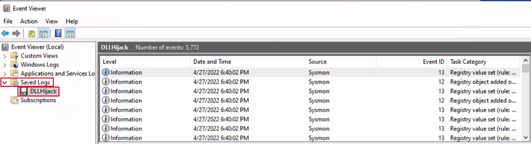
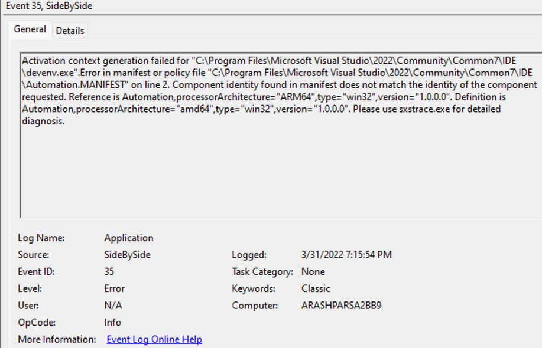

# Windows Event Logs

Windows event logs store logs from different components of the system. Analysing these logs is a critical component of intrusion detection.

Event logs are accessed through the **Event Viewer**.

Event logs are categorized into five categories:

- Application
- Security
- Setup
- System
- Forwarded Events

Event logs can be saved in binary format (.evtx) and opened with the **Event Viewer**. Saved logs are found under the **Saved Logs** section.

Each event contains the following primary components:

| Component           | Description                                                           |
| ------------------- | --------------------------------------------------------------------- |
| `Log Name`          | `Event category (Application, system, ...).`                          |
| `Source`            | `Program that logged the event.`                                      |
| `Event ID`          | `Unique event identifier.`                                            |
| `Task Category`     | `Value or name that help understand the purpose of the event.`        |
| `Level`             | `Severity category (Information, Warning, Error, Critical, Verbose).` |
| `Keywords`          | `Categorization flags.`                                               |
| `User`              | `The user account related to the event.`                              | 
| `OpCode`            | `Specific operations related to the event.`                           |
| `Logged`            | `Date and time when the event was logged.`                            |
| `Computer`          | `Name of computer where the event ocurred.`                           |

The **Keywords** field is particularly useful when filtering for specific types of events. 

All event information is also stored in detailed XML format under the **Details** tab.

