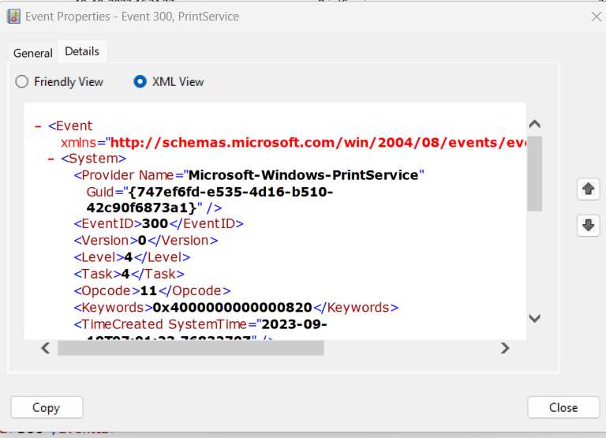

# Windows Event Logs

Windows event logs store logs from different components of the system. Analysing these logs is a critical component of intrusion detection.

Event logs are accessed through the **Event Viewer**.

Event logs are categorized into five categories:

- Application
- Security
- Setup
- System
- Forwarded Events

Event logs can be saved in binary format (.evtx) and opened with the **Event Viewer**. Saved logs are found under the **Saved Logs** section.

Each event contains the following primary components:

| Component           | Description                                                           |
| ------------------- | --------------------------------------------------------------------- |
| `Log Name`          | `Event category (Application, system, ...).`                          |
| `Source`            | `Program that logged the event.`                                      |
| `Event ID`          | `Unique event identifier.`                                            |
| `Task Category`     | `Value or name that help understand the purpose of the event.`        |
| `Level`             | `Severity category (Information, Warning, Error, Critical, Verbose).` |
| `Keywords`          | `Categorization flags.`                                               |
| `User`              | `The user account related to the event.`                              | 
| `OpCode`            | `Specific operations related to the event.`                           |
| `Logged`            | `Date and time when the event was logged.`                            |
| `Computer`          | `Name of computer where the event ocurred.`                           |

The **Keywords** field is particularly useful when filtering for specific types of events. 

All event information is also stored in detailed XML format under the **Details** tab.

Custom XML queries can be utilized for more granular log analysis. Navigate to **Filter Current Log** &rarr; **XML** &rarr; **Edit Query Manually**.

The **Event ID** serves as an event identifier. Some useful IDs include:

| Event ID            | Description                            |
| ------------------- | -------------------------------------- |
| `1074`              | `System shutdown/restart`              |
| `6005`              | `Event log service started`            |
| `6006`              | `Event log service stopped`            |
| `6013`              | `Windows uptime`                       |
| `7040`              | `Service status change`                |
| `1102`              | `Audit log cleared`                    |
| `1116`              | `Malware detected`                     | 
| `1118`              | `Malware remediation started`          |
| `1119`              | `Malware remediation success`          |
| `1120`              | `Malware remediation failure`          |
| `4624`              | `Logon successful`                     |
| `4625`              | `Logon failed`                         |
| `4672`              | `Special privileges assigned to logon` |
| `4698`              | `Scheduled task created`               |
| `4700`              | `Scheduled task enabled`               |
| `4701`              | `Scheduled task disabled`              |
| `4702`              | `Scheduled task updated`               | 
| `4719`              | `Audit policy changed`                 |
| `4738`              | `User account changed`                 |
| `4771`              | `Failed logon (Kerberos)`              |
| `5001`              | `Antivirus config changed`             |
| `5140`              | `Network share accessed`               |
| `5142`              | `Network share added`                  | 
| `7045`              | `Service installed`                    |

---

# Analyzing Evil with Sysmon and Event Logs
